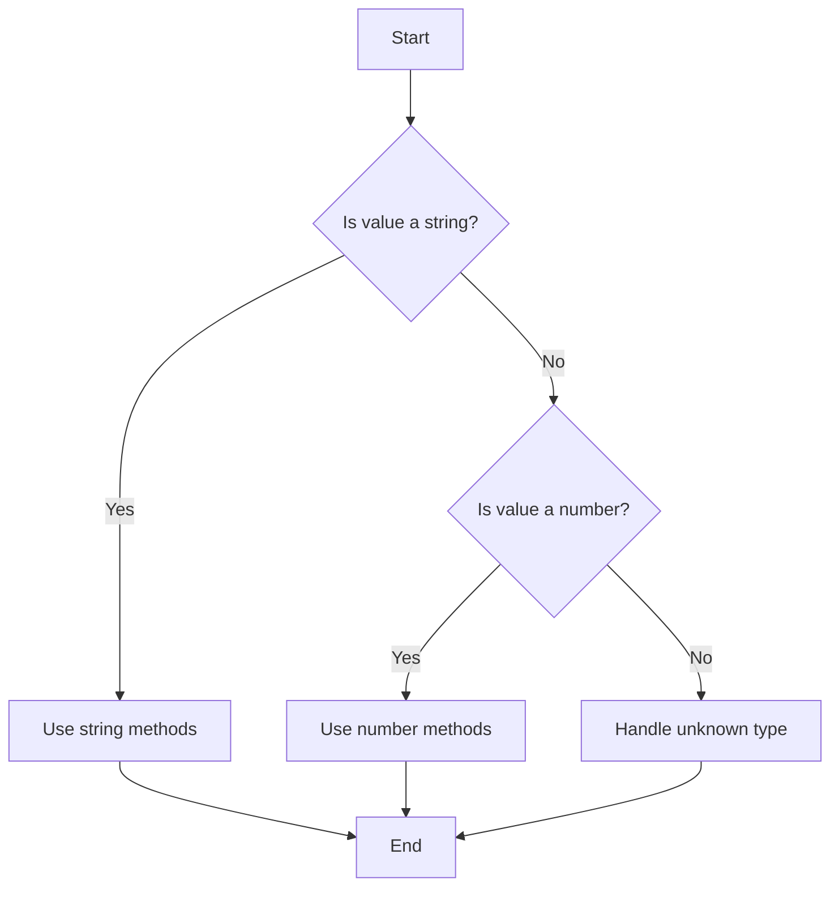

## 2.5 The `unknown` Type

In this section, we'll explore the `unknown` type in TypeScript, a powerful tool for safely handling variables when their types are not known at compile time. We'll compare it with the `any` type, demonstrate how to work with `unknown` using type narrowing techniques, and discuss best practices for its use in function parameters and return types.

### Introduction to the `unknown` Type

The `unknown` type was introduced in TypeScript 3.0 as a safer alternative to the `any` type. When you declare a variable with the `unknown` type, you are essentially telling TypeScript that you don't know what type it is. Unlike `any`, which allows you to perform any operation on the variable without any checks, `unknown` requires you to perform some form of type checking or type assertion before you can use it in a meaningful way.

#### Why Use `unknown`?

- **Safety**: The `unknown` type forces you to perform type checks before using the variable, reducing the risk of runtime errors.
- **Explicitness**: It makes your code more explicit about the uncertainty of a variable's type, which can improve readability and maintainability.
- **Type Safety**: By enforcing type checks, `unknown` helps maintain type safety across your codebase.

### Comparing `unknown` with `any`

To understand the benefits of `unknown`, let's compare it with the `any` type.

#### The `any` Type

The `any` type is a wildcard type that allows you to bypass TypeScript's type checking. While it can be useful in certain scenarios, it can also lead to potential issues:

- **Lack of Type Safety**: With `any`, you can perform any operation on the variable without any compile-time checks, which can lead to runtime errors.
- **Reduced Code Quality**: Overuse of `any` can make your code harder to understand and maintain, as it obscures the intended types of variables.

#### The `unknown` Type

The `unknown` type addresses these issues by requiring explicit type checks:

- **Type Safety**: You cannot perform operations on an `unknown` variable without first narrowing its type.
- **Improved Code Quality**: By enforcing type checks, `unknown` encourages better coding practices and clearer code.

### Working with `unknown` Variables

To use an `unknown` variable, you need to narrow its type to a more specific type before performing any operations. Let's explore some common techniques for type narrowing.

#### Type Narrowing Techniques

1. **Type Guards**: Use `typeof` or `instanceof` to check the type of a variable.

   ```typescript
   function processValue(value: unknown) {
       if (typeof value === "string") {
           console.log("String value:", value.toUpperCase());
       } else if (typeof value === "number") {
           console.log("Number value:", value.toFixed(2));
       } else {
           console.log("Unknown type");
       }
   }
   ```

2. **Type Assertions**: Use the `as` keyword to assert a specific type.

   ```typescript
   function getLength(value: unknown): number {
       if (typeof value === "string") {
           return (value as string).length;
       } else if (Array.isArray(value)) {
           return (value as Array<any>).length;
       }
       return 0;
   }
   ```

3. **User-Defined Type Guards**: Create custom functions to check types.

   ```typescript
   function isString(value: unknown): value is string {
       return typeof value === "string";
   }

   function printValue(value: unknown) {
       if (isString(value)) {
           console.log("String:", value);
       } else {
           console.log("Not a string");
       }
   }
   ```

### When to Use `unknown` Over `any`

The `unknown` type is preferable over `any` in scenarios where you want to ensure type safety and maintainability. Here are some examples:

- **Function Parameters**: When the input type is not known, use `unknown` to enforce type checks within the function.

  ```typescript
  function handleInput(input: unknown) {
      if (typeof input === "string") {
          console.log("Handling string input:", input);
      } else {
          console.log("Handling non-string input");
      }
  }
  ```

- **API Responses**: When dealing with data from external sources, such as API responses, use `unknown` to ensure the data is validated before use.

  ```typescript
  async function fetchData(url: string): Promise<unknown> {
      const response = await fetch(url);
      return response.json();
  }

  async function processData() {
      const data = await fetchData("https://api.example.com/data");
      if (typeof data === "object" && data !== null) {
          console.log("Data is an object:", data);
      } else {
          console.log("Data is not an object");
      }
  }
  ```

### Best Practices for Using `unknown`

- **Use Type Guards**: Always use type guards to narrow down `unknown` types before performing operations.
- **Avoid Overuse**: While `unknown` is safer than `any`, avoid overusing it. Use specific types whenever possible.
- **Document Your Code**: Clearly document the expected types and the rationale for using `unknown` to improve code readability.

### Try It Yourself

Let's put your knowledge to the test! Try modifying the following code examples to handle different types of input:

1. Modify the `processValue` function to handle boolean values.
2. Update the `getLength` function to return the length of a Set if the input is a Set.
3. Create a new function `isNumber` that checks if a value is a number and use it in the `printValue` function.

### Visual Aids

To help you understand how `unknown` works, let's visualize the process of type narrowing using a flowchart.



This flowchart illustrates the decision-making process when working with an `unknown` variable. By checking the type and narrowing it down, we can safely perform operations on the variable.

### References and Links

For more information on the `unknown` type and type narrowing, check out these resources:

- [TypeScript Handbook: The `unknown` Type](https://www.typescriptlang.org/docs/handbook/basic-types.html#unknown)
- [MDN Web Docs: typeof Operator](https://developer.mozilla.org/en-US/docs/Web/JavaScript/Reference/Operators/typeof)
- [TypeScript Playground](https://www.typescriptlang.org/play) - Experiment with TypeScript code online.

### Engagement and Reinforcement

To reinforce your understanding, consider these questions:

- What are the benefits of using `unknown` over `any`?
- How can you use type guards to narrow down an `unknown` type?
- In what scenarios would you choose `unknown` over specific types?

### Key Takeaways

- The `unknown` type is a safer alternative to `any`, requiring type checks before use.
- Use type guards, type assertions, and user-defined type guards to work with `unknown` variables.
- Prefer `unknown` over `any` in scenarios where type safety is important, such as function parameters and API responses.

## Quiz Time!



### What is the primary advantage of using the `unknown` type over the `any` type?

- [x] Type safety
- [ ] Performance improvement
- [ ] Simplicity
- [ ] Compatibility with JavaScript

> **Explanation:** The `unknown` type enforces type safety by requiring type checks before performing operations, unlike `any`.

### Which of the following is a method to narrow down an `unknown` type?

- [x] Type guards
- [ ] Type widening
- [ ] Type inference
- [ ] Type erasure

> **Explanation:** Type guards, such as `typeof` and `instanceof`, are used to narrow down an `unknown` type to a specific type.

### How do you assert a specific type for an `unknown` variable?

- [x] Using the `as` keyword
- [ ] Using the `typeof` operator
- [ ] Using the `instanceof` operator
- [ ] Using the `is` keyword

> **Explanation:** The `as` keyword is used for type assertions to specify a more specific type for an `unknown` variable.

### What is the result of using `typeof` on an `unknown` variable?

- [x] It returns the type of the variable as a string.
- [ ] It throws an error.
- [ ] It returns `unknown`.
- [ ] It returns `any`.

> **Explanation:** The `typeof` operator returns the type of a variable as a string, which can be used to narrow down an `unknown` type.

### Which of the following is a best practice when using the `unknown` type?

- [x] Use type guards to narrow down the type.
- [ ] Avoid using `unknown` altogether.
- [ ] Use `unknown` for all variables.
- [ ] Use `unknown` only in class properties.

> **Explanation:** It's best practice to use type guards to narrow down the `unknown` type before performing operations.

### In what scenario is `unknown` preferable over `any`?

- [x] When handling API responses
- [ ] When performing mathematical operations
- [ ] When declaring constants
- [ ] When defining interfaces

> **Explanation:** `unknown` is preferable for handling API responses to ensure the data is validated before use.

### What is a user-defined type guard?

- [x] A function that checks and narrows down a type
- [ ] A built-in TypeScript function
- [ ] A method to widen types
- [ ] A way to enforce type erasure

> **Explanation:** A user-defined type guard is a function that checks and narrows down a type, allowing you to use `unknown` variables safely.

### How can you handle an `unknown` variable that might be a Set?

- [x] Use `instanceof Set` to check the type
- [ ] Use `typeof` to check the type
- [ ] Use `as Set` to assert the type
- [ ] Use `is Set` to check the type

> **Explanation:** Use `instanceof Set` to check if an `unknown` variable is a Set.

### Which keyword is used for type assertions in TypeScript?

- [x] as
- [ ] is
- [ ] instanceof
- [ ] typeof

> **Explanation:** The `as` keyword is used for type assertions in TypeScript.

### True or False: The `unknown` type allows you to perform any operation without type checks.

- [ ] True
- [x] False

> **Explanation:** False. The `unknown` type requires type checks before performing operations, unlike `any`.


