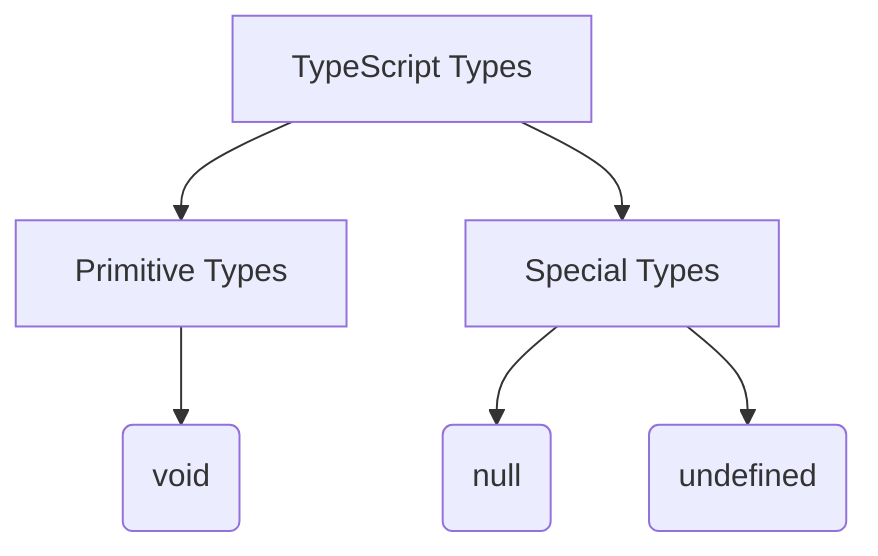

## 2.6 The `void` Type

In TypeScript, understanding the `void` type is essential for defining functions that do not return a value. This concept is foundational for writing clean, predictable code and is a stepping stone to mastering TypeScript's type system. Let's delve into the `void` type, explore its usage, and learn how it differs from other types like `null` and `undefined`.

### What is the `void` Type?

The `void` type in TypeScript is used to indicate that a function does not return a value. It's a way of explicitly stating that the function's purpose is to perform an action rather than produce a result. This is particularly useful for functions that execute side effects, such as logging information, updating a user interface, or modifying global state.

#### Key Characteristics of `void`:

- **No Return Value**: Functions with a `void` return type do not return any value.
- **Explicit Intent**: Using `void` communicates to other developers that the function's primary role is to perform an action.
- **Type Safety**: TypeScript enforces that functions declared with a `void` return type do not return a value, helping prevent unintended behavior.

### Defining Functions with `void`

When defining a function that does not return a value, you use the `void` type in the function's signature. Let's look at an example:

```typescript
function logMessage(message: string): void {
    console.log(message);
}

// Usage
logMessage("Hello, TypeScript!");
```

In this example, the `logMessage` function takes a string parameter and logs it to the console. The `: void` annotation indicates that this function does not return a value.

### Difference Between `void`, `null`, and `undefined`

It's important to understand how `void` differs from `null` and `undefined`, especially in the context of return types.

- **`void`**: Used to indicate that a function does not return a value. It is a type in TypeScript, not a value.
- **`null`**: Represents the intentional absence of any object value. It is a value that a variable can hold.
- **`undefined`**: Indicates that a variable has been declared but not assigned a value. It is both a type and a value.

#### Example Comparison:

```typescript
function returnNull(): null {
    return null;
}

function returnUndefined(): undefined {
    return undefined;
}

function doNothing(): void {
    // No return statement
}
```

In the above examples, `returnNull` explicitly returns `null`, `returnUndefined` returns `undefined`, and `doNothing` does not return anything, hence it uses `void`.

### When to Use `void`

Use the `void` type when:

- **Performing Side Effects**: Functions that perform actions without needing to return a result, such as event handlers or logging functions.
- **Ensuring No Return Value**: When you want to enforce that a function does not return anything, using `void` helps catch errors where a return statement might be accidentally added.

### Edge Cases: Implicit `undefined` Returns

In JavaScript, if a function does not explicitly return a value, it implicitly returns `undefined`. TypeScript's `void` type accommodates this behavior, allowing functions to omit a return statement without causing errors.

#### Example:

```typescript
function greetUser(name: string): void {
    console.log(`Hello, ${name}!`);
    // No return statement needed
}
```

In this example, `greetUser` does not return a value, and TypeScript's `void` type allows this without requiring an explicit `return undefined;`.

### Practical Examples

Let's explore more practical examples to solidify our understanding of the `void` type.

#### Example 1: Event Handler

```typescript
function handleClick(event: MouseEvent): void {
    console.log("Button clicked!", event);
}

document.getElementById("myButton")?.addEventListener("click", handleClick);
```

In this example, `handleClick` is an event handler function that logs a message when a button is clicked. The `void` type indicates that it does not return a value.

#### Example 2: API Request

```typescript
function fetchData(url: string): void {
    fetch(url)
        .then(response => response.json())
        .then(data => console.log(data))
        .catch(error => console.error("Error fetching data:", error));
}

fetchData("https://api.example.com/data");
```

Here, `fetchData` performs an API request and logs the response data. The `void` type signifies that the function's purpose is to execute the request and handle the response, not to return a value.

### Visualizing the `void` Type

To better understand how the `void` type fits into the TypeScript type system, let's use a diagram to illustrate its relationship with other types.



**Diagram Description**: This diagram shows the relationship between different TypeScript types, highlighting `void` as a special type alongside `null` and `undefined`.

### Try It Yourself

To reinforce your understanding, try modifying the examples above:

- **Modify `logMessage`** to include a return statement and observe TypeScript's response.
- **Create a new function** that performs a side effect, such as changing the text of an HTML element, and use the `void` type.
- **Experiment with event handlers** by creating a simple web page with buttons and attaching `void` functions to handle clicks.

### Summary

The `void` type in TypeScript is a powerful tool for defining functions that do not return a value. By using `void`, you can clearly communicate the intent of your functions, enforce type safety, and prevent unintended return values. Understanding the differences between `void`, `null`, and `undefined` will help you write more predictable and maintainable code.

### Additional Resources

- [MDN Web Docs: JavaScript Functions](https://developer.mozilla.org/en-US/docs/Web/JavaScript/Guide/Functions)
- [TypeScript Handbook: Functions](https://www.typescriptlang.org/docs/handbook/functions.html)

## Quiz Time!



### What does the `void` type signify in TypeScript?

- [x] A function does not return a value.
- [ ] A function returns `null`.
- [ ] A function returns `undefined`.
- [ ] A function returns a boolean.

> **Explanation:** The `void` type indicates that a function does not return a value.

### Which of the following is a correct use of the `void` type?

- [x] `function logMessage(message: string): void { console.log(message); }`
- [ ] `function getNumber(): void { return 42; }`
- [ ] `function returnNull(): void { return null; }`
- [ ] `function returnUndefined(): void { return undefined; }`

> **Explanation:** The `logMessage` function correctly uses `void` because it does not return a value.

### What happens if a function with a `void` return type includes a return statement with a value?

- [ ] The function will execute normally.
- [x] TypeScript will throw a compile-time error.
- [ ] The function will return `undefined`.
- [ ] The function will return `null`.

> **Explanation:** TypeScript enforces the `void` type by throwing an error if a function with `void` return type attempts to return a value.

### How does `void` differ from `null` and `undefined`?

- [x] `void` is a type indicating no return value, while `null` and `undefined` are values.
- [ ] `void` is a value, while `null` and `undefined` are types.
- [ ] `void` and `null` are interchangeable in TypeScript.
- [ ] `void` is used for variables, while `null` and `undefined` are used for functions.

> **Explanation:** `void` is a type used to indicate that a function does not return a value, whereas `null` and `undefined` are values.

### Which of the following functions correctly uses the `void` type?

- [x] `function updateUI(): void { document.body.style.backgroundColor = "blue"; }`
- [ ] `function calculateSum(a: number, b: number): void { return a + b; }`
- [ ] `function returnNull(): void { return null; }`
- [ ] `function returnUndefined(): void { return undefined; }`

> **Explanation:** The `updateUI` function correctly uses `void` because it performs an action without returning a value.

### Can a function with a `void` return type implicitly return `undefined`?

- [x] Yes
- [ ] No

> **Explanation:** In JavaScript, if a function does not explicitly return a value, it implicitly returns `undefined`, which is compatible with the `void` type in TypeScript.

### When should you use the `void` type?

- [x] When a function performs an action without needing to return a result.
- [ ] When a function returns `null`.
- [ ] When a function returns `undefined`.
- [ ] When a function returns a number.

> **Explanation:** Use `void` for functions that perform actions and do not need to return a result.

### What is the primary purpose of the `void` type?

- [x] To indicate that a function does not return a value.
- [ ] To indicate that a function returns `null`.
- [ ] To indicate that a function returns `undefined`.
- [ ] To indicate that a function returns a boolean.

> **Explanation:** The primary purpose of the `void` type is to indicate that a function does not return a value.

### Which of the following is NOT a characteristic of the `void` type?

- [ ] No return value
- [ ] Explicit intent
- [ ] Type safety
- [x] Allows returning any value

> **Explanation:** The `void` type does not allow returning any value; it indicates no return value.

### Is it possible to use `void` as a type for variables?

- [ ] Yes
- [x] No

> **Explanation:** The `void` type is specifically used for functions to indicate no return value, not for variables.


