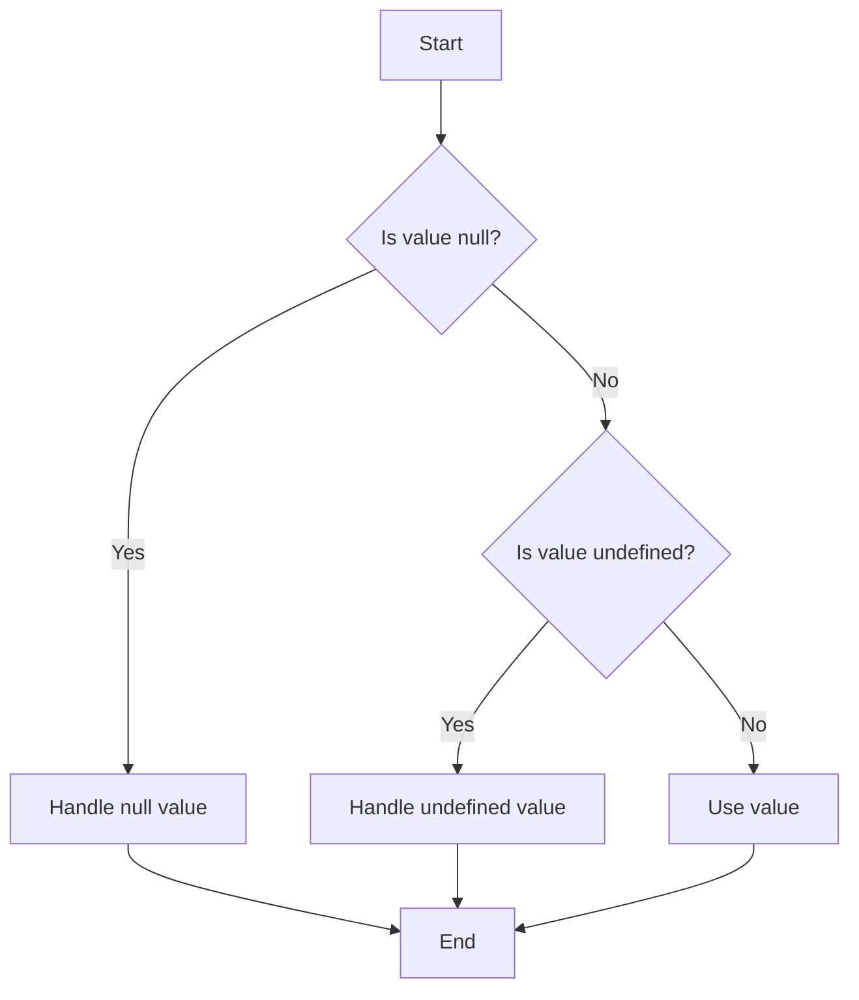

## 2.7 The `null` and `undefined` Types

In this section, we will delve into two fundamental types in TypeScript: `null` and `undefined`. Understanding these types is crucial for managing variables that may not have a value and for writing robust TypeScript code. Let's explore what these types represent, how they differ, and how to handle them effectively.

### What are `null` and `undefined`?

In JavaScript, `null` and `undefined` are two distinct types that represent the absence of a value.

- **`undefined`**: This is the default value of a variable that has been declared but not initialized. It signifies that a variable exists but has not been assigned a value yet.

```typescript
let uninitializedVar;
console.log(uninitializedVar); // Output: undefined
```

- **`null`**: This is an assignment value that represents no value or an empty value. It is explicitly set by the programmer to indicate that a variable should have no value.

```typescript
let emptyValue = null;
console.log(emptyValue); // Output: null
```

### `null` and `undefined` in TypeScript

In TypeScript, `null` and `undefined` are treated as distinct types. By default, TypeScript considers both `null` and `undefined` as valid values for all types. However, with the introduction of strict null checking, you can enforce stricter rules on how these values are handled.

### Strict Null Checking

TypeScript's strict null checking, enabled by the `strictNullChecks` compiler option, changes the way `null` and `undefined` are treated. When `strictNullChecks` is enabled, `null` and `undefined` are not considered valid values for any type unless explicitly included.

#### Enabling Strict Null Checks

To enable strict null checks, you need to set the `strictNullChecks` option to `true` in your `tsconfig.json` file:

```json
{
  "compilerOptions": {
    "strictNullChecks": true
  }
}
```

With strict null checks enabled, the following code will result in a compilation error:

```typescript
let name: string;
name = null; // Error: Type 'null' is not assignable to type 'string'.
```

### Checking for `null` and `undefined`

When working with variables that might be `null` or `undefined`, it's important to check their values before using them. TypeScript provides several ways to perform these checks.

#### Using Conditional Statements

You can use `if` statements to check for `null` or `undefined` values:

```typescript
let value: string | null | undefined;

if (value === null) {
  console.log("Value is null");
} else if (value === undefined) {
  console.log("Value is undefined");
} else {
  console.log("Value is", value);
}
```

#### Using the `==` and `===` Operators

The `==` operator checks for equality, allowing type coercion, while the `===` operator checks for strict equality without type coercion. It's generally recommended to use `===` for comparisons to avoid unexpected results.

```typescript
console.log(null == undefined);  // Output: true
console.log(null === undefined); // Output: false
```

### Union Types with `null` and `undefined`

In TypeScript, you can use union types to explicitly allow `null` or `undefined` as possible values for a variable. This is particularly useful when you want to indicate that a variable might not have a value.

#### Example of Union Types

```typescript
let nullableString: string | null = null;
nullableString = "Hello, TypeScript!";

let optionalNumber: number | undefined;
optionalNumber = 42;
```

### Common Pitfalls and Tips

Handling `null` and `undefined` can be tricky, especially for beginners. Here are some tips to avoid common pitfalls:

1. **Enable Strict Null Checks**: Enabling `strictNullChecks` helps catch potential issues at compile time, making your code more robust.

2. **Use Default Values**: Provide default values using the nullish coalescing operator (`??`) to handle `null` or `undefined` gracefully.

```typescript
let input: string | undefined;
let defaultValue = "Default";
let result = input ?? defaultValue;
console.log(result); // Output: "Default"
```

3. **Avoid Using `==` for Comparisons**: Use `===` to prevent unexpected type coercion.

4. **Use Type Guards**: Implement type guards to narrow down types and handle `null` or `undefined` safely.

```typescript
function isString(value: any): value is string {
  return typeof value === "string";
}

let unknownValue: any = "Hello";

if (isString(unknownValue)) {
  console.log(unknownValue.toUpperCase());
}
```

5. **Document Your Code**: Clearly document when a variable can be `null` or `undefined` to improve code readability and maintainability.

### Visualizing `null` and `undefined`

Let's use a Mermaid.js diagram to visualize the flow of checking `null` and `undefined` values in a program.



This flowchart illustrates the decision-making process when checking for `null` and `undefined` values.

### Try It Yourself

Experiment with the following code examples to deepen your understanding:

1. Modify the `nullableString` variable to include `undefined` in its type and observe how TypeScript handles it.
2. Use the nullish coalescing operator (`??`) to provide default values for variables that might be `null` or `undefined`.
3. Implement a type guard function to check if a variable is a number and use it in a conditional statement.

### Summary

In this section, we've explored the `null` and `undefined` types in TypeScript, their significance, and how to handle them effectively. By enabling strict null checks and using union types, you can write safer and more predictable code. Remember to use type guards and default values to manage variables that might not have a value.

## Quiz Time!



### What is the default value of a variable that has been declared but not initialized in JavaScript?

- [x] undefined
- [ ] null
- [ ] 0
- [ ] ""

> **Explanation:** In JavaScript, a variable that is declared but not initialized has a default value of `undefined`.

### What does the `strictNullChecks` compiler option do in TypeScript?

- [x] It ensures `null` and `undefined` are not assignable to any type unless explicitly included.
- [ ] It allows `null` and `undefined` to be used interchangeably.
- [ ] It converts all `null` values to `undefined`.
- [ ] It disables type checking for `null` and `undefined`.

> **Explanation:** The `strictNullChecks` option ensures that `null` and `undefined` are not assignable to any type unless explicitly included, enforcing stricter type safety.

### Which operator should you use to avoid unexpected type coercion when comparing `null` and `undefined`?

- [x] ===
- [ ] ==
- [ ] !=
- [ ] =

> **Explanation:** The `===` operator checks for strict equality without type coercion, making it the recommended choice for comparing `null` and `undefined`.

### How can you provide a default value for a variable that might be `null` or `undefined`?

- [x] Using the nullish coalescing operator (`??`)
- [ ] Using the logical OR operator (`||`)
- [ ] Using the logical AND operator (`&&`)
- [ ] Using the equality operator (`==`)

> **Explanation:** The nullish coalescing operator (`??`) provides a default value for a variable that might be `null` or `undefined`.

### What is the output of the following code snippet?
```typescript
let value: string | null = null;
console.log(value ?? "Default");
```

- [x] Default
- [ ] null
- [ ] undefined
- [ ] Error

> **Explanation:** The nullish coalescing operator (`??`) returns the right-hand operand ("Default") if the left-hand operand (`value`) is `null` or `undefined`.

### Which of the following is a common pitfall when handling `null` and `undefined`?

- [x] Using `==` instead of `===` for comparisons
- [ ] Providing default values
- [ ] Enabling strict null checks
- [ ] Using type guards

> **Explanation:** Using `==` instead of `===` can lead to unexpected results due to type coercion, making it a common pitfall.

### What is the purpose of a type guard in TypeScript?

- [x] To narrow down types and handle `null` or `undefined` safely
- [ ] To convert `null` values to `undefined`
- [ ] To disable type checking for specific variables
- [ ] To enforce strict null checks

> **Explanation:** Type guards are used to narrow down types and handle `null` or `undefined` safely in TypeScript.

### How do you enable strict null checks in TypeScript?

- [x] By setting `strictNullChecks` to `true` in `tsconfig.json`
- [ ] By using the `null` keyword in your code
- [ ] By declaring all variables with `undefined`
- [ ] By using the `==` operator for comparisons

> **Explanation:** You enable strict null checks by setting the `strictNullChecks` option to `true` in your `tsconfig.json` file.

### What is the output of the following code snippet?
```typescript
let uninitializedVar;
console.log(uninitializedVar);
```

- [x] undefined
- [ ] null
- [ ] 0
- [ ] Error

> **Explanation:** A variable that is declared but not initialized in JavaScript has a default value of `undefined`.

### True or False: In TypeScript, `null` and `undefined` are considered valid values for all types by default.

- [x] True
- [ ] False

> **Explanation:** By default, `null` and `undefined` are considered valid values for all types in TypeScript unless strict null checks are enabled.


