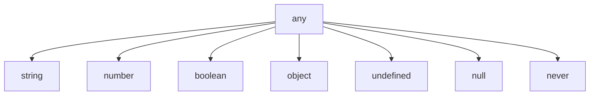

## 2.8 The `never` Type

In this section, we will delve into the `never` type in TypeScript, a unique type that represents values that never occur. Understanding `never` is crucial for mastering TypeScript's type system, especially when dealing with functions that never return or throw errors. Let's explore what the `never` type is, how it is used, and when you might encounter it in your TypeScript journey.

### What is the `never` Type?

The `never` type in TypeScript is a special type that signifies the absence of a value. It is used to represent situations where a function never successfully completes. This can occur in two primary scenarios:

1. **Functions that throw errors**: These functions terminate execution by throwing an exception.
2. **Functions with infinite loops**: These functions run indefinitely without reaching an endpoint.

The `never` type is a subtype of every other type, but no type is a subtype of `never` (except `never` itself). This means that `never` can be assigned to any type, but no type can be assigned to `never`.

### Functions that Throw Errors

One of the most common uses of the `never` type is in functions that throw errors. When a function throws an error, it does not return a value; instead, it halts execution. Let's look at an example:

```typescript
function throwError(message: string): never {
    throw new Error(message);
}

// Usage
throwError("This is an error message");
```

In this example, the `throwError` function is explicitly annotated with the `never` type because it always throws an error and never returns a value. This is a clear indication to anyone reading the code that this function will not complete normally.

### Functions with Infinite Loops

Another scenario where the `never` type is applicable is in functions that contain infinite loops. These functions are designed to run indefinitely and never reach a return statement. Here's an example:

```typescript
function infiniteLoop(): never {
    while (true) {
        console.log("This will run forever");
    }
}
```

The `infiniteLoop` function is annotated with the `never` type because it contains an infinite loop that prevents it from returning a value.

### TypeScript's Use of `never` in Type Inference

TypeScript uses the `never` type in type inference to indicate unreachable code. When TypeScript determines that a particular code path will never be executed, it assigns the `never` type to that path. Consider the following example:

```typescript
function example(value: string | number): string {
    if (typeof value === "string") {
        return "It's a string!";
    } else if (typeof value === "number") {
        return "It's a number!";
    } else {
        // TypeScript infers this block as `never`
        throw new Error("Unexpected value type");
    }
}
```

In this example, the `else` block is technically unreachable because the `value` parameter is constrained to be either a `string` or a `number`. TypeScript infers the type of this block as `never`, indicating that it should not be possible to reach this code.

### When to Explicitly Annotate with `never`

While TypeScript can often infer the `never` type, there are situations where you might want to explicitly annotate a function with `never` for clarity and documentation purposes. Explicit annotations can help convey the intent of the code to other developers or future you. Here are some guidelines:

- **Error-Throwing Functions**: If a function is designed to always throw an error, annotate it with `never` to make its behavior clear.
- **Infinite Loops**: Use `never` for functions with infinite loops to indicate they do not return.
- **Exhaustive Checks**: In switch statements or conditional checks, use `never` to ensure all possible cases are handled. This is particularly useful when working with union types.

### Cautionary Notes on Using `never`

While the `never` type is a powerful tool in TypeScript, it should be used with caution:

- **Avoid Overuse**: Do not overuse `never` in situations where it is not necessary. Reserve it for cases where a function genuinely does not return.
- **Understand Type Inference**: Rely on TypeScript's type inference capabilities to determine when `never` is appropriate. Explicit annotations are not always needed.
- **Code Clarity**: Use `never` to improve code clarity, but ensure it does not make the code harder to read or understand.

### Try It Yourself

Experiment with the `never` type by modifying the examples above. Try creating a function that uses a switch statement with exhaustive checks, and see how TypeScript infers the `never` type for unhandled cases.

### Visualizing the `never` Type

To better understand how the `never` type fits into TypeScript's type system, let's visualize it using a type hierarchy diagram:



In this diagram, `never` is shown as a subtype of all other types, emphasizing that it can be assigned to any type, but no type can be assigned to `never`.

### Summary

The `never` type is an essential part of TypeScript's type system, representing functions that never return. It is used in error-throwing functions, infinite loops, and type inference for unreachable code. By understanding and using the `never` type correctly, you can write more robust and predictable TypeScript code.

## Quiz Time!



### What does the `never` type represent in TypeScript?

- [x] A type that represents values that never occur
- [ ] A type that represents any value
- [ ] A type that represents null or undefined
- [ ] A type that represents a string or number

> **Explanation:** The `never` type represents values that never occur, such as functions that never return.

### Which of the following functions should be annotated with `never`?

- [x] A function that throws an error
- [ ] A function that returns a string
- [ ] A function that returns a number
- [ ] A function that returns a boolean

> **Explanation:** Functions that throw errors should be annotated with `never` because they do not return a value.

### In which scenario is the `never` type used in TypeScript's type inference?

- [x] When a code path is unreachable
- [ ] When a function returns a string
- [ ] When a variable is undefined
- [ ] When a function returns a number

> **Explanation:** TypeScript uses the `never` type to indicate unreachable code paths.

### What is a common use case for the `never` type?

- [x] Functions with infinite loops
- [ ] Functions that return a string
- [ ] Functions that return a number
- [ ] Functions that return a boolean

> **Explanation:** Functions with infinite loops are a common use case for the `never` type because they do not return.

### Why might you explicitly annotate a function with `never`?

- [x] To indicate that the function does not return
- [ ] To indicate that the function returns a string
- [ ] To indicate that the function returns a number
- [ ] To indicate that the function returns a boolean

> **Explanation:** Explicitly annotating a function with `never` indicates that it does not return a value.

### What should you avoid when using the `never` type?

- [x] Overusing it in unnecessary situations
- [ ] Using it for functions that throw errors
- [ ] Using it for functions with infinite loops
- [ ] Using it for unreachable code paths

> **Explanation:** Avoid overusing the `never` type in situations where it is not necessary.

### How does the `never` type relate to other types in TypeScript?

- [x] It is a subtype of every other type
- [ ] It is a supertype of every other type
- [ ] It is equivalent to every other type
- [ ] It is unrelated to other types

> **Explanation:** The `never` type is a subtype of every other type, meaning it can be assigned to any type.

### What does the `never` type indicate in a switch statement?

- [x] That all possible cases are handled
- [ ] That a case returns a string
- [ ] That a case returns a number
- [ ] That a case returns a boolean

> **Explanation:** The `never` type in a switch statement indicates that all possible cases are handled.

### Can a value of type `string` be assigned to a variable of type `never`?

- [ ] Yes
- [x] No

> **Explanation:** No type can be assigned to `never` except `never` itself.

### True or False: The `never` type can be used to represent functions that return a value.

- [ ] True
- [x] False

> **Explanation:** The `never` type is used to represent functions that do not return a value.



By understanding the `never` type, you are better equipped to handle functions that do not return and ensure that your TypeScript code is both robust and predictable. Keep experimenting and exploring to deepen your understanding of TypeScript's powerful type system!
