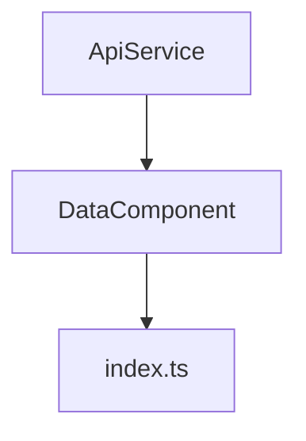

## 20.1 Code Organization and Project Structure

As you embark on your journey to mastering TypeScript, one of the most crucial skills you'll develop is the ability to organize your code effectively. A well-structured project not only makes it easier to maintain and scale your application but also enhances collaboration within a team. In this section, we'll explore the principles of code organization and project structure, providing you with practical guidelines and examples to help you create clean, efficient, and scalable TypeScript projects.

### Why is Code Organization Important?

Before we dive into the specifics of organizing a TypeScript project, let's first understand why code organization is essential:

- **Scalability**: As your project grows, a well-organized structure allows you to add new features without creating chaos.
- **Maintainability**: A clear structure makes it easier to locate and fix bugs, update features, and refactor code.
- **Collaboration**: Consistent organization helps team members understand the project quickly, facilitating better collaboration.
- **Reusability**: Properly organized code encourages the reuse of components and modules across different parts of the application.

### Principles of Code Organization

To achieve an effective project structure, consider the following principles:

1. **Separation of Concerns**: Divide your code into distinct sections, each responsible for a specific aspect of the application. This makes it easier to manage and understand.

2. **Modularity**: Break down your code into self-contained modules or components. This promotes reusability and makes testing and maintenance more straightforward.

3. **Consistency**: Maintain a consistent structure across your project. This includes naming conventions, folder hierarchy, and file organization.

4. **Documentation**: Document your project structure to help new developers understand the organization and purpose of each component.

### Common Project Structures

Let's explore some common project structures used in TypeScript applications. These structures can be adapted to suit the specific needs of your project.

#### Basic Project Structure

For small projects, a simple structure might suffice. Here's an example of a basic TypeScript project structure:

```
my-project/
├── src/
│   ├── index.ts
│   ├── utils.ts
│   ├── types.ts
├── dist/
├── node_modules/
├── package.json
├── tsconfig.json
```

- **src/**: Contains the source code of your application.
- **dist/**: Stores the compiled JavaScript files.
- **node_modules/**: Contains the project's dependencies.
- **package.json**: Manages project metadata and dependencies.
- **tsconfig.json**: Configures the TypeScript compiler options.

#### Modular Project Structure

As your project grows, consider adopting a more modular structure. This involves organizing your code into separate modules or features:

```
my-project/
├── src/
│   ├── components/
│   │   ├── Header.ts
│   │   ├── Footer.ts
│   ├── services/
│   │   ├── ApiService.ts
│   │   ├── AuthService.ts
│   ├── models/
│   │   ├── User.ts
│   │   ├── Product.ts
│   ├── utils/
│   │   ├── helpers.ts
│   │   ├── validators.ts
│   ├── index.ts
├── dist/
├── node_modules/
├── package.json
├── tsconfig.json
```

- **components/**: Contains reusable UI components.
- **services/**: Includes services for handling business logic and API interactions.
- **models/**: Defines data models or interfaces.
- **utils/**: Contains utility functions and helpers.

#### Advanced Project Structure

For larger applications, you might need a more advanced structure that incorporates additional layers, such as configuration, middleware, and tests:

```
my-project/
├── src/
│   ├── components/
│   ├── services/
│   ├── models/
│   ├── utils/
│   ├── config/
│   │   ├── appConfig.ts
│   │   ├── dbConfig.ts
│   ├── middleware/
│   │   ├── authMiddleware.ts
│   │   ├── errorMiddleware.ts
│   ├── tests/
│   │   ├── componentTests/
│   │   ├── serviceTests/
│   ├── index.ts
├── dist/
├── node_modules/
├── package.json
├── tsconfig.json
├── jest.config.js
```

- **config/**: Stores configuration files for the application.
- **middleware/**: Contains middleware functions for handling requests and responses.
- **tests/**: Includes test files for different parts of the application.

### Guidelines for Structuring Projects

Now that we've explored some common structures, let's discuss guidelines for organizing your TypeScript projects effectively:

#### Group Related Files

- **Group by Feature**: Organize files based on features or modules. This makes it easier to locate related code and manage dependencies.
- **Group by Type**: Alternatively, group files by type, such as components, services, and models. This approach can be beneficial for smaller projects.

#### Separate Concerns

- **UI and Logic**: Keep UI components separate from business logic. This separation allows you to update the UI without affecting the underlying logic.
- **Data and Presentation**: Separate data models from presentation logic. This promotes reusability and simplifies testing.

#### Use Modular Design

- **Encapsulate Functionality**: Create modules or classes that encapsulate specific functionality. This makes it easier to test and maintain individual parts of the application.
- **Export and Import**: Use TypeScript's `export` and `import` statements to manage dependencies between modules. This promotes reusability and reduces code duplication.

#### Maintain Consistency

- **Naming Conventions**: Use consistent naming conventions for files, classes, and variables. This improves readability and makes it easier to understand the purpose of each component.
- **Folder Hierarchy**: Maintain a consistent folder hierarchy across your project. This helps team members navigate the codebase efficiently.

#### Document the Structure

- **README File**: Include a README file that explains the project structure and provides an overview of the application's components.
- **Code Comments**: Use comments to explain the purpose of modules, classes, and functions. This aids understanding and reduces the learning curve for new developers.

### Code Example: Modular Design

Let's look at a simple example of a modular design in TypeScript. We'll create a basic application with a service and a component.

```typescript
// src/services/ApiService.ts
export class ApiService {
    fetchData(): string {
        return "Data from API";
    }
}

// src/components/DataComponent.ts
import { ApiService } from "../services/ApiService";

export class DataComponent {
    private apiService: ApiService;

    constructor() {
        this.apiService = new ApiService();
    }

    render(): void {
        const data = this.apiService.fetchData();
        console.log(`Rendering data: ${data}`);
    }
}

// src/index.ts
import { DataComponent } from "./components/DataComponent";

const dataComponent = new DataComponent();
dataComponent.render();
```

In this example:

- **ApiService**: A service class responsible for fetching data.
- **DataComponent**: A component class that uses the `ApiService` to render data.
- **index.ts**: The entry point of the application, where we instantiate and use the `DataComponent`.

### Try It Yourself

To reinforce your understanding, try modifying the code example above:

- **Add a new service**: Create a new service that provides additional data and integrate it with the `DataComponent`.
- **Enhance the component**: Modify the `DataComponent` to display multiple pieces of data from different services.

### Visual Aids

To help visualize the project structure, let's use a Mermaid.js diagram to represent the modular design:



**Diagram Description**: This diagram illustrates the relationship between the `ApiService`, `DataComponent`, and `index.ts`. The `ApiService` provides data to the `DataComponent`, which is then used in the `index.ts` file.

### References and Links

For further reading on TypeScript project structure and code organization, consider the following resources:

- [TypeScript Handbook](https://www.typescriptlang.org/docs/handbook/intro.html)
- [MDN Web Docs: JavaScript Modules](https://developer.mozilla.org/en-US/docs/Web/JavaScript/Guide/Modules)
- [Node.js Project Structure Best Practices](https://nodejs.dev/learn/nodejs-project-structure)

### Engagement and Reinforcement

To engage with the material, consider the following questions:

- How would you organize a project with multiple features and shared components?
- What are the benefits of separating UI components from business logic?

### Exercises

1. **Create a New Project**: Set up a new TypeScript project with a modular structure. Include at least two services and two components.
2. **Refactor an Existing Project**: Take an existing TypeScript project and refactor it to improve its structure and organization.

### Key Takeaways

- A well-organized project structure enhances scalability, maintainability, and collaboration.
- Use separation of concerns and modular design to create clean, efficient code.
- Maintain consistency in naming conventions and folder hierarchy.
- Document your project structure to aid understanding and onboarding.

## Quiz Time!



### What is the primary benefit of organizing code into modules?

- [x] Reusability and easier maintenance
- [ ] Faster execution
- [ ] Reduced file size
- [ ] Improved graphics rendering

> **Explanation:** Organizing code into modules promotes reusability and makes maintenance easier by encapsulating functionality.

### Which principle involves dividing code into distinct sections, each responsible for a specific aspect of the application?

- [x] Separation of Concerns
- [ ] Modularity
- [ ] Consistency
- [ ] Documentation

> **Explanation:** Separation of Concerns involves dividing code into sections, each handling a specific responsibility.

### What is a common folder used to store compiled JavaScript files in a TypeScript project?

- [x] dist/
- [ ] src/
- [ ] node_modules/
- [ ] config/

> **Explanation:** The `dist/` folder is commonly used to store compiled JavaScript files.

### What should you include in a README file?

- [x] Explanation of project structure
- [ ] List of all variables
- [ ] Complete codebase
- [ ] Personal information

> **Explanation:** A README file should include an explanation of the project structure and an overview of the application.

### Which TypeScript feature helps manage dependencies between modules?

- [x] Export and Import
- [ ] Interfaces
- [ ] Classes
- [ ] Generics

> **Explanation:** TypeScript's `export` and `import` statements help manage dependencies between modules.

### What is the benefit of maintaining a consistent folder hierarchy?

- [x] Efficient navigation of the codebase
- [ ] Faster code execution
- [ ] Improved graphics rendering
- [ ] Reduced memory usage

> **Explanation:** A consistent folder hierarchy helps team members navigate the codebase efficiently.

### What is the purpose of the `node_modules/` folder?

- [x] To store project dependencies
- [ ] To store compiled code
- [ ] To store configuration files
- [ ] To store user data

> **Explanation:** The `node_modules/` folder stores the project's dependencies.

### Why is it important to separate UI components from business logic?

- [x] To allow updates to the UI without affecting the logic
- [ ] To reduce file size
- [ ] To improve graphics rendering
- [ ] To increase execution speed

> **Explanation:** Separating UI components from business logic allows updates to the UI without affecting the underlying logic.

### What is a key advantage of documenting your project structure?

- [x] It aids understanding and reduces the learning curve for new developers.
- [ ] It increases code execution speed.
- [ ] It improves graphics rendering.
- [ ] It reduces memory usage.

> **Explanation:** Documenting your project structure helps new developers understand the organization and purpose of each component.

### True or False: A well-organized project structure is only important for large projects.

- [ ] True
- [x] False

> **Explanation:** A well-organized project structure is important for projects of all sizes, as it enhances scalability, maintainability, and collaboration.


