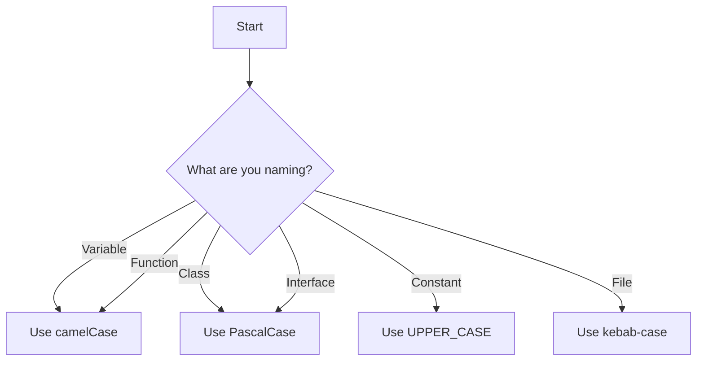

## 20.2 Naming Conventions

In the world of programming, naming conventions play a crucial role in enhancing code readability and maintainability. As you embark on your journey with TypeScript, adopting consistent naming conventions will not only make your code more understandable to others but also to your future self. In this section, we'll explore the standard naming conventions used in TypeScript, discuss the importance of clear and descriptive names, and provide practical examples to illustrate good and bad naming practices.

### Why Naming Conventions Matter

Before diving into specific conventions, let's understand why naming conventions are important:

- **Readability**: Consistent naming makes it easier for developers to read and understand code. It reduces cognitive load, allowing developers to focus on logic rather than deciphering names.
- **Maintainability**: Clear names help in maintaining code over time. When you or someone else revisits the code after months or years, meaningful names provide context and understanding.
- **Collaboration**: In a team setting, following a common naming convention ensures that everyone is on the same page, reducing misunderstandings and errors.
- **Professionalism**: Adhering to industry standards reflects professionalism and attention to detail, which are highly valued in software development.

### Common Naming Conventions

Let's explore some of the most common naming conventions used in TypeScript:

#### camelCase

- **Usage**: Primarily used for variable names, function names, and object properties.
- **Format**: The first letter is lowercase, and each subsequent word starts with an uppercase letter.
- **Example**: `let userName = "John";`, `function calculateTotal() {}`

#### PascalCase

- **Usage**: Commonly used for class names, interfaces, and type aliases.
- **Format**: Each word starts with an uppercase letter.
- **Example**: `class UserProfile {}`, `interface UserSettings {}`

#### snake_case

- **Usage**: Rarely used in TypeScript, but sometimes seen in constants or configuration files.
- **Format**: Words are separated by underscores, all in lowercase.
- **Example**: `const api_key = "12345";`

#### UPPER_CASE

- **Usage**: Typically used for constants and enum values.
- **Format**: All letters are uppercase, with words separated by underscores.
- **Example**: `const MAX_USERS = 100;`, `enum Color { RED, GREEN, BLUE }`

### Guidelines for Naming

#### Variables

- **Descriptive Names**: Use names that clearly describe the purpose of the variable.
  - **Good**: `let userAge = 25;`
  - **Bad**: `let x = 25;`

- **Avoid Abbreviations**: Unless they are well-known and universally understood.
  - **Good**: `let totalAmount = 100;`
  - **Bad**: `let amt = 100;`

- **Use camelCase**: For consistency and readability.
  - **Example**: `let firstName = "Alice";`

#### Functions

- **Action-Oriented Names**: Functions should be named after the action they perform.
  - **Good**: `function fetchData() {}`
  - **Bad**: `function data() {}`

- **Use camelCase**: To maintain a consistent naming style.
  - **Example**: `function calculateSum(a: number, b: number): number { return a + b; }`

- **Avoid Generic Names**: Be specific about the function's purpose.
  - **Good**: `function validateEmail(email: string): boolean {}`
  - **Bad**: `function check() {}`

#### Classes and Interfaces

- **Use PascalCase**: To distinguish them from variables and functions.
  - **Example**: `class ShoppingCart {}`, `interface Product {}`

- **Descriptive Names**: Reflect the entity or concept the class or interface represents.
  - **Good**: `class UserAccount {}`
  - **Bad**: `class U {}`
  
- **Prefix Interfaces with 'I'**: This is optional and depends on team conventions.
  - **Example**: `interface IUser {}`

#### Constants

- **Use UPPER_CASE**: To signify immutability and importance.
  - **Example**: `const PI = 3.14;`

- **Descriptive Names**: Clearly indicate what the constant represents.
  - **Good**: `const MAX_RETRIES = 5;`
  - **Bad**: `const m = 5;`

### File Naming Conventions

- **Use kebab-case**: For filenames, which is a common practice in TypeScript projects.
  - **Example**: `user-profile.ts`, `shopping-cart.ts`

- **Descriptive Filenames**: Reflect the content or purpose of the file.
  - **Good**: `user-service.ts`
  - **Bad**: `file1.ts`

- **Consistent Extensions**: Use `.ts` for TypeScript files and `.d.ts` for declaration files.

### Examples of Good and Bad Naming Practices

Let's look at some examples to reinforce these concepts:

```typescript
// Good Naming Practice
let userEmail = "example@example.com";
function sendEmail(email: string): void {
  console.log(`Sending email to ${email}`);
}
class EmailService {
  send(email: string): void {
    console.log(`Email sent to ${email}`);
  }
}

// Bad Naming Practice
let e = "example@example.com";
function s(e: string): void {
  console.log(`Sending email to ${e}`);
}
class es {
  s(e: string): void {
    console.log(`Email sent to ${e}`);
  }
}
```

### Try It Yourself

Now that we've covered the basics, try modifying the following code snippet to adhere to the naming conventions discussed:

```typescript
// Original Code
let n = 10;
function add(a: number, b: number): number {
  return a + b;
}
class p {
  constructor(public n: number) {}
}

// Improved Code
let numberOfItems = 10;
function addNumbers(firstNumber: number, secondNumber: number): number {
  return firstNumber + secondNumber;
}
class Product {
  constructor(public quantity: number) {}
}
```

### Visual Aid: Naming Conventions Flowchart

To help visualize the naming conventions, here is a flowchart that outlines the decision-making process for choosing the appropriate naming style:



### Adhering to Team or Industry Standards

While the conventions discussed here are widely accepted, it's important to note that different teams or organizations may have their own specific guidelines. Always strive to adhere to your team's standards, and when in doubt, consult your project's style guide or lead developer.

### Conclusion

Naming conventions are a fundamental aspect of writing clean, readable, and maintainable code. By adopting consistent naming practices, you'll not only improve your own coding skills but also contribute positively to any team or project you work on. Remember, the goal is to make your code as intuitive and understandable as possible.

### Key Takeaways

- Use **camelCase** for variables and functions.
- Use **PascalCase** for classes and interfaces.
- Use **UPPER_CASE** for constants.
- Choose descriptive and meaningful names.
- Follow team or industry standards for consistency.

## Quiz Time!



### Which naming convention is typically used for variable names in TypeScript?

- [x] camelCase
- [ ] PascalCase
- [ ] snake_case
- [ ] UPPER_CASE

> **Explanation:** camelCase is the standard naming convention for variables in TypeScript.

### What naming convention should be used for class names?

- [ ] camelCase
- [x] PascalCase
- [ ] snake_case
- [ ] UPPER_CASE

> **Explanation:** PascalCase is used for class names to distinguish them from variables and functions.

### Why is it important to use descriptive names for variables?

- [x] To make the code more readable and maintainable
- [ ] To make the code more complex
- [ ] To confuse other developers
- [ ] To increase the file size

> **Explanation:** Descriptive names improve code readability and maintainability by providing context.

### What is the recommended naming convention for constants?

- [ ] camelCase
- [ ] PascalCase
- [ ] snake_case
- [x] UPPER_CASE

> **Explanation:** UPPER_CASE is used for constants to signify immutability and importance.

### Which of the following is a bad naming practice?

- [ ] Using descriptive names
- [x] Using single-letter variable names
- [ ] Following team standards
- [ ] Using camelCase for variables

> **Explanation:** Single-letter variable names lack clarity and context, making the code harder to understand.

### What is the purpose of using PascalCase for class names?

- [x] To distinguish them from variables and functions
- [ ] To make them harder to read
- [ ] To confuse other developers
- [ ] To increase the file size

> **Explanation:** PascalCase helps distinguish class names from variables and functions.

### Which naming convention is rarely used in TypeScript?

- [ ] camelCase
- [ ] PascalCase
- [x] snake_case
- [ ] UPPER_CASE

> **Explanation:** snake_case is rarely used in TypeScript, except occasionally for constants or configuration files.

### What should you do if your team has specific naming conventions?

- [x] Follow the team's conventions
- [ ] Ignore them and use your own
- [ ] Use random naming styles
- [ ] Avoid naming conventions altogether

> **Explanation:** Following team conventions ensures consistency and collaboration.

### Which naming convention is used for filenames in TypeScript projects?

- [ ] camelCase
- [ ] PascalCase
- [x] kebab-case
- [ ] UPPER_CASE

> **Explanation:** kebab-case is commonly used for filenames in TypeScript projects.

### True or False: Naming conventions are only important for large projects.

- [ ] True
- [x] False

> **Explanation:** Naming conventions are important for projects of all sizes to ensure readability and maintainability.


