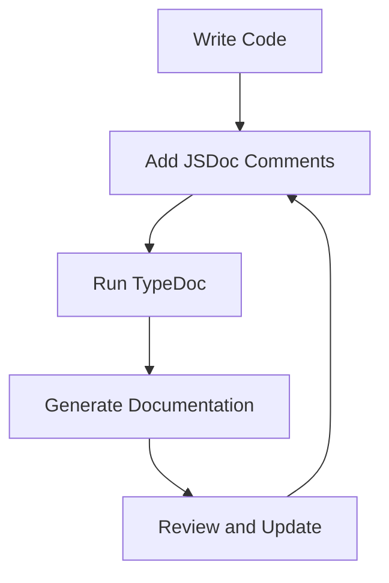

## 20.4 Documenting Your Code

In the world of software development, writing code is just one part of the equation. Equally important is ensuring that your code is understandable and maintainable by others—or even by yourself in the future. This is where documentation comes into play. In this section, we'll explore the importance of documenting your TypeScript code, how to use JSDoc-style comments, and how to generate documentation using tools like TypeDoc.

### Why Document Your Code?

Before diving into the technicalities, let's discuss why documenting your code is crucial:

- **Improved Readability**: Well-documented code is easier to read and understand, reducing the learning curve for new developers joining the project.
- **Easier Maintenance**: Documentation helps in maintaining the codebase by providing insights into the code's purpose and functionality.
- **Better Collaboration**: When working in teams, documentation acts as a common language, ensuring everyone is on the same page.
- **Future-proofing**: As projects evolve, documentation serves as a historical record, explaining why certain decisions were made.

### JSDoc: The Basics

JSDoc is a popular tool for adding comments to your JavaScript and TypeScript code. These comments can describe the purpose of a function, the types of its parameters, the return type, and more. Let's look at some basic JSDoc annotations:

```typescript
/**
 * Adds two numbers together.
 * @param {number} a - The first number.
 * @param {number} b - The second number.
 * @returns {number} The sum of the two numbers.
 */
function add(a: number, b: number): number {
    return a + b;
}
```

In this example, the `@param` tag is used to describe the parameters, and the `@returns` tag describes the return value. These annotations help anyone reading the code understand what the function does without having to decipher the implementation details.

### Common JSDoc Annotations

Here are some commonly used JSDoc annotations:

- `@param {type} name - description`: Describes a parameter of a function.
- `@returns {type} - description`: Describes the return value of a function.
- `@example`: Provides an example of how to use the function.
- `@deprecated`: Marks a method or function as deprecated.
- `@see`: Provides a reference to related information.

### Advanced JSDoc Annotations

As you become more comfortable with JSDoc, you can explore more advanced annotations:

- `@typedef`: Defines complex types.
- `@callback`: Describes callback functions.
- `@template`: Documents generic types.
- `@throws {type}`: Describes exceptions thrown by a function.

### Generating Documentation with TypeDoc

TypeDoc is a documentation generator specifically designed for TypeScript. It reads your JSDoc comments and generates a static HTML documentation site. Here's how to get started with TypeDoc:

1. **Install TypeDoc**: First, you need to install TypeDoc as a development dependency in your project:

   ```bash
   npm install typedoc --save-dev
   ```

2. **Run TypeDoc**: Use the following command to generate documentation:

   ```bash
   npx typedoc --out docs src
   ```

   This command tells TypeDoc to generate documentation from the `src` directory and output it to a `docs` directory.

3. **Customize TypeDoc**: You can customize TypeDoc's behavior using a `typedoc.json` configuration file. For example:

   ```json
   {
     "entryPoints": ["src/index.ts"],
     "out": "docs",
     "exclude": ["**/node_modules/**"],
     "includeVersion": true
   }
   ```

### Including Examples and Usage Guidelines

A key aspect of good documentation is providing examples and usage guidelines. This helps users understand how to use your functions and classes effectively.

#### Example with JSDoc

```typescript
/**
 * Calculates the factorial of a number.
 * @param {number} n - The number to calculate the factorial for.
 * @returns {number} The factorial of the number.
 * @example
 * // returns 120
 * factorial(5);
 */
function factorial(n: number): number {
    if (n <= 1) return 1;
    return n * factorial(n - 1);
}
```

In this example, the `@example` tag provides a clear usage example, demonstrating how the function should be used.

### Encouraging Documentation Updates

As your code evolves, so should your documentation. Here are some best practices to ensure your documentation remains up-to-date:

- **Document as You Code**: Make it a habit to write documentation alongside your code. This ensures that your documentation is always relevant.
- **Review Documentation During Code Reviews**: Include documentation checks as part of your code review process.
- **Use Version Control**: Track changes in your documentation using version control systems like Git.
- **Automate Documentation Generation**: Integrate tools like TypeDoc into your build process to automate documentation generation.

### Try It Yourself

To reinforce your understanding, try documenting a simple TypeScript class using JSDoc and generate documentation with TypeDoc. Here's a starting point:

```typescript
/**
 * Represents a person.
 */
class Person {
    /**
     * Creates a new person.
     * @param {string} name - The name of the person.
     * @param {number} age - The age of the person.
     */
    constructor(public name: string, public age: number) {}

    /**
     * Greets another person.
     * @param {Person} other - The person to greet.
     * @returns {string} A greeting message.
     */
    greet(other: Person): string {
        return `Hello, ${other.name}! My name is ${this.name}.`;
    }
}
```

**Challenge**: Generate documentation for this class using TypeDoc. Experiment by adding more methods and properties, and update the documentation accordingly.

### Visual Aids

To visualize the process of documenting and generating documentation, let's use a flowchart:



**Description**: This flowchart illustrates the cycle of writing code, adding JSDoc comments, generating documentation with TypeDoc, and reviewing and updating the documentation.

### Additional Resources

For more information on JSDoc and TypeDoc, consider exploring the following resources:

- [JSDoc Official Documentation](https://jsdoc.app/)
- [TypeDoc Official Website](https://typedoc.org/)
- [MDN Web Docs on JSDoc](https://developer.mozilla.org/en-US/docs/Web/JavaScript/Reference/Global_Objects/Function)

### Key Takeaways

- Documenting your code improves readability, maintainability, and collaboration.
- Use JSDoc annotations to describe functions, parameters, and return values.
- Generate documentation automatically using tools like TypeDoc.
- Keep your documentation up-to-date with code changes.
- Provide examples and usage guidelines to enhance understanding.

By following these practices, you'll ensure that your TypeScript code is not only functional but also accessible and maintainable for anyone who interacts with it.

## Quiz Time!



### What is the primary purpose of documenting code?

- [x] To improve readability and maintainability
- [ ] To increase code execution speed
- [ ] To reduce file size
- [ ] To make code harder to understand

> **Explanation:** Documenting code is primarily aimed at improving readability and maintainability, making it easier for others (or yourself) to understand and work with the code in the future.

### Which JSDoc tag is used to describe a function's parameter?

- [ ] @returns
- [x] @param
- [ ] @example
- [ ] @typedef

> **Explanation:** The `@param` tag is used in JSDoc to describe a function's parameter, including its type and description.

### What tool is used to generate documentation from JSDoc comments in TypeScript?

- [ ] ESLint
- [ ] Prettier
- [x] TypeDoc
- [ ] Babel

> **Explanation:** TypeDoc is a tool specifically designed to generate documentation from JSDoc comments in TypeScript projects.

### How can you ensure your documentation stays up-to-date?

- [x] Document as you code
- [x] Review documentation during code reviews
- [ ] Ignore documentation after initial writing
- [x] Use version control

> **Explanation:** To keep documentation up-to-date, it's important to document as you code, review documentation during code reviews, and use version control to track changes.

### What does the `@example` tag in JSDoc provide?

- [ ] A description of a parameter
- [ ] The return type of a function
- [x] An example of how to use the function
- [ ] A reference to related information

> **Explanation:** The `@example` tag in JSDoc provides an example of how to use the function, helping users understand its usage.

### Which JSDoc tag marks a method as deprecated?

- [ ] @param
- [ ] @returns
- [x] @deprecated
- [ ] @throws

> **Explanation:** The `@deprecated` tag in JSDoc is used to mark a method or function as deprecated, indicating that it should not be used in new code.

### What is the benefit of using TypeDoc?

- [x] Automatically generates HTML documentation
- [ ] Increases code execution speed
- [ ] Reduces code complexity
- [ ] Compiles TypeScript to JavaScript

> **Explanation:** TypeDoc automatically generates HTML documentation from JSDoc comments, making it easy to create and maintain comprehensive documentation.

### What should you include in your documentation to enhance understanding?

- [x] Examples and usage guidelines
- [ ] Only complex algorithms
- [ ] Personal opinions
- [ ] Unrelated code snippets

> **Explanation:** Including examples and usage guidelines in your documentation helps enhance understanding by providing practical insights into how to use the code.

### What is the role of the `@typedef` tag in JSDoc?

- [ ] Describes a function parameter
- [x] Defines complex types
- [ ] Marks a method as deprecated
- [ ] Provides an example

> **Explanation:** The `@typedef` tag in JSDoc is used to define complex types, allowing you to describe custom data structures in your documentation.

### True or False: Documentation should only be written after the code is complete.

- [ ] True
- [x] False

> **Explanation:** Documentation should be written alongside code development to ensure it remains relevant and accurate, rather than waiting until the code is complete.


