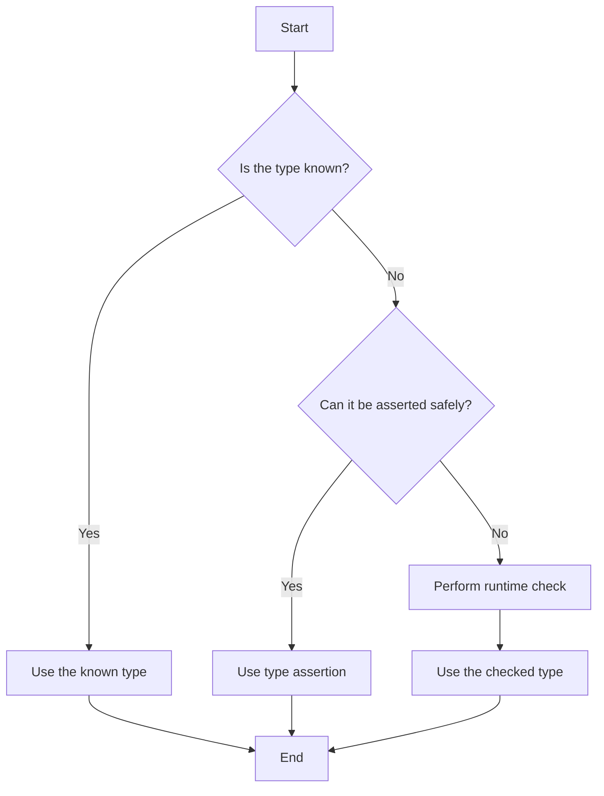

## 20.5 Avoiding Common Pitfalls

As you embark on your journey to master TypeScript, it's important to be aware of common pitfalls that beginners often encounter. Understanding these pitfalls will not only help you write better code but also make your learning experience smoother and more enjoyable. In this section, we'll explore some of the most frequent mistakes, provide examples, and discuss strategies to avoid or correct them. Let's dive in!

### Misuse of the `any` Type

One of the most common pitfalls for beginners is the overuse or misuse of the `any` type. While `any` can be a quick fix to bypass type checking, it defeats the purpose of using TypeScript's static typing system, which is to catch errors at compile time.

#### Why It's a Problem

Using `any` essentially turns off type checking for a variable, which can lead to runtime errors that TypeScript is designed to prevent. This can make your codebase less predictable and harder to maintain.

#### Example

```typescript
let data: any;
data = "Hello, World!";
console.log(data.toFixed(2)); // Runtime error: toFixed is not a function
```

In the example above, `data` is assigned a string, but the method `toFixed` is called, which is only valid for numbers. Since `data` is typed as `any`, TypeScript doesn't catch this mistake.

#### How to Avoid It

- **Use Specific Types**: Instead of `any`, use specific types whenever possible. If you're unsure of the type, consider using `unknown` and perform type checks before using the value.
- **Leverage Type Inference**: Let TypeScript infer types when possible, reducing the need for explicit `any` declarations.

#### Corrected Example

```typescript
let data: string = "Hello, World!";
console.log(data.toUpperCase()); // Correct usage
```

### Improper Type Assertions

Type assertions are a powerful feature in TypeScript, but they can be misused, leading to unexpected behavior.

#### Why It's a Problem

Improper type assertions can lead to false assumptions about the type of a variable, resulting in runtime errors.

#### Example

```typescript
let someValue: unknown = "This is a string";
let strLength: number = (someValue as number).length; // Incorrect assertion
```

In this example, `someValue` is asserted as a `number`, but it's actually a `string`. This will lead to a runtime error when trying to access `length`.

#### How to Avoid It

- **Use Type Assertions Sparingly**: Only use type assertions when you are certain about the type of a variable.
- **Perform Runtime Checks**: Use runtime checks to ensure the variable is of the expected type before asserting.

#### Corrected Example

```typescript
let someValue: unknown = "This is a string";
if (typeof someValue === "string") {
  let strLength: number = someValue.length; // Safe usage
}
```

### Neglecting Null and Undefined Checks

Another common pitfall is neglecting to check for `null` or `undefined` values, which can lead to runtime errors.

#### Why It's a Problem

Assuming that a variable is always defined can lead to `TypeError` exceptions when accessing properties or methods on `null` or `undefined`.

#### Example

```typescript
function getLength(str: string | null): number {
  return str.length; // Potential runtime error if str is null
}
```

#### How to Avoid It

- **Use Optional Chaining**: Use optional chaining (`?.`) to safely access properties on potentially `null` or `undefined` objects.
- **Use Nullish Coalescing**: Use the nullish coalescing operator (`??`) to provide default values.

#### Corrected Example

```typescript
function getLength(str: string | null): number {
  return str?.length ?? 0; // Safe usage with default value
}
```

### Overlooking Type Inference

TypeScript's type inference is a powerful feature that can save you time and reduce errors, but beginners often overlook it.

#### Why It's a Problem

Explicitly typing every variable can lead to verbose and redundant code, making it harder to read and maintain.

#### Example

```typescript
let count: number = 10;
let message: string = "Hello, TypeScript!";
```

In the example above, the types `number` and `string` are redundant because TypeScript can infer them.

#### How to Avoid It

- **Trust TypeScript's Inference**: Let TypeScript infer types when the type is obvious from the context.

#### Corrected Example

```typescript
let count = 10; // TypeScript infers type as number
let message = "Hello, TypeScript!"; // TypeScript infers type as string
```

### Ignoring Compiler Warnings

Compiler warnings are there to help you catch potential issues early, but they are often ignored by beginners.

#### Why It's a Problem

Ignoring warnings can lead to subtle bugs that are hard to track down later.

#### Example

```typescript
let unusedVariable = 42; // Compiler warning: 'unusedVariable' is declared but its value is never read
```

#### How to Avoid It

- **Pay Attention to Warnings**: Treat warnings as errors and address them promptly.
- **Use Strict Mode**: Enable strict mode in your `tsconfig.json` to catch more potential issues.

#### Corrected Example

```typescript
// Remove unused variable or use it
console.log("Hello, World!");
```

### Failing to Leverage TypeScript Features

TypeScript offers many features that can enhance your code, such as interfaces, generics, and enums. Beginners often fail to leverage these features fully.

#### Why It's a Problem

Not using TypeScript's features can lead to less robust and maintainable code.

#### Example

```typescript
function printUser(user: { name: string; age: number }) {
  console.log(`Name: ${user.name}, Age: ${user.age}`);
}
```

While this function works, it could be improved by using an interface.

#### How to Avoid It

- **Use Interfaces and Types**: Define interfaces or types for complex structures to improve readability and maintainability.
- **Explore Advanced Features**: As you become more comfortable with TypeScript, explore features like generics and enums.

#### Corrected Example

```typescript
interface User {
  name: string;
  age: number;
}

function printUser(user: User) {
  console.log(`Name: ${user.name}, Age: ${user.age}`);
}
```

### Try It Yourself

To reinforce your understanding, try modifying the examples above. For instance, change the `User` interface to include an optional email property, and update the `printUser` function to handle this new property. Experimenting with code is a great way to solidify your learning.

### Visual Aids

To better understand the flow of handling null values and type assertions, let's look at a simple flowchart that illustrates the decision-making process when dealing with unknown types.



This flowchart helps visualize the steps you should take when dealing with unknown types in TypeScript, ensuring that you handle them safely and effectively.

### Continuous Learning and Code Review

Avoiding common pitfalls is an ongoing process. Here are some strategies to help you continue improving:

- **Engage in Code Reviews**: Regular code reviews can help catch mistakes early and provide valuable learning opportunities.
- **Stay Updated**: Keep up with the latest TypeScript updates and best practices by following the [TypeScript Handbook](https://www.typescriptlang.org/docs/handbook/intro.html) and other reputable resources.
- **Practice Regularly**: The more you practice, the more familiar you'll become with TypeScript's features and quirks.

### Key Takeaways

- Avoid using `any` unless absolutely necessary, and prefer specific types or `unknown`.
- Use type assertions carefully and perform runtime checks when needed.
- Always check for `null` or `undefined` values to prevent runtime errors.
- Leverage TypeScript's type inference to write cleaner code.
- Pay attention to compiler warnings and enable strict mode for better error checking.
- Explore and utilize TypeScript's advanced features to write more robust code.

By keeping these tips in mind, you'll be well on your way to becoming a proficient TypeScript developer. Remember, learning is a continuous journey, and every mistake is an opportunity to improve.

## Quiz Time!



### Which type should you avoid using excessively in TypeScript?

- [x] any
- [ ] string
- [ ] number
- [ ] boolean

> **Explanation:** The `any` type should be avoided as it disables type checking, which is one of TypeScript's main benefits.

### What should you do before using a type assertion?

- [x] Perform a runtime check
- [ ] Ignore the type
- [ ] Use `any` instead
- [ ] Assume the type is correct

> **Explanation:** Performing a runtime check ensures that the type assertion is safe and prevents runtime errors.

### How can you safely access properties on potentially null or undefined objects?

- [x] Use optional chaining (?.)
- [ ] Use type assertions
- [ ] Use `any`
- [ ] Ignore null checks

> **Explanation:** Optional chaining allows you to safely access properties on objects that might be null or undefined.

### What is a benefit of TypeScript's type inference?

- [x] Reduces redundancy in code
- [ ] Increases code verbosity
- [ ] Disables type checking
- [ ] Requires more explicit type declarations

> **Explanation:** Type inference reduces redundancy by allowing TypeScript to determine types automatically, making code cleaner.

### What should you do with compiler warnings?

- [x] Treat them as errors
- [ ] Ignore them
- [ ] Disable them
- [ ] Assume they are incorrect

> **Explanation:** Treating warnings as errors helps catch potential issues early and improves code quality.

### Which feature can improve code readability and maintainability?

- [x] Interfaces
- [ ] `any` type
- [ ] Ignoring warnings
- [ ] Type assertions

> **Explanation:** Interfaces help define the structure of objects, improving readability and maintainability.

### What operator can provide default values for nullish expressions?

- [x] Nullish coalescing operator (??)
- [ ] Optional chaining (?.)
- [ ] Type assertion
- [ ] `any` type

> **Explanation:** The nullish coalescing operator provides default values for expressions that are null or undefined.

### What is a good practice when dealing with unknown types?

- [x] Perform runtime checks
- [ ] Use `any`
- [ ] Assume the type
- [ ] Ignore type safety

> **Explanation:** Performing runtime checks ensures that you handle unknown types safely and correctly.

### How can you keep up with TypeScript updates?

- [x] Follow the TypeScript Handbook
- [ ] Ignore new features
- [ ] Use only `any` type
- [ ] Avoid reading documentation

> **Explanation:** Following the TypeScript Handbook and other resources helps you stay informed about new features and best practices.

### True or False: TypeScript's strict mode helps catch more potential issues.

- [x] True
- [ ] False

> **Explanation:** Enabling strict mode in TypeScript helps catch more potential issues by enforcing stricter type checks.


