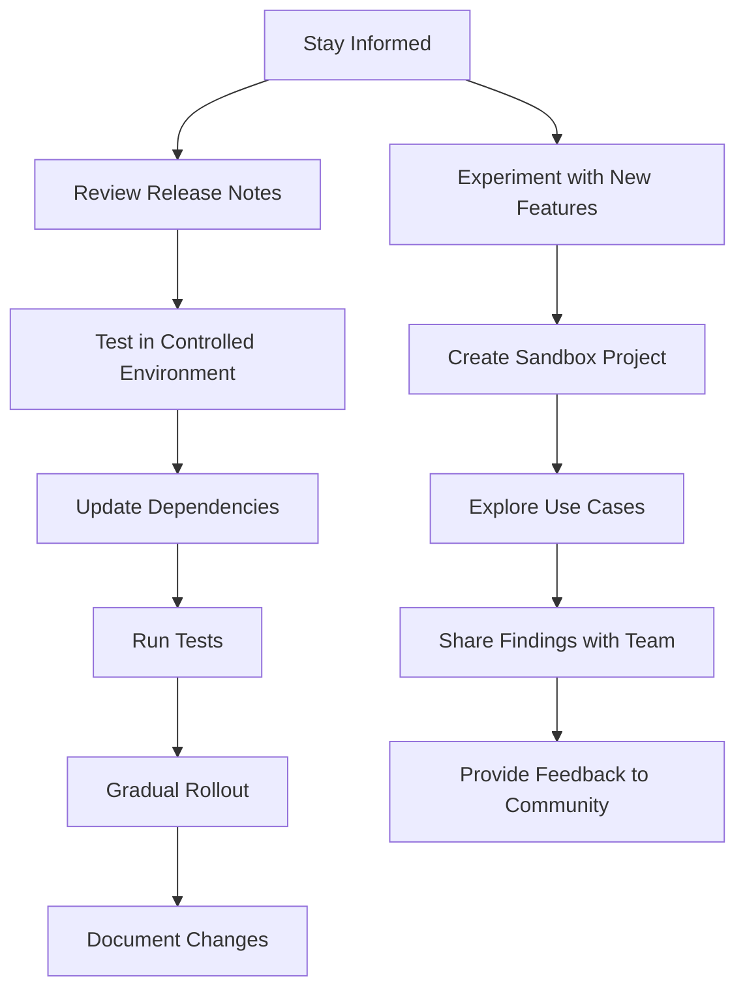

## 20.6 Keeping Up with TypeScript Updates

In the fast-paced world of software development, staying up-to-date with the latest tools and technologies is crucial. TypeScript, a superset of JavaScript, is no exception. As TypeScript evolves, it introduces new features, improvements, and bug fixes that can significantly enhance your development experience and the quality of your code. In this section, we'll explore why keeping your TypeScript version current is important, how to stay informed about updates, and strategies for integrating new features into your projects.

### Why Keeping TypeScript Up-to-Date Matters

Keeping your TypeScript version up-to-date is more than just a best practice; it's essential for several reasons:

1. **Enhanced Features and Performance**: Each new TypeScript release often includes new language features, performance improvements, and optimizations that can make your code more efficient and expressive.

2. **Improved Tooling and Support**: Updates often come with better tooling support, including enhanced editor integrations, improved error messages, and more robust type checking.

3. **Security and Stability**: Staying current with TypeScript updates ensures you have the latest security patches and stability improvements, reducing the risk of vulnerabilities in your codebase.

4. **Community and Ecosystem Alignment**: By using the latest version, you align with the broader TypeScript community and ecosystem, making it easier to find resources, libraries, and community support.

5. **Future-Proofing Your Code**: Adopting new features early can help future-proof your codebase, making it easier to maintain and extend over time.

### Resources for Staying Informed

To keep up with TypeScript updates, it's important to know where to find reliable information. Here are some key resources:

- **Official TypeScript Blog**: The [TypeScript Blog](https://devblogs.microsoft.com/typescript/) is the primary source for official announcements, release notes, and insights into upcoming features.

- **GitHub Repository**: The [TypeScript GitHub Repository](https://github.com/microsoft/TypeScript) is where you'll find the source code, issue tracker, and discussions about new features and bug fixes.

- **Release Notes**: Each TypeScript release is accompanied by detailed [release notes](https://github.com/microsoft/TypeScript/releases) that outline new features, breaking changes, and bug fixes.

- **Community Forums and Discussions**: Engage with the TypeScript community on platforms like [Stack Overflow](https://stackoverflow.com/questions/tagged/typescript), [Reddit](https://www.reddit.com/r/typescript/), and [TypeScript Discord](https://discord.com/invite/typescript).

- **Social Media and Newsletters**: Follow TypeScript-related accounts on social media platforms like Twitter and subscribe to newsletters such as [TypeScript Weekly](https://typescript-weekly.com/) for curated updates.

### Planning for Version Upgrades

Upgrading TypeScript versions in your projects requires careful planning to ensure a smooth transition. Here are some steps to consider:

1. **Review Release Notes**: Before upgrading, thoroughly review the release notes to understand new features, breaking changes, and deprecations.

2. **Test in a Controlled Environment**: Create a separate branch or environment to test the new TypeScript version. This allows you to identify and address any issues without affecting your production code.

3. **Update Dependencies**: Ensure that all your project dependencies are compatible with the new TypeScript version. This may involve updating or replacing some packages.

4. **Run Tests**: Execute your test suite to verify that your code behaves as expected with the new TypeScript version. Pay special attention to areas affected by breaking changes.

5. **Gradual Rollout**: Consider rolling out the upgrade gradually, especially in large projects. This approach minimizes risk and allows you to address issues incrementally.

6. **Document Changes**: Keep detailed documentation of the upgrade process, including any code changes and lessons learned. This documentation can be invaluable for future upgrades.

### Experimenting with New Features

Experimenting with new TypeScript features in a controlled environment can help you understand their benefits and limitations before integrating them into your production code. Here's how to approach experimentation:

1. **Create a Sandbox Project**: Set up a small, isolated project where you can freely experiment with new features without impacting your main codebase.

2. **Explore Use Cases**: Identify specific use cases in your projects where new features could be beneficial. This targeted approach helps you assess the practical value of each feature.

3. **Share Findings with Your Team**: If you work in a team, share your findings and insights with your colleagues. Collaborative experimentation can lead to more informed decisions.

4. **Provide Feedback to the Community**: If you encounter issues or have suggestions for improvement, consider providing feedback to the TypeScript team through GitHub or community forums.

### The Role of Community Contributions and Feedback

The TypeScript community plays a vital role in the language's evolution. By contributing to discussions, reporting issues, and providing feedback, you can help shape the future of TypeScript. Here's how you can get involved:

- **Participate in Discussions**: Join conversations on GitHub, forums, and social media to share your experiences and learn from others.

- **Report Bugs and Issues**: If you encounter bugs or unexpected behavior, report them to the TypeScript team via GitHub. Detailed bug reports help improve the language.

- **Contribute Code**: If you're comfortable with TypeScript's internals, consider contributing code to the project. Contributions can range from bug fixes to new features.

- **Attend Conferences and Meetups**: Engage with the community in person by attending TypeScript conferences, meetups, and workshops. These events are great opportunities to learn and network.

### Visualizing the Update Process

To better understand the process of keeping up with TypeScript updates, let's visualize it with a flowchart:

**Figure 1: TypeScript Update Process Flowchart**

### Try It Yourself

To reinforce your understanding of keeping up with TypeScript updates, try the following exercises:

1. **Explore the TypeScript Blog**: Visit the [TypeScript Blog](https://devblogs.microsoft.com/typescript/) and read the latest release notes. Identify one new feature and consider how it might benefit your projects.

2. **Set Up a Sandbox Project**: Create a new TypeScript project specifically for experimenting with new features. Try using a feature from the latest release and document your findings.

3. **Join a Community Forum**: Sign up for a TypeScript community forum or Discord server. Participate in a discussion or ask a question about a recent update.

4. **Plan a Version Upgrade**: If you have an existing TypeScript project, plan a hypothetical upgrade to the latest version. Outline the steps you would take and any potential challenges you foresee.

### Key Takeaways

- **Stay Informed**: Regularly check official sources like the TypeScript Blog and GitHub for updates and release notes.
- **Plan Upgrades Carefully**: Use a controlled environment to test new versions and ensure compatibility with your codebase.
- **Experiment and Share**: Try new features in sandbox projects and share your insights with your team and the community.
- **Engage with the Community**: Participate in discussions, report issues, and contribute to the TypeScript project to help shape its future.

By staying informed and proactive, you can leverage the latest TypeScript features to enhance your development projects and keep your skills sharp.

## Quiz Time!



### Why is it important to keep TypeScript versions up-to-date?

- [x] To benefit from new features and performance improvements
- [ ] To avoid learning new features
- [ ] To ensure your code remains outdated
- [ ] To reduce community engagement

> **Explanation:** Keeping TypeScript up-to-date ensures you benefit from new features, performance improvements, and security patches.

### Which resource is the primary source for official TypeScript announcements?

- [x] TypeScript Blog
- [ ] Reddit
- [ ] Stack Overflow
- [ ] Twitter

> **Explanation:** The TypeScript Blog is the primary source for official announcements and release notes.

### What should you do before upgrading your TypeScript version?

- [x] Review the release notes
- [ ] Upgrade without testing
- [ ] Ignore compatibility issues
- [ ] Skip reading the documentation

> **Explanation:** Reviewing the release notes helps you understand new features, breaking changes, and deprecations.

### What is a recommended approach for testing new TypeScript features?

- [x] Create a sandbox project
- [ ] Test directly in production
- [ ] Avoid testing
- [ ] Use outdated environments

> **Explanation:** A sandbox project allows you to experiment with new features without impacting your main codebase.

### How can you contribute to the TypeScript community?

- [x] Report bugs and issues
- [x] Participate in discussions
- [ ] Ignore community forums
- [ ] Avoid providing feedback

> **Explanation:** Reporting bugs and participating in discussions help improve TypeScript and shape its future.

### What is a benefit of engaging with the TypeScript community?

- [x] Learning from others
- [ ] Keeping knowledge to yourself
- [ ] Avoiding new information
- [ ] Reducing collaboration

> **Explanation:** Engaging with the community allows you to learn from others and stay informed about best practices.

### What should you do if you encounter a bug in TypeScript?

- [x] Report it on GitHub
- [ ] Ignore it
- [ ] Keep it to yourself
- [ ] Avoid using TypeScript

> **Explanation:** Reporting bugs on GitHub helps the TypeScript team address issues and improve the language.

### What is the purpose of a gradual rollout when upgrading TypeScript?

- [x] Minimize risk and address issues incrementally
- [ ] Upgrade all at once
- [ ] Ignore potential issues
- [ ] Avoid testing

> **Explanation:** A gradual rollout minimizes risk and allows you to address issues incrementally.

### What is an advantage of using the latest TypeScript version?

- [x] Aligning with the community and ecosystem
- [ ] Avoiding new features
- [ ] Reducing code quality
- [ ] Ignoring security patches

> **Explanation:** Using the latest version aligns you with the community and ensures you have the latest security patches.

### True or False: Experimenting with new TypeScript features should be done in production.

- [ ] True
- [x] False

> **Explanation:** Experimenting with new features should be done in a controlled environment, not in production.


