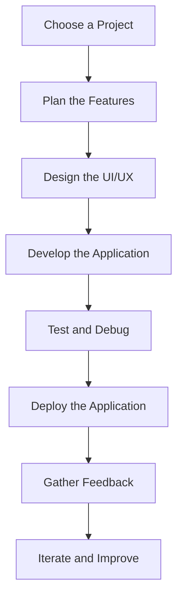

## 21.3 Building Real-world Applications

Congratulations on reaching this stage in your TypeScript journey! You've learned the fundamentals and are now ready to apply your skills to build real-world applications. This section will guide you through selecting projects, building a portfolio, and collaborating with others to enhance your learning experience.

### Why Build Real-world Applications?

Building real-world applications is an essential step in solidifying your understanding of TypeScript and programming concepts. It allows you to:

- **Consolidate Learning**: Applying what you've learned in practical scenarios helps reinforce your knowledge and identify areas for improvement.
- **Build a Portfolio**: A portfolio showcases your skills to potential employers or clients, demonstrating your ability to create functional applications.
- **Collaborate and Network**: Working on open-source projects or with peers provides opportunities to learn from others, receive feedback, and expand your professional network.
- **Gain Confidence**: Successfully completing projects boosts your confidence and prepares you for more complex challenges.

### Project Ideas to Get You Started

Choosing the right project is crucial. It should be challenging enough to push your limits but not so overwhelming that it becomes discouraging. Here are some project ideas tailored to different skill levels:

#### Beginner Projects

1. **To-Do List Application**: Create a simple to-do list app where users can add, edit, and delete tasks. This project will help you practice working with arrays, functions, and DOM manipulation.

    ```typescript
    // Define a Task interface
    interface Task {
        id: number;
        description: string;
        completed: boolean;
    }

    // Sample task array
    let tasks: Task[] = [];

    // Function to add a new task
    function addTask(description: string): void {
        const newTask: Task = {
            id: tasks.length + 1,
            description,
            completed: false
        };
        tasks.push(newTask);
    }

    // Function to toggle task completion
    function toggleTaskCompletion(taskId: number): void {
        const task = tasks.find(t => t.id === taskId);
        if (task) {
            task.completed = !task.completed;
        }
    }

    // Function to remove a task
    function removeTask(taskId: number): void {
        tasks = tasks.filter(t => t.id !== taskId);
    }
    ```

2. **Weather App**: Use a public API to fetch and display weather data for a given location. This project introduces you to working with APIs and handling JSON data.

    ```typescript
    // Fetch weather data from an API
    async function fetchWeather(city: string): Promise<void> {
        const response = await fetch(`https://api.weatherapi.com/v1/current.json?key=YOUR_API_KEY&q=${city}`);
        const data = await response.json();
        console.log(`The weather in ${city} is ${data.current.condition.text}`);
    }

    // Call the function with a city name
    fetchWeather("New York");
    ```

#### Intermediate Projects

1. **Expense Tracker**: Build an application to track income and expenses, categorize them, and display summaries. This project involves more complex data handling and UI updates.

2. **Chat Application**: Create a simple chat app using WebSockets for real-time communication. This project helps you understand asynchronous programming and event handling.

#### Advanced Projects

1. **E-commerce Platform**: Develop a basic e-commerce site with product listings, a shopping cart, and checkout functionality. This project covers a wide range of skills, including state management and user authentication.

2. **Social Media Dashboard**: Build a dashboard that aggregates data from various social media platforms. This project involves working with multiple APIs and data visualization.

### Building a Portfolio

A well-crafted portfolio is a powerful tool for showcasing your skills and projects. Here are some tips for building an impressive portfolio:

- **Select Your Best Work**: Choose projects that demonstrate a range of skills and complexity. Include a mix of personal projects and any collaborative work.
- **Provide Context**: For each project, include a brief description, your role, the technologies used, and any challenges you overcame.
- **Use a Clean Design**: Ensure your portfolio is visually appealing and easy to navigate. Use a simple layout with clear headings and sections.
- **Include Code Samples**: Provide links to your GitHub repositories or embed code snippets to show your coding style and problem-solving approach.
- **Keep It Updated**: Regularly update your portfolio with new projects and skills as you continue learning and growing.

### Collaborating on Open-source Projects

Contributing to open-source projects is a fantastic way to learn from experienced developers, gain real-world experience, and give back to the community. Here are some steps to get started:

1. **Find a Project**: Look for projects that interest you and match your skill level. Websites like GitHub, GitLab, and Bitbucket host thousands of open-source projects.
2. **Understand the Project**: Read the project's documentation, explore the codebase, and understand its goals and structure.
3. **Start Small**: Begin with small tasks or bug fixes to familiarize yourself with the project's workflow and coding standards.
4. **Communicate**: Engage with the project maintainers and other contributors. Ask questions, seek feedback, and participate in discussions.
5. **Follow Best Practices**: Adhere to the project's contribution guidelines, write clean code, and document your changes.

### Tips for Selecting Suitable Projects

Choosing the right project is key to maintaining motivation and ensuring a rewarding experience. Consider the following when selecting a project:

- **Interest and Passion**: Choose projects that align with your interests or passions. You'll be more motivated to work on something you care about.
- **Skill Level**: Assess your current skills and choose projects that are challenging but achievable. Gradually increase complexity as you gain confidence.
- **Learning Opportunities**: Select projects that allow you to learn new technologies or concepts. This will help you grow as a developer.
- **Impact and Usefulness**: Consider projects that solve real-world problems or have a positive impact. This adds meaning to your work and can be more fulfilling.

### Motivating Yourself to Keep Practicing

Continuous practice and learning are crucial for mastering TypeScript and programming in general. Here are some strategies to stay motivated:

- **Set Goals**: Define clear, achievable goals for your projects and learning journey. Break them down into smaller tasks to track progress.
- **Celebrate Milestones**: Acknowledge and celebrate your achievements, no matter how small. This boosts morale and keeps you motivated.
- **Join Communities**: Engage with online communities, forums, or local meetups to connect with other learners and share experiences.
- **Seek Feedback**: Regularly seek feedback on your work from peers or mentors. Constructive criticism helps you improve and grow.
- **Stay Curious**: Keep exploring new technologies, tools, and trends in the programming world. Curiosity drives innovation and learning.

### Try It Yourself

Now that you've learned about building real-world applications, it's time to put your skills to the test. Choose one of the project ideas mentioned above or come up with your own. Experiment with different features, libraries, or APIs to enhance your project. Remember, the key is to keep practicing and learning.

### Visual Aids

To help you visualize the process of building a real-world application, here's a simple flowchart illustrating the steps involved:



This flowchart represents the typical workflow for developing a real-world application. Each step is crucial to ensure a successful project.

### References and Links

- [MDN Web Docs: TypeScript](https://developer.mozilla.org/en-US/docs/Web/JavaScript/Reference)
- [TypeScript Official Documentation](https://www.typescriptlang.org/docs/)
- [GitHub: Explore Open Source Projects](https://github.com/explore)
- [Codecademy: Learn TypeScript](https://www.codecademy.com/learn/learn-typescript)

### Engagement and Reinforcement

To reinforce your learning, try answering the following questions or challenges:

- What are the key benefits of building real-world applications?
- How can you effectively showcase your projects in a portfolio?
- What steps should you take when contributing to an open-source project?
- Choose a project idea and outline the steps you would take to develop it.

### Key Takeaways

- Building real-world applications helps consolidate your learning and develop practical skills.
- A portfolio is an essential tool for showcasing your work and attracting opportunities.
- Collaborating on open-source projects provides valuable experience and networking opportunities.
- Selecting suitable projects and staying motivated are crucial for continuous growth.

## Quiz Time!



### What is one key benefit of building real-world applications?

- [x] Consolidates learning and reinforces knowledge
- [ ] Guarantees a job in tech
- [ ] Eliminates the need for further study
- [ ] Ensures perfect code quality

> **Explanation:** Building real-world applications consolidates learning by applying theoretical knowledge in practical scenarios, reinforcing understanding and skills.

### Which project idea is suitable for beginners?

- [x] To-Do List Application
- [ ] E-commerce Platform
- [ ] Social Media Dashboard
- [ ] Chat Application

> **Explanation:** A To-Do List Application is a simple project that helps beginners practice basic TypeScript concepts like arrays and functions.

### What should you include in a portfolio?

- [x] Best work with descriptions and technologies used
- [ ] Every project ever attempted
- [ ] Only personal projects
- [ ] Projects without context

> **Explanation:** A portfolio should showcase your best work, including descriptions, your role, and the technologies used to provide context.

### What is a good first step in contributing to open-source projects?

- [x] Start with small tasks or bug fixes
- [ ] Rewrite the entire codebase
- [ ] Ignore the project's guidelines
- [ ] Only work on large features

> **Explanation:** Starting with small tasks or bug fixes helps you familiarize yourself with the project's workflow and coding standards.

### How can you stay motivated while learning TypeScript?

- [x] Set goals and celebrate milestones
- [ ] Avoid seeking feedback
- [ ] Work in isolation
- [ ] Only focus on theory

> **Explanation:** Setting goals and celebrating milestones helps maintain motivation and track progress, making the learning journey more rewarding.

### What should you consider when selecting a project?

- [x] Interest, skill level, and learning opportunities
- [ ] Only the project's popularity
- [ ] Projects that require no effort
- [ ] Projects with no documentation

> **Explanation:** Selecting a project based on interest, skill level, and learning opportunities ensures a rewarding and motivating experience.

### What is the purpose of a flowchart in project development?

- [x] Visualize the steps involved in the process
- [ ] Replace written documentation
- [ ] Confuse the development team
- [ ] Skip planning and jump to coding

> **Explanation:** A flowchart helps visualize the steps involved in project development, providing a clear overview of the process.

### Which of the following is a benefit of collaborating on open-source projects?

- [x] Learning from experienced developers
- [ ] Working in isolation
- [ ] Avoiding feedback
- [ ] Ignoring coding standards

> **Explanation:** Collaborating on open-source projects allows you to learn from experienced developers and gain real-world experience.

### What is a key component of a well-crafted portfolio?

- [x] Clean design and easy navigation
- [ ] Complex design with many colors
- [ ] Only text descriptions
- [ ] No links to code samples

> **Explanation:** A well-crafted portfolio should have a clean design and easy navigation to effectively showcase your work.

### True or False: Building real-world applications can help you gain confidence in your skills.

- [x] True
- [ ] False

> **Explanation:** Building real-world applications helps you apply your skills in practical scenarios, boosting confidence and preparing you for more complex challenges.


