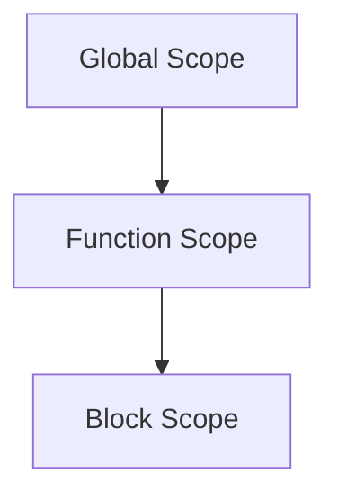

## 3.1 Declaring Variables with `let` and `const`

In TypeScript, as in JavaScript, variables are fundamental building blocks of any program. They allow us to store and manipulate data throughout our code. In this section, we will explore the different ways to declare variables using `let`, `const`, and `var`, and understand their differences in terms of scope and reassignment. We will also discuss best practices for using these declarations effectively in TypeScript.

### Understanding Variable Declarations

Before diving into `let` and `const`, let's briefly revisit `var`, the traditional way of declaring variables in JavaScript. Understanding `var` will help us appreciate the improvements brought by `let` and `const`.

#### `var` Declaration

The `var` keyword has been used in JavaScript since its inception. However, it comes with certain quirks that can lead to unexpected behavior, especially concerning scope and hoisting.

- **Scope**: Variables declared with `var` are function-scoped or globally-scoped if declared outside a function. This means they are accessible anywhere within the function they are declared in, or globally if declared outside any function.

- **Hoisting**: `var` declarations are hoisted to the top of their containing function or global scope. This means that the declaration is processed before any code is executed, but the initialization remains in place.

Here's an example illustrating hoisting with `var`:

```typescript
function exampleVar() {
    console.log(x); // Output: undefined
    var x = 10;
    console.log(x); // Output: 10
}

exampleVar();
```

In the above code, the declaration `var x` is hoisted to the top of the `exampleVar` function, but the assignment `x = 10` is not. This results in `undefined` being logged before `10`.

#### `let` Declaration

The `let` keyword was introduced in ECMAScript 2015 (ES6) to address some of the issues associated with `var`. Here are the key characteristics of `let`:

- **Block Scope**: Unlike `var`, `let` is block-scoped. This means that a variable declared with `let` is only accessible within the block (enclosed by `{}`) in which it is declared.

- **No Hoisting**: While `let` declarations are also hoisted, they are not initialized. Accessing them before the declaration results in a `ReferenceError`.

Here's an example demonstrating `let`:

```typescript
function exampleLet() {
    if (true) {
        let y = 20;
        console.log(y); // Output: 20
    }
    // console.log(y); // Error: y is not defined
}

exampleLet();
```

In this example, `y` is only accessible within the `if` block, showcasing the block-scoping behavior of `let`.

#### `const` Declaration

The `const` keyword is similar to `let` in terms of block-scoping but with an added constraint: variables declared with `const` cannot be reassigned. This makes `const` ideal for declaring constants or variables that should not change.

- **Block Scope**: Like `let`, `const` is block-scoped.

- **Immutability**: Variables declared with `const` must be initialized at the time of declaration and cannot be reassigned.

Here's an example using `const`:

```typescript
function exampleConst() {
    const z = 30;
    console.log(z); // Output: 30
    // z = 40; // Error: Assignment to constant variable.
}

exampleConst();
```

In this example, attempting to reassign `z` results in an error, demonstrating the immutability of `const`.

### Comparing `var`, `let`, and `const`

Now that we have a basic understanding of `var`, `let`, and `const`, let's compare them in terms of scope and reassignment:

| Keyword | Scope        | Hoisting | Reassignment |
|---------|--------------|----------|--------------|
| `var`   | Function/Global | Yes      | Yes          |
| `let`   | Block        | Yes      | Yes          |
| `const` | Block        | Yes      | No           |

#### Best Practices for Variable Declarations

1. **Prefer `const` by Default**: Use `const` whenever possible. It clearly indicates that the variable should not be reassigned, making your code more predictable and easier to understand.

2. **Use `let` for Mutable Variables**: If you need to reassign a variable, use `let`. This is common in loops or when the variable's value needs to change over time.

3. **Avoid `var`**: Due to its function-scoping and hoisting behavior, `var` can lead to bugs and unexpected behavior. Stick to `let` and `const` for cleaner and more reliable code.

### Code Examples

Let's look at some practical examples to solidify our understanding of `let` and `const`.

#### Example 1: Using `let` in a Loop

```typescript
function loopExample() {
    for (let i = 0; i < 5; i++) {
        console.log(i); // Output: 0, 1, 2, 3, 4
    }
    // console.log(i); // Error: i is not defined
}

loopExample();
```

In this example, `i` is declared with `let`, making it block-scoped to the `for` loop. Attempting to access `i` outside the loop results in an error.

#### Example 2: Using `const` for Constants

```typescript
function constantExample() {
    const PI = 3.14159;
    console.log(PI); // Output: 3.14159
    // PI = 3.14; // Error: Assignment to constant variable.
}

constantExample();
```

Here, `PI` is declared with `const`, indicating that its value should not change. Attempting to reassign `PI` results in an error.

### Try It Yourself

Now that we've covered the basics, try modifying the code examples above:

- Change the `let` declaration in the loop example to `var` and observe the difference in behavior.
- Try declaring a `const` variable without initializing it and see what error you encounter.
- Experiment with nested blocks and observe how `let` and `const` behave in different scopes.

### Visual Aids

To better understand the scope and hoisting behavior of `var`, `let`, and `const`, let's look at a visual representation of variable scope:



- **Global Scope**: Variables declared outside any function or block are in the global scope.
- **Function Scope**: Variables declared with `var` inside a function are in the function scope.
- **Block Scope**: Variables declared with `let` or `const` are in the block scope.

### References and Links

For more information on variable declarations in JavaScript and TypeScript, check out these resources:

- [MDN Web Docs: var](https://developer.mozilla.org/en-US/docs/Web/JavaScript/Reference/Statements/var)
- [MDN Web Docs: let](https://developer.mozilla.org/en-US/docs/Web/JavaScript/Reference/Statements/let)
- [MDN Web Docs: const](https://developer.mozilla.org/en-US/docs/Web/JavaScript/Reference/Statements/const)

### Engagement and Reinforcement

To reinforce your understanding, consider these questions:

- Why is `let` preferred over `var` for variable declarations?
- In what scenarios would you choose `const` over `let`?
- How does block scoping improve code readability and maintainability?

### Exercises

1. Declare a variable using `let` inside a function and try accessing it outside the function. What happens?
2. Create a constant array using `const` and try modifying its elements. Is this allowed?
3. Write a function that uses `let` to declare a counter variable and increments it inside a loop. Print the counter value outside the loop.

### Key Takeaways

- Use `let` and `const` for variable declarations in TypeScript to take advantage of block scoping and prevent unexpected behavior.
- Prefer `const` for variables that should not change, and use `let` for variables that need to be reassigned.
- Avoid `var` due to its function-scoping and hoisting behavior, which can lead to bugs.

By following these best practices, you'll write cleaner, more reliable TypeScript code that is easier to understand and maintain.

## Quiz Time!



### Which keyword should you use for a variable that needs to be reassigned?

- [ ] const
- [x] let
- [ ] var
- [ ] function

> **Explanation:** `let` is used for variables that need to be reassigned, as it allows for reassignment within its block scope.

### What is the scope of a variable declared with `let`?

- [ ] Global
- [ ] Function
- [x] Block
- [ ] Module

> **Explanation:** Variables declared with `let` are block-scoped, meaning they are only accessible within the block they are declared in.

### What happens if you try to reassign a `const` variable?

- [ ] It gets reassigned
- [x] An error is thrown
- [ ] It becomes `undefined`
- [ ] It gets hoisted

> **Explanation:** `const` variables cannot be reassigned. Attempting to do so results in an error.

### Which keyword allows for hoisting?

- [x] var
- [ ] let
- [ ] const
- [ ] function

> **Explanation:** Variables declared with `var` are hoisted to the top of their scope, unlike `let` and `const`.

### What is the output of the following code?
```typescript
function test() {
    console.log(a);
    var a = 5;
}
test();
```

- [ ] 5
- [x] undefined
- [ ] Error
- [ ] null

> **Explanation:** The `var` declaration is hoisted, but the assignment is not, resulting in `undefined`.

### Which keyword is preferred for declaring constants?

- [x] const
- [ ] let
- [ ] var
- [ ] static

> **Explanation:** `const` is preferred for declaring constants as it prevents reassignment.

### What is the main advantage of using `let` over `var`?

- [ ] Global scope
- [x] Block scope
- [ ] Function scope
- [ ] No scope

> **Explanation:** `let` provides block scope, which helps prevent errors related to variable scope.

### Can you declare a `const` variable without initializing it?

- [ ] Yes
- [x] No
- [ ] Only in functions
- [ ] Only in global scope

> **Explanation:** `const` variables must be initialized at the time of declaration.

### What is the output of the following code?
```typescript
{
    let x = 10;
}
console.log(x);
```

- [ ] 10
- [ ] undefined
- [x] Error
- [ ] null

> **Explanation:** `x` is block-scoped and not accessible outside the block, resulting in an error.

### Is it possible to modify the elements of a `const` array?

- [x] True
- [ ] False

> **Explanation:** While you cannot reassign a `const` array, you can modify its elements.


