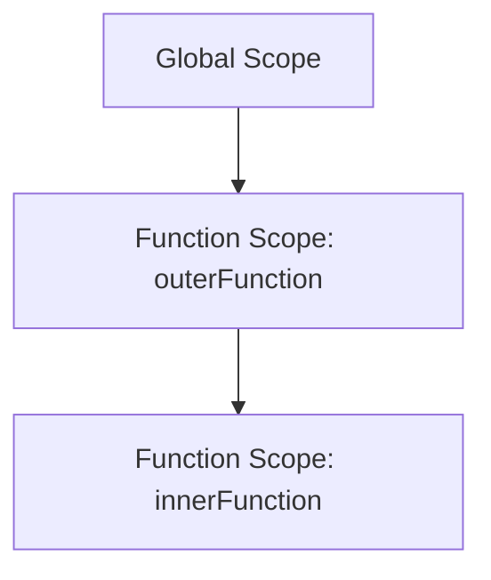

## 3.2 Variable Scope in TypeScript

In programming, understanding how and where variables are accessible is crucial for writing efficient and bug-free code. This concept is known as **variable scope**. In TypeScript, as in JavaScript, scope determines the visibility and lifespan of variables. Let's dive into the different types of scope in TypeScript and how they affect your code.

### Types of Scope in TypeScript

#### Global Scope

Variables declared in the global scope are accessible from anywhere in your code. They are defined outside of any function or block. Global variables can be convenient, but they can also lead to conflicts and bugs if not managed carefully.

```typescript
// Global variable
let globalVar = "I am a global variable";

function showGlobalVar() {
    console.log(globalVar); // Accessible here
}

showGlobalVar(); // Output: I am a global variable
console.log(globalVar); // Output: I am a global variable
```

#### Function Scope

Variables declared within a function are only accessible within that function. This is known as function scope. Function-scoped variables help prevent conflicts by isolating variables to the function they belong to.

```typescript
function greet() {
    let message = "Hello, World!";
    console.log(message); // Accessible here
}

greet(); // Output: Hello, World!
// console.log(message); // Error: message is not defined
```

#### Block Scope

Block scope is defined by curly braces `{}`. Variables declared with `let` or `const` within a block are only accessible within that block. This is a key difference from `var`, which does not respect block scope.

```typescript
if (true) {
    let blockScopedVar = "I am block scoped";
    console.log(blockScopedVar); // Accessible here
}

// console.log(blockScopedVar); // Error: blockScopedVar is not defined
```

### Variable Shadowing

Variable shadowing occurs when a variable declared within a certain scope has the same name as a variable in an outer scope. The inner variable "shadows" the outer one, making it inaccessible within the inner scope.

```typescript
let shadowedVar = "Outer";

function shadowingExample() {
    let shadowedVar = "Inner";
    console.log(shadowedVar); // Output: Inner
}

shadowingExample();
console.log(shadowedVar); // Output: Outer
```

### Accessing Outer Variables

Inner scopes can access variables declared in outer scopes, but not vice versa. This is known as lexical scoping.

```typescript
let outerVar = "I am outside!";

function accessOuter() {
    console.log(outerVar); // Accessible here
}

accessOuter(); // Output: I am outside!
```

### Implications of Scope on Memory and Performance

Understanding scope is not just about accessibility; it also has implications for memory and performance. Variables within a scope are only kept in memory as long as that scope is active. Once the scope is exited, the variables are eligible for garbage collection, freeing up memory.

#### Memory Management

Efficient use of scope can help manage memory usage. For example, variables that are only needed temporarily should be declared within the smallest possible scope to ensure they are cleared from memory as soon as they are no longer needed.

#### Performance Considerations

Minimizing the use of global variables can enhance performance by reducing the time it takes for the JavaScript engine to resolve variable references. Local variables are resolved faster because the engine doesn't have to search through multiple scopes.

### Try It Yourself

To reinforce your understanding of variable scope, try predicting the output of the following code before running it:

```typescript
let scopeTest = "Global";

function outerFunction() {
    let scopeTest = "Outer Function";

    function innerFunction() {
        let scopeTest = "Inner Function";
        console.log(scopeTest); // What will this output?
    }

    innerFunction();
    console.log(scopeTest); // What will this output?
}

outerFunction();
console.log(scopeTest); // What will this output?
```

### Visualizing Scope

To better understand how scope works, let's visualize it using a scope chain diagram. This diagram shows how the JavaScript engine looks for variables in nested scopes.



In this diagram, the engine first looks for a variable in the innermost scope (`innerFunction`). If it doesn't find it, it moves up to the next outer scope (`outerFunction`), and finally to the global scope.

### Practice Problems

1. **Predict the Output**: Modify the code examples above and predict the output before running them.
2. **Create a Function**: Write a function that declares a variable with the same name as a global variable and logs both to the console.
3. **Block Scope Challenge**: Create a loop with a block-scoped variable and log its value inside and outside the loop.

### Key Takeaways

- **Global Scope**: Variables are accessible from anywhere in the code.
- **Function Scope**: Variables are accessible only within the function they're declared in.
- **Block Scope**: Variables are accessible only within the block they're declared in, thanks to `let` and `const`.
- **Variable Shadowing**: Inner variables with the same name as outer variables hide the outer ones.
- **Memory and Performance**: Proper scope management can improve memory usage and performance.

By understanding and applying these concepts, you'll be able to write more efficient and error-free TypeScript code. Remember, practice makes perfect, so keep experimenting with different scopes to solidify your understanding.

## Quiz Time!



### What is the scope of a variable declared outside any function or block?

- [x] Global Scope
- [ ] Function Scope
- [ ] Block Scope
- [ ] Local Scope

> **Explanation:** Variables declared outside any function or block are in the global scope and are accessible from anywhere in the code.

### Which keyword respects block scope in TypeScript?

- [x] let
- [x] const
- [ ] var
- [ ] function

> **Explanation:** `let` and `const` respect block scope, meaning variables declared with these keywords are only accessible within the block they are declared in.

### What happens when a variable is shadowed?

- [x] The inner variable hides the outer variable with the same name.
- [ ] The outer variable becomes a global variable.
- [ ] The inner variable is deleted.
- [ ] The outer variable is renamed.

> **Explanation:** When a variable is shadowed, the inner variable hides the outer variable with the same name within its scope.

### Can a function access variables declared in an outer scope?

- [x] Yes
- [ ] No

> **Explanation:** Functions can access variables declared in an outer scope due to lexical scoping.

### What is the benefit of using block scope?

- [x] It prevents variable conflicts and reduces memory usage.
- [ ] It makes variables global.
- [ ] It increases the execution speed of the code.
- [ ] It allows variables to be accessed from any function.

> **Explanation:** Block scope helps prevent variable conflicts and reduces memory usage by limiting the lifespan and accessibility of variables.

### Which scope is the fastest for variable resolution?

- [x] Local Scope
- [ ] Global Scope
- [ ] Function Scope
- [ ] Block Scope

> **Explanation:** Local scope is the fastest for variable resolution because the JavaScript engine doesn't have to search through multiple scopes.

### What is the output of the following code?

```typescript
let a = "Global";
function test() {
    let a = "Local";
    console.log(a);
}
test();
```

- [x] Local
- [ ] Global
- [ ] Error
- [ ] Undefined

> **Explanation:** The output is "Local" because the local variable `a` shadows the global variable `a` within the function.

### What is the main difference between `var` and `let`?

- [x] `var` does not respect block scope, while `let` does.
- [ ] `let` is faster than `var`.
- [ ] `var` is only used in functions.
- [ ] `let` is only used in loops.

> **Explanation:** The main difference is that `var` does not respect block scope, while `let` does, making `let` more suitable for block-scoped variables.

### What is the result of accessing a block-scoped variable outside its block?

- [x] Error
- [ ] Undefined
- [ ] Null
- [ ] Global variable is accessed

> **Explanation:** Accessing a block-scoped variable outside its block results in an error because the variable is not defined outside the block.

### True or False: Inner scopes can access variables from outer scopes.

- [x] True
- [ ] False

> **Explanation:** Inner scopes can access variables from outer scopes due to lexical scoping, which allows them to "see" variables declared in their parent scopes.


