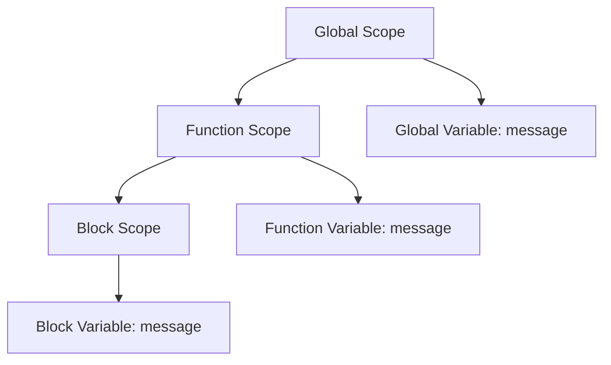

## 3.4 Shadowing Variables

In this section, we will delve into the concept of variable shadowing in TypeScript. Understanding this concept is crucial for writing clean and bug-free code. We will explore what variable shadowing is, how it can lead to unintended behavior, and strategies to avoid it. We will also discuss how tools like linters can help detect shadowed variables and the importance of good naming conventions.

### What is Variable Shadowing?

Variable shadowing occurs when a variable declared within a certain scope (e.g., a block or function) has the same name as a variable declared in an outer scope. The inner variable "shadows" the outer one, making the outer variable inaccessible within the inner scope.

#### Example of Variable Shadowing

Let's look at a simple example to illustrate variable shadowing:

```typescript
let message = "Hello from the outer scope!";

function greet() {
  let message = "Hello from the inner scope!";
  console.log(message);
}

greet(); // Output: "Hello from the inner scope!"
console.log(message); // Output: "Hello from the outer scope!"
```

In this example, the `message` variable inside the `greet` function shadows the `message` variable in the outer scope. When we call `console.log(message)` inside the function, it refers to the inner `message`, not the outer one.

### How Shadowing Can Lead to Bugs

Variable shadowing can lead to bugs or unintended behavior, especially in complex codebases where it's easy to lose track of variable scopes. Here are some potential pitfalls:

1. **Unintended Variable Access**: You might accidentally modify or access the wrong variable, leading to unexpected results.

2. **Confusing Code**: Shadowing can make code harder to understand, especially for someone unfamiliar with the codebase.

3. **Debugging Challenges**: It can be difficult to debug issues related to shadowed variables, as it might not be immediately obvious which variable is being accessed.

#### Example of Unintended Behavior

Consider the following code:

```typescript
let count = 10;

function increment() {
  let count = 0;
  count++;
  console.log(count);
}

increment(); // Output: 1
console.log(count); // Output: 10
```

Here, the `count` variable inside the `increment` function shadows the outer `count` variable. The `increment` function increments the inner `count`, leaving the outer `count` unchanged. This might not be the intended behavior if the goal was to increment the global `count`.

### Strategies to Avoid Shadowing

To avoid the pitfalls of variable shadowing, consider the following strategies:

1. **Use Unique Variable Names**: Ensure that variable names are descriptive and unique, reducing the likelihood of accidental shadowing.

2. **Limit Scope**: Declare variables in the smallest possible scope to minimize the risk of shadowing.

3. **Consistent Naming Conventions**: Adopt consistent naming conventions to distinguish between variables in different scopes.

4. **Refactor Large Functions**: Break down large functions into smaller, more manageable pieces, each with its own scope.

5. **Use Linters**: Tools like ESLint can help detect shadowed variables and enforce best practices.

#### Example of Using Unique Variable Names

```typescript
let globalCount = 10;

function incrementLocalCount() {
  let localCount = 0;
  localCount++;
  console.log(localCount);
}

incrementLocalCount(); // Output: 1
console.log(globalCount); // Output: 10
```

By using more descriptive and unique variable names (`globalCount` and `localCount`), we avoid shadowing and make the code more readable.

### The Role of Linters

Linters are tools that analyze your code for potential errors and enforce coding standards. They can help detect variable shadowing and suggest improvements. For TypeScript, ESLint is a popular choice.

#### Configuring ESLint to Detect Shadowing

To configure ESLint to detect shadowed variables, you can use the `no-shadow` rule. Here's how you can set it up:

1. **Install ESLint**: If you haven't already, install ESLint in your project:

   ```bash
   npm install eslint --save-dev
   ```

2. **Configure ESLint**: Create an `.eslintrc.json` file in your project root and add the following configuration:

   ```json
   {
     "rules": {
       "no-shadow": "warn"
     }
   }
   ```

3. **Run ESLint**: Run ESLint on your codebase to detect shadowed variables:

   ```bash
   npx eslint .
   ```

ESLint will warn you about any instances of variable shadowing, allowing you to address them before they become issues.

### Good Naming Conventions

Adopting good naming conventions is essential for writing clear and maintainable code. Here are some tips:

- **Descriptive Names**: Use names that clearly describe the purpose of the variable.
- **Consistent Style**: Follow a consistent naming style, such as camelCase for variables and PascalCase for classes.
- **Avoid Single-Letter Names**: Except for loop indices, avoid single-letter variable names, as they can be ambiguous.

#### Example of Good Naming Conventions

```typescript
let userCount = 100;

function updateUserCount() {
  let newUserCount = userCount + 1;
  console.log(newUserCount);
}

updateUserCount(); // Output: 101
console.log(userCount); // Output: 100
```

By using descriptive names like `userCount` and `newUserCount`, we improve code clarity and reduce the risk of shadowing.

### Try It Yourself

Now that we've covered the basics of variable shadowing, try experimenting with the following exercises:

1. **Modify the Code**: Take the initial `greet` function example and rename the inner `message` variable to something unique. Observe how it affects the output.

2. **Create a New Function**: Write a function that calculates the sum of an array of numbers. Use descriptive variable names to avoid shadowing.

3. **Use ESLint**: Set up ESLint in a TypeScript project and configure it to detect shadowed variables. Experiment with different configurations to see how they affect the linting process.

### Visualizing Variable Shadowing

To better understand variable shadowing, let's visualize it using a scope chain diagram. This diagram shows how TypeScript resolves variable names in nested scopes.



In this diagram, the `message` variable is declared in three different scopes: global, function, and block. The innermost variable shadows the outer ones, demonstrating how TypeScript resolves variable names.

### Summary

In this section, we've explored the concept of variable shadowing in TypeScript. We've seen how shadowing can lead to bugs and confusion, and we've discussed strategies to avoid it. By using unique variable names, limiting scope, and adopting consistent naming conventions, we can write cleaner and more reliable code. Tools like ESLint can help detect shadowed variables and enforce best practices.

### Key Takeaways

- **Variable Shadowing**: Occurs when a variable in an inner scope has the same name as a variable in an outer scope.
- **Potential Pitfalls**: Shadowing can lead to unintended behavior and make code harder to understand.
- **Avoiding Shadowing**: Use unique names, limit scope, and adopt consistent naming conventions.
- **Linters**: Tools like ESLint can help detect shadowed variables and enforce best practices.

## Quiz Time!



### What is variable shadowing?

- [x] When a variable in an inner scope has the same name as a variable in an outer scope.
- [ ] When a variable is declared but not used.
- [ ] When a variable is declared with a different type.
- [ ] When a variable is declared in a global scope.

> **Explanation:** Variable shadowing occurs when a variable in an inner scope has the same name as a variable in an outer scope, making the outer variable inaccessible within the inner scope.

### How can variable shadowing lead to bugs?

- [x] It can cause unintended variable access and confusing code.
- [ ] It can cause syntax errors.
- [ ] It can cause runtime errors.
- [ ] It can cause memory leaks.

> **Explanation:** Shadowing can lead to unintended variable access and make code harder to understand, which can result in bugs.

### Which strategy can help avoid variable shadowing?

- [x] Use unique variable names.
- [ ] Use single-letter variable names.
- [ ] Declare all variables in the global scope.
- [ ] Avoid using functions.

> **Explanation:** Using unique variable names helps avoid shadowing by ensuring that variables in different scopes have distinct names.

### What tool can help detect shadowed variables?

- [x] ESLint
- [ ] TypeScript Compiler
- [ ] Node.js
- [ ] Webpack

> **Explanation:** ESLint is a tool that can help detect shadowed variables and enforce best coding practices.

### What is a good naming convention for variables?

- [x] Use descriptive names and consistent style.
- [ ] Use single-letter names for all variables.
- [ ] Use all uppercase letters for variable names.
- [ ] Use numbers in variable names.

> **Explanation:** Using descriptive names and a consistent style improves code clarity and reduces the risk of shadowing.

### What does the `no-shadow` rule in ESLint do?

- [x] Warns about shadowed variables.
- [ ] Prevents variable declarations.
- [ ] Enforces variable naming conventions.
- [ ] Detects unused variables.

> **Explanation:** The `no-shadow` rule in ESLint warns about instances of variable shadowing, helping developers avoid this issue.

### Why should you avoid single-letter variable names?

- [x] They can be ambiguous and lead to confusion.
- [ ] They are not allowed in TypeScript.
- [ ] They cause syntax errors.
- [ ] They are reserved for loop indices.

> **Explanation:** Single-letter variable names can be ambiguous and make code harder to understand, leading to potential confusion.

### What is the benefit of limiting variable scope?

- [x] Reduces the risk of shadowing and improves code clarity.
- [ ] Increases the number of variables in the code.
- [ ] Makes code run faster.
- [ ] Allows for more global variables.

> **Explanation:** Limiting variable scope reduces the risk of shadowing and makes code easier to understand and maintain.

### How can you visualize variable shadowing?

- [x] Using a scope chain diagram.
- [ ] Using a flowchart.
- [ ] Using a pie chart.
- [ ] Using a bar graph.

> **Explanation:** A scope chain diagram visually represents how variables are resolved in nested scopes, helping to understand shadowing.

### True or False: Variable shadowing only occurs in TypeScript.

- [ ] True
- [x] False

> **Explanation:** Variable shadowing is a concept that occurs in many programming languages, not just TypeScript.


