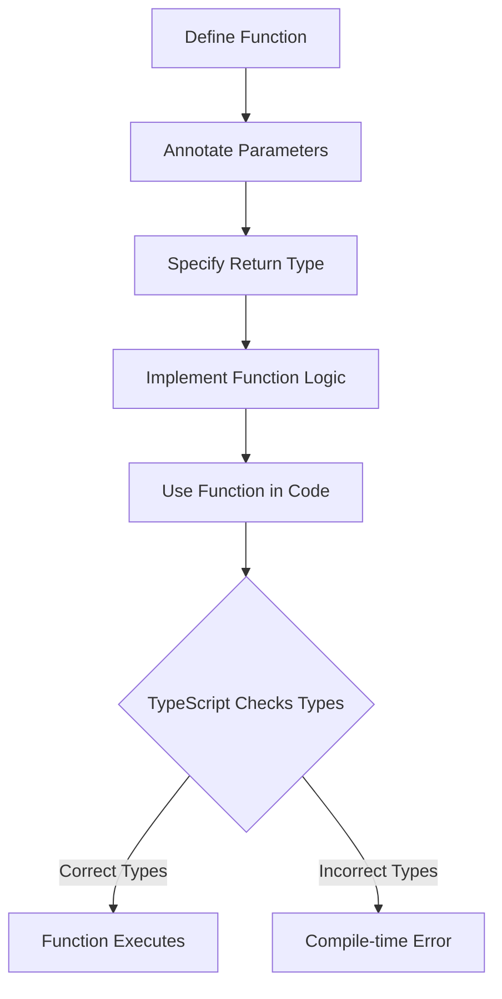

## 4.1 Function Types and Signatures

In this section, we will explore how to define function types and signatures in TypeScript. Understanding these concepts is crucial for writing robust and error-free code. We'll cover how to annotate function parameters and return types, the importance of typing for preventing errors, and provide examples of both regular and arrow functions with type annotations. Additionally, we'll discuss implicit vs. explicit return types and emphasize the benefits of clear function signatures in team environments.

### Understanding Function Types

Functions are a fundamental building block in any programming language. In TypeScript, functions can be typed to ensure that they are used correctly. This means specifying the types of the parameters a function accepts and the type of value it returns. By doing so, TypeScript can catch errors at compile time, making your code more reliable and easier to maintain.

#### Annotating Function Parameters

When defining a function in TypeScript, you can specify the type of each parameter. This is done by following the parameter name with a colon and the type. Here’s an example:

```typescript
function add(a: number, b: number): number {
    return a + b;
}
```

In this example, the `add` function takes two parameters, `a` and `b`, both of which are numbers. The function returns a number, which is the result of adding `a` and `b`.

#### Return Type Annotations

Just as you can specify the types of parameters, you can also specify the type of the value a function returns. This is done by adding a colon and the return type after the parameter list. For instance:

```typescript
function greet(name: string): string {
    return `Hello, ${name}!`;
}
```

Here, the `greet` function takes a single parameter, `name`, which is a string, and returns a string.

#### Importance of Typing for Preventing Errors

Typing function parameters and return values is essential for preventing errors. It helps ensure that functions are used correctly and that the values passed to them are of the expected types. This reduces the likelihood of runtime errors and makes the code easier to understand and maintain.

For example, if you try to call the `add` function with a string instead of a number, TypeScript will throw an error at compile time:

```typescript
// This will cause a compile-time error
add("one", 2);
```

By catching such errors early, TypeScript helps you write safer and more reliable code.

### Regular and Arrow Functions with Type Annotations

TypeScript supports both regular functions and arrow functions, and you can annotate both with types.

#### Regular Functions

Regular functions are defined using the `function` keyword. Here’s an example with type annotations:

```typescript
function multiply(x: number, y: number): number {
    return x * y;
}
```

This function takes two numbers as parameters and returns their product.

#### Arrow Functions

Arrow functions provide a more concise syntax for writing functions. They are especially useful for writing short, anonymous functions. Here’s how you can type an arrow function:

```typescript
const divide = (x: number, y: number): number => {
    return x / y;
};
```

In this example, `divide` is an arrow function that takes two numbers and returns their quotient.

### Implicit vs. Explicit Return Types

TypeScript can often infer the return type of a function based on its implementation. This is known as an implicit return type. However, it’s a good practice to explicitly specify the return type, especially in larger codebases, to improve readability and maintainability.

#### Implicit Return Types

Here’s an example of a function with an implicit return type:

```typescript
function subtract(x: number, y: number) {
    return x - y;
}
```

TypeScript infers that the return type of `subtract` is `number` because the function returns the result of a subtraction operation.

#### Explicit Return Types

To explicitly specify the return type, you can add a colon and the type after the parameter list:

```typescript
function subtractExplicit(x: number, y: number): number {
    return x - y;
}
```

Explicit return types make your code more predictable and easier to understand, especially for other developers who might work on your code.

### Benefits of Clear Function Signatures in Team Environments

Clear function signatures are crucial in team environments where multiple developers are working on the same codebase. They serve as a form of documentation, making it clear what a function does, what parameters it expects, and what it returns. This reduces the likelihood of misunderstandings and errors.

#### Example: Team Collaboration

Consider a scenario where a team is developing a web application. One developer writes a function to calculate the total price of items in a shopping cart:

```typescript
function calculateTotal(items: { price: number, quantity: number }[]): number {
    return items.reduce((total, item) => total + item.price * item.quantity, 0);
}
```

The function signature clearly indicates that `calculateTotal` expects an array of objects, each with a `price` and `quantity` property, and returns a number. This makes it easy for other developers to use the function correctly.

### Try It Yourself

Now that we’ve covered the basics of function types and signatures, try experimenting with the following code:

```typescript
// Define a function that takes a string and a number and returns a string
function repeatString(str: string, times: number): string {
    return str.repeat(times);
}

// Call the function with different arguments
console.log(repeatString("Hello", 3)); // Output: HelloHelloHello
```

**Challenge**: Modify the `repeatString` function to handle cases where `times` is less than or equal to zero by returning an empty string.

### Visual Aids

To further illustrate the concept of function types and signatures, let's use a flowchart to represent the process of defining and using a typed function.



**Diagram Description**: This flowchart represents the process of defining a function with type annotations, using it in code, and how TypeScript checks for type correctness at compile time.

### References and Links

For more information on function types and signatures in TypeScript, check out these resources:

- [TypeScript Handbook: Functions](https://www.typescriptlang.org/docs/handbook/functions.html)
- [MDN Web Docs: Functions](https://developer.mozilla.org/en-US/docs/Web/JavaScript/Guide/Functions)
- [W3Schools: JavaScript Functions](https://www.w3schools.com/js/js_functions.asp)

### Engagement and Reinforcement

To reinforce your understanding, consider these questions:

- What are the benefits of typing function parameters and return values?
- How does TypeScript help prevent errors with typed functions?
- Why is it important to have clear function signatures in team environments?

### Exercises

1. **Exercise 1**: Write a function that takes an array of numbers and returns their average. Annotate the function parameters and return type.

2. **Exercise 2**: Create an arrow function that takes a string and returns its length. Use type annotations.

3. **Exercise 3**: Modify the `calculateTotal` function to handle cases where the `items` array is empty by returning zero.

### Summary

In this section, we've explored how to define function types and signatures in TypeScript. We've learned how to annotate function parameters and return types, the importance of typing for preventing errors, and provided examples of both regular and arrow functions with type annotations. We've also discussed implicit vs. explicit return types and emphasized the benefits of clear function signatures in team environments. By understanding these concepts, you'll be better equipped to write robust and error-free code.

## Quiz Time!



### What is the primary benefit of typing function parameters in TypeScript?

- [x] Preventing errors at compile time
- [ ] Making code run faster
- [ ] Reducing the size of the code
- [ ] Allowing functions to return multiple types

> **Explanation:** Typing function parameters helps prevent errors by ensuring that the correct types are used, which TypeScript checks at compile time.

### How do you specify the return type of a function in TypeScript?

- [x] By adding a colon and the type after the parameter list
- [ ] By using the `return` keyword
- [ ] By placing the type before the function name
- [ ] By using a special `type` keyword

> **Explanation:** The return type is specified by adding a colon and the type after the parameter list in the function definition.

### What is an implicit return type?

- [x] A return type that TypeScript infers based on the function implementation
- [ ] A return type that is explicitly defined by the developer
- [ ] A return type that is always `void`
- [ ] A return type that is determined at runtime

> **Explanation:** An implicit return type is one that TypeScript infers from the function's implementation without an explicit annotation.

### Which of the following is a benefit of clear function signatures in team environments?

- [x] They serve as documentation for other developers
- [ ] They make the code run faster
- [ ] They reduce the number of lines of code
- [ ] They allow functions to be called with any type of argument

> **Explanation:** Clear function signatures act as documentation, making it easier for team members to understand and use functions correctly.

### How can you annotate an arrow function's parameters and return type?

- [x] By placing the types after the parameters and before the arrow
- [ ] By using a special `arrowType` keyword
- [ ] By placing the types before the function name
- [ ] By using the `function` keyword

> **Explanation:** In arrow functions, types are placed after the parameters and before the arrow to specify parameter and return types.

### What happens if you call a typed function with the wrong parameter types?

- [x] TypeScript throws a compile-time error
- [ ] The function returns `undefined`
- [ ] The function executes with default values
- [ ] The function ignores the incorrect parameters

> **Explanation:** TypeScript will throw a compile-time error if a function is called with incorrect parameter types, preventing execution.

### Why is it a good practice to explicitly specify return types?

- [x] To improve code readability and maintainability
- [ ] To make the code run faster
- [ ] To reduce the number of lines of code
- [ ] To allow functions to return multiple types

> **Explanation:** Explicit return types enhance code readability and maintainability by making the function's behavior clear.

### What is the syntax for defining a function with typed parameters in TypeScript?

- [x] `function name(param: type): returnType { ... }`
- [ ] `function name(param): type { ... }`
- [ ] `name: function(param: type) { ... }`
- [ ] `function name(type param): returnType { ... }`

> **Explanation:** The correct syntax is `function name(param: type): returnType { ... }`, where both parameters and return type are annotated.

### What is the purpose of using type annotations in functions?

- [x] To ensure correct usage and prevent errors
- [ ] To make the code run faster
- [ ] To reduce the size of the code
- [ ] To allow functions to be called with any type of argument

> **Explanation:** Type annotations ensure that functions are used correctly and help prevent errors by enforcing type safety.

### True or False: TypeScript can infer the return type of a function if it is not explicitly specified.

- [x] True
- [ ] False

> **Explanation:** TypeScript can infer the return type of a function based on its implementation if it is not explicitly specified.


