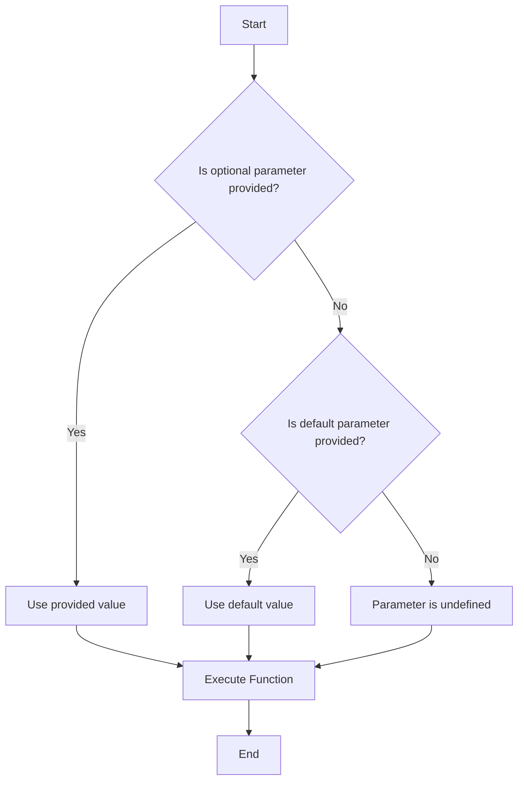

## 4.2 Optional and Default Parameters

In TypeScript, functions are a fundamental building block for creating reusable and modular code. As you design functions, you may encounter scenarios where certain parameters are not always required, or where you want to provide default values for parameters when they are not supplied. This is where optional and default parameters come into play.

### Understanding Optional Parameters

Optional parameters allow you to define parameters that are not mandatory when calling a function. This is particularly useful when you want to provide flexibility in how a function is used. To declare a parameter as optional, you append a question mark (`?`) to the parameter name in the function signature.

#### Syntax for Optional Parameters

```typescript
function greet(name: string, age?: number): string {
    if (age !== undefined) {
        return `Hello, ${name}. You are ${age} years old.`;
    }
    return `Hello, ${name}.`;
}
```

In this example, the `age` parameter is optional. When calling the `greet` function, you can choose to provide the `age` parameter or omit it entirely.

#### Example Usage

```typescript
console.log(greet("Alice")); // Output: Hello, Alice.
console.log(greet("Bob", 30)); // Output: Hello, Bob. You are 30 years old.
```

As demonstrated, the function behaves differently based on whether the optional parameter is provided.

### Exploring Default Parameters

Default parameters allow you to specify a default value for a parameter. If the caller does not provide a value for that parameter, the default value is used. This feature simplifies function calls and reduces the need for additional logic to handle missing values.

#### Syntax for Default Parameters

```typescript
function calculatePrice(price: number, tax: number = 0.1): number {
    return price + price * tax;
}
```

Here, the `tax` parameter has a default value of `0.1`. If no value is provided for `tax`, the function uses the default value.

#### Example Usage

```typescript
console.log(calculatePrice(100)); // Output: 110
console.log(calculatePrice(100, 0.2)); // Output: 120
```

The function calculates the price using the default tax rate when no tax value is specified.

### Comparing Optional and Default Parameters

While both optional and default parameters offer flexibility, they serve different purposes and have distinct behaviors.

- **Optional Parameters**: These parameters can be omitted entirely. If omitted, they are `undefined` within the function.
- **Default Parameters**: These parameters have a default value that is used if no value is provided. They are never `undefined` because the default value is assigned.

#### Code Example: Optional vs. Default

```typescript
function printMessage(message: string, prefix?: string, suffix: string = "!"): string {
    if (prefix) {
        return `${prefix} ${message}${suffix}`;
    }
    return `${message}${suffix}`;
}

console.log(printMessage("Welcome")); // Output: Welcome!
console.log(printMessage("Welcome", "Hello")); // Output: Hello Welcome!
console.log(printMessage("Welcome", undefined, "?")); // Output: Welcome?
```

In this example, `prefix` is optional, and `suffix` has a default value. Notice how you can explicitly pass `undefined` to skip the optional parameter and use the default value for the next parameter.

### Order Considerations

When combining optional and default parameters, the order in which you declare them matters. Typically, optional parameters should be placed after required parameters, and default parameters can be placed anywhere, but it's common to place them after required parameters as well.

#### Example with Mixed Parameters

```typescript
function createUser(username: string, isAdmin: boolean = false, age?: number): string {
    let userInfo = `User: ${username}, Admin: ${isAdmin}`;
    if (age !== undefined) {
        userInfo += `, Age: ${age}`;
    }
    return userInfo;
}

console.log(createUser("John")); // Output: User: John, Admin: false
console.log(createUser("Jane", true)); // Output: User: Jane, Admin: true
console.log(createUser("Doe", false, 25)); // Output: User: Doe, Admin: false, Age: 25
```

In this function, `isAdmin` has a default value, and `age` is optional. This order allows for flexible function calls.

### Best Practices for Using Optional and Default Parameters

1. **Clarity**: Use optional and default parameters to make your functions more intuitive and easier to use.
2. **Consistency**: Maintain a consistent order of parameters to avoid confusion.
3. **Documentation**: Clearly document the behavior of your functions, especially when using optional and default parameters, to ensure users understand how to call them correctly.

### Try It Yourself

Experiment with the following exercises to reinforce your understanding of optional and default parameters:

1. Modify the `greet` function to include an optional `greeting` parameter that defaults to "Hello".
2. Create a function `calculateTotal` that takes a `price`, an optional `discount`, and a default `tax` of 0.05. Calculate the total price after applying the discount and tax.
3. Define a function `formatDate` that accepts a `date` and an optional `format` parameter. If no format is provided, use a default format of "YYYY-MM-DD".

### Visualizing Parameter Usage

To better understand how optional and default parameters interact, consider the following flowchart that illustrates the decision-making process within a function:



This flowchart shows how the function determines which value to use for each parameter based on whether they are optional or have default values.

### Further Reading

For more information on functions in TypeScript, consider exploring the following resources:

- [MDN Web Docs: Functions](https://developer.mozilla.org/en-US/docs/Web/JavaScript/Guide/Functions)
- [TypeScript Handbook: Functions](https://www.typescriptlang.org/docs/handbook/functions.html)

### Key Takeaways

- Optional parameters are declared with a `?` and can be omitted in function calls.
- Default parameters have a specified value that is used when no value is provided.
- The order of parameters matters, especially when combining optional and default parameters.
- Use optional and default parameters to create flexible and user-friendly functions.

By understanding and applying these concepts, you'll be able to write more versatile and maintainable TypeScript functions.

## Quiz Time!



### What is the syntax to declare an optional parameter in TypeScript?

- [x] Append a `?` to the parameter name
- [ ] Use `optional` keyword before the parameter name
- [ ] Use `undefined` as the default value
- [ ] Use `null` as the default value

> **Explanation:** In TypeScript, you declare an optional parameter by appending a `?` to the parameter name in the function signature.

### How do you assign a default value to a parameter in TypeScript?

- [x] By using the `=` operator followed by the default value
- [ ] By appending a `?` to the parameter name
- [ ] By using the `default` keyword
- [ ] By placing the parameter at the end of the parameter list

> **Explanation:** Default values are assigned using the `=` operator in the function signature.

### What happens if you call a function with an optional parameter without providing a value?

- [x] The parameter is `undefined`
- [ ] The parameter is assigned a default value
- [ ] The function throws an error
- [ ] The function skips the parameter

> **Explanation:** If an optional parameter is not provided, it is `undefined` within the function.

### Can a function have both optional and default parameters?

- [x] Yes
- [ ] No

> **Explanation:** A function can have both optional and default parameters, allowing for flexible function calls.

### What is the recommended order for declaring parameters in a function?

- [x] Required, optional, default
- [ ] Default, optional, required
- [ ] Optional, required, default
- [ ] Default, required, optional

> **Explanation:** The recommended order is to declare required parameters first, followed by optional and then default parameters.

### What is the output of the following code: `console.log(calculatePrice(100));` if `calculatePrice` is defined as `function calculatePrice(price: number, tax: number = 0.1): number { return price + price * tax; }`?

- [x] 110
- [ ] 100
- [ ] 120
- [ ] 90

> **Explanation:** The default tax value of `0.1` is used, resulting in a total of `110`.

### What is the output of the following code: `console.log(greet("Alice", 25));` if `greet` is defined as `function greet(name: string, age?: number): string { if (age !== undefined) { return \`Hello, ${name}. You are ${age} years old.\`; } return \`Hello, ${name}.\`; }`?

- [x] Hello, Alice. You are 25 years old.
- [ ] Hello, Alice.
- [ ] Hello, Alice. You are undefined years old.
- [ ] Hello, Alice. You are 0 years old.

> **Explanation:** Since the `age` parameter is provided, the function returns "Hello, Alice. You are 25 years old."

### What is the purpose of default parameters?

- [x] To provide a fallback value when no argument is supplied
- [ ] To make parameters optional
- [ ] To ensure parameters are always provided
- [ ] To throw an error if no argument is supplied

> **Explanation:** Default parameters provide a fallback value when no argument is supplied.

### What is the output of the following code: `console.log(printMessage("Welcome", undefined, "?"));` if `printMessage` is defined as `function printMessage(message: string, prefix?: string, suffix: string = "!"): string { if (prefix) { return \`${prefix} ${message}${suffix}\`; } return \`${message}${suffix}\`; }`?

- [x] Welcome?
- [ ] Welcome!
- [ ] undefined Welcome!
- [ ] Welcome undefined!

> **Explanation:** Since `prefix` is `undefined`, it is skipped, and the `suffix` is used as "?".

### True or False: Optional parameters must always be placed at the end of the parameter list.

- [x] True
- [ ] False

> **Explanation:** Optional parameters should be placed at the end of the parameter list to avoid confusion and ensure proper function calls.


