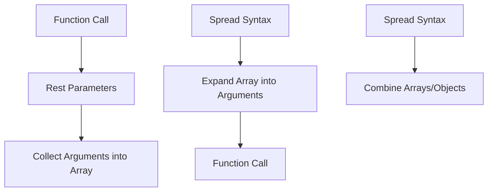

## 4.3 Rest Parameters and Spread Syntax

In this section, we will delve into two powerful features of TypeScript and JavaScript: rest parameters and spread syntax. These features allow us to write more flexible and concise code when dealing with functions, arrays, and objects. By the end of this section, you'll have a solid understanding of how to utilize these features to handle multiple arguments and manipulate data structures effectively.

### Understanding Rest Parameters

Rest parameters allow a function to accept an indefinite number of arguments as an array. This is particularly useful when you don't know how many arguments will be passed to the function. Rest parameters are defined using the `...` syntax in the function's parameter list.

#### Syntax of Rest Parameters

The rest parameter syntax (`...args`) is used to represent an indefinite number of arguments as an array. Here's the basic syntax:

```typescript
function exampleFunction(...args: number[]): void {
    console.log(args);
}
```

In this example, `args` is an array that contains all the arguments passed to `exampleFunction`.

#### Using Rest Parameters in Functions

Let's explore a practical example of using rest parameters. Suppose we want to create a function that calculates the sum of all its arguments:

```typescript
function sumAll(...numbers: number[]): number {
    return numbers.reduce((accumulator, currentValue) => accumulator + currentValue, 0);
}

console.log(sumAll(1, 2, 3, 4)); // Output: 10
console.log(sumAll(5, 10, 15));  // Output: 30
```

**Explanation:**

- The `sumAll` function takes any number of numeric arguments.
- The `numbers` parameter is an array containing all the arguments passed to the function.
- We use the `reduce` method to calculate the sum of the numbers.

#### Benefits of Rest Parameters

- **Flexibility**: Rest parameters allow functions to handle varying numbers of arguments without requiring changes to the function definition.
- **Simplicity**: They eliminate the need for complex logic to handle multiple arguments manually.

### Introducing Spread Syntax

Spread syntax is used to expand elements of an iterable (like an array or object) into individual elements. It is denoted by the same `...` syntax but used in different contexts.

#### Using Spread Syntax with Arrays

The spread operator can be used to expand an array into individual elements. This is useful for combining arrays, copying arrays, or passing elements as arguments to a function.

**Example: Combining Arrays**

```typescript
const array1 = [1, 2, 3];
const array2 = [4, 5, 6];

const combinedArray = [...array1, ...array2];
console.log(combinedArray); // Output: [1, 2, 3, 4, 5, 6]
```

**Example: Copying Arrays**

```typescript
const originalArray = [1, 2, 3];
const copiedArray = [...originalArray];

console.log(copiedArray); // Output: [1, 2, 3]
```

**Explanation:**

- The spread operator `...` is used to expand `array1` and `array2` into individual elements, which are then combined into `combinedArray`.
- Similarly, `copiedArray` is a shallow copy of `originalArray`.

#### Using Spread Syntax with Objects

Spread syntax can also be used to copy or merge objects. This is particularly useful for creating new objects with additional or modified properties.

**Example: Merging Objects**

```typescript
const object1 = { a: 1, b: 2 };
const object2 = { b: 3, c: 4 };

const mergedObject = { ...object1, ...object2 };
console.log(mergedObject); // Output: { a: 1, b: 3, c: 4 }
```

**Explanation:**

- The spread operator is used to merge `object1` and `object2`.
- If there are overlapping keys, the values from the last object (`object2`) will overwrite those from the previous objects.

### Practical Use Cases

#### Function Calls with Spread Syntax

Spread syntax can be used to pass elements of an array as individual arguments to a function. This is particularly useful when a function expects separate arguments rather than an array.

```typescript
function multiply(a: number, b: number, c: number): number {
    return a * b * c;
}

const numbers = [2, 3, 4];
console.log(multiply(...numbers)); // Output: 24
```

**Explanation:**

- The `multiply` function expects three separate arguments.
- The spread operator is used to pass the elements of the `numbers` array as individual arguments.

#### Cloning and Merging Arrays and Objects

Using spread syntax, you can easily clone or merge arrays and objects without affecting the original data structures.

**Example: Cloning an Object**

```typescript
const originalObject = { x: 10, y: 20 };
const clonedObject = { ...originalObject };

console.log(clonedObject); // Output: { x: 10, y: 20 }
```

**Example: Merging Arrays**

```typescript
const fruits = ['apple', 'banana'];
const vegetables = ['carrot', 'lettuce'];

const food = [...fruits, ...vegetables];
console.log(food); // Output: ['apple', 'banana', 'carrot', 'lettuce']
```

### Common Mistakes and Best Practices

- **Rest Parameters Position**: Rest parameters must be the last parameter in a function's parameter list. This is because they collect all remaining arguments into an array.
  
  ```typescript
  // Incorrect
  function incorrectFunction(a: number, ...args: number[], b: number): void {
      // Error: A rest parameter must be last in a parameter list.
  }
  ```

- **Shallow Copy**: When using spread syntax to clone objects or arrays, remember that it creates a shallow copy. This means nested objects or arrays are not deeply copied.

  ```typescript
  const nestedArray = [[1, 2], [3, 4]];
  const shallowCopy = [...nestedArray];

  shallowCopy[0][0] = 99;
  console.log(nestedArray[0][0]); // Output: 99
  ```

  **Explanation**: The change in `shallowCopy` affects `nestedArray` because the inner arrays are not deeply copied.

### Try It Yourself

Now that we've covered the basics, let's try some exercises to reinforce your understanding:

1. **Modify the `sumAll` Function**: Change the `sumAll` function to calculate the average of the numbers instead of the sum.

2. **Combine and Sort Arrays**: Create two arrays of numbers, combine them using spread syntax, and sort the combined array in ascending order.

3. **Clone and Modify an Object**: Clone an object using spread syntax and modify one of its properties without affecting the original object.

### Visualizing Rest and Spread

To better understand how rest parameters and spread syntax work, let's visualize them using a simple diagram.



**Diagram Explanation**:

- **Rest Parameters**: Collects multiple arguments into a single array when a function is called.
- **Spread Syntax**: Expands an array into individual arguments or combines arrays/objects.

### Additional Resources

For more information on rest parameters and spread syntax, consider exploring the following resources:

- [MDN Web Docs: Rest Parameters](https://developer.mozilla.org/en-US/docs/Web/JavaScript/Reference/Functions/rest_parameters)
- [MDN Web Docs: Spread Syntax](https://developer.mozilla.org/en-US/docs/Web/JavaScript/Reference/Operators/Spread_syntax)
- [TypeScript Handbook: Functions](https://www.typescriptlang.org/docs/handbook/functions.html)

### Key Takeaways

- **Rest Parameters**: Allow functions to accept an indefinite number of arguments as an array.
- **Spread Syntax**: Expands elements of an iterable into individual elements, useful for function calls and data manipulation.
- **Common Use Cases**: Combining arrays, cloning objects, and passing array elements as function arguments.

By mastering rest parameters and spread syntax, you'll be able to write more flexible and efficient TypeScript code. These features are essential tools in your programming toolkit, enabling you to handle data structures and function arguments with ease.

## Quiz Time!



### What is the purpose of rest parameters in TypeScript?

- [x] To allow a function to accept an indefinite number of arguments as an array
- [ ] To restrict a function to only one argument
- [ ] To declare a variable with a fixed number of values
- [ ] To define a function without any parameters

> **Explanation:** Rest parameters allow a function to gather an indefinite number of arguments into an array, providing flexibility in handling multiple inputs.

### How do you define rest parameters in a function?

- [x] Using the `...` syntax before the parameter name
- [ ] Using the `[]` syntax after the parameter name
- [ ] Using the `*` symbol before the parameter name
- [ ] Using the `&` symbol after the parameter name

> **Explanation:** Rest parameters are defined using the `...` syntax before the parameter name, indicating that all remaining arguments should be collected into an array.

### What is the spread syntax used for?

- [x] To expand elements of an iterable into individual elements
- [ ] To compress multiple elements into a single element
- [ ] To define a new function parameter
- [ ] To create a new array from a single element

> **Explanation:** The spread syntax expands elements of an iterable, such as an array or object, into individual elements, useful for function calls and data manipulation.

### Which of the following is a correct use of spread syntax with arrays?

- [x] `const combined = [...array1, ...array2];`
- [ ] `const combined = [...array1 array2];`
- [ ] `const combined = [...array1 + array2];`
- [ ] `const combined = [...array1, array2];`

> **Explanation:** The correct use of spread syntax involves using `...` to expand the elements of `array1` and `array2` into individual elements, which are then combined into a new array.

### What happens when you use spread syntax to clone an object?

- [x] A shallow copy of the object is created
- [ ] A deep copy of the object is created
- [ ] The original object is modified
- [ ] The object is converted to an array

> **Explanation:** Spread syntax creates a shallow copy of the object, meaning that nested objects or arrays are not deeply copied, and changes to them affect the original object.

### Can rest parameters be used in the middle of a function's parameter list?

- [ ] Yes, they can be placed anywhere in the parameter list
- [x] No, they must be the last parameter in the list
- [ ] Yes, but only if there are no other parameters
- [ ] No, they cannot be used in function parameters

> **Explanation:** Rest parameters must be the last parameter in a function's parameter list because they collect all remaining arguments into an array.

### How can you pass elements of an array as individual arguments to a function?

- [x] Using the spread syntax with the array
- [ ] Using the rest parameter syntax with the array
- [ ] Using the `join` method on the array
- [ ] Using the `split` method on the array

> **Explanation:** The spread syntax can be used to expand the elements of an array into individual arguments when calling a function.

### What is the result of using spread syntax with overlapping object keys?

- [x] The values from the last object overwrite those from previous objects
- [ ] The values from the first object overwrite those from later objects
- [ ] The objects are merged without any key conflicts
- [ ] An error is thrown due to key conflicts

> **Explanation:** When using spread syntax with overlapping object keys, the values from the last object in the sequence overwrite those from previous objects.

### Which of the following is a common use case for spread syntax?

- [x] Combining arrays
- [ ] Declaring variables
- [ ] Defining functions
- [ ] Creating loops

> **Explanation:** Spread syntax is commonly used to combine arrays, allowing elements from multiple arrays to be merged into a single array.

### Rest parameters and spread syntax are denoted by the same symbol. True or False?

- [x] True
- [ ] False

> **Explanation:** Both rest parameters and spread syntax use the `...` symbol, but they serve different purposes based on the context in which they are used.


