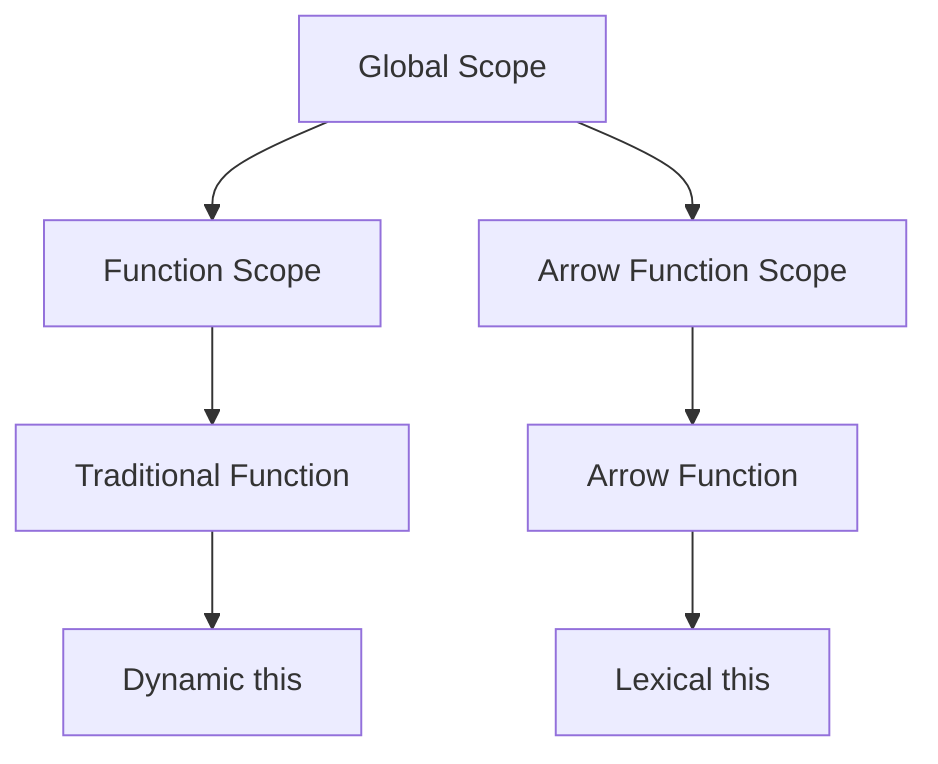

## 4.4 Arrow Functions in TypeScript

Arrow functions are a modern and concise way to write functions in TypeScript and JavaScript. They offer a more compact syntax than traditional function expressions and come with a unique feature: lexical binding of `this`. In this section, we'll explore the syntax of arrow functions, their behavior, and when to use them effectively.

### Understanding Arrow Function Syntax

Arrow functions are defined using the `=>` syntax, which is why they are sometimes referred to as "fat arrow" functions. Here's a basic example:

```typescript
// Traditional function expression
const add = function(x: number, y: number): number {
    return x + y;
};

// Arrow function
const addArrow = (x: number, y: number): number => x + y;

console.log(add(2, 3)); // Output: 5
console.log(addArrow(2, 3)); // Output: 5
```

**Key Differences:**

1. **Conciseness**: Arrow functions allow for a more concise syntax, especially when the function body contains a single expression. The `return` keyword and curly braces `{}` can be omitted in such cases.

2. **Lexical `this`**: Arrow functions do not have their own `this` context. Instead, they capture the `this` value of the enclosing execution context.

3. **No `arguments` object**: Unlike traditional functions, arrow functions do not have their own `arguments` object.

### Lexical Binding of `this`

One of the most significant features of arrow functions is their lexical binding of `this`. In traditional functions, the value of `this` can change depending on how the function is called. Arrow functions, however, capture the `this` value from the surrounding context at the time they are defined.

Consider the following example:

```typescript
class Counter {
    count: number = 0;

    increment() {
        setTimeout(function() {
            this.count++;
            console.log(this.count); // Output: NaN
        }, 1000);
    }
}

const counter = new Counter();
counter.increment();
```

In this example, `this.count` inside the `setTimeout` function does not refer to the `Counter` instance. Instead, it refers to the global object (or `undefined` in strict mode), leading to unexpected behavior.

Now, let's see how arrow functions can solve this problem:

```typescript
class Counter {
    count: number = 0;

    increment() {
        setTimeout(() => {
            this.count++;
            console.log(this.count); // Output: 1
        }, 1000);
    }
}

const counter = new Counter();
counter.increment();
```

By using an arrow function, `this` inside the `setTimeout` callback correctly refers to the `Counter` instance, preserving the expected behavior.

### Arrow Functions in Different Scenarios

Arrow functions can be used in various scenarios, from simple callbacks to more complex functional programming patterns. Let's explore some common use cases:

#### 1. Array Methods

Arrow functions are often used with array methods like `map`, `filter`, and `reduce` for their brevity and clarity.

```typescript
const numbers = [1, 2, 3, 4, 5];

// Using map to create a new array with each number doubled
const doubled = numbers.map(n => n * 2);
console.log(doubled); // Output: [2, 4, 6, 8, 10]
```

#### 2. Event Handlers

Arrow functions are useful for event handlers, especially when you need to access the `this` context of a class.

```typescript
class Button {
    label: string;

    constructor(label: string) {
        this.label = label;
    }

    click() {
        document.querySelector('button')?.addEventListener('click', () => {
            console.log(`Button ${this.label} clicked`);
        });
    }
}

const myButton = new Button('Submit');
myButton.click();
```

#### 3. Functional Programming

Arrow functions are a staple in functional programming, where functions are often passed as arguments or returned from other functions.

```typescript
const add = (x: number) => (y: number) => x + y;
const addFive = add(5);
console.log(addFive(3)); // Output: 8
```

### When to Use Arrow Functions vs. Traditional Functions

While arrow functions are powerful, they are not always the best choice. Here are some guidelines on when to use arrow functions:

- **Use Arrow Functions**:
  - When you need a concise syntax for simple functions.
  - When you want to preserve the `this` context from the surrounding scope.
  - For array methods and functional programming patterns.

- **Use Traditional Functions**:
  - When you need a function with its own `this` context.
  - When you need access to the `arguments` object.
  - When defining methods in a class prototype.

### Common Pitfalls

Despite their advantages, arrow functions can lead to some pitfalls if not used carefully:

1. **Arrow Functions as Methods**: Avoid using arrow functions to define methods in a class. Since arrow functions do not have their own `this`, they cannot be used as constructors or methods that rely on `this`.

```typescript
class MyClass {
    value: number = 10;

    // Incorrect: Arrow function should not be used as a method
    getValue = () => this.value;
}

const obj = new MyClass();
console.log(obj.getValue()); // Output: 10
```

2. **No `arguments` Object**: Arrow functions do not have an `arguments` object. Use rest parameters instead.

```typescript
const sum = (...args: number[]) => args.reduce((acc, curr) => acc + curr, 0);
console.log(sum(1, 2, 3)); // Output: 6
```

### Try It Yourself

Now that we've covered the basics of arrow functions, try modifying the examples above. For instance, change the `Counter` class to decrement the count instead of incrementing it. Experiment with different array methods using arrow functions to see how they behave.

### Visual Aids

To better understand the lexical binding of `this`, let's visualize it using a diagram:



**Diagram Description**: This diagram illustrates the relationship between different scopes and how `this` is bound in arrow functions versus traditional functions. Arrow functions capture `this` from the surrounding scope, while traditional functions have their own `this`.

### References and Links

- [MDN Web Docs: Arrow Functions](https://developer.mozilla.org/en-US/docs/Web/JavaScript/Reference/Functions/Arrow_functions)
- [TypeScript Handbook: Functions](https://www.typescriptlang.org/docs/handbook/functions.html)

### Engagement and Reinforcement

- **Question**: What happens to the `this` context in an arrow function when used inside a method?
- **Exercise**: Create a class with a method that uses an arrow function to log a message. Experiment with different contexts to see how `this` behaves.

### Key Takeaways

- Arrow functions provide a concise syntax and capture `this` from the surrounding context.
- Use arrow functions for simple callbacks, array methods, and when you need to preserve `this`.
- Avoid using arrow functions as methods in classes or when you need the `arguments` object.

## Quiz Time!



### What is a key feature of arrow functions in TypeScript?

- [x] Lexical binding of `this`
- [ ] Dynamic binding of `this`
- [ ] Access to `arguments` object
- [ ] Ability to be used as constructors

> **Explanation:** Arrow functions capture the `this` value from the surrounding context, known as lexical binding.

### Which syntax is used to define an arrow function?

- [x] `=>`
- [ ] `function`
- [ ] `->`
- [ ] `:=`

> **Explanation:** Arrow functions use the `=>` syntax to define the function body.

### When should you avoid using arrow functions?

- [x] When defining methods in a class
- [ ] When using array methods
- [ ] When preserving `this` context
- [ ] When writing concise functions

> **Explanation:** Arrow functions should be avoided as methods in classes because they do not have their own `this`.

### How do arrow functions handle the `arguments` object?

- [x] They do not have an `arguments` object
- [ ] They create a new `arguments` object
- [ ] They share the `arguments` object with the parent function
- [ ] They use a global `arguments` object

> **Explanation:** Arrow functions do not have their own `arguments` object. Use rest parameters instead.

### What is the output of the following code?
```typescript
const add = (x: number, y: number) => x + y;
console.log(add(2, 3));
```

- [x] 5
- [ ] 23
- [ ] 2
- [ ] 3

> **Explanation:** The arrow function adds two numbers, so the output is 5.

### What is the main advantage of using arrow functions in event handlers?

- [x] They preserve the `this` context
- [ ] They have access to the `arguments` object
- [ ] They can be used as constructors
- [ ] They are always faster

> **Explanation:** Arrow functions preserve the `this` context, which is useful in event handlers.

### Which of the following is a correct way to define an arrow function?

- [x] `(x: number) => x * 2`
- [ ] `function(x: number) { return x * 2; }`
- [ ] `x: number => x * 2`
- [ ] `x => { return x * 2; }`

> **Explanation:** The correct syntax for an arrow function is `(x: number) => x * 2`.

### What is the output of the following code?
```typescript
class Test {
    value = 42;
    getValue = () => this.value;
}

const obj = new Test();
console.log(obj.getValue());
```

- [x] 42
- [ ] undefined
- [ ] NaN
- [ ] Error

> **Explanation:** The arrow function captures `this` from the class instance, so `getValue` returns 42.

### True or False: Arrow functions can be used as constructors.

- [ ] True
- [x] False

> **Explanation:** Arrow functions cannot be used as constructors because they do not have their own `this`.

### Which feature is NOT available in arrow functions?

- [x] `arguments` object
- [ ] Lexical `this`
- [ ] Concise syntax
- [ ] Use in array methods

> **Explanation:** Arrow functions do not have their own `arguments` object.


