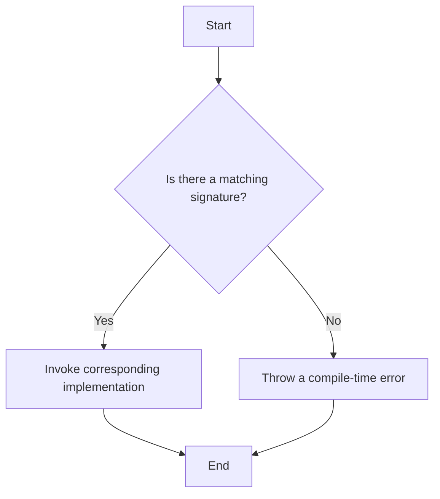

## 4.5 Function Overloads

In this section, we will explore the concept of function overloads in TypeScript. Function overloading is a powerful feature that allows you to define multiple function signatures for a single function. This enables your code to handle different parameter types and counts, making it more flexible and robust.

### Understanding Function Overloads

Function overloading in TypeScript allows you to define multiple signatures for a function, where each signature specifies a different combination of parameter types and counts. This is particularly useful when you want a single function to handle various input scenarios without having to create separate functions for each case.

In TypeScript, function overloads are defined by writing multiple function signatures followed by a single implementation. The TypeScript compiler uses these signatures to determine which implementation to invoke based on the arguments passed to the function.

### Declaring Function Overloads

To declare function overloads, you provide multiple function signatures followed by a single implementation. Let's look at a simple example to illustrate this concept:

```typescript
// Function signatures
function greet(person: string): string;
function greet(person: string, age: number): string;

// Function implementation
function greet(person: string, age?: number): string {
    if (age !== undefined) {
        return `Hello, ${person}! You are ${age} years old.`;
    } else {
        return `Hello, ${person}!`;
    }
}

// Usage
console.log(greet("Alice")); // Output: Hello, Alice!
console.log(greet("Bob", 30)); // Output: Hello, Bob! You are 30 years old.
```

In this example, we have two function signatures for `greet`. The first signature accepts a single string parameter, while the second accepts a string and a number. The implementation uses an optional parameter to handle both cases.

### Overloads with Different Parameter Types

Function overloads can also be used to handle different parameter types. This is useful when you want a function to perform similar operations on different types of data. Let's see an example:

```typescript
// Function signatures
function calculateArea(radius: number): number;
function calculateArea(length: number, width: number): number;

// Function implementation
function calculateArea(radiusOrLength: number, width?: number): number {
    if (width !== undefined) {
        return radiusOrLength * width; // Rectangle area
    } else {
        return Math.PI * radiusOrLength * radiusOrLength; // Circle area
    }
}

// Usage
console.log(calculateArea(5)); // Output: 78.53981633974483 (Circle area)
console.log(calculateArea(5, 10)); // Output: 50 (Rectangle area)
```

Here, the `calculateArea` function can compute the area of either a circle or a rectangle, depending on the number and type of arguments provided.

### How TypeScript Resolves Function Overloads

When you call an overloaded function, TypeScript uses the provided arguments to determine which signature to use. The compiler checks each signature in the order they are declared and selects the first one that matches the arguments. This means that the order of the signatures is important, and more specific signatures should be placed before more general ones.

### Best Practices for Function Overloads

While function overloads are a powerful tool, it's important to use them judiciously to maintain code readability and maintainability. Here are some best practices to consider:

1. **Keep It Simple**: Avoid overly complex overloads that make the function difficult to understand. Aim for clarity and simplicity.

2. **Document Each Overload**: Provide clear documentation for each overload signature to help other developers understand the intended use cases.

3. **Use Descriptive Names**: Choose descriptive parameter names that convey the purpose of each overload.

4. **Avoid Excessive Overloading**: If a function has too many overloads, consider splitting it into multiple functions for better readability.

5. **Test Thoroughly**: Ensure that each overload is thoroughly tested to verify that it behaves as expected for all input scenarios.

### Try It Yourself

Experiment with function overloads by modifying the examples provided. Try adding additional overloads or changing the parameter types to see how TypeScript handles them. This hands-on practice will help reinforce your understanding of function overloads.

### Visual Representation

To better understand how function overloads work, consider the following flowchart that illustrates the decision-making process when calling an overloaded function:



This flowchart shows that when you call an overloaded function, TypeScript checks for a matching signature. If a match is found, the corresponding implementation is invoked. Otherwise, a compile-time error is thrown.

### Further Reading

For more information on function overloads and related topics, consider exploring the following resources:

- [TypeScript Handbook: Functions](https://www.typescriptlang.org/docs/handbook/functions.html)
- [MDN Web Docs: Function](https://developer.mozilla.org/en-US/docs/Web/JavaScript/Guide/Functions)

### Summary

Function overloads in TypeScript allow you to define multiple signatures for a single function, enabling it to handle different parameter types and counts. By following best practices and experimenting with the examples provided, you can effectively use function overloads to create flexible and robust code.

## Quiz Time!



### What is function overloading in TypeScript?

- [x] Defining multiple signatures for a single function
- [ ] Creating multiple functions with the same name
- [ ] Using optional parameters in functions
- [ ] Writing functions with different return types

> **Explanation:** Function overloading in TypeScript involves defining multiple signatures for a single function to handle different parameter types and counts.

### How does TypeScript determine which function overload to use?

- [x] By matching the arguments to the first compatible signature
- [ ] By using the last defined signature
- [ ] By checking the return type of the function
- [ ] By randomly selecting a signature

> **Explanation:** TypeScript checks each signature in the order they are declared and selects the first one that matches the provided arguments.

### What is a best practice when using function overloads?

- [x] Document each overload clearly
- [ ] Use as many overloads as possible
- [ ] Avoid using overloads for simple functions
- [ ] Place general signatures before specific ones

> **Explanation:** It's important to document each overload clearly to help other developers understand the intended use cases.

### What happens if no matching signature is found for an overloaded function call?

- [x] A compile-time error is thrown
- [ ] The first signature is used by default
- [ ] The function returns `undefined`
- [ ] The function throws a runtime error

> **Explanation:** If no matching signature is found, TypeScript throws a compile-time error.

### Which of the following is an example of function overloading?

- [x] Defining multiple signatures for a function to handle different parameter types
- [ ] Using default parameters in a function
- [ ] Writing a function with a variable number of arguments
- [ ] Creating a function with a single signature

> **Explanation:** Function overloading involves defining multiple signatures for a function to handle different parameter types and counts.

### In the provided `greet` function example, what does the second signature allow?

- [x] Passing both a name and age to the function
- [ ] Passing only a name to the function
- [ ] Passing only an age to the function
- [ ] Passing no arguments to the function

> **Explanation:** The second signature allows passing both a name and age to the `greet` function.

### Why is the order of function signatures important in TypeScript?

- [x] TypeScript selects the first matching signature
- [ ] TypeScript selects the last matching signature
- [ ] TypeScript selects a random signature
- [ ] The order doesn't matter

> **Explanation:** TypeScript selects the first matching signature, so the order is important to ensure the correct signature is used.

### What is a potential downside of excessive function overloading?

- [x] Reduced code readability
- [ ] Increased performance
- [ ] Easier code maintenance
- [ ] More efficient memory usage

> **Explanation:** Excessive function overloading can reduce code readability, making it harder to understand and maintain.

### What is the purpose of the `calculateArea` function example?

- [x] To demonstrate overloads with different parameter types
- [ ] To show how to use default parameters
- [ ] To illustrate a recursive function
- [ ] To explain variable scope

> **Explanation:** The `calculateArea` function example demonstrates overloads with different parameter types (circle and rectangle).

### True or False: Function overloads can only be used with functions that have the same return type.

- [x] False
- [ ] True

> **Explanation:** Function overloads can be used with functions that have different return types, as long as the signatures differ in parameter types or counts.


