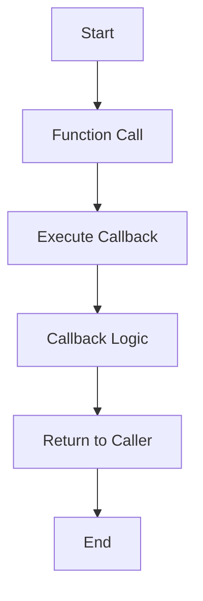

## 4.6 Function Callbacks

In this section, we will explore the concept of function callbacks in TypeScript. Callbacks are a fundamental aspect of programming, especially in asynchronous operations. Understanding how to use and type them effectively can greatly enhance your TypeScript skills.

### What are Callbacks?

**Callbacks** are functions passed as arguments to other functions. They are invoked after the completion of a task, allowing you to execute code once a particular operation has finished. This is particularly useful in asynchronous programming, where operations like network requests or file reading may take time to complete.

#### Why Use Callbacks?

Callbacks are essential for:
- **Asynchronous Programming**: They allow you to handle operations that don't complete immediately, like fetching data from a server.
- **Event Handling**: In web development, callbacks are used to handle events like clicks or form submissions.
- **Functional Programming**: Methods like `map`, `filter`, and `reduce` use callbacks to process arrays.

### Typing Callback Functions in TypeScript

In TypeScript, typing callback functions ensures that they are used correctly. This involves specifying the types of the parameters that the callback function will receive and the type of the value it will return.

#### Basic Callback Typing

Let's start with a simple example. Suppose we have a function that takes a callback to process a number:

```typescript
function processNumber(num: number, callback: (n: number) => void): void {
    callback(num);
}

// Example usage
processNumber(5, (n) => {
    console.log(`The number is ${n}`);
});
```

In this example:
- `processNumber` takes a number and a callback function as arguments.
- The callback function is typed as `(n: number) => void`, meaning it takes a number and returns nothing (`void`).

### Using Callbacks with Array Methods

Array methods like `map`, `filter`, and `reduce` are common use cases for callbacks. Let's explore how to use and type them in TypeScript.

#### `map` Method

The `map` method creates a new array by applying a function to each element of the original array.

```typescript
const numbers = [1, 2, 3, 4, 5];

const doubled = numbers.map((num: number): number => {
    return num * 2;
});

console.log(doubled); // Output: [2, 4, 6, 8, 10]
```

Here, the callback function `(num: number): number` takes a number and returns a number, which is the new value for each element in the array.

#### `filter` Method

The `filter` method creates a new array with elements that pass a test implemented by the callback function.

```typescript
const numbers = [1, 2, 3, 4, 5];

const evenNumbers = numbers.filter((num: number): boolean => {
    return num % 2 === 0;
});

console.log(evenNumbers); // Output: [2, 4]
```

The callback function `(num: number): boolean` returns a boolean indicating whether the element should be included in the new array.

#### `reduce` Method

The `reduce` method executes a reducer function on each element of the array, resulting in a single output value.

```typescript
const numbers = [1, 2, 3, 4, 5];

const sum = numbers.reduce((accumulator: number, currentValue: number): number => {
    return accumulator + currentValue;
}, 0);

console.log(sum); // Output: 15
```

In this example, the callback function `(accumulator: number, currentValue: number): number` takes two arguments and returns a number, which is the accumulated result.

### Potential Issues with Callbacks

While callbacks are powerful, they can lead to complex and hard-to-read code, especially when dealing with multiple asynchronous operations. This is known as **callback hell**.

#### Callback Hell

Callback hell occurs when callbacks are nested within other callbacks, leading to deeply nested code that is difficult to understand and maintain.

```typescript
doSomething((result) => {
    doSomethingElse(result, (newResult) => {
        doAnotherThing(newResult, (finalResult) => {
            console.log(finalResult);
        });
    });
});
```

To mitigate callback hell, you can:
- **Use Promises**: Promises provide a cleaner way to handle asynchronous operations.
- **Use Async/Await**: This syntax allows you to write asynchronous code that looks synchronous, improving readability.

### Encouraging Clear Type Definitions

Defining clear types for your callbacks not only improves code predictability but also helps catch errors early in the development process. It ensures that the functions you pass as callbacks adhere to the expected signature.

### Try It Yourself

Experiment with the following code snippets to deepen your understanding of callbacks:

1. Modify the `processNumber` function to accept a callback that returns a string, and log the result.
2. Use the `map` method to convert an array of strings to uppercase.
3. Create a `filter` function that removes all elements less than 3 from an array.
4. Implement a `reduce` function that finds the maximum value in an array.

### Visualizing Callback Flow

To better understand how callbacks work, let's visualize the flow of a simple callback function using a flowchart:



This flowchart represents the sequence of events when a callback function is executed. The function is called, the callback is executed, and control returns to the caller.

### References and Further Reading

For more information on callbacks and asynchronous programming, consider exploring the following resources:
- [MDN Web Docs: Callbacks](https://developer.mozilla.org/en-US/docs/Glossary/Callback_function)
- [JavaScript.info: Callbacks](https://javascript.info/callbacks)
- [MDN Web Docs: Promises](https://developer.mozilla.org/en-US/docs/Web/JavaScript/Guide/Using_promises)

### Key Takeaways

- Callbacks are functions passed as arguments to other functions, crucial for asynchronous programming.
- Typing callbacks in TypeScript ensures correct usage and improves code predictability.
- Array methods like `map`, `filter`, and `reduce` are common use cases for callbacks.
- Be aware of callback hell and consider using Promises or async/await for cleaner code.

## Quiz Time!



### What is a callback function?

- [x] A function passed as an argument to another function
- [ ] A function that returns another function
- [ ] A function that is called immediately after its declaration
- [ ] A function that only works with arrays

> **Explanation:** A callback function is a function passed as an argument to another function, allowing it to be called at a later time.

### Why are callbacks important in asynchronous programming?

- [x] They allow code to execute after an asynchronous operation completes
- [ ] They make code run faster
- [ ] They are required for all JavaScript functions
- [ ] They are used to declare variables

> **Explanation:** Callbacks are crucial in asynchronous programming because they allow you to execute code once an asynchronous operation, like a network request, has completed.

### How do you type a callback function that takes a number and returns a string in TypeScript?

- [x] `(n: number) => string`
- [ ] `(n: string) => number`
- [ ] `(n: number) => void`
- [ ] `(n: string) => void`

> **Explanation:** The correct type for a callback function that takes a number and returns a string is `(n: number) => string`.

### Which array method uses a callback to create a new array with elements that pass a test?

- [x] `filter`
- [ ] `map`
- [ ] `reduce`
- [ ] `forEach`

> **Explanation:** The `filter` method uses a callback function to test each element and creates a new array with elements that pass the test.

### What is callback hell?

- [x] A situation where callbacks are nested within other callbacks, leading to complex code
- [ ] A type of error in JavaScript
- [ ] A method for handling synchronous code
- [ ] A way to optimize code performance

> **Explanation:** Callback hell occurs when callbacks are nested within other callbacks, resulting in deeply nested and hard-to-read code.

### How can you avoid callback hell?

- [x] Use Promises or async/await
- [ ] Use more nested callbacks
- [ ] Avoid using callbacks altogether
- [ ] Use synchronous code only

> **Explanation:** To avoid callback hell, you can use Promises or async/await, which provide a cleaner way to handle asynchronous operations.

### What does the `map` method do?

- [x] Applies a function to each element of an array and returns a new array
- [ ] Filters elements of an array based on a condition
- [ ] Reduces an array to a single value
- [ ] Iterates over an array without returning a new array

> **Explanation:** The `map` method applies a function to each element of an array and returns a new array with the results.

### What is the purpose of typing callback functions in TypeScript?

- [x] To ensure callbacks are used correctly and catch errors early
- [ ] To make the code run faster
- [ ] To allow callbacks to be used in any function
- [ ] To prevent callbacks from being used

> **Explanation:** Typing callback functions in TypeScript ensures they are used correctly, improving code predictability and catching errors early.

### Which of the following is a common use case for callbacks?

- [x] Event handling
- [ ] Declaring variables
- [ ] Defining classes
- [ ] Writing comments

> **Explanation:** Callbacks are commonly used in event handling, where they are executed in response to events like clicks or form submissions.

### True or False: Callbacks are only used in asynchronous programming.

- [ ] True
- [x] False

> **Explanation:** Callbacks are not limited to asynchronous programming; they are also used in synchronous operations, such as array methods like `map` and `filter`.


