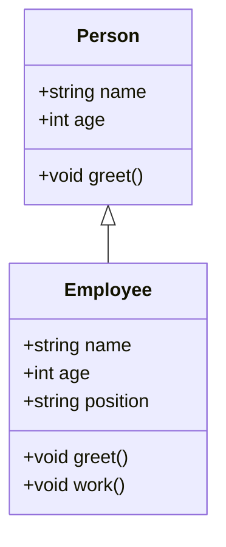

## 5.1 Introduction to Interfaces

In the world of TypeScript, interfaces play a crucial role in defining the structure of objects and ensuring that our code adheres to specific contracts. As we delve into this topic, we'll explore what interfaces are, how they work, and why they are an essential tool for TypeScript developers.

### What are Interfaces?

Interfaces in TypeScript are a way to define the shape of an object. They act as a blueprint for objects, specifying what properties and methods an object should have. Interfaces help enforce a contract within your code, ensuring that objects adhere to a specific structure.

Think of an interface as a contract that an object must fulfill. If an object claims to implement an interface, it must have all the properties and methods defined by that interface.

### Why Use Interfaces?

Interfaces provide several benefits:

1. **Type Safety**: Interfaces help catch errors early by enforcing the presence and types of properties.
2. **Code Readability**: They make it easier to understand what an object should look like, improving code readability and maintainability.
3. **Reusability**: Interfaces can be reused across different parts of your application, promoting consistency.
4. **Flexibility**: They allow for flexible and extensible code by enabling polymorphism.

### Declaring Interfaces

Let's start by declaring a simple interface in TypeScript. We'll define an interface for a `Person` object:

```typescript
interface Person {
    name: string;
    age: number;
    greet(): void;
}
```

In this example, the `Person` interface specifies that any object adhering to it must have a `name` property of type `string`, an `age` property of type `number`, and a `greet` method that returns `void`.

### Using Interfaces

Once an interface is defined, we can use it to type-check objects:

```typescript
const person: Person = {
    name: "Alice",
    age: 30,
    greet() {
        console.log(`Hello, my name is ${this.name}`);
    }
};

person.greet(); // Output: Hello, my name is Alice
```

In this example, the `person` object adheres to the `Person` interface, ensuring that it has the required properties and methods.

### Enforcing Property Presence and Types

Interfaces enforce the presence and types of properties. If we try to create an object that doesn't match the interface, TypeScript will throw an error:

```typescript
const invalidPerson: Person = {
    name: "Bob",
    // Missing 'age' property
    greet() {
        console.log(`Hello, my name is ${this.name}`);
    }
};

// Error: Property 'age' is missing in type '{ name: string; greet(): void; }' but required in type 'Person'.
```

### Duck Typing or Structural Subtyping

TypeScript uses a concept known as "duck typing" or "structural subtyping." This means that TypeScript checks the structure of an object rather than its explicit type. If an object has all the properties and methods required by an interface, it is considered to implement that interface, regardless of its actual type.

For example:

```typescript
interface Point {
    x: number;
    y: number;
}

function logPoint(point: Point) {
    console.log(`x: ${point.x}, y: ${point.y}`);
}

const point = { x: 10, y: 20, z: 30 };
logPoint(point); // Output: x: 10, y: 20
```

In this example, `point` has an extra property `z`, but it still satisfies the `Point` interface because it has the required `x` and `y` properties.

### Extending Interfaces

Interfaces can be extended to create new interfaces with additional properties. This is useful for building upon existing interfaces:

```typescript
interface Animal {
    name: string;
    age: number;
}

interface Dog extends Animal {
    breed: string;
}

const myDog: Dog = {
    name: "Buddy",
    age: 5,
    breed: "Golden Retriever"
};
```

Here, the `Dog` interface extends the `Animal` interface, adding a `breed` property.

### Exercises: Define Interfaces

Let's put what we've learned into practice. Try defining interfaces for the following objects:

1. **Car**: A car should have a `make`, `model`, and `year` property, as well as a `startEngine` method.
2. **Book**: A book should have a `title`, `author`, and `pages` property, as well as a `read` method.

**Exercise 1: Car Interface**

```typescript
interface Car {
    make: string;
    model: string;
    year: number;
    startEngine(): void;
}

const myCar: Car = {
    make: "Toyota",
    model: "Corolla",
    year: 2020,
    startEngine() {
        console.log("Engine started!");
    }
};

myCar.startEngine(); // Output: Engine started!
```

**Exercise 2: Book Interface**

```typescript
interface Book {
    title: string;
    author: string;
    pages: number;
    read(): void;
}

const myBook: Book = {
    title: "TypeScript for Beginners",
    author: "John Doe",
    pages: 300,
    read() {
        console.log(`Reading ${this.title} by ${this.author}`);
    }
};

myBook.read(); // Output: Reading TypeScript for Beginners by John Doe
```

### Try It Yourself

Now that you've seen how interfaces work, try modifying the code examples above. Add new properties or methods to the interfaces, or create your own interfaces for different objects. Experimentation is a great way to solidify your understanding of interfaces.

### Visualizing Interfaces

To better understand how interfaces define the structure of objects, let's visualize the relationship between interfaces and objects using a diagram.



In this diagram, the `Employee` class extends the `Person` interface, inheriting its properties and methods while adding its own.

### Key Takeaways

- **Interfaces define the shape of objects**: They specify what properties and methods an object should have.
- **Type safety and readability**: Interfaces help catch errors early and make code easier to understand.
- **Duck typing**: TypeScript checks the structure of an object rather than its explicit type.
- **Extending interfaces**: Interfaces can be extended to create new interfaces with additional properties.

### Further Reading

For more information on interfaces in TypeScript, check out the following resources:

- [TypeScript Handbook: Interfaces](https://www.typescriptlang.org/docs/handbook/interfaces.html)
- [MDN Web Docs: TypeScript Interfaces](https://developer.mozilla.org/en-US/docs/Web/JavaScript/Reference/Global_Objects/TypeScript/Interfaces)

## Quiz Time!



### What is the primary purpose of interfaces in TypeScript?

- [x] To define the shape of objects and enforce contracts within code
- [ ] To provide runtime type checking
- [ ] To improve performance
- [ ] To replace classes

> **Explanation:** Interfaces are used to define the shape of objects and enforce contracts within code, ensuring that objects adhere to a specific structure.

### Which of the following is NOT a benefit of using interfaces?

- [ ] Type safety
- [ ] Code readability
- [ ] Reusability
- [x] Improved runtime performance

> **Explanation:** Interfaces provide type safety, improve code readability, and promote reusability, but they do not directly improve runtime performance.

### What happens if an object does not match an interface?

- [x] TypeScript will throw a compile-time error
- [ ] The object will be automatically converted to match the interface
- [ ] The object will be ignored
- [ ] The object will cause a runtime error

> **Explanation:** If an object does not match an interface, TypeScript will throw a compile-time error, preventing the code from compiling.

### What is "duck typing" in TypeScript?

- [x] Checking the structure of an object rather than its explicit type
- [ ] A method for optimizing code
- [ ] A way to define classes
- [ ] A technique for handling errors

> **Explanation:** Duck typing, or structural subtyping, involves checking the structure of an object rather than its explicit type.

### How can interfaces be extended in TypeScript?

- [x] Using the `extends` keyword
- [ ] Using the `implements` keyword
- [ ] Using the `inherit` keyword
- [ ] Using the `add` keyword

> **Explanation:** Interfaces can be extended using the `extends` keyword to create new interfaces with additional properties.

### What is the result of the following code?

```typescript
interface Animal {
    name: string;
}

interface Dog extends Animal {
    breed: string;
}

const myDog: Dog = {
    name: "Buddy",
    breed: "Golden Retriever"
};
```

- [x] The code will compile successfully
- [ ] The code will throw a compile-time error
- [ ] The code will throw a runtime error
- [ ] The code will not run

> **Explanation:** The code will compile successfully because `myDog` adheres to the `Dog` interface, which extends the `Animal` interface.

### Which of the following is true about interfaces?

- [x] They can define methods as well as properties
- [ ] They can only define properties
- [ ] They are used for runtime type checking
- [ ] They are only used for classes

> **Explanation:** Interfaces can define both methods and properties, providing a complete blueprint for objects.

### What is the output of the following code?

```typescript
interface Point {
    x: number;
    y: number;
}

function logPoint(point: Point) {
    console.log(`x: ${point.x}, y: ${point.y}`);
}

const point = { x: 10, y: 20, z: 30 };
logPoint(point);
```

- [x] x: 10, y: 20
- [ ] x: 10, y: 20, z: 30
- [ ] x: 10
- [ ] y: 20

> **Explanation:** The output is `x: 10, y: 20` because the `logPoint` function only accesses the `x` and `y` properties defined by the `Point` interface.

### Can interfaces be used to type-check function parameters?

- [x] Yes
- [ ] No

> **Explanation:** Interfaces can be used to type-check function parameters, ensuring that the passed arguments adhere to the specified structure.

### True or False: Interfaces can only be used with objects.

- [ ] True
- [x] False

> **Explanation:** Interfaces can be used with objects, functions, and classes, providing a versatile tool for defining types in TypeScript.


