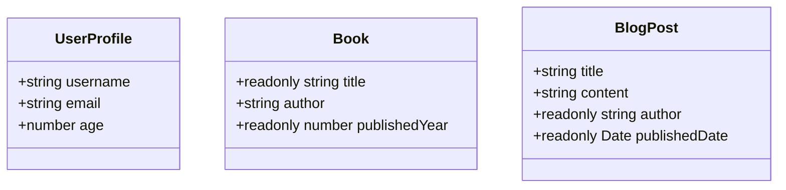

## 5.2 Optional and Readonly Properties

In this section, we will explore two powerful features of TypeScript interfaces: optional properties and readonly properties. These features allow us to define more flexible and safer data structures, enhancing the robustness of our code. Let's dive into each concept and see how they can be applied in real-world scenarios.

### Optional Properties

Optional properties in TypeScript interfaces are properties that may or may not be present in an object. This is particularly useful when dealing with data structures where certain fields are not always required. To declare an optional property, we use the `?` symbol after the property name.

#### Declaring Optional Properties

Let's start with a simple example. Consider an interface representing a user profile:

```typescript
interface UserProfile {
  username: string;
  email: string;
  age?: number; // This property is optional
}
```

In the `UserProfile` interface, the `age` property is optional, meaning that an object of type `UserProfile` may or may not have an `age` property. Here's how you can use this interface:

```typescript
const user1: UserProfile = {
  username: "john_doe",
  email: "john@example.com"
};

const user2: UserProfile = {
  username: "jane_doe",
  email: "jane@example.com",
  age: 28
};
```

In the example above, `user1` does not have an `age` property, while `user2` does. Both objects are valid `UserProfile` instances.

#### Use Cases for Optional Properties

Optional properties are particularly useful in scenarios where data might be incomplete or where certain fields are conditionally required. For instance:

- **User Input Forms**: When collecting user data, not all fields may be mandatory. Optional properties can represent fields that users can choose to fill out or leave blank.
- **API Responses**: When working with APIs, responses might include additional fields based on certain conditions. Optional properties can help model these responses accurately.
- **Configuration Objects**: In configuration settings, some options may have default values, and users only need to specify them if they want to override the defaults.

### Readonly Properties

Readonly properties are those that cannot be modified after they are initialized. This immutability is crucial for maintaining the integrity of data, especially in large applications where objects are passed around frequently.

#### Declaring Readonly Properties

To declare a property as readonly, use the `readonly` modifier before the property name. Here's an example:

```typescript
interface Book {
  readonly title: string;
  author: string;
  readonly publishedYear: number;
}
```

In the `Book` interface, both `title` and `publishedYear` are readonly properties. Once a `Book` object is created, these properties cannot be changed.

```typescript
const myBook: Book = {
  title: "TypeScript Basics",
  author: "Jane Smith",
  publishedYear: 2023
};

// This will cause an error
// myBook.title = "Advanced TypeScript"; // Error: Cannot assign to 'title' because it is a read-only property.
```

#### Use Cases for Readonly Properties

Readonly properties are beneficial in scenarios where data should remain constant after initialization. Some examples include:

- **Immutable Data Structures**: When designing data structures that should not change once created, readonly properties ensure immutability.
- **Constants**: For values that are set once and should not be altered, such as configuration settings or metadata.
- **Preventing Accidental Modifications**: In complex applications, readonly properties help prevent unintended changes to critical data.

### Combining Optional and Readonly Properties

TypeScript allows us to combine optional and readonly properties within the same interface. This combination is useful when a property might not always be present, but if it is, it should not be modified.

#### Example: Combining Optional and Readonly

Consider an interface for a blog post:

```typescript
interface BlogPost {
  title: string;
  content: string;
  readonly author: string;
  readonly publishedDate?: Date; // Optional and readonly
}
```

In this `BlogPost` interface, the `author` is always present and cannot be changed, while `publishedDate` is optional but also readonly if it exists.

```typescript
const post: BlogPost = {
  title: "Learning TypeScript",
  content: "TypeScript is a powerful tool for building robust applications.",
  author: "John Doe"
};

// This will cause an error
// post.author = "Jane Doe"; // Error: Cannot assign to 'author' because it is a read-only property.

// This is valid
post.publishedDate = new Date();
```

#### Use Cases for Combining Modifiers

Combining optional and readonly properties is useful in scenarios where:

- **Conditional Immutability**: Certain properties should remain unchanged if they exist, but they might not always be present.
- **Versioning and Metadata**: In systems where metadata might be added later, but should remain constant once set.

### Thinking About Immutability

Immutability is a key concept in software design, promoting stability and predictability in code. By using readonly properties, we can enforce immutability, reducing bugs caused by unintended data changes.

#### Benefits of Immutability

- **Predictable State**: Immutable objects ensure that once data is set, it remains consistent throughout the application's lifecycle.
- **Easier Debugging**: With immutable data, tracking changes becomes simpler, as objects do not change unexpectedly.
- **Concurrency Safety**: In multi-threaded environments, immutable objects can be shared across threads without risk of data corruption.

### Try It Yourself

Let's put these concepts into practice. Modify the following code examples to experiment with optional and readonly properties:

```typescript
interface Car {
  readonly make: string;
  model: string;
  year?: number;
}

const myCar: Car = {
  make: "Toyota",
  model: "Corolla"
};

// Try adding a year to myCar
// Try changing the make of myCar
```

### Visualizing Optional and Readonly Properties

To better understand how optional and readonly properties work, let's visualize them using a simple diagram.



This diagram illustrates the structure of the `UserProfile`, `Book`, and `BlogPost` interfaces, highlighting optional and readonly properties.

### Key Takeaways

- **Optional Properties**: Use the `?` symbol to declare properties that may or may not be present.
- **Readonly Properties**: Use the `readonly` modifier to prevent modifications to properties after initialization.
- **Combining Modifiers**: Optional and readonly can be combined for properties that are conditionally immutable.
- **Immutability**: Embrace immutability to enhance code safety and predictability.

### Further Reading

- [TypeScript Handbook: Interfaces](https://www.typescriptlang.org/docs/handbook/interfaces.html)
- [MDN Web Docs: JavaScript Data Structures](https://developer.mozilla.org/en-US/docs/Web/JavaScript/Data_structures)

## Quiz Time!



### What symbol is used to declare an optional property in a TypeScript interface?

- [x] ?
- [ ] #
- [ ] @
- [ ] $

> **Explanation:** The `?` symbol is used to denote optional properties in TypeScript interfaces.

### What does the `readonly` modifier do to a property in TypeScript?

- [x] Prevents modification after initialization
- [ ] Allows modification at any time
- [ ] Makes the property optional
- [ ] Hides the property from other modules

> **Explanation:** The `readonly` modifier ensures that a property cannot be changed after it has been set initially.

### Can a property be both optional and readonly in TypeScript?

- [x] Yes
- [ ] No

> **Explanation:** A property can be both optional and readonly, meaning it may not always be present, but if it is, it cannot be modified.

### Which of the following is a benefit of using readonly properties?

- [x] Preventing accidental modifications
- [ ] Allowing dynamic changes
- [ ] Making properties optional
- [ ] Hiding properties from other modules

> **Explanation:** Readonly properties help prevent accidental modifications, ensuring data integrity.

### In which scenario would you use an optional property?

- [x] When a property may not always be present
- [ ] When a property should never change
- [ ] When a property needs to be hidden
- [ ] When a property should be shared across modules

> **Explanation:** Optional properties are used when a property might not always be present in an object.

### What is a key benefit of immutability in software design?

- [x] Predictable state
- [ ] Faster execution
- [ ] More memory usage
- [ ] Easier syntax

> **Explanation:** Immutability ensures a predictable state, making it easier to understand and debug code.

### How do optional properties enhance flexibility in TypeScript?

- [x] By allowing properties to be absent
- [ ] By making properties readonly
- [ ] By hiding properties from other modules
- [ ] By allowing properties to be shared

> **Explanation:** Optional properties allow certain fields to be absent, providing flexibility in data structures.

### What happens if you try to modify a readonly property?

- [x] A compile-time error occurs
- [ ] The property changes
- [ ] The property is removed
- [ ] Nothing happens

> **Explanation:** Attempting to modify a readonly property results in a compile-time error.

### Which of the following is a use case for combining optional and readonly properties?

- [x] Conditional immutability
- [ ] Dynamic data structures
- [ ] Hidden properties
- [ ] Shared properties

> **Explanation:** Combining optional and readonly properties is useful for conditional immutability, where a property may not always be present but should remain unchanged if it exists.

### True or False: Immutability can help with concurrency safety.

- [x] True
- [ ] False

> **Explanation:** Immutability allows objects to be shared across threads without risk of data corruption, enhancing concurrency safety.


