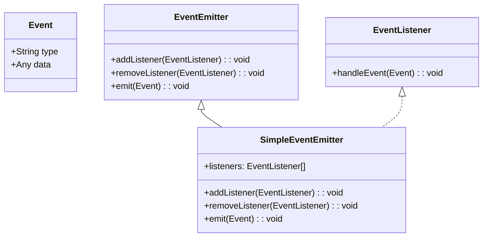

## 5.3 Function Types in Interfaces

In this section, we will explore how to define function types within interfaces in TypeScript. This concept is particularly useful for event-driven programming, where functions are often passed around as callbacks or event handlers. By the end of this section, you'll understand how to include function signatures in interfaces, the benefits of doing so, and how it can facilitate consistency and developer understanding.

### Introduction to Function Types in Interfaces

In TypeScript, interfaces are a powerful way to define the shape of an object. They allow us to specify what properties an object should have and what types those properties should be. But interfaces can do more than just define object properties—they can also define function types. This means you can specify what kind of functions an object should have, including the parameters those functions take and the type of value they return.

### Including Function Signatures in Interfaces

To include a function signature in an interface, you define a property with a function type. A function type is a type that describes a function's parameter types and return type. Here's the basic syntax:

```typescript
interface MyInterface {
  myFunction: (param1: string, param2: number) => boolean;
}
```

In this example, `myFunction` is a property of `MyInterface` that is expected to be a function. This function takes two parameters: a `string` and a `number`, and it returns a `boolean`.

### Example: Defining Function Properties in Interfaces

Let's look at a more detailed example. Suppose we are building a simple event system where we want to define an interface for event listeners. Each event listener should be a function that takes an event object and returns nothing (i.e., `void`).

```typescript
interface EventListener {
  handleEvent: (event: Event) => void;
}

class Button {
  private listeners: EventListener[] = [];

  addEventListener(listener: EventListener) {
    this.listeners.push(listener);
  }

  click() {
    const event = new Event('click');
    this.listeners.forEach(listener => listener.handleEvent(event));
  }
}
```

In this example, we define an `EventListener` interface with a `handleEvent` function. The `Button` class can register multiple listeners and call their `handleEvent` functions when the button is clicked.

### Benefits of Typing Functions in Interfaces

Typing functions in interfaces offers several benefits:

1. **Consistency**: By defining function types in interfaces, you ensure that all implementations of the interface adhere to the same function signature. This consistency makes your codebase more predictable and easier to understand.

2. **Type Safety**: TypeScript will check that the functions you assign to these properties match the specified types. This helps catch errors at compile time, rather than at runtime.

3. **IntelliSense Support**: When using a code editor with IntelliSense, defining function types in interfaces provides better autocompletion and documentation support, making development faster and less error-prone.

4. **Documentation**: Interfaces serve as a form of documentation for your code. By including function types, you make it clear what functions an object should have and how they should be used.

### Practical Example: Event Listener Interface

Let's expand on our earlier example by creating a more complex event system. We'll define an interface for an event emitter, which can register listeners and emit events.

```typescript
interface Event {
  type: string;
  data?: any;
}

interface EventListener {
  handleEvent: (event: Event) => void;
}

interface EventEmitter {
  addListener: (listener: EventListener) => void;
  removeListener: (listener: EventListener) => void;
  emit: (event: Event) => void;
}

class SimpleEventEmitter implements EventEmitter {
  private listeners: EventListener[] = [];

  addListener(listener: EventListener) {
    this.listeners.push(listener);
  }

  removeListener(listener: EventListener) {
    this.listeners = this.listeners.filter(l => l !== listener);
  }

  emit(event: Event) {
    this.listeners.forEach(listener => listener.handleEvent(event));
  }
}
```

In this example, we define an `EventEmitter` interface with three function properties: `addListener`, `removeListener`, and `emit`. The `SimpleEventEmitter` class implements this interface, providing a basic event system.

### Facilitating Consistency and Developer Understanding

By defining function types in interfaces, you create a contract that all implementations must follow. This contract ensures consistency across your codebase, making it easier for developers to understand how different parts of the system interact.

For example, when a developer sees the `EventEmitter` interface, they immediately know that any class implementing this interface will have `addListener`, `removeListener`, and `emit` functions. This understanding reduces the cognitive load on developers, allowing them to focus on building features rather than figuring out how the system works.

### Try It Yourself

Now that we've covered the basics, try modifying the `SimpleEventEmitter` class to log a message each time an event is emitted. You can also experiment with adding more event types and listeners to see how the system behaves.

### Visualizing Function Types in Interfaces

To help visualize how function types fit into interfaces, consider the following diagram. It shows the relationship between an interface and a class that implements it, with a focus on function types.



### Further Reading and Resources

To deepen your understanding of interfaces and function types in TypeScript, consider exploring the following resources:

- [TypeScript Handbook: Interfaces](https://www.typescriptlang.org/docs/handbook/interfaces.html)
- [MDN Web Docs: JavaScript Functions](https://developer.mozilla.org/en-US/docs/Web/JavaScript/Guide/Functions)
- [TypeScript Deep Dive: Interfaces](https://basarat.gitbook.io/typescript/type-system/interfaces)

### Summary

In this section, we explored how to define function types within interfaces in TypeScript. We learned how to include function signatures in interfaces, the benefits of doing so, and how it can facilitate consistency and developer understanding. By using interfaces to define function types, you create a clear contract for your code, making it easier to maintain and extend.

### Quiz Time!



### What is the primary purpose of defining function types in interfaces?

- [x] To ensure consistency and type safety across implementations.
- [ ] To make functions run faster.
- [ ] To avoid using classes.
- [ ] To eliminate the need for function parameters.

> **Explanation:** Defining function types in interfaces ensures consistency and type safety across implementations, making the codebase more predictable and easier to understand.

### How do you define a function type in an interface?

- [x] By specifying a property with a function signature.
- [ ] By using the `function` keyword.
- [ ] By creating a class method.
- [ ] By using a constructor function.

> **Explanation:** A function type in an interface is defined by specifying a property with a function signature, detailing the parameter types and return type.

### What is the return type of the `handleEvent` function in the `EventListener` interface?

- [x] void
- [ ] boolean
- [ ] number
- [ ] string

> **Explanation:** The `handleEvent` function in the `EventListener` interface returns `void`, indicating it does not return a value.

### Which of the following is a benefit of typing functions in interfaces?

- [x] Improved IntelliSense support.
- [ ] Faster execution time.
- [ ] Reduced memory usage.
- [ ] Automatic code generation.

> **Explanation:** Typing functions in interfaces provides improved IntelliSense support, offering better autocompletion and documentation in code editors.

### What does the `emit` function in the `EventEmitter` interface do?

- [x] It triggers all registered listeners with a given event.
- [ ] It removes a listener from the list.
- [ ] It adds a new listener to the list.
- [ ] It logs the event to the console.

> **Explanation:** The `emit` function in the `EventEmitter` interface triggers all registered listeners with a given event.

### In the `SimpleEventEmitter` class, what type is the `listeners` property?

- [x] EventListener[]
- [ ] string[]
- [ ] number[]
- [ ] boolean[]

> **Explanation:** The `listeners` property in the `SimpleEventEmitter` class is of type `EventListener[]`, an array of `EventListener` objects.

### What is the role of the `addListener` function in the `EventEmitter` interface?

- [x] To add a new listener to the list of listeners.
- [ ] To remove a listener from the list.
- [ ] To emit an event.
- [ ] To log a message to the console.

> **Explanation:** The `addListener` function in the `EventEmitter` interface adds a new listener to the list of listeners.

### Which of the following is NOT a benefit of using function types in interfaces?

- [ ] Consistency
- [ ] Type Safety
- [ ] Documentation
- [x] Increased runtime performance

> **Explanation:** While function types in interfaces provide consistency, type safety, and documentation, they do not inherently increase runtime performance.

### True or False: Interfaces in TypeScript can only define object properties, not functions.

- [ ] True
- [x] False

> **Explanation:** False. Interfaces in TypeScript can define both object properties and function types.

### What does the `removeListener` function in the `EventEmitter` interface do?

- [x] It removes a listener from the list of listeners.
- [ ] It adds a new listener to the list.
- [ ] It emits an event.
- [ ] It logs a message to the console.

> **Explanation:** The `removeListener` function in the `EventEmitter` interface removes a listener from the list of listeners.


