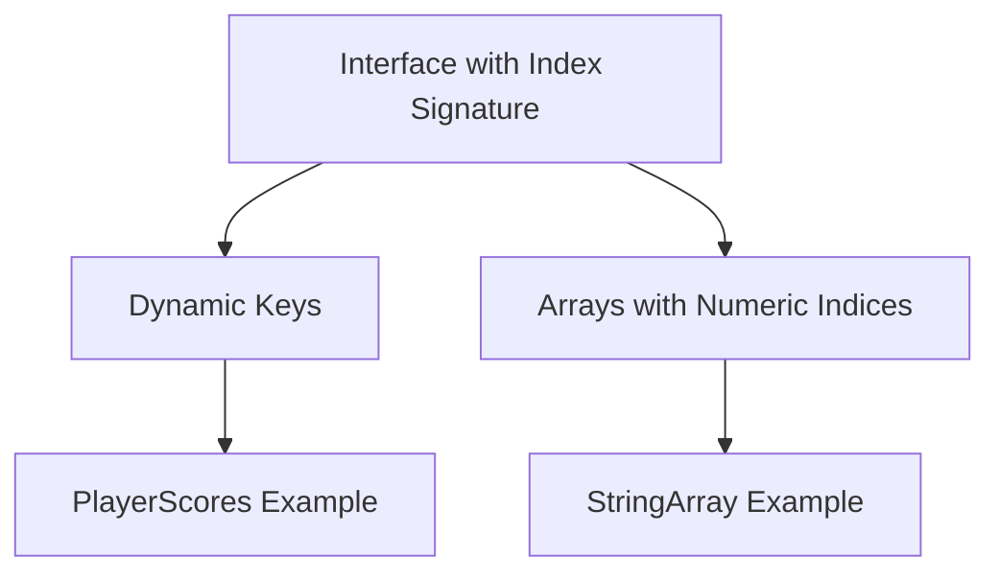

## 5.4 Indexable Types

In TypeScript, indexable types allow us to define the shape of objects and arrays that are accessed using indices or keys. This feature is particularly useful when working with collections of data where the keys or indices are not known in advance. In this section, we'll explore how to use index signatures in interfaces, provide examples of typing objects with dynamic keys and arrays, discuss the limitations and rules of indexable types, and highlight scenarios where they are particularly useful. We'll also include warnings about potential type safety issues with improper use.

### Understanding Index Signatures

Index signatures are a way to describe the types of values that can be accessed using a string or number index. They are declared within interfaces and allow us to define properties whose names are not known at compile time.

#### Declaring Index Signatures

To declare an index signature in an interface, we use the following syntax:

```typescript
interface MyIndexableType {
  [index: string]: number;
}
```

In this example, `MyIndexableType` is an interface with an index signature that specifies any property accessed with a `string` key will have a `number` value.

#### Example: Typing Objects with Dynamic Keys

Consider a scenario where we have an object representing a collection of scores for different players. The player names are not known in advance, so we use an index signature to type this object:

```typescript
interface PlayerScores {
  [playerName: string]: number;
}

const scores: PlayerScores = {
  Alice: 10,
  Bob: 15,
  Charlie: 20
};

console.log(scores["Alice"]); // Output: 10
```

In this example, the `PlayerScores` interface allows us to access player scores using their names as keys.

### Typing Arrays with Index Signatures

Index signatures can also be used to type arrays. In TypeScript, arrays are objects with numeric indices, so we can use a number index signature to define the type of elements in an array.

#### Example: Typing Arrays

Let's create an interface for an array of strings:

```typescript
interface StringArray {
  [index: number]: string;
}

const fruits: StringArray = ["Apple", "Banana", "Cherry"];

console.log(fruits[1]); // Output: Banana
```

In this example, the `StringArray` interface ensures that every element in the `fruits` array is a string.

### Limitations and Rules of Indexable Types

While indexable types are powerful, there are some limitations and rules to keep in mind:

1. **Consistency in Value Types**: All properties accessed via an index signature must have the same type. For example, if you declare `[index: string]: number`, all values must be numbers.

2. **No Mixed Index Signatures**: You cannot have both string and number index signatures in the same interface. This is because JavaScript automatically converts number indices to strings when accessing object properties.

3. **No Overlapping Properties**: If an interface has both named properties and an index signature, the named properties must be compatible with the index signature type.

#### Example: Overlapping Properties

```typescript
interface MixedType {
  [index: string]: number;
  length: number; // This is allowed
  // name: string; // Error: Property 'name' of type 'string' is not assignable to string index type 'number'.
}
```

In this example, the `length` property is compatible with the index signature, but a `name` property would cause an error.

### Scenarios Where Indexable Types Are Useful

Indexable types are particularly useful in scenarios where:

- **Dynamic Data Structures**: You are working with data structures where the keys or indices are not known at compile time, such as dictionaries or maps.

- **Collections of Similar Items**: You need to enforce a consistent type for all items in a collection, such as arrays or lists.

- **Flexible APIs**: You are designing APIs that need to accommodate a wide range of input types without sacrificing type safety.

### Potential Type Safety Issues

While indexable types provide flexibility, improper use can lead to type safety issues. Here are some warnings to consider:

- **Type Mismatch**: Ensure that the values assigned to properties accessed via an index signature match the expected type. Type mismatches can lead to runtime errors.

- **Unintentional Property Access**: Be cautious when accessing properties that may not exist. Use optional chaining or type guards to handle undefined values safely.

#### Example: Handling Undefined Values

```typescript
interface ProductPrices {
  [productName: string]: number;
}

const prices: ProductPrices = {
  apple: 1.5,
  banana: 2.0
};

const orangePrice = prices["orange"] ?? 0; // Use nullish coalescing to provide a default value
console.log(orangePrice); // Output: 0
```

In this example, we use the nullish coalescing operator (`??`) to provide a default value when accessing a property that may not exist.

### Try It Yourself

Now that we've covered the basics of indexable types, try experimenting with the following exercises:

1. **Create a Dictionary**: Define an interface for a dictionary that maps country names to their capitals. Populate the dictionary with a few entries and access the capital of a specific country.

2. **Type an Array of Numbers**: Create an interface for an array of numbers and use it to define an array of your favorite numbers. Access and log a specific number from the array.

3. **Handle Undefined Properties**: Extend the `PlayerScores` example to handle cases where a player's score is not available. Use optional chaining or default values to prevent errors.

### Visual Aids

To help visualize the concept of indexable types, consider the following diagram:



This diagram illustrates how an interface with an index signature can be used to type objects with dynamic keys and arrays with numeric indices.

### References and Links

For further reading on indexable types and related concepts, check out these resources:

- [TypeScript Handbook: Index Signatures](https://www.typescriptlang.org/docs/handbook/2/objects.html#index-signatures)
- [MDN Web Docs: JavaScript Arrays](https://developer.mozilla.org/en-US/docs/Web/JavaScript/Reference/Global_Objects/Array)
- [TypeScript Deep Dive: Index Signatures](https://basarat.gitbook.io/typescript/type-system/index-signatures)

### Engagement and Reinforcement

To reinforce your understanding of indexable types, consider these questions:

- What are the benefits of using index signatures in interfaces?
- How do indexable types help in designing flexible APIs?
- What are some potential pitfalls to avoid when using indexable types?

### Key Takeaways

- Indexable types allow us to define the shape of objects and arrays accessed via indices or keys.
- Index signatures are declared within interfaces and specify the type of values for dynamic keys.
- Indexable types are useful for dynamic data structures, collections of similar items, and flexible APIs.
- Be cautious of type mismatches and undefined property access when using indexable types.

## Quiz Time!



### What is an index signature in TypeScript?

- [x] A way to describe the types of values accessed using a string or number index.
- [ ] A method for declaring functions within interfaces.
- [ ] A syntax for defining classes with dynamic properties.
- [ ] A feature for handling asynchronous operations.

> **Explanation:** An index signature is a way to describe the types of values that can be accessed using a string or number index in TypeScript.

### How do you declare an index signature for a string key in an interface?

- [ ] interface MyType { [index: number]: string; }
- [x] interface MyType { [index: string]: string; }
- [ ] interface MyType { index: string; }
- [ ] interface MyType { string: index; }

> **Explanation:** To declare an index signature for a string key, use the syntax `[index: string]: string;` within an interface.

### Which of the following is a valid use of an index signature?

- [x] Typing an object with dynamic keys.
- [ ] Declaring a function with optional parameters.
- [ ] Creating a class with private properties.
- [ ] Implementing a module with named exports.

> **Explanation:** Index signatures are used for typing objects with dynamic keys, allowing for flexible property access.

### Can you have both string and number index signatures in the same interface?

- [ ] Yes, it is always allowed.
- [x] No, because JavaScript converts number indices to strings.
- [ ] Yes, but only in classes.
- [ ] No, because TypeScript does not support number indices.

> **Explanation:** You cannot have both string and number index signatures in the same interface because JavaScript converts number indices to strings.

### What happens if you access a property that doesn't exist in an indexable type?

- [ ] The program crashes immediately.
- [x] It returns `undefined`.
- [ ] It throws a compile-time error.
- [ ] It automatically creates the property.

> **Explanation:** Accessing a property that doesn't exist in an indexable type returns `undefined`.

### How can you provide a default value when accessing a potentially undefined property?

- [ ] Use a `try-catch` block.
- [ ] Use a `for-loop`.
- [x] Use the nullish coalescing operator (`??`).
- [ ] Use a `switch` statement.

> **Explanation:** The nullish coalescing operator (`??`) provides a default value when accessing a potentially undefined property.

### Which of the following is a limitation of indexable types?

- [x] All properties accessed via an index signature must have the same type.
- [ ] They cannot be used with arrays.
- [ ] They require explicit type casting.
- [ ] They are only available in TypeScript 4.0 and above.

> **Explanation:** A limitation of indexable types is that all properties accessed via an index signature must have the same type.

### What is a common use case for indexable types?

- [ ] Implementing complex algorithms.
- [x] Designing flexible APIs.
- [ ] Creating static HTML pages.
- [ ] Writing CSS stylesheets.

> **Explanation:** Indexable types are commonly used in designing flexible APIs where the keys or indices are not known at compile time.

### True or False: Indexable types can be used to type arrays.

- [x] True
- [ ] False

> **Explanation:** True. Indexable types can be used to type arrays by using a number index signature.

### True or False: Indexable types can only be used with string keys.

- [ ] True
- [x] False

> **Explanation:** False. Indexable types can be used with both string and number keys, although not simultaneously in the same interface.


