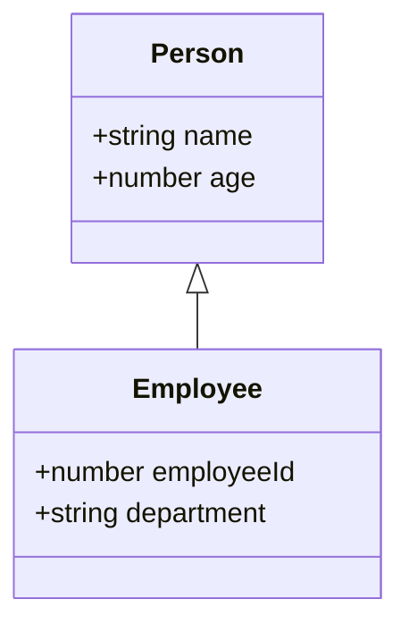

## 5.5 Extending Interfaces

In this section, we will explore how to extend interfaces in TypeScript. Extending interfaces is a powerful feature that allows us to build upon existing interfaces to create more specific types. This not only helps in avoiding redundancy but also promotes a modular and scalable code architecture. Let's dive into the concept of extending interfaces and understand its benefits and best practices.

### Understanding Interface Extension

In TypeScript, interfaces are used to define the shape of an object. They allow us to specify the properties and methods that an object must have. However, as our applications grow, we might find ourselves needing to create interfaces that share common properties. Instead of duplicating these properties across multiple interfaces, we can use the `extends` keyword to create a new interface that inherits properties from one or more existing interfaces.

### Demonstrating Interface Extension

Let's start with a simple example to illustrate how interface extension works. Consider the following interfaces:

```typescript
interface Person {
    name: string;
    age: number;
}

interface Employee extends Person {
    employeeId: number;
    department: string;
}
```

In this example, the `Employee` interface extends the `Person` interface. This means that `Employee` inherits all the properties of `Person` (`name` and `age`), and adds its own properties (`employeeId` and `department`). This allows us to create objects that are both `Person` and `Employee`.

```typescript
const employee: Employee = {
    name: "Alice",
    age: 30,
    employeeId: 12345,
    department: "Engineering"
};
```

### Benefits of Interface Extension

1. **Avoiding Redundancy**: By extending interfaces, we avoid repeating the same properties in multiple interfaces. This makes our code cleaner and easier to maintain.

2. **Promoting Reusability**: Interface extension allows us to create reusable components. We can define common properties in a base interface and extend it to create more specific interfaces as needed.

3. **Enhancing Scalability**: As our application grows, we can easily extend existing interfaces to accommodate new requirements without modifying the original interface.

4. **Improving Code Organization**: Interface extension helps in organizing code by grouping related properties together, making it easier to understand and manage.

### Best Practices for Interface Design and Extension

When designing and extending interfaces, it's important to follow some best practices to ensure that our code remains clean and maintainable:

- **Use Descriptive Names**: Choose meaningful names for interfaces and their properties. This makes the code more readable and self-explanatory.

- **Keep Interfaces Small**: Avoid creating large interfaces with too many properties. Instead, break them down into smaller, more focused interfaces that can be extended as needed.

- **Favor Composition Over Inheritance**: While extending interfaces is useful, it's often better to use composition to combine multiple interfaces. This provides more flexibility and avoids the pitfalls of deep inheritance hierarchies.

- **Avoid Overlapping Properties**: Ensure that extended interfaces do not have overlapping properties with different types. This can lead to confusion and errors.

- **Document Interfaces**: Provide clear documentation for interfaces and their extensions. This helps other developers understand the purpose and usage of each interface.

### Try It Yourself

To reinforce your understanding of interface extension, try modifying the code examples provided above. You can add new properties to the `Person` or `Employee` interfaces, or create a new interface that extends `Employee` to include additional properties specific to a certain role.

### Visualizing Interface Extension

To better understand how interface extension works, let's visualize the relationship between interfaces using a diagram. This diagram shows how the `Employee` interface extends the `Person` interface:



In this diagram, the `Employee` class inherits properties from the `Person` class, illustrating the concept of interface extension.

### Advanced Concepts: Multiple Interface Extension

TypeScript allows an interface to extend multiple interfaces. This is useful when you want to combine properties from different interfaces into a single interface. Here's an example:

```typescript
interface Address {
    street: string;
    city: string;
    zipCode: string;
}

interface ContactInfo extends Person, Address {
    phoneNumber: string;
    email: string;
}
```

In this example, the `ContactInfo` interface extends both `Person` and `Address`, inheriting all their properties and adding its own (`phoneNumber` and `email`). This allows us to create a comprehensive interface that includes personal, address, and contact information.

```typescript
const contact: ContactInfo = {
    name: "Bob",
    age: 45,
    street: "123 Main St",
    city: "Anytown",
    zipCode: "12345",
    phoneNumber: "555-1234",
    email: "bob@example.com"
};
```

### Best Practices for Multiple Interface Extension

- **Ensure Compatibility**: When extending multiple interfaces, make sure that their properties are compatible and do not conflict with each other.

- **Use Sparingly**: While multiple interface extension is powerful, it should be used judiciously to avoid overly complex interfaces.

- **Maintain Clarity**: Keep the purpose of each interface clear and well-defined, even when combining multiple interfaces.

### Encouraging Modular and Scalable Code Architecture

By using interface extension, we can create a code architecture that is both modular and scalable. This approach allows us to build applications that are easy to extend and maintain, as new features and requirements can be accommodated by extending existing interfaces rather than rewriting code.

### Conclusion

Extending interfaces in TypeScript is a powerful technique that enhances code reusability, organization, and scalability. By following best practices and understanding the benefits of interface extension, we can create clean, maintainable, and efficient code. As you continue your journey with TypeScript, remember to leverage interface extension to build robust applications.

## Quiz Time!



### What is the primary purpose of extending interfaces in TypeScript?

- [x] To avoid redundancy and promote reusability
- [ ] To create new classes
- [ ] To add methods to existing objects
- [ ] To convert TypeScript to JavaScript

> **Explanation:** Extending interfaces helps avoid redundancy by reusing common properties and promotes reusability by allowing the creation of more specific types.

### Which keyword is used to extend an interface in TypeScript?

- [ ] implement
- [ ] inherit
- [x] extends
- [ ] include

> **Explanation:** The `extends` keyword is used in TypeScript to extend an interface.

### What happens when an interface extends another interface?

- [x] It inherits all properties from the extended interface
- [ ] It overrides the extended interface
- [ ] It creates a new class
- [ ] It deletes the extended interface

> **Explanation:** When an interface extends another, it inherits all properties from the extended interface, allowing for more specific types.

### How can you avoid redundancy when designing interfaces?

- [x] By extending interfaces
- [ ] By duplicating properties
- [ ] By using classes instead
- [ ] By avoiding interfaces

> **Explanation:** Extending interfaces allows you to reuse common properties, avoiding redundancy in your code.

### What is a benefit of using small, focused interfaces?

- [x] They are easier to extend and maintain
- [ ] They require more code
- [ ] They are less efficient
- [ ] They are harder to understand

> **Explanation:** Small, focused interfaces are easier to extend and maintain, making the codebase more manageable.

### Which of the following is a best practice for designing interfaces?

- [x] Use descriptive names for interfaces and properties
- [ ] Create large interfaces with many properties
- [ ] Avoid documentation
- [ ] Use overlapping properties

> **Explanation:** Descriptive names make the code more readable and self-explanatory, which is a best practice for designing interfaces.

### What should you ensure when extending multiple interfaces?

- [x] Ensure compatibility of properties
- [ ] Use the `implement` keyword
- [ ] Avoid using properties
- [ ] Use the `include` keyword

> **Explanation:** When extending multiple interfaces, ensure that their properties are compatible and do not conflict with each other.

### What is a potential downside of using multiple interface extension?

- [x] It can lead to overly complex interfaces
- [ ] It simplifies the code
- [ ] It reduces the number of properties
- [ ] It eliminates the need for classes

> **Explanation:** While powerful, multiple interface extension can lead to overly complex interfaces if not used judiciously.

### How does interface extension improve code organization?

- [x] By grouping related properties together
- [ ] By increasing redundancy
- [ ] By eliminating the need for classes
- [ ] By avoiding the use of interfaces

> **Explanation:** Interface extension helps organize code by grouping related properties together, making it easier to understand and manage.

### True or False: Interface extension can only be used with one interface at a time.

- [ ] True
- [x] False

> **Explanation:** False. TypeScript allows an interface to extend multiple interfaces, combining properties from different interfaces into a single interface.


