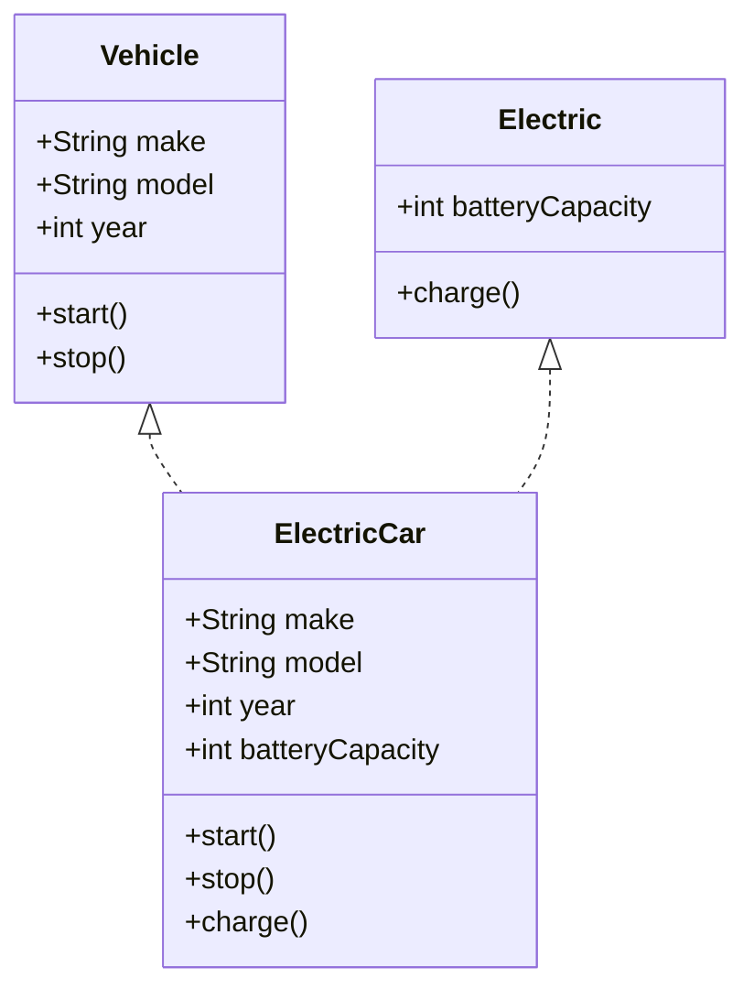

## 5.6 Implementing Interfaces in Classes

In this section, we will explore how to implement interfaces in TypeScript classes. This practice is crucial for ensuring that classes adhere to specific contracts, which enhances code reliability and maintainability. By the end of this section, you'll understand how to use interfaces to design robust APIs and libraries, promote loose coupling, and achieve high cohesion in your code.

### Understanding Interfaces and Classes

Before diving into implementation, let's briefly recap what interfaces and classes are:

- **Interfaces**: In TypeScript, an interface is a syntactical contract that an entity should conform to. It defines the structure that a class should follow without implementing the behavior.
- **Classes**: A class is a blueprint for creating objects with specific properties and methods. It encapsulates data and behavior, allowing for object-oriented programming.

### Implementing Interfaces in Classes

To implement an interface in a class, we use the `implements` keyword. This ensures that the class adheres to the structure defined by the interface. Let's see how this works with a simple example.

#### Example: Implementing a Single Interface

Consider an interface `Vehicle` with properties and methods that any vehicle should have:

```typescript
interface Vehicle {
  make: string;
  model: string;
  year: number;
  start(): void;
  stop(): void;
}

class Car implements Vehicle {
  make: string;
  model: string;
  year: number;

  constructor(make: string, model: string, year: number) {
    this.make = make;
    this.model = model;
    this.year = year;
  }

  start(): void {
    console.log(`${this.make} ${this.model} started.`);
  }

  stop(): void {
    console.log(`${this.make} ${this.model} stopped.`);
  }
}

const myCar = new Car('Toyota', 'Corolla', 2020);
myCar.start(); // Output: Toyota Corolla started.
myCar.stop();  // Output: Toyota Corolla stopped.
```

In this example, the `Car` class implements the `Vehicle` interface. This means the class must provide implementations for all properties and methods defined in the interface.

### Implementing Multiple Interfaces

A class can implement multiple interfaces, allowing it to conform to various contracts. Let's see how this is done.

#### Example: Implementing Multiple Interfaces

Suppose we have two interfaces, `Vehicle` and `Electric`, and we want a class to implement both:

```typescript
interface Electric {
  batteryCapacity: number;
  charge(): void;
}

class ElectricCar implements Vehicle, Electric {
  make: string;
  model: string;
  year: number;
  batteryCapacity: number;

  constructor(make: string, model: string, year: number, batteryCapacity: number) {
    this.make = make;
    this.model = model;
    this.year = year;
    this.batteryCapacity = batteryCapacity;
  }

  start(): void {
    console.log(`${this.make} ${this.model} started.`);
  }

  stop(): void {
    console.log(`${this.make} ${this.model} stopped.`);
  }

  charge(): void {
    console.log(`${this.make} ${this.model} is charging.`);
  }
}

const myElectricCar = new ElectricCar('Tesla', 'Model S', 2021, 100);
myElectricCar.start();  // Output: Tesla Model S started.
myElectricCar.charge(); // Output: Tesla Model S is charging.
```

Here, `ElectricCar` implements both `Vehicle` and `Electric` interfaces, ensuring it adheres to the contracts of both.

### Importance of Interfaces in API and Library Design

Interfaces play a crucial role in designing APIs and libraries. They define clear contracts for how classes should behave, making it easier for developers to understand and use your code. Here are some benefits:

- **Loose Coupling**: Interfaces decouple the implementation from the contract, allowing for flexibility in how the contract is fulfilled.
- **High Cohesion**: By defining specific interfaces, you ensure that classes have a focused responsibility, leading to more cohesive code.
- **Interchangeability**: Classes implementing the same interface can be used interchangeably, promoting code reuse and flexibility.

### Promoting Loose Coupling and High Cohesion

Loose coupling and high cohesion are two fundamental principles of software design that interfaces help achieve.

- **Loose Coupling**: By using interfaces, you can change the implementation of a class without affecting the rest of the codebase. This is because the code depends on the interface, not the implementation.
- **High Cohesion**: Interfaces encourage classes to focus on a specific set of responsibilities, leading to more organized and maintainable code.

### Exercise: Implement an Interface in a Class

Now it's your turn! Try implementing an interface in a class. Follow these steps:

1. **Define an Interface**: Create an interface `Animal` with properties `name` and `age`, and methods `speak()` and `move()`.
2. **Implement the Interface**: Create a class `Dog` that implements the `Animal` interface.
3. **Add Properties and Methods**: Provide implementations for the properties and methods in the `Dog` class.
4. **Test Your Code**: Create an instance of the `Dog` class and call its methods.

Here's a starting point:

```typescript
interface Animal {
  name: string;
  age: number;
  speak(): void;
  move(): void;
}

class Dog implements Animal {
  // Your code here
}

// Test your implementation
```

### Try It Yourself

Experiment with the code examples provided. Try modifying the `Car` or `ElectricCar` classes to add new features or change existing ones. See how interfaces help maintain the structure and reliability of your code.

### Visualizing Interfaces and Classes

To help visualize the relationship between interfaces and classes, let's use a diagram:



**Diagram Description**: This diagram shows the `ElectricCar` class implementing both `Vehicle` and `Electric` interfaces. The arrows indicate that `ElectricCar` adheres to the contracts defined by these interfaces.

### Key Takeaways

- **Interfaces define contracts**: They specify what a class should do, not how it should do it.
- **Classes implement interfaces**: By using the `implements` keyword, classes adhere to the structure defined by interfaces.
- **Multiple interfaces**: A class can implement multiple interfaces, allowing it to conform to various contracts.
- **Design benefits**: Interfaces promote loose coupling, high cohesion, and interchangeability, making your code more flexible and maintainable.

### Further Reading

For more information on TypeScript interfaces and classes, check out these resources:

- [TypeScript Handbook: Interfaces](https://www.typescriptlang.org/docs/handbook/interfaces.html)
- [MDN Web Docs: Classes](https://developer.mozilla.org/en-US/docs/Web/JavaScript/Reference/Classes)

## Quiz Time!



### Which keyword is used to implement an interface in a class?

- [x] implements
- [ ] extends
- [ ] interface
- [ ] class

> **Explanation:** The `implements` keyword is used to implement an interface in a class.

### What is the primary purpose of an interface in TypeScript?

- [x] To define a contract for classes to follow
- [ ] To provide default implementations for methods
- [ ] To create instances of objects
- [ ] To encapsulate data and behavior

> **Explanation:** Interfaces define a contract that classes must adhere to, specifying what methods and properties they should have.

### Can a class implement multiple interfaces in TypeScript?

- [x] Yes
- [ ] No

> **Explanation:** A class can implement multiple interfaces, allowing it to conform to various contracts.

### What is a benefit of using interfaces in API design?

- [x] Loose coupling
- [ ] Increased complexity
- [ ] Reduced flexibility
- [ ] Tighter coupling

> **Explanation:** Interfaces promote loose coupling by decoupling the implementation from the contract.

### What does high cohesion mean in the context of software design?

- [x] Classes have focused responsibilities
- [ ] Classes have multiple unrelated responsibilities
- [ ] Classes are tightly coupled
- [ ] Classes are not reusable

> **Explanation:** High cohesion means that classes have focused responsibilities, leading to more organized and maintainable code.

### What happens if a class does not implement all properties and methods of an interface?

- [x] A compile-time error occurs
- [ ] The class will still compile
- [ ] The class will have default implementations
- [ ] The interface will be ignored

> **Explanation:** If a class does not implement all properties and methods of an interface, a compile-time error occurs.

### How do interfaces promote interchangeability in code?

- [x] By allowing different classes to implement the same interface
- [ ] By enforcing a single implementation
- [ ] By restricting class usage
- [ ] By providing default implementations

> **Explanation:** Interfaces allow different classes to implement the same interface, making them interchangeable in code.

### What is the relationship between a class and an interface it implements?

- [x] The class must adhere to the interface's contract
- [ ] The class inherits from the interface
- [ ] The class is unrelated to the interface
- [ ] The class provides default implementations for the interface

> **Explanation:** A class must adhere to the contract defined by the interface it implements.

### Can interfaces in TypeScript have default method implementations?

- [ ] Yes
- [x] No

> **Explanation:** Interfaces in TypeScript cannot have default method implementations; they only define the contract.

### True or False: Interfaces can only be used with classes in TypeScript.

- [ ] True
- [x] False

> **Explanation:** Interfaces can be used with functions, objects, and classes in TypeScript to define contracts.


