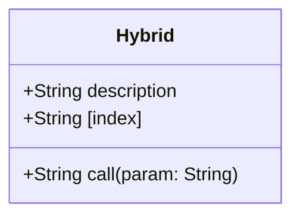

## 5.7 Hybrid Types

In the world of TypeScript, interfaces are a powerful tool that allow us to define the shape of objects. But what if we need an object that can also be called like a function? This is where hybrid types come into play. Hybrid types are advanced constructs that combine the capabilities of both objects and functions, providing a flexible way to define entities that can be both invoked and accessed like objects.

### Understanding Hybrid Types

Hybrid types are interfaces that can be both callable and indexable. This means that they can be used as functions and also have properties like objects. This dual nature makes them particularly useful in certain scenarios, such as creating libraries or APIs that need to offer both functionality and configuration options.

#### Callable and Indexable Signatures

To understand hybrid types, we need to first grasp the concepts of callable and indexable signatures:

- **Callable Signature**: This defines how a function can be called. It specifies the parameters the function takes and the type of value it returns.
- **Indexable Signature**: This defines how an object can be accessed using an index, such as a string or number. It specifies the type of the index and the type of the value returned.

### Defining Hybrid Interfaces

Let's start by defining a simple hybrid interface. Imagine we want to create a library that can be used both as a function and as an object with properties. Here's how we can define such an interface in TypeScript:

```typescript
interface Hybrid {
    (param: string): string; // Callable signature
    description: string;     // Property
    [index: number]: string; // Indexable signature
}

// Implementing the hybrid interface
const hybridExample: Hybrid = (param: string) => {
    return `Hello, ${param}`;
};

hybridExample.description = "This is a hybrid interface example.";
hybridExample[0] = "First element";

// Using the hybrid interface
console.log(hybridExample("World")); // Output: Hello, World
console.log(hybridExample.description); // Output: This is a hybrid interface example.
console.log(hybridExample[0]); // Output: First element
```

In this example, we define an interface `Hybrid` that can be called like a function, has a property `description`, and can be indexed with a number to return a string.

### Scenarios for Using Hybrid Types

Hybrid types are not something you'll use every day, but they are invaluable in certain situations. Here are some scenarios where hybrid types are particularly useful:

1. **Library Design**: Libraries like jQuery or Lodash often use hybrid types to provide both a callable function and a set of utility methods or properties.
2. **Configuration Objects**: Sometimes, you might want a configuration object that can also perform actions. Hybrid types can encapsulate both configuration and behavior.
3. **APIs**: When designing APIs, you might want to offer a function that also exposes metadata or additional methods.

### Declaring and Using Hybrid Types

When declaring hybrid types, it's important to clearly define both the callable and indexable signatures. This ensures that the hybrid type can be used correctly and predictably.

#### Example: A Simple Logger

Let's create a simple logger that can be called to log messages and also has properties for configuration:

```typescript
interface Logger {
    (message: string): void; // Callable signature
    level: string;           // Property
    [index: string]: any;    // Indexable signature for additional settings
}

// Implementing the logger
const logger: Logger = (message: string) => {
    console.log(`[${logger.level}] ${message}`);
};

logger.level = "INFO";
logger["output"] = "console";

// Using the logger
logger("This is a log message."); // Output: [INFO] This is a log message.
console.log(logger.level); // Output: INFO
console.log(logger["output"]); // Output: console
```

In this example, the `Logger` interface allows us to log messages while also providing a `level` property and an indexable signature for additional settings.

### Complexity and Best Practices

While hybrid types are powerful, they can also introduce complexity. It's important to use them judiciously and ensure that their dual nature is clear to other developers who might work with your code.

#### Best Practices for Hybrid Types

- **Clear Documentation**: Always document the intended use of the hybrid type, including its callable and indexable aspects.
- **Consistent Naming**: Use consistent naming conventions for properties and methods to avoid confusion.
- **Limit Complexity**: Avoid adding too many properties or methods to the hybrid type, as this can make it difficult to understand and maintain.
- **Test Thoroughly**: Ensure that both the callable and indexable aspects of the hybrid type are well-tested.

### Try It Yourself

Now that we've explored hybrid types, let's try modifying the logger example. Add a new property to the `Logger` interface for a timestamp format, and update the logger implementation to include a timestamp in the log messages.

### Visualizing Hybrid Types

To better understand hybrid types, let's visualize their structure using a diagram. This will help illustrate how callable and indexable signatures coexist within a single interface.



In this diagram, the `Hybrid` class represents a hybrid type with a callable method `call`, a property `description`, and an indexable signature `[index]`.

### Additional Resources

For more information on hybrid types and related concepts, consider exploring the following resources:

- [TypeScript Handbook: Interfaces](https://www.typescriptlang.org/docs/handbook/interfaces.html)
- [MDN Web Docs: JavaScript Functions](https://developer.mozilla.org/en-US/docs/Web/JavaScript/Guide/Functions)
- [W3Schools: JavaScript Objects](https://www.w3schools.com/js/js_objects.asp)

### Summary

Hybrid types in TypeScript offer a unique way to combine the functionality of functions and objects. By understanding how to define and use hybrid types, you can create more flexible and powerful code. Remember to use hybrid types thoughtfully, keeping complexity in check and ensuring that your code remains clear and maintainable.

## Quiz Time!



### What is a hybrid type in TypeScript?

- [x] An interface that acts as both a function and an object
- [ ] A type that combines multiple interfaces
- [ ] A type that only has callable signatures
- [ ] A type that only has indexable signatures

> **Explanation:** Hybrid types in TypeScript are interfaces that can act as both functions and objects, allowing them to be called like functions and accessed like objects.

### Which of the following is a callable signature in a hybrid type?

- [x] `(param: string): string;`
- [ ] `[index: number]: string;`
- [ ] `description: string;`
- [ ] `level: string;`

> **Explanation:** A callable signature defines how a function can be called, specifying the parameters and return type. `(param: string): string;` is an example of a callable signature.

### What is an indexable signature in a hybrid type?

- [x] It defines how an object can be accessed using an index.
- [ ] It defines how a function can be called.
- [ ] It specifies the return type of a function.
- [ ] It specifies the properties of an object.

> **Explanation:** An indexable signature defines how an object can be accessed using an index, such as a string or number, and specifies the type of the value returned.

### In which scenario might you use a hybrid type?

- [x] Designing a library like jQuery
- [ ] Creating a simple function
- [ ] Defining a basic object
- [ ] Writing a CSS stylesheet

> **Explanation:** Hybrid types are useful in scenarios like designing libraries (e.g., jQuery) where you need both callable functions and object properties.

### How can you define a property in a hybrid type interface?

- [x] `description: string;`
- [ ] `(param: string): string;`
- [ ] `[index: number]: string;`
- [ ] `function call(param: string): string;`

> **Explanation:** `description: string;` is an example of defining a property in a hybrid type interface.

### What should you consider when using hybrid types?

- [x] Complexity and maintainability
- [ ] Only the callable aspect
- [ ] Only the indexable aspect
- [ ] Ignoring documentation

> **Explanation:** When using hybrid types, it's important to consider complexity and maintainability to ensure the code remains clear and understandable.

### What is the purpose of the indexable signature `[index: string]: any;` in a hybrid type?

- [x] To allow dynamic property access using strings
- [ ] To define a function call
- [ ] To specify a return type
- [ ] To create a constant property

> **Explanation:** The indexable signature `[index: string]: any;` allows dynamic property access using strings, enabling flexible object-like behavior.

### Which of the following is a hybrid type example?

- [x] An interface with both callable and indexable signatures
- [ ] A class with only methods
- [ ] A function with no parameters
- [ ] An object with only properties

> **Explanation:** A hybrid type example is an interface with both callable and indexable signatures, allowing it to act as both a function and an object.

### What is a best practice when using hybrid types?

- [x] Clear documentation
- [ ] Ignoring complexity
- [ ] Adding many properties
- [ ] Avoiding testing

> **Explanation:** Clear documentation is a best practice when using hybrid types to ensure that their usage is well-understood by other developers.

### True or False: Hybrid types can only be used in TypeScript.

- [x] False
- [ ] True

> **Explanation:** While hybrid types are a feature of TypeScript, similar patterns can be achieved in JavaScript through careful design, though TypeScript provides more explicit support.


