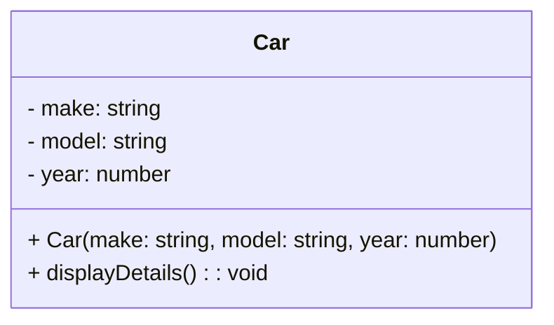

## 6.1 Introduction to Classes

In this section, we delve into the world of classes in TypeScript, a powerful feature that allows us to create objects and encapsulate data and behavior. Understanding classes is a fundamental step in mastering object-oriented programming (OOP) in TypeScript. Let's explore the syntax and structure of classes, how they compare to traditional OOP languages, and how they can be used to model real-world objects.

### What is a Class?

A class in TypeScript is a blueprint for creating objects. It defines properties and methods that the objects created from the class will have. Classes encapsulate data (properties) and behavior (methods) in a single unit, making it easier to manage and organize code.

### Basic Structure of a Class

Let's start by looking at the basic structure of a class in TypeScript:

```typescript
class Car {
    // Properties
    make: string;
    model: string;
    year: number;

    // Constructor
    constructor(make: string, model: string, year: number) {
        this.make = make;
        this.model = model;
        this.year = year;
    }

    // Method
    displayDetails(): void {
        console.log(`Car: ${this.make} ${this.model}, Year: ${this.year}`);
    }
}

// Creating an object of the Car class
const myCar = new Car('Toyota', 'Corolla', 2020);
myCar.displayDetails(); // Output: Car: Toyota Corolla, Year: 2020
```

#### Key Components of a Class

1. **Properties**: These are variables that hold data specific to the class. In the `Car` class, `make`, `model`, and `year` are properties.

2. **Constructor**: A special method used to initialize objects. It is called when an object is created from the class. The constructor in the `Car` class initializes the properties with values provided as arguments.

3. **Methods**: Functions defined inside a class that describe the behaviors of the objects. The `displayDetails` method in the `Car` class is an example of a method that prints the car's details.

### Encapsulation: Data and Behavior

Encapsulation is one of the core principles of OOP. It refers to the bundling of data (properties) and methods (behavior) that operate on the data into a single unit, or class. This helps in protecting the data from outside interference and misuse.

In our `Car` class example, encapsulation is demonstrated by having the properties and methods within the class. This makes it easy to manage the car's data and behavior in one place.

### Comparing TypeScript Classes with Traditional OOP Languages

TypeScript classes are similar to classes in traditional OOP languages like Java and C#. However, there are some differences:

- **Syntax**: TypeScript uses a syntax that is similar to JavaScript, making it more accessible to web developers familiar with JavaScript.
- **Type Annotations**: TypeScript allows type annotations, providing static typing which is not available in JavaScript.
- **Access Modifiers**: TypeScript supports access modifiers like `public`, `private`, and `protected`, which control the visibility of properties and methods.

Here's an example of using access modifiers in TypeScript:

```typescript
class BankAccount {
    private balance: number;

    constructor(initialBalance: number) {
        this.balance = initialBalance;
    }

    public deposit(amount: number): void {
        this.balance += amount;
    }

    public withdraw(amount: number): void {
        if (amount <= this.balance) {
            this.balance -= amount;
        } else {
            console.log('Insufficient funds');
        }
    }

    public getBalance(): number {
        return this.balance;
    }
}

const myAccount = new BankAccount(1000);
myAccount.deposit(500);
console.log(myAccount.getBalance()); // Output: 1500
myAccount.withdraw(2000); // Output: Insufficient funds
```

In this example, the `balance` property is private, meaning it cannot be accessed directly from outside the class. This is a key feature of encapsulation, ensuring that the balance can only be modified through the `deposit` and `withdraw` methods.

### Modeling Real-World Objects

Classes are a great way to model real-world objects in your code. When designing a class, think about the properties and behaviors that the object should have.

For example, consider a `Person` class:

```typescript
class Person {
    name: string;
    age: number;

    constructor(name: string, age: number) {
        this.name = name;
        this.age = age;
    }

    greet(): void {
        console.log(`Hello, my name is ${this.name} and I am ${this.age} years old.`);
    }
}

const person1 = new Person('Alice', 30);
person1.greet(); // Output: Hello, my name is Alice and I am 30 years old.
```

In this `Person` class, `name` and `age` are properties, and `greet` is a method that describes a behavior of the person.

### Try It Yourself

Experiment with the examples provided by modifying the properties and methods. For instance, add a new method to the `Car` class that calculates the age of the car based on the current year. This will help reinforce your understanding of classes and their structure.

### Visualizing Class Structure

To further aid your understanding, let's visualize the structure of a class using a diagram:



This diagram represents the `Car` class, showing its properties and methods. The `-` symbol indicates private members, while the `+` symbol indicates public members.

### Summary

In this section, we've explored the basics of classes in TypeScript, including their syntax and structure. We've seen how classes encapsulate data and behavior, making it easier to manage code. By comparing TypeScript classes with those in traditional OOP languages, we highlighted the unique features TypeScript offers, such as type annotations and access modifiers. Finally, we encouraged you to think of real-world objects as classes, providing a solid foundation for modeling complex systems.

### Key Takeaways

- A class is a blueprint for creating objects, encapsulating data and behavior.
- TypeScript classes support type annotations and access modifiers for better code organization and safety.
- Encapsulation helps protect data and manage complexity by bundling properties and methods.
- Classes can model real-world objects, making code more intuitive and maintainable.

## Quiz Time!



### What is a class in TypeScript?

- [x] A blueprint for creating objects
- [ ] A function that returns an object
- [ ] A method that encapsulates data
- [ ] A variable that holds data

> **Explanation:** A class is a blueprint for creating objects, defining their properties and methods.

### What is the purpose of a constructor in a class?

- [x] To initialize objects
- [ ] To define methods
- [ ] To encapsulate data
- [ ] To create variables

> **Explanation:** A constructor is a special method used to initialize objects when they are created.

### Which access modifier restricts access to class members from outside the class?

- [x] private
- [ ] public
- [ ] protected
- [ ] internal

> **Explanation:** The `private` access modifier restricts access to class members from outside the class.

### What does encapsulation in OOP refer to?

- [x] Bundling data and methods into a single unit
- [ ] Creating multiple objects from a class
- [ ] Defining methods for a class
- [ ] Using access modifiers

> **Explanation:** Encapsulation refers to bundling data and methods into a single unit, or class.

### How do you create an object from a class in TypeScript?

- [x] Using the `new` keyword
- [ ] Using the `create` method
- [ ] Using the `object` keyword
- [ ] Using the `instance` keyword

> **Explanation:** You create an object from a class using the `new` keyword.

### Which of the following is a method in the `Car` class example?

- [x] displayDetails()
- [ ] make
- [ ] model
- [ ] year

> **Explanation:** `displayDetails()` is a method in the `Car` class example.

### What is the output of `myCar.displayDetails()` in the `Car` class example?

- [x] Car: Toyota Corolla, Year: 2020
- [ ] Car: Toyota, Year: 2020
- [ ] Car: Corolla, Year: 2020
- [ ] Car: Toyota Corolla

> **Explanation:** The `displayDetails()` method outputs the make, model, and year of the car.

### What does the `public` access modifier do?

- [x] Allows access to class members from outside the class
- [ ] Restricts access to class members
- [ ] Makes class members read-only
- [ ] Hides class members from subclasses

> **Explanation:** The `public` access modifier allows access to class members from outside the class.

### In the `BankAccount` class example, what happens if you try to withdraw more than the balance?

- [x] Outputs "Insufficient funds"
- [ ] Throws an error
- [ ] Withdraws the available balance
- [ ] Does nothing

> **Explanation:** The `withdraw` method checks if the amount is less than or equal to the balance and outputs "Insufficient funds" if not.

### True or False: TypeScript classes can have type annotations for properties.

- [x] True
- [ ] False

> **Explanation:** TypeScript allows type annotations for properties, providing static typing.


