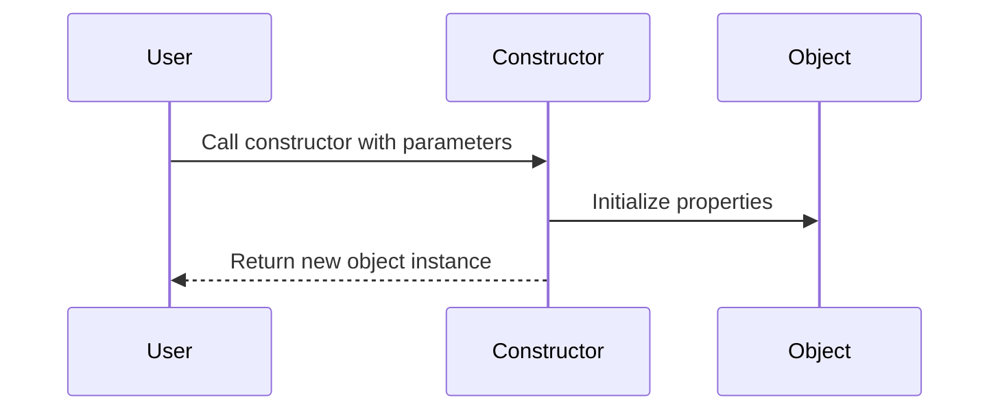

## 6.2 Constructors and Initialization

In this section, we will explore the concept of constructors in TypeScript classes. Constructors play a pivotal role in object-oriented programming by allowing us to initialize class instances and set up their initial state. Let's dive into how constructors work, how to define them with parameters, and best practices to keep them simple and effective.

### Understanding Constructors

A constructor is a special method in a class that is automatically called when an instance of the class is created. It is used to initialize the properties of the class and set up any necessary initial state. In TypeScript, the constructor is defined using the `constructor` keyword.

#### The Role of Constructors

- **Initialization**: Constructors are primarily used to initialize the properties of a class. When you create a new object, the constructor sets up the initial values for the object's properties.
- **Dependency Injection**: Constructors can take parameters, allowing you to inject dependencies or configuration values into the object at the time of creation.
- **Enforcing Invariants**: Constructors can enforce certain conditions or invariants that must be true for the object to be in a valid state.

### Defining Constructors with Parameters

In TypeScript, you can define constructors with parameters to pass values during object creation. These parameters can then be used to initialize the class properties.

```typescript
class Car {
  brand: string;
  model: string;
  year: number;

  // Constructor with parameters
  constructor(brand: string, model: string, year: number) {
    this.brand = brand;
    this.model = model;
    this.year = year;
  }
}

// Creating an instance of the Car class
const myCar = new Car("Toyota", "Corolla", 2020);

console.log(myCar.brand); // Output: Toyota
console.log(myCar.model); // Output: Corolla
console.log(myCar.year);  // Output: 2020
```

In this example, the `Car` class has a constructor that takes three parameters: `brand`, `model`, and `year`. These parameters are used to initialize the corresponding properties of the class.

### Initializing Class Properties

When you define a class in TypeScript, you can declare properties and initialize them within the constructor. This ensures that every instance of the class starts with a well-defined state.

#### Example: Initializing Properties

```typescript
class Book {
  title: string;
  author: string;
  pages: number;

  constructor(title: string, author: string, pages: number) {
    this.title = title;
    this.author = author;
    this.pages = pages;
  }

  describe(): string {
    return `${this.title} by ${this.author}, ${this.pages} pages.`;
  }
}

const myBook = new Book("The TypeScript Handbook", "John Doe", 350);
console.log(myBook.describe()); // Output: The TypeScript Handbook by John Doe, 350 pages.
```

In this example, the `Book` class has a constructor that initializes the `title`, `author`, and `pages` properties. The `describe` method returns a string describing the book.

### Default Parameters in Constructors

TypeScript allows you to define default values for constructor parameters. This is useful when you want to provide default values for certain properties while still allowing them to be overridden.

#### Example: Default Parameters

```typescript
class Rectangle {
  width: number;
  height: number;

  constructor(width: number = 1, height: number = 1) {
    this.width = width;
    this.height = height;
  }

  area(): number {
    return this.width * this.height;
  }
}

const defaultRectangle = new Rectangle();
console.log(defaultRectangle.area()); // Output: 1

const customRectangle = new Rectangle(5, 10);
console.log(customRectangle.area()); // Output: 50
```

In this example, the `Rectangle` class has a constructor with default parameters for `width` and `height`. If no arguments are provided, the default values of `1` are used.

### Overloading Constructors

TypeScript does not support multiple constructors directly, but you can achieve similar functionality by using optional parameters or union types.

#### Example: Simulating Constructor Overloading

```typescript
class Point {
  x: number;
  y: number;

  constructor(x: number, y?: number) {
    this.x = x;
    this.y = y !== undefined ? y : x; // If y is not provided, use x
  }

  display(): string {
    return `Point(${this.x}, ${this.y})`;
  }
}

const point1 = new Point(5);
console.log(point1.display()); // Output: Point(5, 5)

const point2 = new Point(5, 10);
console.log(point2.display()); // Output: Point(5, 10)
```

In this example, the `Point` class simulates constructor overloading by using an optional parameter `y`. If `y` is not provided, it defaults to the value of `x`.

### Best Practices for Constructors

When designing constructors, it's important to follow some best practices to ensure they remain simple and effective:

- **Keep Constructors Simple**: Avoid complex logic in constructors. They should primarily focus on initializing the object's properties.
- **Use Parameters Wisely**: Limit the number of parameters in constructors. If a class requires many parameters, consider using a configuration object.
- **Avoid Side Effects**: Constructors should not perform actions with side effects, such as making network requests or modifying global state.
- **Ensure Valid State**: Use constructors to ensure that the object is in a valid state after creation. Validate input parameters if necessary.

### Visualizing Constructor Initialization

To better understand how constructors work, let's visualize the process of creating an object and initializing its properties.



In this sequence diagram, the user calls the constructor with parameters. The constructor initializes the object's properties and returns the new object instance.

### Try It Yourself

Now that we've covered the basics of constructors, try experimenting with the following exercises:

1. **Create a `Person` class** with properties `name`, `age`, and `gender`. Initialize these properties using a constructor.
2. **Add a method** to the `Person` class that returns a string describing the person.
3. **Use default parameters** in the constructor to provide default values for `age` and `gender`.
4. **Simulate constructor overloading** by allowing the constructor to accept either a single string (name) or a full set of parameters (name, age, gender).

### Summary

In this section, we've explored the concept of constructors in TypeScript classes. We've learned how to define constructors with parameters, initialize class properties, and use default parameters. We've also discussed best practices for keeping constructors simple and effective. By understanding constructors, you can create well-defined and properly initialized objects in your TypeScript applications.

## Quiz Time!



### What is the primary role of a constructor in a TypeScript class?

- [x] To initialize the properties of the class
- [ ] To define methods for the class
- [ ] To handle errors in the class
- [ ] To manage memory allocation for the class

> **Explanation:** The primary role of a constructor is to initialize the properties of the class when an instance is created.

### How can you define default values for constructor parameters in TypeScript?

- [x] By assigning default values in the parameter list
- [ ] By using a separate method to set defaults
- [ ] By using a configuration file
- [ ] By defining a separate constructor for defaults

> **Explanation:** Default values for constructor parameters can be defined directly in the parameter list.

### What is a best practice when designing constructors?

- [x] Keep constructors simple and avoid complex logic
- [ ] Include as many parameters as possible
- [ ] Perform network requests in the constructor
- [ ] Modify global state in the constructor

> **Explanation:** Constructors should be kept simple and focus on initializing the object's properties without complex logic.

### How can you simulate constructor overloading in TypeScript?

- [x] By using optional parameters or union types
- [ ] By defining multiple constructors
- [ ] By using a separate class for each constructor
- [ ] By using inheritance

> **Explanation:** Constructor overloading can be simulated using optional parameters or union types.

### What should constructors avoid to ensure they are effective?

- [x] Side effects such as modifying global state
- [ ] Initializing properties
- [ ] Taking parameters
- [ ] Returning an object instance

> **Explanation:** Constructors should avoid side effects like modifying global state to remain effective.

### Which keyword is used to define a constructor in TypeScript?

- [x] constructor
- [ ] init
- [ ] create
- [ ] build

> **Explanation:** The `constructor` keyword is used to define a constructor in TypeScript.

### What happens if you don't define a constructor in a TypeScript class?

- [x] A default constructor is provided by TypeScript
- [ ] The class cannot be instantiated
- [ ] The class will throw an error
- [ ] The class will not have any properties

> **Explanation:** If no constructor is defined, TypeScript provides a default constructor.

### What is the purpose of using parameters in a constructor?

- [x] To pass values for initializing class properties
- [ ] To define methods for the class
- [ ] To handle exceptions in the class
- [ ] To manage memory for the class

> **Explanation:** Parameters in a constructor are used to pass values for initializing class properties.

### How can you ensure an object is in a valid state after creation?

- [x] By validating input parameters in the constructor
- [ ] By using a separate validation method
- [ ] By relying on external libraries
- [ ] By using global variables

> **Explanation:** Validating input parameters in the constructor ensures the object is in a valid state after creation.

### True or False: Constructors in TypeScript can perform actions with side effects.

- [ ] True
- [x] False

> **Explanation:** Constructors should avoid performing actions with side effects to maintain simplicity and predictability.



By understanding and applying these concepts, you'll be well-equipped to use constructors effectively in your TypeScript projects. Happy coding!
