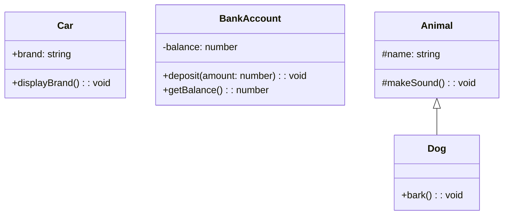

## 6.3 Public, Private, and Protected Modifiers

In the world of programming, especially in object-oriented programming (OOP), controlling access to the internal state of objects is crucial. This is where access modifiers come into play. In TypeScript, we have three primary access modifiers: `public`, `private`, and `protected`. These modifiers help us define the accessibility of class members (properties and methods) and enforce encapsulation—a core principle of OOP.

### Understanding Access Modifiers

#### Public Modifier

The `public` modifier is the default access level for class members in TypeScript. When a member is marked as `public`, it can be accessed from anywhere: inside the class, outside the class, and even from subclasses.

```typescript
class Car {
  public brand: string;

  constructor(brand: string) {
    this.brand = brand;
  }

  public displayBrand(): void {
    console.log(`The car brand is ${this.brand}.`);
  }
}

const myCar = new Car("Toyota");
myCar.displayBrand(); // Output: The car brand is Toyota.
console.log(myCar.brand); // Output: Toyota
```

In this example, both the `brand` property and the `displayBrand` method are accessible from outside the `Car` class.

#### Private Modifier

The `private` modifier restricts access to the class member such that it can only be accessed within the class itself. This is useful for hiding the internal implementation details and protecting the integrity of the data.

```typescript
class BankAccount {
  private balance: number;

  constructor(initialBalance: number) {
    this.balance = initialBalance;
  }

  public deposit(amount: number): void {
    this.balance += amount;
  }

  public getBalance(): number {
    return this.balance;
  }
}

const myAccount = new BankAccount(1000);
myAccount.deposit(500);
console.log(myAccount.getBalance()); // Output: 1500
// console.log(myAccount.balance); // Error: Property 'balance' is private and only accessible within class 'BankAccount'.
```

Here, the `balance` property is private, ensuring that it cannot be accessed directly from outside the `BankAccount` class. Instead, we use the `getBalance` method to retrieve its value.

#### Protected Modifier

The `protected` modifier is similar to `private`, but it allows access to the member within the class and its subclasses. This is particularly useful when you want to allow subclasses to access certain properties or methods while keeping them hidden from the outside world.

```typescript
class Animal {
  protected name: string;

  constructor(name: string) {
    this.name = name;
  }

  protected makeSound(): void {
    console.log(`${this.name} makes a sound.`);
  }
}

class Dog extends Animal {
  public bark(): void {
    console.log(`${this.name} barks.`);
    this.makeSound();
  }
}

const myDog = new Dog("Buddy");
myDog.bark(); // Output: Buddy barks. Buddy makes a sound.
// console.log(myDog.name); // Error: Property 'name' is protected and only accessible within class 'Animal' and its subclasses.
```

In this example, the `name` property and `makeSound` method are protected, allowing the `Dog` class to access them, but they remain inaccessible from outside the class hierarchy.

### The Importance of Encapsulation

Encapsulation is a fundamental concept in OOP that involves bundling the data (properties) and the methods that operate on the data into a single unit, or class. By using access modifiers, we can control how the data is accessed and modified, which leads to several benefits:

- **Data Integrity**: By restricting access to certain class members, we can prevent unauthorized or unintended modifications, ensuring that the data remains consistent and valid.
- **Abstraction**: Encapsulation allows us to hide the complex implementation details and expose only the necessary parts of the class, making it easier to understand and use.
- **Flexibility and Maintainability**: With encapsulation, we can change the internal implementation of a class without affecting the code that uses it, as long as the public interface remains the same.

### TypeScript's Enforcement at Compile Time

One of the advantages of using TypeScript is its ability to enforce access levels at compile time. This means that if you try to access a private or protected member from outside its allowed scope, TypeScript will throw a compile-time error, preventing potential runtime errors and bugs.

```typescript
class Example {
  private secret: string = "hidden";

  public revealSecret(): string {
    return this.secret;
  }
}

const example = new Example();
// console.log(example.secret); // Error: Property 'secret' is private and only accessible within class 'Example'.
console.log(example.revealSecret()); // Output: hidden
```

In this code, attempting to access the `secret` property directly results in a compile-time error, ensuring that the encapsulation is respected.

### Exercises: Experimenting with Access Modifiers

Let's put our understanding of access modifiers into practice. Try modifying the access levels of class members in the following exercises and observe the outcomes.

#### Exercise 1: Changing Access Levels

1. Create a class `Person` with a private property `age` and a public method `getAge`.
2. Attempt to access the `age` property directly from an instance of `Person`.
3. Change the `age` property to protected and create a subclass `Employee` that accesses `age`.
4. Finally, make `age` public and observe the changes.

```typescript
class Person {
  private age: number;

  constructor(age: number) {
    this.age = age;
  }

  public getAge(): number {
    return this.age;
  }
}

// Step 2
const person = new Person(30);
// console.log(person.age); // Error: Property 'age' is private and only accessible within class 'Person'.

// Step 3
class Employee extends Person {
  public displayAge(): void {
    console.log(`Employee age is ${this.getAge()}.`);
  }
}

const employee = new Employee(25);
employee.displayAge(); // Output: Employee age is 25.

// Step 4
class PublicPerson {
  public age: number;

  constructor(age: number) {
    this.age = age;
  }
}

const publicPerson = new PublicPerson(40);
console.log(publicPerson.age); // Output: 40
```

#### Exercise 2: Implementing Encapsulation

1. Create a class `Library` with a private array `books` and methods to `addBook` and `listBooks`.
2. Ensure that books can only be added through the `addBook` method.
3. Test the encapsulation by attempting to modify the `books` array directly.

```typescript
class Library {
  private books: string[] = [];

  public addBook(book: string): void {
    this.books.push(book);
  }

  public listBooks(): void {
    console.log("Books in the library:", this.books.join(", "));
  }
}

const myLibrary = new Library();
myLibrary.addBook("The Great Gatsby");
myLibrary.addBook("1984");
myLibrary.listBooks(); // Output: Books in the library: The Great Gatsby, 1984

// Attempt to modify books directly
// myLibrary.books.push("Moby Dick"); // Error: Property 'books' is private and only accessible within class 'Library'.
```

### Try It Yourself

Now it's your turn! Modify the code examples above by changing the access modifiers and observe how the accessibility of class members changes. Experiment with creating subclasses and see how protected members behave differently from private ones.

### Visualizing Access Modifiers

To better understand how access modifiers work, let's visualize the accessibility of class members using a simple diagram.



In this diagram:
- `Car` has a public property and method, accessible from anywhere.
- `BankAccount` has a private property, accessible only within the class.
- `Animal` has a protected property and method, accessible within the class and its subclass `Dog`.

### Key Takeaways

- **Public Modifier**: Allows access from anywhere. It's the default modifier.
- **Private Modifier**: Restricts access to within the class only. Useful for hiding internal details.
- **Protected Modifier**: Allows access within the class and its subclasses. Useful for inheritance scenarios.
- **Encapsulation**: Helps in maintaining data integrity, abstraction, and flexibility.
- **TypeScript Enforcement**: Provides compile-time checks to ensure access levels are respected.

By understanding and utilizing access modifiers, we can write more robust, maintainable, and secure TypeScript code.

## Quiz Time!



### What is the default access modifier in TypeScript?

- [x] public
- [ ] private
- [ ] protected
- [ ] none

> **Explanation:** In TypeScript, the default access modifier is `public`, meaning class members are accessible from anywhere unless specified otherwise.

### Which access modifier allows access only within the class itself?

- [ ] public
- [x] private
- [ ] protected
- [ ] internal

> **Explanation:** The `private` modifier restricts access to the class member such that it can only be accessed within the class itself.

### Which access modifier allows access within the class and its subclasses?

- [ ] public
- [ ] private
- [x] protected
- [ ] internal

> **Explanation:** The `protected` modifier allows access to class members within the class and its subclasses.

### What is the main benefit of encapsulation?

- [x] Data integrity and protection
- [ ] Faster code execution
- [ ] More lines of code
- [ ] Less memory usage

> **Explanation:** Encapsulation helps maintain data integrity and protection by controlling access to class members.

### How does TypeScript enforce access modifiers?

- [x] At compile time
- [ ] At runtime
- [ ] During deployment
- [ ] Through a linter

> **Explanation:** TypeScript enforces access modifiers at compile time, providing errors if access levels are violated.

### Which of the following is NOT a benefit of using access modifiers?

- [ ] Data integrity
- [ ] Abstraction
- [ ] Flexibility
- [x] Increased code complexity

> **Explanation:** Access modifiers help reduce complexity by providing clear boundaries for accessing class members.

### Can a private member be accessed by a subclass?

- [ ] Yes
- [x] No
- [ ] Only if it's a method
- [ ] Only if it's a property

> **Explanation:** A private member cannot be accessed by a subclass; it is only accessible within the class where it is defined.

### What happens if you try to access a private member from outside its class?

- [ ] It works fine
- [x] Compile-time error
- [ ] Runtime error
- [ ] It logs a warning

> **Explanation:** Accessing a private member from outside its class results in a compile-time error in TypeScript.

### Which modifier would you use to allow a subclass to access a member but not the outside world?

- [ ] public
- [ ] private
- [x] protected
- [ ] internal

> **Explanation:** The `protected` modifier allows subclasses to access a member while keeping it hidden from the outside world.

### True or False: A public member can be accessed from anywhere, including outside the class.

- [x] True
- [ ] False

> **Explanation:** A public member is accessible from anywhere, including outside the class, as it is the default access level in TypeScript.


