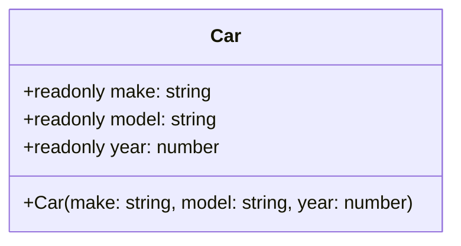

## 6.4 Readonly Properties

In this section, we will explore the concept of readonly properties in TypeScript classes. Readonly properties are a powerful feature that allows developers to define properties that cannot be modified after they have been initialized. This immutability can help prevent accidental changes to critical data and make your code more robust and predictable.

### Understanding the `readonly` Keyword

The `readonly` keyword in TypeScript is used to create properties within a class that cannot be reassigned after their initial assignment. This is particularly useful when you want to ensure that certain properties remain constant throughout the lifecycle of an object.

#### Basic Syntax

To declare a readonly property, simply prefix the property name with the `readonly` keyword. Here's a simple example:

```typescript
class Car {
  readonly make: string;
  readonly model: string;
  readonly year: number;

  constructor(make: string, model: string, year: number) {
    this.make = make;
    this.model = model;
    this.year = year;
  }
}

const myCar = new Car('Toyota', 'Corolla', 2020);
console.log(myCar.make); // Output: Toyota

// Attempting to modify a readonly property will result in an error
// myCar.make = 'Honda'; // Error: Cannot assign to 'make' because it is a read-only property.
```

In this example, the properties `make`, `model`, and `year` are marked as `readonly`, meaning they can only be set once, typically in the constructor.

### Readonly Properties vs. `const`

It's important to understand the difference between `readonly` and `const`. While both are used to enforce immutability, they are applied in different contexts:

- **`const`**: Used for variables whose values cannot be reassigned. It is used at the variable level and is not applicable to class properties.
  
  ```typescript
  const pi = 3.14;
  // pi = 3.14159; // Error: Cannot assign to 'pi' because it is a constant.
  ```

- **`readonly`**: Used for class properties that should not be reassigned after initialization. It allows for the initialization of properties within the constructor.

### Setting Readonly Properties via Constructor

Readonly properties are typically initialized in the constructor of a class. This allows you to set their values when creating an instance of the class, ensuring that they remain immutable thereafter.

Here's an example demonstrating how to set readonly properties through a constructor:

```typescript
class Book {
  readonly title: string;
  readonly author: string;

  constructor(title: string, author: string) {
    this.title = title;
    this.author = author;
  }
}

const myBook = new Book('1984', 'George Orwell');
console.log(myBook.title); // Output: 1984

// myBook.title = 'Animal Farm'; // Error: Cannot assign to 'title' because it is a read-only property.
```

In this example, the `title` and `author` properties are initialized in the constructor and cannot be changed afterward.

### Use Cases for Readonly Properties

Readonly properties are particularly useful in scenarios where immutability is desired. Here are some common use cases:

1. **Constants**: Use readonly properties to define constant values that should not change, such as configuration settings or fixed data.

2. **Immutable Data Structures**: When creating data structures that should not be altered after creation, readonly properties ensure that the data remains consistent.

3. **Preventing Accidental Changes**: By marking properties as readonly, you can prevent accidental modifications that could lead to bugs or inconsistent state.

4. **Enhancing Code Predictability**: Immutability can make your code more predictable and easier to reason about, as you can be confident that certain values will not change unexpectedly.

### Encouraging Immutability

Immutability is a key principle in functional programming and can lead to more reliable and maintainable code. By using readonly properties, you can enforce immutability in your classes and take advantage of its benefits.

#### Example: Immutable Configuration Object

Let's create a configuration object that uses readonly properties to ensure its values remain constant:

```typescript
class AppConfig {
  readonly apiUrl: string;
  readonly maxRetries: number;

  constructor(apiUrl: string, maxRetries: number) {
    this.apiUrl = apiUrl;
    this.maxRetries = maxRetries;
  }
}

const config = new AppConfig('https://api.example.com', 3);
console.log(config.apiUrl); // Output: https://api.example.com

// config.apiUrl = 'https://api.newexample.com'; // Error: Cannot assign to 'apiUrl' because it is a read-only property.
```

In this example, the `AppConfig` class defines an immutable configuration object with `apiUrl` and `maxRetries` as readonly properties.

### Try It Yourself

To reinforce your understanding of readonly properties, try modifying the examples above. Experiment with adding new readonly properties or attempting to change their values after initialization. Observe the errors that TypeScript provides and consider how readonly properties can enhance the reliability of your code.

### Visualizing Readonly Properties

To better understand how readonly properties work within a class, let's visualize the flow of data using a simple diagram.



In this diagram, the `Car` class is shown with its readonly properties. The `+` symbol indicates that these properties are public and accessible from outside the class, but they cannot be modified after the object is created.

### Summary

Readonly properties in TypeScript provide a powerful way to enforce immutability within your classes. By using the `readonly` keyword, you can ensure that certain properties remain constant after initialization, preventing accidental changes and enhancing the predictability of your code.

**Key Takeaways:**

- Use the `readonly` keyword to define immutable properties in a class.
- Readonly properties can be initialized in the constructor but cannot be reassigned afterward.
- Understand the difference between `readonly` and `const`.
- Leverage readonly properties for constants, immutable data structures, and to prevent accidental changes.
- Encourage immutability to make your code more reliable and maintainable.

### Further Reading

For more information on readonly properties and immutability in TypeScript, consider exploring the following resources:

- [TypeScript Handbook: Classes](https://www.typescriptlang.org/docs/handbook/classes.html)
- [MDN Web Docs: Immutability](https://developer.mozilla.org/en-US/docs/Glossary/Immutable)
- [TypeScript Deep Dive: Readonly](https://basarat.gitbook.io/typescript/type-system/readonly)

## Quiz Time!



### What is the purpose of the `readonly` keyword in TypeScript?

- [x] To create properties that cannot be modified after initialization.
- [ ] To create variables that cannot be reassigned.
- [ ] To define private properties in a class.
- [ ] To enforce type safety in function parameters.

> **Explanation:** The `readonly` keyword is used to define properties in a class that cannot be modified after they have been initialized.

### How are readonly properties typically initialized in a TypeScript class?

- [x] Via the constructor.
- [ ] Using a setter method.
- [ ] Directly within the class body.
- [ ] Through a static method.

> **Explanation:** Readonly properties are usually initialized in the constructor of a class, allowing them to be set once when an object is created.

### What is the main difference between `readonly` and `const` in TypeScript?

- [x] `readonly` is used for class properties, while `const` is used for variables.
- [ ] `readonly` is used for variables, while `const` is used for class properties.
- [ ] `readonly` allows reassignment, while `const` does not.
- [ ] `readonly` is used for private properties, while `const` is for public properties.

> **Explanation:** `readonly` is used to define immutable properties in a class, whereas `const` is used for variables that cannot be reassigned.

### Which of the following is a valid use case for readonly properties?

- [x] Defining constants within a class.
- [ ] Creating mutable data structures.
- [ ] Implementing dynamic configurations.
- [ ] Allowing property reassignment.

> **Explanation:** Readonly properties are ideal for defining constants within a class, ensuring that their values remain unchanged.

### Can readonly properties be modified after they are initialized?

- [ ] Yes, they can be modified.
- [x] No, they cannot be modified.
- [ ] Yes, but only within the class.
- [ ] No, but they can be reassigned using a setter.

> **Explanation:** Once initialized, readonly properties cannot be modified, ensuring their immutability.

### What happens if you try to reassign a readonly property in TypeScript?

- [x] A compile-time error occurs.
- [ ] The reassignment is ignored.
- [ ] The property is reassigned without error.
- [ ] A runtime error occurs.

> **Explanation:** Attempting to reassign a readonly property results in a compile-time error, preventing the code from compiling.

### In which scenarios is immutability particularly beneficial?

- [x] When working with configuration data.
- [x] When creating constants.
- [ ] When implementing dynamic features.
- [ ] When handling mutable state.

> **Explanation:** Immutability is beneficial for configuration data and constants, where values should remain unchanged.

### How can readonly properties enhance code predictability?

- [x] By ensuring certain values do not change unexpectedly.
- [ ] By allowing dynamic property reassignment.
- [ ] By enabling mutable data structures.
- [ ] By enforcing private access to properties.

> **Explanation:** Readonly properties enhance code predictability by ensuring that certain values remain constant, reducing the likelihood of unexpected changes.

### Which keyword is used to define variables that cannot be reassigned?

- [ ] readonly
- [x] const
- [ ] var
- [ ] let

> **Explanation:** The `const` keyword is used to define variables that cannot be reassigned.

### True or False: Readonly properties can be reassigned within a class method.

- [ ] True
- [x] False

> **Explanation:** Readonly properties cannot be reassigned within a class method or anywhere else after their initial assignment.


