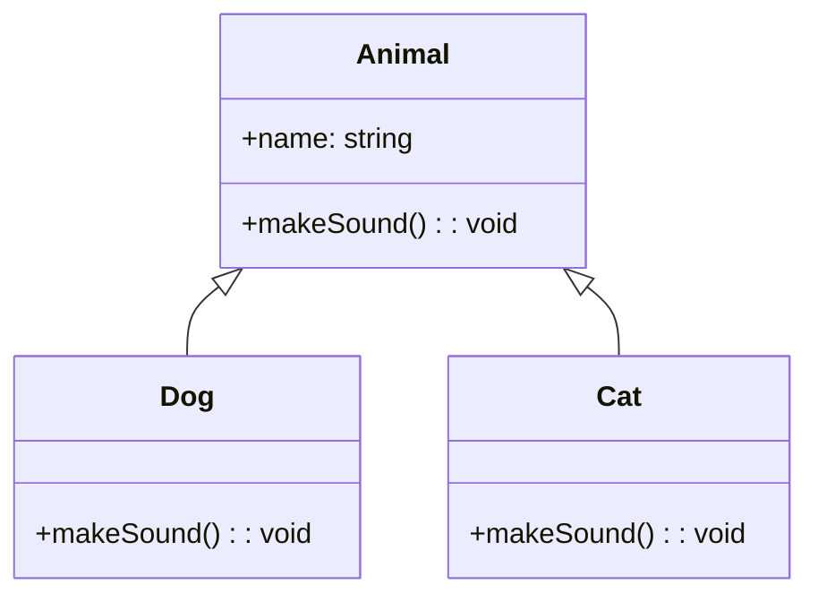

## 6.5 Inheritance and Derived Classes

In this section, we'll delve into the concept of inheritance in TypeScript, a fundamental principle of object-oriented programming (OOP). Inheritance allows us to create new classes based on existing ones, promoting code reuse and a more organized code structure. We'll explore how to use the `extends` keyword to create subclasses, understand how derived classes inherit and override properties and methods, and discuss the role of polymorphism in OOP.

### Understanding Inheritance

Inheritance is a mechanism that allows one class (the derived class) to inherit properties and methods from another class (the base class). This enables us to create a hierarchy of classes that share common functionality, reducing code duplication and enhancing maintainability.

#### The `extends` Keyword

In TypeScript, we use the `extends` keyword to create a derived class from a base class. The derived class inherits all the properties and methods of the base class, allowing us to build upon existing functionality.

### Example: Base Class and Derived Class

Let's start with a simple example to illustrate how inheritance works in TypeScript.

```typescript
// Base class
class Animal {
    name: string;

    constructor(name: string) {
        this.name = name;
    }

    makeSound(): void {
        console.log("Some generic animal sound");
    }
}

// Derived class
class Dog extends Animal {
    constructor(name: string) {
        super(name); // Call the constructor of the base class
    }

    makeSound(): void {
        console.log("Bark!");
    }
}

const dog = new Dog("Buddy");
dog.makeSound(); // Output: Bark!
```

In this example, we have a base class `Animal` with a property `name` and a method `makeSound()`. The `Dog` class extends `Animal`, inheriting its properties and methods. The `Dog` class overrides the `makeSound()` method to provide a specific implementation.

### Inheriting and Overriding Properties and Methods

When a derived class inherits from a base class, it gains access to all the public and protected properties and methods of the base class. The derived class can also override methods to provide its own implementation.

#### Overriding Methods

Overriding allows a derived class to provide a specific implementation of a method that is already defined in its base class. This is useful when the derived class needs to alter or extend the behavior of the base class method.

```typescript
class Cat extends Animal {
    constructor(name: string) {
        super(name);
    }

    makeSound(): void {
        console.log("Meow!");
    }
}

const cat = new Cat("Whiskers");
cat.makeSound(); // Output: Meow!
```

Here, the `Cat` class overrides the `makeSound()` method to produce a "Meow!" sound, demonstrating how derived classes can customize inherited methods.

### Polymorphism in OOP

Polymorphism is a core concept in OOP that allows objects of different classes to be treated as objects of a common superclass. It enables us to write more flexible and reusable code.

#### Example of Polymorphism

Let's see how polymorphism works with our `Animal` example.

```typescript
function makeAnimalSound(animal: Animal): void {
    animal.makeSound();
}

const animals: Animal[] = [new Dog("Buddy"), new Cat("Whiskers")];

animals.forEach(makeAnimalSound);
// Output:
// Bark!
// Meow!
```

In this example, the `makeAnimalSound` function accepts an `Animal` type, allowing us to pass any object that is an instance of `Animal` or its derived classes. This demonstrates polymorphism, where the actual method that gets called depends on the object's runtime type.

### Class Hierarchies

To better understand the relationship between base and derived classes, let's visualize the class hierarchy using a diagram.



In this diagram, `Animal` is the base class, and `Dog` and `Cat` are derived classes. The arrows indicate the inheritance relationship.

### Practical Example: Vehicle Hierarchy

Let's consider a more practical example involving a vehicle hierarchy.

```typescript
// Base class
class Vehicle {
    brand: string;
    model: string;

    constructor(brand: string, model: string) {
        this.brand = brand;
        this.model = model;
    }

    startEngine(): void {
        console.log("Engine started");
    }
}

// Derived class
class Car extends Vehicle {
    numberOfDoors: number;

    constructor(brand: string, model: string, numberOfDoors: number) {
        super(brand, model);
        this.numberOfDoors = numberOfDoors;
    }

    startEngine(): void {
        console.log("Car engine started");
    }
}

const myCar = new Car("Toyota", "Corolla", 4);
myCar.startEngine(); // Output: Car engine started
```

In this example, `Vehicle` is the base class with properties `brand` and `model`, and a method `startEngine()`. The `Car` class extends `Vehicle`, adding a new property `numberOfDoors` and overriding the `startEngine()` method.

### Try It Yourself

To reinforce your understanding, try modifying the code examples:

1. Add a new derived class `Truck` that extends `Vehicle` and includes a property `cargoCapacity`.
2. Override the `startEngine()` method in `Truck` to print a different message.
3. Create instances of `Car` and `Truck`, and call their `startEngine()` methods.

### Key Takeaways

- **Inheritance** allows us to create new classes based on existing ones, promoting code reuse.
- The **`extends` keyword** is used to create a derived class from a base class.
- Derived classes **inherit** properties and methods from the base class and can **override** them.
- **Polymorphism** enables objects of different classes to be treated as objects of a common superclass, allowing for flexible and reusable code.

### Further Reading

- [MDN Web Docs: Inheritance and the prototype chain](https://developer.mozilla.org/en-US/docs/Web/JavaScript/Inheritance_and_the_prototype_chain)
- [TypeScript Handbook: Classes](https://www.typescriptlang.org/docs/handbook/classes.html)

## Quiz Time!



### What keyword is used in TypeScript to create a derived class?

- [x] extends
- [ ] implements
- [ ] inherits
- [ ] derives

> **Explanation:** The `extends` keyword is used to create a derived class from a base class in TypeScript.

### What is the purpose of the `super` keyword in a derived class constructor?

- [x] To call the constructor of the base class
- [ ] To override a method
- [ ] To access a private property
- [ ] To define a new method

> **Explanation:** The `super` keyword is used in a derived class constructor to call the constructor of the base class.

### What is polymorphism in object-oriented programming?

- [x] The ability to treat objects of different classes as objects of a common superclass
- [ ] The ability to create new classes from existing ones
- [ ] The ability to override methods
- [ ] The ability to define private properties

> **Explanation:** Polymorphism allows objects of different classes to be treated as objects of a common superclass, enabling flexible and reusable code.

### Which method is overridden in the `Dog` class in the example provided?

- [x] makeSound()
- [ ] startEngine()
- [ ] constructor()
- [ ] bark()

> **Explanation:** The `makeSound()` method is overridden in the `Dog` class to provide a specific implementation.

### In the vehicle hierarchy example, what new property is added to the `Car` class?

- [x] numberOfDoors
- [ ] cargoCapacity
- [ ] brand
- [ ] model

> **Explanation:** The `Car` class adds a new property `numberOfDoors` to the base `Vehicle` class.

### What is the output of `dog.makeSound()` in the provided example?

- [x] Bark!
- [ ] Meow!
- [ ] Some generic animal sound
- [ ] Woof!

> **Explanation:** The `Dog` class overrides the `makeSound()` method to print "Bark!".

### Which of the following is NOT a benefit of inheritance?

- [ ] Code reuse
- [ ] Organized code structure
- [x] Increased code duplication
- [ ] Enhanced maintainability

> **Explanation:** Inheritance reduces code duplication, as common functionality is shared through the base class.

### How do you call the base class constructor from a derived class?

- [x] Using the `super` keyword
- [ ] Using the `base` keyword
- [ ] Using the `this` keyword
- [ ] Using the `parent` keyword

> **Explanation:** The `super` keyword is used to call the base class constructor from a derived class.

### What is the relationship between `Animal`, `Dog`, and `Cat` in the class hierarchy?

- [x] `Animal` is the base class, and `Dog` and `Cat` are derived classes.
- [ ] `Dog` is the base class, and `Animal` and `Cat` are derived classes.
- [ ] `Cat` is the base class, and `Animal` and `Dog` are derived classes.
- [ ] All are base classes.

> **Explanation:** `Animal` is the base class, and `Dog` and `Cat` are derived classes in the hierarchy.

### True or False: Derived classes can override methods from the base class.

- [x] True
- [ ] False

> **Explanation:** Derived classes can override methods from the base class to provide specific implementations.


