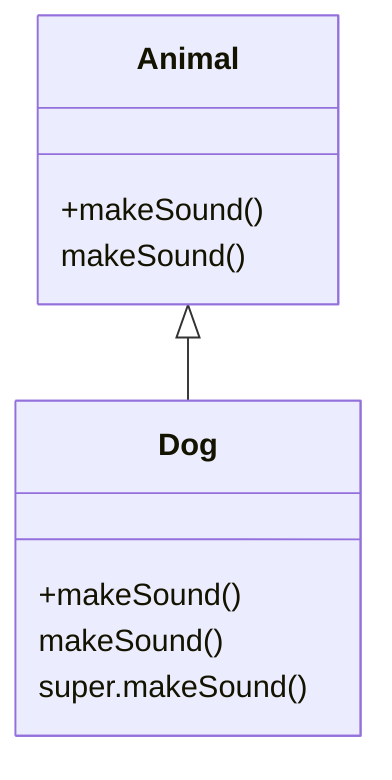

## 6.6 Method Overriding and Super Calls

In this section, we will delve into the concepts of method overriding and the use of the `super` keyword in TypeScript. These are fundamental aspects of object-oriented programming (OOP) that allow us to create flexible and reusable code. By the end of this section, you'll understand how to override methods in derived classes and how to use `super` to call methods and constructors from a base class.

### Understanding Method Overriding

**Method overriding** occurs when a derived class provides a specific implementation for a method that is already defined in its base class. This allows the derived class to modify or extend the behavior of the base class method.

#### Why Override Methods?

- **Customization**: Override methods to customize or extend the functionality of a base class.
- **Polymorphism**: Enable polymorphic behavior, where a single function call can invoke different methods depending on the object type.
- **Code Reusability**: Reuse existing code and modify only the necessary parts.

### Demonstrating Method Overriding

Let's start with a simple example. Suppose we have a base class `Animal` with a method `makeSound`. We'll create a derived class `Dog` that overrides this method.

```typescript
class Animal {
    makeSound(): void {
        console.log("Some generic animal sound");
    }
}

class Dog extends Animal {
    makeSound(): void {
        console.log("Bark");
    }
}

const myDog = new Dog();
myDog.makeSound(); // Output: Bark
```

In this example, the `Dog` class overrides the `makeSound` method of the `Animal` class. When we call `makeSound` on an instance of `Dog`, it executes the overridden method in the `Dog` class.

### The Role of the `super` Keyword

The `super` keyword is used to access and call functions on an object's parent. It is essential in two main scenarios:

1. **Calling Base Class Constructors**: When a derived class has its own constructor, it must call the base class constructor using `super`.
2. **Calling Base Class Methods**: When overriding a method, you might still want to use the functionality of the base class method. You can do this by calling `super.methodName()`.

#### Using `super` in Constructors

When you define a constructor in a derived class, you must call `super()` before using `this`. This ensures that the base class is properly initialized.

```typescript
class Animal {
    constructor(public name: string) {}
}

class Dog extends Animal {
    constructor(name: string, public breed: string) {
        super(name); // Call the base class constructor
    }
}

const myDog = new Dog("Buddy", "Golden Retriever");
console.log(myDog.name); // Output: Buddy
console.log(myDog.breed); // Output: Golden Retriever
```

In this example, the `Dog` class constructor calls `super(name)` to pass the `name` parameter to the `Animal` class constructor.

#### Using `super` in Method Overriding

You can also use `super` to call a method from the base class within an overridden method.

```typescript
class Animal {
    makeSound(): void {
        console.log("Some generic animal sound");
    }
}

class Dog extends Animal {
    makeSound(): void {
        super.makeSound(); // Call the base class method
        console.log("Bark");
    }
}

const myDog = new Dog();
myDog.makeSound();
// Output:
// Some generic animal sound
// Bark
```

Here, the `Dog` class calls `super.makeSound()` to execute the `makeSound` method from the `Animal` class before adding its own behavior.

### Common Pitfalls and How to Avoid Them

1. **Forgetting to Call `super()`**: If you define a constructor in a derived class, you must call `super()` before accessing `this`. Failing to do so will result in a runtime error.

2. **Incorrect Method Signature**: Ensure that the method signature in the derived class matches the one in the base class. Otherwise, you might not be overriding the method but rather defining a new one.

3. **Overusing `super`**: While `super` is powerful, overusing it can lead to tightly coupled code. Use it judiciously to maintain flexibility.

### Visualizing Method Overriding and Super Calls

To better understand the flow of method calls in inheritance, let's visualize it using a diagram.



In this diagram, the `Dog` class inherits from the `Animal` class and overrides the `makeSound` method. The `super.makeSound()` call is depicted to show the invocation of the base class method.

### Try It Yourself

Now that we've covered the basics, try modifying the examples:

- Add another derived class, `Cat`, that overrides `makeSound` to print "Meow".
- Create a method in the `Animal` class that returns the type of sound the animal makes. Override it in `Dog` and `Cat` to return specific sounds.
- Experiment with calling `super` in different scenarios to see how it affects method behavior.

### Summary

In this section, we've explored method overriding and the use of the `super` keyword in TypeScript. These concepts are crucial for building flexible and reusable code in an object-oriented style. By understanding how to override methods and call base class constructors and methods, you can create more sophisticated and maintainable applications.

### Additional Resources

- [MDN Web Docs: Classes](https://developer.mozilla.org/en-US/docs/Web/JavaScript/Reference/Classes)
- [TypeScript Handbook: Classes](https://www.typescriptlang.org/docs/handbook/classes.html)
- [W3Schools: TypeScript Classes](https://www.w3schools.com/typescript/typescript_classes.php)

## Quiz Time!



### What is method overriding?

- [x] Providing a specific implementation for a method in a derived class that is already defined in its base class.
- [ ] Defining a new method in a derived class.
- [ ] Using the `super` keyword to call a base class method.
- [ ] Creating a method with a different name in a derived class.

> **Explanation:** Method overriding involves redefining a method in a derived class that already exists in the base class.

### What does the `super` keyword do in TypeScript?

- [x] It calls functions on an object's parent.
- [ ] It creates a new instance of a class.
- [ ] It defines a new method in a class.
- [ ] It initializes a class property.

> **Explanation:** The `super` keyword is used to call methods and constructors from an object's parent class.

### Why is `super()` used in constructors?

- [x] To call the base class constructor and ensure proper initialization.
- [ ] To define a new constructor in the derived class.
- [ ] To override a method in the base class.
- [ ] To create a new instance of the derived class.

> **Explanation:** `super()` is used in constructors to call the base class constructor, which is necessary for proper initialization.

### What will happen if you forget to call `super()` in a derived class constructor?

- [x] A runtime error will occur.
- [ ] The derived class will still work fine.
- [ ] The base class constructor will be called automatically.
- [ ] The derived class constructor will not execute.

> **Explanation:** Forgetting to call `super()` in a derived class constructor will result in a runtime error because the base class constructor needs to be called first.

### How can you call a base class method from a derived class?

- [x] Using `super.methodName()`.
- [ ] Using `this.methodName()`.
- [ ] Using `base.methodName()`.
- [ ] Using `parent.methodName()`.

> **Explanation:** You can call a base class method from a derived class using `super.methodName()`.

### What is a common pitfall when overriding methods?

- [x] Incorrect method signature.
- [ ] Using the `super` keyword.
- [ ] Defining a new class.
- [ ] Creating a new instance.

> **Explanation:** A common pitfall is having an incorrect method signature, which can lead to defining a new method instead of overriding the existing one.

### Which of the following is true about `super` in method overriding?

- [x] It allows calling the base class method within the overridden method.
- [ ] It prevents method overriding.
- [ ] It is not used in method overriding.
- [ ] It creates a new method in the derived class.

> **Explanation:** `super` allows calling the base class method within the overridden method, enabling the derived class to extend or modify the base class behavior.

### What is the output of the following code?

```typescript
class Animal {
    makeSound(): void {
        console.log("Animal sound");
    }
}

class Dog extends Animal {
    makeSound(): void {
        super.makeSound();
        console.log("Bark");
    }
}

const myDog = new Dog();
myDog.makeSound();
```

- [x] Animal sound\nBark
- [ ] Bark\nAnimal sound
- [ ] Animal sound
- [ ] Bark

> **Explanation:** The `makeSound` method in `Dog` calls `super.makeSound()` first, which prints "Animal sound", followed by "Bark".

### Which keyword is used to access the parent class in TypeScript?

- [x] super
- [ ] this
- [ ] parent
- [ ] base

> **Explanation:** The `super` keyword is used to access the parent class in TypeScript.

### True or False: Overriding a method in a derived class is optional.

- [x] True
- [ ] False

> **Explanation:** Overriding a method in a derived class is optional. You only override if you need to change or extend the behavior of the base class method.


