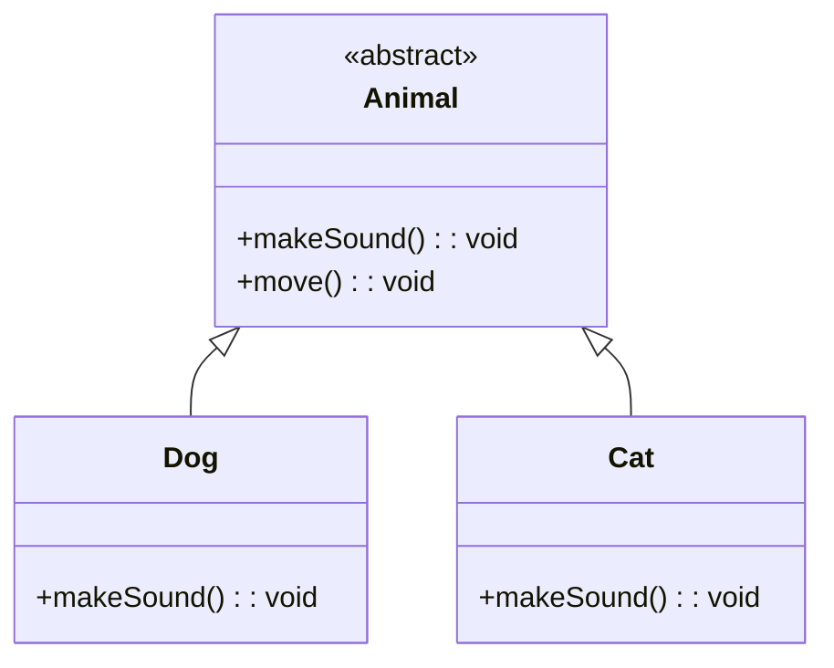

## 6.7 Abstract Classes and Methods

In the world of object-oriented programming (OOP), abstraction is a powerful concept that allows us to define the structure of our code without getting bogged down in the details. In TypeScript, abstract classes and methods provide a way to enforce a contract for subclasses while allowing flexibility in implementation. This section will guide you through the basics of abstract classes and methods, using clear explanations and practical examples to help you understand their role in designing flexible systems.

### What are Abstract Classes?

Abstract classes in TypeScript are classes that cannot be instantiated directly. Instead, they serve as blueprints for other classes. An abstract class can contain both fully implemented methods and abstract methods, which are methods without an implementation. These abstract methods must be implemented by any non-abstract subclass.

#### Purpose of Abstract Classes

The primary purpose of abstract classes is to provide a common interface for all derived classes. They allow you to define methods that must be created within any child classes built from the abstract class. This ensures that certain methods are consistently implemented across different subclasses, promoting code reusability and consistency.

### Declaring Abstract Classes and Methods

To declare an abstract class in TypeScript, use the `abstract` keyword before the `class` keyword. Similarly, to declare an abstract method, use the `abstract` keyword before the method signature. Abstract methods do not have a body; they only define the method signature.

```typescript
abstract class Animal {
    abstract makeSound(): void; // Abstract method

    move(): void {
        console.log("Moving...");
    }
}
```

In the example above, `Animal` is an abstract class with an abstract method `makeSound()`. The `move()` method is a regular method with an implementation.

### Implementing Concrete Subclasses

Concrete subclasses are classes that extend an abstract class and provide implementations for all its abstract methods. Let's see how we can create subclasses from our `Animal` abstract class.

```typescript
class Dog extends Animal {
    makeSound(): void {
        console.log("Woof! Woof!");
    }
}

class Cat extends Animal {
    makeSound(): void {
        console.log("Meow! Meow!");
    }
}

const myDog = new Dog();
myDog.makeSound(); // Output: Woof! Woof!
myDog.move(); // Output: Moving...

const myCat = new Cat();
myCat.makeSound(); // Output: Meow! Meow!
myCat.move(); // Output: Moving...
```

In this example, `Dog` and `Cat` are concrete subclasses of `Animal`. They provide their own implementations of the `makeSound()` method, fulfilling the contract set by the abstract class.

### Scenarios for Using Abstract Classes

Abstract classes are particularly useful when you want to provide a common base class with some shared implementation, while still enforcing that certain methods are implemented in each subclass. Here are some scenarios where abstract classes might be preferable to interfaces:

1. **Shared Code**: If you have some common functionality that you want to share among all subclasses, an abstract class is a good choice because it can contain implemented methods.

2. **Partial Implementation**: When you want to provide a partial implementation of a class and leave the rest to be implemented by subclasses, abstract classes are ideal.

3. **Complex Hierarchies**: In complex class hierarchies where multiple levels of inheritance are involved, abstract classes can help maintain a consistent interface across different levels.

4. **State Management**: If you need to maintain state across different subclasses, abstract classes can be useful since they can have fields and properties.

### Abstract Classes vs. Interfaces

While both abstract classes and interfaces can be used to define contracts for classes, they serve different purposes and have distinct characteristics:

- **Abstract Classes**: Can contain both implemented and abstract methods, as well as fields. They are used when you want to provide some shared functionality along with a contract for subclasses.

- **Interfaces**: Only define method signatures and properties without any implementation. They are used purely for defining a contract that classes must adhere to.

Here's a quick comparison table:

| Feature                | Abstract Classes                       | Interfaces                         |
|------------------------|----------------------------------------|------------------------------------|
| Method Implementation  | Can have implemented and abstract methods | Only method signatures              |
| Fields                 | Can have fields                        | Cannot have fields                 |
| Multiple Inheritance   | Single inheritance (can extend one class) | Can implement multiple interfaces  |
| Use Case               | Shared code and partial implementation | Purely defining a contract         |

### Role of Abstraction in Designing Flexible Systems

Abstraction is a key principle in designing flexible and maintainable systems. By using abstract classes, you can define a common interface for different components of your application while allowing for specific implementations. This promotes code reusability, consistency, and scalability.

#### Example: Designing a Payment System

Let's consider a payment processing system where different payment methods (e.g., credit card, PayPal, bank transfer) need to be supported. We can use an abstract class to define the common interface for all payment methods.

```typescript
abstract class PaymentMethod {
    abstract processPayment(amount: number): void;

    validate(): void {
        console.log("Validating payment method...");
    }
}

class CreditCardPayment extends PaymentMethod {
    processPayment(amount: number): void {
        console.log(`Processing credit card payment of $${amount}`);
    }
}

class PayPalPayment extends PaymentMethod {
    processPayment(amount: number): void {
        console.log(`Processing PayPal payment of $${amount}`);
    }
}

const creditCard = new CreditCardPayment();
creditCard.validate(); // Output: Validating payment method...
creditCard.processPayment(100); // Output: Processing credit card payment of $100

const payPal = new PayPalPayment();
payPal.validate(); // Output: Validating payment method...
payPal.processPayment(200); // Output: Processing PayPal payment of $200
```

In this example, `PaymentMethod` is an abstract class with a common `validate()` method and an abstract `processPayment()` method. `CreditCardPayment` and `PayPalPayment` are concrete subclasses that provide specific implementations for processing payments.

### Try It Yourself

To deepen your understanding, try modifying the code examples above. Here are some suggestions:

- Add a new subclass, such as `BankTransferPayment`, and implement the `processPayment()` method.
- Introduce a new method in the `PaymentMethod` abstract class and implement it in the subclasses.
- Experiment with adding fields to the abstract class and using them in the subclasses.

### Visualizing Abstract Classes and Methods

To help you visualize the relationship between abstract classes and their subclasses, here's a simple diagram:



In this diagram, `Animal` is an abstract class with an abstract method `makeSound()` and a concrete method `move()`. `Dog` and `Cat` are subclasses that implement the `makeSound()` method.

### Key Takeaways

- **Abstract Classes**: Serve as blueprints for other classes and cannot be instantiated directly.
- **Abstract Methods**: Must be implemented by subclasses, ensuring a consistent interface.
- **Use Cases**: Ideal for shared code, partial implementation, and complex hierarchies.
- **Abstraction**: Promotes code reusability, consistency, and scalability in software design.

### Further Reading

For more information on abstract classes and methods, check out these resources:

- [TypeScript Handbook: Classes](https://www.typescriptlang.org/docs/handbook/classes.html)
- [MDN Web Docs: Object-Oriented Programming](https://developer.mozilla.org/en-US/docs/Learn/JavaScript/Objects/Object-oriented_JS)

## Quiz Time!



### What is the primary purpose of an abstract class in TypeScript?

- [x] To provide a common interface for all derived classes
- [ ] To allow instantiation of objects
- [ ] To define private methods
- [ ] To override existing classes

> **Explanation:** Abstract classes provide a common interface for all derived classes, ensuring consistency and reusability.

### Which keyword is used to declare an abstract class in TypeScript?

- [x] abstract
- [ ] class
- [ ] interface
- [ ] extends

> **Explanation:** The `abstract` keyword is used to declare an abstract class in TypeScript.

### Can abstract classes contain implemented methods?

- [x] True
- [ ] False

> **Explanation:** Abstract classes can contain both implemented and abstract methods.

### What must a subclass do to a method declared abstract in its superclass?

- [x] Implement the method
- [ ] Ignore the method
- [ ] Override the method
- [ ] Delete the method

> **Explanation:** A subclass must implement any method declared abstract in its superclass.

### Which of the following is a scenario where abstract classes are preferable to interfaces?

- [x] When shared code is needed
- [ ] When multiple inheritance is required
- [ ] When no implementation is needed
- [ ] When defining only method signatures

> **Explanation:** Abstract classes are preferable when shared code is needed, as they can contain implemented methods.

### What is the difference between abstract classes and interfaces in TypeScript?

- [x] Abstract classes can have implemented methods; interfaces cannot.
- [ ] Interfaces can have implemented methods; abstract classes cannot.
- [ ] Both can have implemented methods.
- [ ] Neither can have implemented methods.

> **Explanation:** Abstract classes can have implemented methods, while interfaces only define method signatures.

### Can an abstract class be instantiated directly?

- [x] No
- [ ] Yes

> **Explanation:** Abstract classes cannot be instantiated directly; they serve as blueprints for other classes.

### What is the role of abstraction in software design?

- [x] To promote code reusability and consistency
- [ ] To complicate code
- [ ] To eliminate the need for interfaces
- [ ] To reduce code readability

> **Explanation:** Abstraction promotes code reusability and consistency, making software design more flexible and scalable.

### Which of the following is a correct way to declare an abstract method?

- [x] abstract makeSound(): void;
- [ ] makeSound(): void;
- [ ] abstract makeSound() {};
- [ ] makeSound(): abstract void;

> **Explanation:** The correct syntax for declaring an abstract method is `abstract makeSound(): void;`.

### What happens if a subclass does not implement an abstract method from its superclass?

- [x] A compile-time error occurs
- [ ] The method is ignored
- [ ] The method is automatically implemented
- [ ] The subclass becomes abstract

> **Explanation:** If a subclass does not implement an abstract method from its superclass, a compile-time error occurs.


