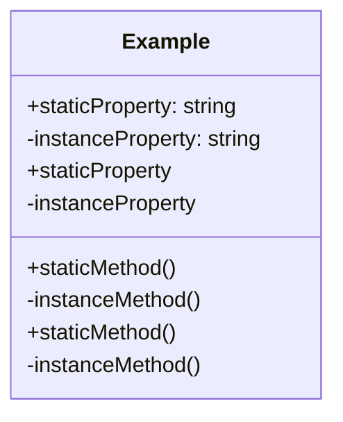

## 6.8 Static Members

In this section, we will explore the concept of static members in TypeScript classes. Static members are a powerful feature that allows us to define properties and methods that belong to the class itself, rather than to any particular instance of the class. This can be particularly useful for creating utility functions, constants, and other shared resources.

### What Are Static Members?

Static members in TypeScript are properties and methods that are associated with the class itself, not with any specific instance of the class. This means that you can access static members without creating an instance of the class. Static members are defined using the `static` keyword.

#### Declaring Static Members

To declare a static member in a TypeScript class, you simply prefix the member with the `static` keyword. Let's look at an example:

```typescript
class MathUtils {
    static PI: number = 3.14159;

    static calculateCircumference(radius: number): number {
        return 2 * MathUtils.PI * radius;
    }
}

// Accessing static members
console.log(MathUtils.PI); // Output: 3.14159
console.log(MathUtils.calculateCircumference(5)); // Output: 31.4159
```

In this example, `PI` is a static property, and `calculateCircumference` is a static method. We can access both directly using the class name `MathUtils`, without needing to create an instance of the class.

### Static vs. Instance Members

It's important to understand the difference between static and instance members:

- **Static Members**: Belong to the class itself. Accessed using the class name. Shared across all instances of the class.
- **Instance Members**: Belong to individual instances of the class. Accessed using the instance variable. Unique to each instance.

Here's a quick comparison:

```typescript
class Example {
    static staticProperty: string = "I am static";
    instanceProperty: string = "I am an instance property";

    static staticMethod() {
        console.log("This is a static method");
    }

    instanceMethod() {
        console.log("This is an instance method");
    }
}

// Accessing static members
console.log(Example.staticProperty); // Output: I am static
Example.staticMethod(); // Output: This is a static method

// Accessing instance members
const exampleInstance = new Example();
console.log(exampleInstance.instanceProperty); // Output: I am an instance property
exampleInstance.instanceMethod(); // Output: This is an instance method
```

### Use Cases for Static Members

Static members are particularly useful in the following scenarios:

1. **Utility Functions**: Functions that perform common operations and do not require any instance-specific data. For example, mathematical calculations, string manipulations, etc.

2. **Constants**: Values that are shared across all instances and do not change. For example, mathematical constants like `PI`, configuration settings, etc.

3. **Singleton Patterns**: When you want to ensure that a class has only one instance and provide a global point of access to it.

4. **Factory Methods**: Methods that create instances of a class and return them.

#### Example: Utility Class

Let's create a utility class with static methods:

```typescript
class StringUtils {
    static toUpperCase(str: string): string {
        return str.toUpperCase();
    }

    static toLowerCase(str: string): string {
        return str.toLowerCase();
    }
}

// Using static methods
console.log(StringUtils.toUpperCase("hello")); // Output: HELLO
console.log(StringUtils.toLowerCase("WORLD")); // Output: world
```

### Guidelines for Using Static Members

When designing your classes, consider the following guidelines for using static members:

- **Use Static Members for Shared Data**: If a property or method does not depend on instance-specific data, consider making it static.
- **Avoid Overusing Static Members**: Overusing static members can lead to code that is difficult to test and maintain. Use them judiciously.
- **Encapsulate Static Members**: If a static member should not be accessed directly, encapsulate it within a static method that controls access.
- **Document Static Members**: Clearly document the purpose and usage of static members to avoid confusion.

### Try It Yourself

Let's encourage you to experiment with static members. Try modifying the `MathUtils` class to include a static method that calculates the area of a circle. Here's a starting point:

```typescript
class MathUtils {
    static PI: number = 3.14159;

    static calculateCircumference(radius: number): number {
        return 2 * MathUtils.PI * radius;
    }

    // Add a static method to calculate the area of a circle
    static calculateArea(radius: number): number {
        // Your code here
    }
}

// Test your new method
console.log(MathUtils.calculateArea(5)); // Expected output: 78.53975
```

### Visualizing Static Members

To better understand how static members work, let's visualize the relationship between static and instance members in a class using a diagram.



In this diagram, the `Example` class has both static and instance members. Static members are denoted with a `+` sign, indicating they are accessible through the class itself, while instance members are denoted with a `-` sign, indicating they are accessible through instances of the class.

### Summary

Static members in TypeScript are a powerful tool for defining properties and methods that belong to the class itself. They are useful for creating utility functions, constants, and shared resources. By understanding the difference between static and instance members, you can design more efficient and maintainable classes.

### Further Reading

For more information on static members and other TypeScript features, consider exploring the following resources:

- [MDN Web Docs: Classes](https://developer.mozilla.org/en-US/docs/Web/JavaScript/Reference/Classes)
- [TypeScript Handbook: Classes](https://www.typescriptlang.org/docs/handbook/classes.html)

## Quiz Time!



### What is a static member in TypeScript?

- [x] A property or method that belongs to the class itself
- [ ] A property or method that belongs to an instance of the class
- [ ] A property or method that is private to the class
- [ ] A property or method that is protected in the class

> **Explanation:** Static members belong to the class itself and can be accessed without creating an instance.

### How do you declare a static member in TypeScript?

- [x] By using the `static` keyword
- [ ] By using the `private` keyword
- [ ] By using the `public` keyword
- [ ] By using the `protected` keyword

> **Explanation:** The `static` keyword is used to declare static members in a TypeScript class.

### Which of the following is a use case for static members?

- [x] Utility functions
- [ ] Instance-specific data
- [ ] Private methods
- [ ] Event handlers

> **Explanation:** Static members are ideal for utility functions that do not depend on instance-specific data.

### How do you access a static member in TypeScript?

- [x] Using the class name
- [ ] Using an instance of the class
- [ ] Using the `this` keyword
- [ ] Using the `super` keyword

> **Explanation:** Static members are accessed using the class name, not an instance.

### What is the difference between static and instance members?

- [x] Static members belong to the class, while instance members belong to instances
- [ ] Static members belong to instances, while instance members belong to the class
- [ ] Both belong to the class
- [ ] Both belong to instances

> **Explanation:** Static members are associated with the class itself, whereas instance members are associated with individual instances.

### When should you use static members?

- [x] When the data or method is shared across all instances
- [ ] When the data or method is unique to each instance
- [ ] When the data or method should be private
- [ ] When the data or method should be protected

> **Explanation:** Static members are used for shared data or methods that do not depend on instance-specific data.

### Can static members be accessed using an instance of the class?

- [ ] Yes
- [x] No

> **Explanation:** Static members are accessed using the class name, not through instances.

### What keyword is used to define a static method?

- [x] static
- [ ] instance
- [ ] private
- [ ] protected

> **Explanation:** The `static` keyword is used to define static methods in TypeScript.

### Which of the following is true about static members?

- [x] They can be accessed without creating an instance of the class
- [ ] They can only be accessed through an instance of the class
- [ ] They are always private
- [ ] They are always protected

> **Explanation:** Static members can be accessed directly using the class name, without needing an instance.

### Static members are useful for creating which of the following?

- [x] Constants
- [ ] Instance-specific data
- [ ] Private methods
- [ ] Event handlers

> **Explanation:** Static members are ideal for constants and shared resources that do not depend on instance-specific data.


