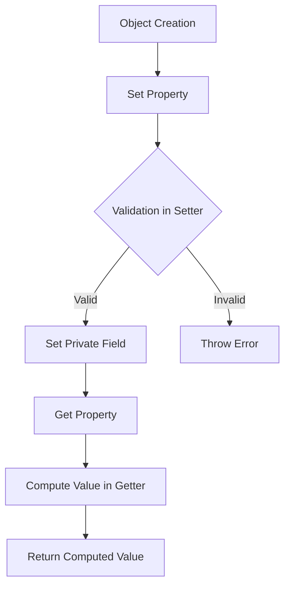

## 6.9 Accessors: Getters and Setters

In the world of object-oriented programming (OOP), encapsulation is a fundamental principle that helps manage complexity by restricting access to certain components of an object. TypeScript, with its robust type system, provides a powerful way to implement encapsulation through the use of accessors—specifically, getters and setters. In this section, we will explore how to define and use getters and setters in TypeScript, demonstrate their benefits, and discuss best practices for their use.

### Understanding Accessors

Accessors are special methods that allow you to get and set the values of an object's properties. They provide a way to control how properties are accessed and modified, which can be particularly useful for validation, computed properties, and maintaining class invariants.

#### Getters

A getter is a method that retrieves the value of a property. It is defined using the `get` keyword followed by a method name. Getters allow you to define a property that can be accessed like a regular property but is computed dynamically.

#### Setters

A setter is a method that sets the value of a property. It is defined using the `set` keyword followed by a method name. Setters enable you to control how a property is modified, allowing for validation and other logic to be executed whenever the property is set.

### Defining Getters and Setters in TypeScript

Let's start by defining a simple class with a getter and a setter to illustrate how they work.

```typescript
class Rectangle {
  private _width: number;
  private _height: number;

  constructor(width: number, height: number) {
    this._width = width;
    this._height = height;
  }

  // Getter for the area property
  get area(): number {
    return this._width * this._height;
  }

  // Setter for the width property
  set width(value: number) {
    if (value <= 0) {
      throw new Error("Width must be positive");
    }
    this._width = value;
  }

  // Setter for the height property
  set height(value: number) {
    if (value <= 0) {
      throw new Error("Height must be positive");
    }
    this._height = value;
  }
}

const rect = new Rectangle(10, 20);
console.log(rect.area); // Output: 200

rect.width = 15;
console.log(rect.area); // Output: 300

// Attempting to set a negative width will throw an error
// rect.width = -5; // Uncommenting this line will throw an error
```

In the above example, we define a `Rectangle` class with private properties `_width` and `_height`. We use a getter to compute the area of the rectangle dynamically. The setters for `width` and `height` include validation logic to ensure that the dimensions are positive.

### Benefits of Using Getters and Setters

#### Encapsulation

Getters and setters enhance encapsulation by controlling access to an object's properties. By using private fields and exposing them through accessors, you can prevent direct modification of the properties, ensuring that any change goes through your defined logic.

#### Computed Properties

Getters allow you to define properties that are computed dynamically. This can be useful for properties that depend on other properties or require some calculation.

#### Validation and Invariants

Setters provide a convenient place to include validation logic. By validating inputs in setters, you can maintain class invariants and ensure that the object remains in a consistent state.

### Potential Performance Implications

While getters and setters offer many benefits, they can also introduce performance overhead, especially if the getter or setter performs complex calculations or operations. It's important to be mindful of this when designing your classes.

### Best Practices for Using Getters and Setters

1. **Use Getters for Computed Properties**: If a property is derived from other properties, use a getter to compute its value dynamically.

2. **Include Validation in Setters**: Use setters to validate inputs and maintain class invariants. This helps ensure that the object remains in a valid state.

3. **Avoid Complex Logic in Accessors**: Keep the logic in getters and setters simple to avoid performance issues. If complex logic is required, consider using methods instead.

4. **Use Accessors for Encapsulation**: Encapsulate private fields using getters and setters to control access and modification.

5. **Document Accessors Clearly**: Provide clear documentation for your getters and setters to explain their purpose and any validation logic they include.

### Try It Yourself

To reinforce your understanding of getters and setters, try modifying the `Rectangle` class to include a getter for the perimeter and a setter that ensures the rectangle remains a square (i.e., width equals height).

### Visualizing Getters and Setters

To help visualize the flow of data when using getters and setters, consider the following diagram:



This flowchart illustrates the process of setting a property, validating it in the setter, and computing a value in the getter.

### External Resources

For more information on getters and setters in TypeScript, you can refer to the following resources:

- [MDN Web Docs on JavaScript Getters and Setters](https://developer.mozilla.org/en-US/docs/Web/JavaScript/Guide/Working_with_Objects#Defining_getters_and_setters)
- [TypeScript Handbook: Classes](https://www.typescriptlang.org/docs/handbook/classes.html)

### Key Takeaways

- Getters and setters are special methods that allow controlled access to an object's properties.
- They enhance encapsulation, provide computed properties, and enable validation logic.
- While powerful, they should be used judiciously to avoid performance issues.
- Practice using getters and setters to maintain class invariants and improve code quality.

## Quiz Time!



### What is the primary purpose of using getters in TypeScript?

- [x] To compute the value of a property dynamically
- [ ] To validate input values
- [ ] To directly modify private fields
- [ ] To execute complex logic

> **Explanation:** Getters are used to compute the value of a property dynamically, allowing for properties that depend on other properties or require calculations.

### How do setters contribute to encapsulation?

- [x] By controlling how properties are modified
- [ ] By directly accessing private fields
- [ ] By executing complex logic
- [ ] By computing property values

> **Explanation:** Setters control how properties are modified, allowing for validation and logic to be executed whenever a property is set, thus enhancing encapsulation.

### What keyword is used to define a getter in TypeScript?

- [x] `get`
- [ ] `set`
- [ ] `function`
- [ ] `property`

> **Explanation:** The `get` keyword is used to define a getter in TypeScript.

### What happens if a setter's validation logic fails?

- [x] An error is thrown
- [ ] The property is set to a default value
- [ ] The property is set to `null`
- [ ] The setter is ignored

> **Explanation:** If a setter's validation logic fails, an error is typically thrown to prevent the property from being set to an invalid value.

### Which of the following is a benefit of using accessors?

- [x] Encapsulation
- [x] Computed properties
- [ ] Direct field access
- [ ] Performance improvement

> **Explanation:** Accessors enhance encapsulation and allow for computed properties, but they do not improve performance or provide direct field access.

### What should be avoided in getters and setters to prevent performance issues?

- [x] Complex logic
- [ ] Simple validation
- [ ] Direct field access
- [ ] Property computation

> **Explanation:** Complex logic should be avoided in getters and setters to prevent performance issues.

### What is the result of accessing a property with a getter?

- [x] A computed value is returned
- [ ] The property is set to a new value
- [ ] An error is thrown
- [ ] The property is deleted

> **Explanation:** Accessing a property with a getter returns a computed value.

### What is the result of setting a property with a setter?

- [x] The property is validated and set
- [ ] The property is deleted
- [ ] An error is thrown
- [ ] The property is ignored

> **Explanation:** Setting a property with a setter involves validation and setting the property if valid.

### How can you ensure a class invariant using setters?

- [x] By including validation logic in setters
- [ ] By using complex logic in getters
- [ ] By directly modifying private fields
- [ ] By ignoring invalid values

> **Explanation:** Including validation logic in setters helps ensure class invariants by preventing invalid values from being set.

### True or False: Getters and setters are mandatory in TypeScript classes.

- [ ] True
- [x] False

> **Explanation:** Getters and setters are not mandatory in TypeScript classes; they are optional tools for encapsulation and validation.


