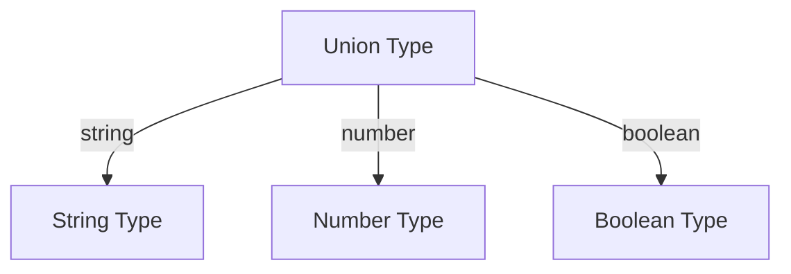

## 7.1 Union Types

In this section, we delve into the concept of union types in TypeScript, a powerful feature that allows variables to hold more than one type using the union operator (`|`). This flexibility is crucial for handling dynamic data and enhancing code robustness. Let's explore how to declare union types, understand their behavior, and apply them effectively in your TypeScript projects.

### Understanding Union Types

Union types enable a variable to accept multiple types, providing flexibility while maintaining type safety. By using the union operator (`|`), you can specify that a variable or parameter can be one of several types. This is particularly useful when dealing with APIs, user inputs, or functions that can handle different data types.

#### Declaring Union Types

To declare a union type, use the `|` operator between the types you want to include. Here's a simple example:

```typescript
let value: string | number;
```

In this example, `value` can be either a `string` or a `number`. This means you can assign values of either type to `value` without causing a type error.

### Practical Examples of Union Types

Let's explore some practical examples to see union types in action.

#### Example 1: Variables with Union Types

Consider a scenario where you want a variable to hold either a string representing a username or a number representing a user ID:

```typescript
let userIdentifier: string | number;

userIdentifier = "john_doe"; // valid
userIdentifier = 12345;      // valid
```

In this case, `userIdentifier` can store both a string and a number, making it versatile for different contexts.

#### Example 2: Function Parameters with Union Types

Union types are also beneficial for function parameters. Suppose you have a function that processes either a string or a number:

```typescript
function processInput(input: string | number): void {
    if (typeof input === "string") {
        console.log(`Processing string: ${input.toUpperCase()}`);
    } else {
        console.log(`Processing number: ${input.toFixed(2)}`);
    }
}

processInput("hello"); // Output: Processing string: HELLO
processInput(42);      // Output: Processing number: 42.00
```

In this example, the `processInput` function accepts both strings and numbers. Inside the function, we use type narrowing to determine the actual type of `input` and handle it accordingly.

### Type Narrowing with Union Types

TypeScript uses type narrowing to infer the specific type of a union type variable at runtime. This is done through control flow analysis, such as using `typeof` checks or conditional statements.

#### Example 3: Type Narrowing

Let's revisit the `processInput` function to understand type narrowing:

```typescript
function processInput(input: string | number): void {
    if (typeof input === "string") {
        console.log(`Processing string: ${input.toUpperCase()}`);
    } else {
        console.log(`Processing number: ${input.toFixed(2)}`);
    }
}
```

Here, the `typeof` operator is used to check the type of `input`. If `input` is a string, TypeScript narrows the type to `string`, allowing us to use string-specific methods like `toUpperCase()`. Similarly, if `input` is a number, TypeScript narrows the type to `number`, enabling us to use number-specific methods like `toFixed()`.

### Common Use Cases for Union Types

Union types are versatile and can be applied in various scenarios. Let's explore some common use cases.

#### Handling Function Arguments

Union types are ideal for functions that need to accept different types of arguments. This is common in libraries and APIs where flexibility is required.

```typescript
function formatValue(value: string | number | boolean): string {
    if (typeof value === "string") {
        return `String: ${value}`;
    } else if (typeof value === "number") {
        return `Number: ${value.toFixed(2)}`;
    } else {
        return `Boolean: ${value ? "true" : "false"}`;
    }
}

console.log(formatValue("hello")); // Output: String: hello
console.log(formatValue(42));      // Output: Number: 42.00
console.log(formatValue(true));    // Output: Boolean: true
```

In this example, the `formatValue` function can handle strings, numbers, and booleans, demonstrating the flexibility of union types.

#### Working with APIs

When interacting with APIs, you may encounter data that can be in different formats. Union types allow you to handle such scenarios gracefully.

```typescript
interface ApiResponse {
    data: string | number | null;
    error: string | null;
}

function handleApiResponse(response: ApiResponse): void {
    if (response.error) {
        console.error(`Error: ${response.error}`);
    } else if (typeof response.data === "string") {
        console.log(`String data: ${response.data}`);
    } else if (typeof response.data === "number") {
        console.log(`Numeric data: ${response.data}`);
    } else {
        console.log("No data available.");
    }
}
```

Here, the `ApiResponse` interface uses union types to represent possible data formats returned by an API. The `handleApiResponse` function uses type narrowing to process the response appropriately.

### Caution with Union Types

While union types offer flexibility, it's essential to use them judiciously to maintain type safety. Here are some tips to keep in mind:

- **Avoid Overusing Union Types**: Overusing union types can lead to complex and hard-to-maintain code. Use them when necessary and consider alternative designs if possible.
- **Ensure Type Safety**: Always use type narrowing techniques to ensure you're working with the correct type. This prevents runtime errors and enhances code reliability.
- **Document Your Code**: When using union types, document your code to clarify the expected types and behavior. This helps other developers understand your code and reduces potential confusion.

### Try It Yourself

To reinforce your understanding of union types, try modifying the examples provided. Here are some suggestions:

- Add more types to the union in the `processInput` function and handle them appropriately.
- Create a function that accepts a union type parameter and returns a union type result.
- Experiment with union types in an API response scenario, adding more fields and handling them.

### Visualizing Union Types

To better understand how union types work, let's visualize the concept using a simple diagram.



This diagram illustrates a union type that can be a `string`, `number`, or `boolean`. The arrows represent the possible types that the union can take.

### Key Takeaways

- **Union types** allow variables to hold more than one type, providing flexibility while maintaining type safety.
- **Type narrowing** is crucial for working with union types, ensuring you handle each type appropriately.
- **Common use cases** include handling function arguments, working with APIs, and managing dynamic data.
- **Caution** is advised to maintain type safety and avoid overly complex code.

### Further Reading

To deepen your understanding of union types and related concepts, consider exploring the following resources:

- [TypeScript Handbook: Union Types](https://www.typescriptlang.org/docs/handbook/2/everyday-types.html#union-types)
- [MDN Web Docs: JavaScript Data Types and Data Structures](https://developer.mozilla.org/en-US/docs/Web/JavaScript/Data_structures)

By mastering union types, you'll enhance your ability to write flexible and robust TypeScript code, paving the way for more advanced programming concepts.

## Quiz Time!



### What is a union type in TypeScript?

- [x] A type that allows a variable to hold more than one type.
- [ ] A type that restricts a variable to a single type.
- [ ] A type that only allows string values.
- [ ] A type that only allows number values.

> **Explanation:** A union type allows a variable to hold more than one type using the union operator (`|`).

### How do you declare a union type in TypeScript?

- [x] Using the `|` operator between types.
- [ ] Using the `&` operator between types.
- [ ] Using the `:` operator between types.
- [ ] Using the `=` operator between types.

> **Explanation:** Union types are declared using the `|` operator between the types you want to include.

### What is type narrowing?

- [x] A technique to determine the specific type of a union type variable at runtime.
- [ ] A technique to widen the types a variable can hold.
- [ ] A method to convert a number to a string.
- [ ] A method to convert a string to a number.

> **Explanation:** Type narrowing is a technique used to determine the specific type of a union type variable at runtime through control flow analysis.

### Which operator is used for type narrowing in TypeScript?

- [x] `typeof`
- [ ] `instanceof`
- [ ] `new`
- [ ] `delete`

> **Explanation:** The `typeof` operator is commonly used for type narrowing in TypeScript to check the type of a variable.

### What is a common use case for union types?

- [x] Handling function arguments that accept multiple types.
- [ ] Restricting variables to a single type.
- [ ] Converting strings to numbers.
- [ ] Performing arithmetic operations.

> **Explanation:** Union types are commonly used to handle function arguments that can accept multiple types, providing flexibility in code.

### What should you be cautious about when using union types?

- [x] Overusing them, which can lead to complex code.
- [ ] Using them only with string types.
- [ ] Using them only with number types.
- [ ] Avoiding them in all scenarios.

> **Explanation:** Overusing union types can lead to complex and hard-to-maintain code, so it's important to use them judiciously.

### How can you ensure type safety when using union types?

- [x] By using type narrowing techniques.
- [ ] By avoiding union types altogether.
- [ ] By using only string types.
- [ ] By using only number types.

> **Explanation:** Type narrowing techniques ensure type safety by determining the specific type of a union type variable at runtime.

### What does the `|` operator do in a union type declaration?

- [x] It separates the different types a variable can hold.
- [ ] It combines the different types a variable can hold.
- [ ] It assigns a value to a variable.
- [ ] It compares two values.

> **Explanation:** The `|` operator separates the different types a variable can hold in a union type declaration.

### Can a union type include more than two types?

- [x] True
- [ ] False

> **Explanation:** A union type can include more than two types, allowing a variable to hold any of the specified types.

### What is the benefit of using union types in TypeScript?

- [x] They provide flexibility while maintaining type safety.
- [ ] They restrict variables to a single type.
- [ ] They convert strings to numbers automatically.
- [ ] They prevent runtime errors completely.

> **Explanation:** Union types provide flexibility by allowing variables to hold multiple types while maintaining type safety through type narrowing.


