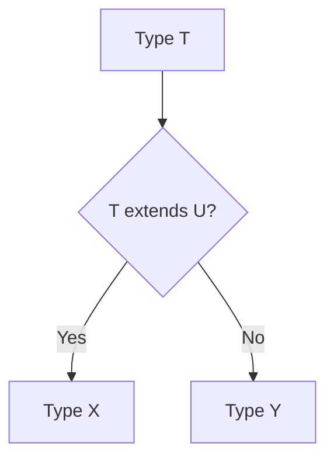

## 7.10 Conditional Types

In this section, we will explore one of the more advanced features of TypeScript: conditional types. Conditional types allow us to define types that depend on a condition, making our code more flexible and expressive. This feature is particularly useful when working with complex data structures or when you need to create types that adapt based on other types.

### Understanding Conditional Types

Conditional types in TypeScript are a powerful tool that allows you to create types based on a condition. The basic syntax of a conditional type is as follows:

```typescript
T extends U ? X : Y
```

In this expression, `T` is the type you are checking, `U` is the type you are comparing against, `X` is the type that will be used if the condition is true, and `Y` is the type that will be used if the condition is false.

#### Example: Basic Conditional Type

Let's start with a simple example to illustrate how conditional types work:

```typescript
type IsString<T> = T extends string ? "Yes" : "No";

type Test1 = IsString<string>; // "Yes"
type Test2 = IsString<number>; // "No"
```

In this example, we define a type `IsString` that checks if a given type `T` is a string. If `T` extends `string`, the type resolves to `"Yes"`, otherwise, it resolves to `"No"`.

### Distributed Conditional Types

One of the unique features of conditional types is that they distribute over union types. This means that if you apply a conditional type to a union type, TypeScript will apply the conditional type to each member of the union individually.

#### Example: Distributed Conditional Type

Consider the following example:

```typescript
type ToArray<T> = T extends any ? T[] : never;

type Test3 = ToArray<string | number>; // string[] | number[]
```

Here, `ToArray` is a conditional type that converts any type `T` into an array of `T`. When applied to the union type `string | number`, it results in `string[] | number[]`. This is because the conditional type is applied to each member of the union separately.

### Practical Use Cases

Conditional types are not just a theoretical concept; they have practical applications in real-world TypeScript code. Let's explore some common use cases.

#### Use Case 1: Type Filtering

Conditional types can be used to filter types from a union. For example, you might want to extract only the string types from a union of multiple types.

```typescript
type ExtractString<T> = T extends string ? T : never;

type Test4 = ExtractString<string | number | boolean>; // string
```

In this example, `ExtractString` filters out all types except `string` from the union `string | number | boolean`.

#### Use Case 2: Extracting Types

Another common use case is extracting specific types from a complex structure. For instance, you might want to extract the return type of a function.

```typescript
type ReturnType<T> = T extends (...args: any[]) => infer R ? R : never;

type Test5 = ReturnType<() => string>; // string
type Test6 = ReturnType<(x: number) => number>; // number
```

Here, `ReturnType` uses the `infer` keyword to extract the return type `R` from a function type `T`.

### Advanced Examples

Let's dive into some more advanced examples to deepen our understanding of conditional types.

#### Example: Conditional Type with Multiple Conditions

You can chain multiple conditional types to handle more complex scenarios.

```typescript
type TypeName<T> = 
  T extends string ? "string" :
  T extends number ? "number" :
  T extends boolean ? "boolean" :
  "unknown";

type Test7 = TypeName<string>; // "string"
type Test8 = TypeName<number>; // "number"
type Test9 = TypeName<boolean>; // "boolean"
type Test10 = TypeName<null>; // "unknown"
```

In this example, `TypeName` checks the type of `T` and returns a string representing the type name. If `T` is not a string, number, or boolean, it defaults to `"unknown"`.

#### Example: Conditional Type with Mapped Types

You can combine conditional types with mapped types to transform complex data structures.

```typescript
type Nullable<T> = {
  [K in keyof T]: T[K] extends object ? Nullable<T[K]> : T[K] | null;
};

type Test11 = Nullable<{ a: number; b: { c: string } }>;
// { a: number | null; b: { c: string | null; } | null; }
```

In this example, `Nullable` recursively makes all properties of an object type `T` nullable.

### Visualizing Conditional Types

To better understand how conditional types work, let's use a visual aid to represent the flow of a conditional type expression.



This diagram illustrates the decision-making process of a conditional type. If `T` extends `U`, the type resolves to `X`; otherwise, it resolves to `Y`.

### Try It Yourself

Now that we've covered the basics and some advanced examples, it's time to experiment with conditional types on your own. Try modifying the examples above to see how changes affect the resulting types. For instance, you can:

- Create a conditional type that checks if a type is an array.
- Experiment with distributed conditional types using different union types.
- Combine conditional types with other advanced types like mapped types or utility types.

### Key Takeaways

- Conditional types allow you to define types based on conditions, making your code more flexible.
- They distribute over union types, applying the condition to each member of the union.
- Practical use cases include type filtering and extracting types from complex structures.
- You can chain multiple conditions and combine conditional types with other TypeScript features for more complex scenarios.

### Additional Resources

For further reading and deeper dives into conditional types, consider exploring the following resources:

- [TypeScript Handbook: Conditional Types](https://www.typescriptlang.org/docs/handbook/2/conditional-types.html)
- [MDN Web Docs: TypeScript](https://developer.mozilla.org/en-US/docs/Web/JavaScript/Reference/Global_Objects/TypeScript)
- [TypeScript Deep Dive](https://basarat.gitbook.io/typescript/)

## Quiz Time!



### What is the basic syntax of a conditional type in TypeScript?

- [x] `T extends U ? X : Y`
- [ ] `T extends X ? U : Y`
- [ ] `U extends T ? X : Y`
- [ ] `X extends T ? U : Y`

> **Explanation:** The basic syntax of a conditional type is `T extends U ? X : Y`, where `T` is the type being checked, `U` is the type being compared against, `X` is the type if true, and `Y` is the type if false.

### How do conditional types distribute over union types?

- [x] They apply the condition to each member of the union individually.
- [ ] They apply the condition to the union as a whole.
- [ ] They do not work with union types.
- [ ] They only work with string types.

> **Explanation:** Conditional types distribute over union types by applying the condition to each member of the union individually, resulting in a union of the conditional results.

### What does the following conditional type return for `Test1`? `type IsString<T> = T extends string ? "Yes" : "No"; type Test1 = IsString<string>;`

- [x] "Yes"
- [ ] "No"
- [ ] "Maybe"
- [ ] "Unknown"

> **Explanation:** `Test1` is of type `"Yes"` because `string` extends `string`, making the condition true.

### What is the result of `type Test3 = ToArray<string | number>;` if `type ToArray<T> = T extends any ? T[] : never;`?

- [x] `string[] | number[]`
- [ ] `string[]`
- [ ] `number[]`
- [ ] `never`

> **Explanation:** The conditional type `ToArray` distributes over the union `string | number`, resulting in `string[] | number[]`.

### Which keyword is used to extract the return type of a function in a conditional type?

- [x] `infer`
- [ ] `extends`
- [ ] `return`
- [ ] `extract`

> **Explanation:** The `infer` keyword is used within a conditional type to extract the return type of a function.

### What does `type ExtractString<T> = T extends string ? T : never;` do?

- [x] Filters out all types except `string` from a union.
- [ ] Converts all types to `string`.
- [ ] Filters out `string` from a union.
- [ ] Converts `string` to `number`.

> **Explanation:** `ExtractString` filters out all types except `string` from a union, returning `string` if `T` is a string, otherwise `never`.

### What is the output of `type Test7 = TypeName<string>;` if `type TypeName<T> = T extends string ? "string" : "unknown";`?

- [x] "string"
- [ ] "unknown"
- [ ] "number"
- [ ] "boolean"

> **Explanation:** `Test7` is of type `"string"` because `string` extends `string`, making the condition true.

### What does `type Nullable<T> = { [K in keyof T]: T[K] extends object ? Nullable<T[K]> : T[K] | null; };` do?

- [x] Makes all properties of an object type nullable.
- [ ] Converts all properties to strings.
- [ ] Removes all properties from an object.
- [ ] Converts all properties to numbers.

> **Explanation:** `Nullable` recursively makes all properties of an object type nullable, allowing for `null` values.

### Can conditional types be combined with mapped types?

- [x] True
- [ ] False

> **Explanation:** Conditional types can be combined with mapped types to transform complex data structures, as shown in the `Nullable` example.

### Do conditional types allow for multiple conditions to be chained?

- [x] True
- [ ] False

> **Explanation:** Multiple conditions can be chained in conditional types to handle more complex scenarios, as demonstrated in the `TypeName` example.


