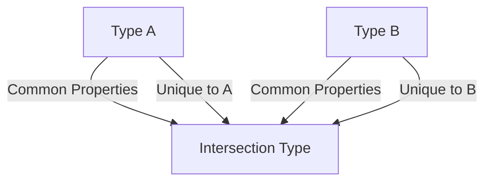

## 7.2 Intersection Types

In TypeScript, intersection types are a powerful feature that allows us to combine multiple types into one. This is particularly useful when we want to create a type that includes all the properties and methods of several other types. In this section, we'll explore what intersection types are, how to use them, and why they are beneficial in TypeScript programming.

### Understanding Intersection Types

Intersection types are created using the `&` operator. When we use this operator between two or more types, we create a new type that has all the properties of the combined types. This can be thought of as the "AND" operation in set theory, where the resulting set contains elements that are common to all sets.

#### Defining Intersection Types

To define an intersection type, we simply use the `&` operator between the types we want to combine. Here's a basic example:

```typescript
interface Person {
    name: string;
    age: number;
}

interface Employee {
    employeeId: number;
    department: string;
}

// Intersection type
type PersonEmployee = Person & Employee;

const employee: PersonEmployee = {
    name: "Alice",
    age: 30,
    employeeId: 12345,
    department: "Engineering"
};
```

In this example, `PersonEmployee` is an intersection type that combines the `Person` and `Employee` interfaces. An object of type `PersonEmployee` must have all the properties from both `Person` and `Employee`.

### When to Use Intersection Types

Intersection types are particularly useful in scenarios where you need to ensure that an object satisfies multiple contracts. Here are some common use cases:

1. **Combining Interfaces**: When you have multiple interfaces that describe different aspects of an object, and you want to create a new type that includes all these aspects.

2. **Enhancing Type Safety**: By combining types, you can ensure that an object has all the necessary properties and methods, reducing the risk of runtime errors.

3. **Flexible Code Design**: Intersection types allow you to design flexible and reusable code by composing types from smaller, more focused interfaces.

### Merging Properties with Intersection Types

When you create an intersection type, TypeScript merges the properties from all the involved types. This means that the resulting type will have all the properties of the combined types. Let's look at another example:

```typescript
interface Vehicle {
    make: string;
    model: string;
}

interface Electric {
    batteryCapacity: number;
    charge: () => void;
}

// Intersection type
type ElectricVehicle = Vehicle & Electric;

const tesla: ElectricVehicle = {
    make: "Tesla",
    model: "Model S",
    batteryCapacity: 100,
    charge: () => {
        console.log("Charging...");
    }
};
```

In this example, `ElectricVehicle` is an intersection type that combines `Vehicle` and `Electric`. The `tesla` object must have all the properties from both interfaces, ensuring it has both vehicle and electric-specific properties.

### Handling Conflicts in Intersection Types

While intersection types are powerful, they can also lead to conflicts if the combined types have properties with the same name but different types. TypeScript resolves these conflicts by using the most specific type. Let's see an example:

```typescript
interface A {
    value: string;
}

interface B {
    value: number;
}

// Intersection type
type C = A & B;

// This will cause a TypeScript error
const obj: C = {
    value: "Hello" // Error: Type 'string' is not assignable to type 'never'
};
```

In this case, `C` is an intersection type of `A` and `B`, both of which have a `value` property but with different types. TypeScript resolves this by using the `never` type, which means no value can satisfy both `string` and `number` simultaneously. This results in a compile-time error, highlighting the conflict.

### Use Cases for Intersection Types

Intersection types are versatile and can be used in various scenarios. Here are some practical use cases:

#### Combining Multiple Interfaces

When working with complex objects that need to adhere to multiple interfaces, intersection types provide a clean and efficient way to ensure all requirements are met.

```typescript
interface Drivable {
    drive: () => void;
}

interface Flyable {
    fly: () => void;
}

// Intersection type
type FlyingCar = Drivable & Flyable;

const myFlyingCar: FlyingCar = {
    drive: () => {
        console.log("Driving...");
    },
    fly: () => {
        console.log("Flying...");
    }
};
```

In this example, `FlyingCar` is an intersection type that combines `Drivable` and `Flyable`, ensuring that any object of this type can both drive and fly.

#### Extending Functionality

Intersection types can also be used to extend the functionality of existing types by combining them with new interfaces.

```typescript
interface BasicUser {
    username: string;
    password: string;
}

interface AdminPrivileges {
    accessLevel: string;
    manageUsers: () => void;
}

// Intersection type
type AdminUser = BasicUser & AdminPrivileges;

const admin: AdminUser = {
    username: "admin",
    password: "securepassword",
    accessLevel: "superuser",
    manageUsers: () => {
        console.log("Managing users...");
    }
};
```

Here, `AdminUser` is an intersection type that combines `BasicUser` with `AdminPrivileges`, creating a type that includes both basic user information and administrative capabilities.

### Try It Yourself

Now that we've explored the basics of intersection types, let's try modifying some of the examples to deepen our understanding:

1. **Modify the `ElectricVehicle` Example**: Add a new interface for `Autonomous` with a `selfDrive` method. Create an intersection type that combines `Vehicle`, `Electric`, and `Autonomous`, and implement an object of this new type.

2. **Resolve a Conflict**: Create two interfaces with a conflicting property and resolve the conflict by using a union type for the conflicting property.

3. **Extend Functionality**: Create a new intersection type that combines an existing type with additional properties or methods, and implement an object of this new type.

### Visualizing Intersection Types

To better understand how intersection types work, let's visualize the concept using a Venn diagram. This diagram illustrates how intersection types combine properties from multiple types.



**Diagram Description**: The diagram shows two types, A and B, with overlapping sections representing common properties. The intersection type, C, includes properties from both A and B, as well as any unique properties.

### Summary

Intersection types in TypeScript provide a powerful way to combine multiple types into one cohesive type. By using the `&` operator, we can ensure that an object satisfies multiple contracts, enhancing type safety and flexibility. However, it's important to be aware of potential conflicts and how TypeScript resolves them. With intersection types, we can design more robust and reusable code, making our applications more maintainable and scalable.

### Additional Resources

- [TypeScript Handbook: Intersection Types](https://www.typescriptlang.org/docs/handbook/unions-and-intersections.html#intersection-types)
- [MDN Web Docs: TypeScript](https://developer.mozilla.org/en-US/docs/Web/JavaScript/Guide/TypeScript)

## Quiz Time!



### What is an intersection type in TypeScript?

- [x] A type that combines multiple types into one using the `&` operator.
- [ ] A type that allows for multiple values of different types.
- [ ] A type that only includes properties common to all combined types.
- [ ] A type that resolves conflicts by ignoring properties.

> **Explanation:** An intersection type combines multiple types into one, including all properties from the combined types.

### How do you define an intersection type in TypeScript?

- [x] By using the `&` operator between types.
- [ ] By using the `|` operator between types.
- [ ] By using the `+` operator between types.
- [ ] By using the `-` operator between types.

> **Explanation:** The `&` operator is used to define intersection types in TypeScript.

### What happens when two types in an intersection have a property with the same name but different types?

- [x] TypeScript resolves it to the `never` type.
- [ ] TypeScript chooses the first type.
- [ ] TypeScript chooses the second type.
- [ ] TypeScript ignores the conflict.

> **Explanation:** When there is a conflict, TypeScript resolves it to the `never` type, indicating that no value can satisfy both types.

### Which of the following is a use case for intersection types?

- [x] Combining multiple interfaces into one.
- [ ] Creating a type with optional properties.
- [ ] Defining a type with default values.
- [ ] Creating a type that only includes primitive types.

> **Explanation:** Intersection types are often used to combine multiple interfaces into one cohesive type.

### What is the result of combining two interfaces with intersection types?

- [x] A new type with all properties from both interfaces.
- [ ] A new type with only common properties from both interfaces.
- [ ] A new type with properties from the first interface only.
- [ ] A new type with properties from the second interface only.

> **Explanation:** The resulting type includes all properties from both interfaces.

### Can intersection types be used to extend functionality?

- [x] Yes, by combining existing types with new interfaces.
- [ ] No, they can only combine existing types.
- [ ] Yes, but only with primitive types.
- [ ] No, they are only for resolving conflicts.

> **Explanation:** Intersection types can extend functionality by combining existing types with new interfaces.

### What does the `&` operator do in TypeScript?

- [x] Combines multiple types into an intersection type.
- [ ] Combines multiple types into a union type.
- [ ] Combines multiple values into an array.
- [ ] Combines multiple strings into a template literal.

> **Explanation:** The `&` operator is used to create intersection types by combining multiple types.

### How does TypeScript handle conflicts in intersection types?

- [x] By resolving to the `never` type.
- [ ] By choosing the first type.
- [ ] By choosing the second type.
- [ ] By ignoring the conflict.

> **Explanation:** TypeScript resolves conflicts in intersection types by using the `never` type.

### Which operator is used to create intersection types?

- [x] &
- [ ] |
- [ ] +
- [ ] -

> **Explanation:** The `&` operator is used to create intersection types in TypeScript.

### Intersection types can be used to ensure that an object satisfies multiple contracts.

- [x] True
- [ ] False

> **Explanation:** Intersection types are used to ensure that an object satisfies multiple contracts by combining multiple types into one.


