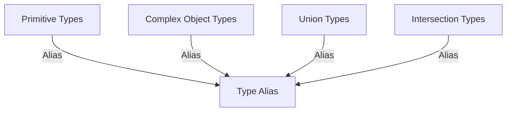

## 7.3 Type Aliases

In TypeScript, type aliases are a powerful feature that allows you to create new names for existing types. This can be particularly useful when dealing with complex types, as it simplifies code readability and maintainability. In this section, we'll explore how to create and use type aliases, their benefits, and how they can be applied to primitive, complex, union, and intersection types.

### Understanding Type Aliases

Type aliases in TypeScript are created using the `type` keyword. They allow you to define a new name for an existing type, which can be a primitive type, a complex object type, or even a combination of types. By creating type aliases, you can make your code more readable and easier to manage, especially when working with complex type definitions.

#### Creating a Type Alias

To create a type alias, use the `type` keyword followed by the alias name and the type definition. Here's a basic example of aliasing a primitive type:

```typescript
// Create a type alias for a string
type Username = string;

// Use the type alias
let user: Username = "john_doe";
```

In this example, `Username` is a type alias for `string`. You can use `Username` anywhere you would use a `string`, making your code more descriptive and easier to understand.

### Aliasing Complex Object Types

Type aliases become even more useful when dealing with complex object types. By creating a type alias for an object type, you can simplify your code and make it more readable.

```typescript
// Define a complex object type
type User = {
  id: number;
  name: string;
  email: string;
  isActive: boolean;
};

// Use the type alias
const newUser: User = {
  id: 1,
  name: "Alice",
  email: "alice@example.com",
  isActive: true,
};
```

In this example, the `User` type alias represents an object with specific properties. By using the `User` alias, you can easily create new user objects without having to redefine the object structure each time.

### Benefits of Type Aliases

Type aliases offer several benefits that can enhance your TypeScript code:

1. **Improved Readability**: By using descriptive names for type aliases, you make your code easier to read and understand. This is especially helpful when working with complex types.

2. **Reusability**: Type aliases allow you to reuse type definitions throughout your codebase, reducing duplication and potential errors.

3. **Simplified Refactoring**: If you need to change a type definition, you can do so in one place, and the change will be reflected wherever the alias is used.

4. **Enhanced Code Clarity**: By abstracting complex types into aliases, you can focus on the logic of your code rather than the intricacies of type definitions.

### Aliasing Union and Intersection Types

Type aliases are particularly useful when working with union and intersection types, which can be complex and difficult to read.

#### Union Types

A union type allows a variable to hold values of multiple types. You can create a type alias for a union type to simplify its usage.

```typescript
// Define a union type
type ID = number | string;

// Use the type alias
let userId: ID = 101;
userId = "abc123";
```

In this example, the `ID` type alias represents a union of `number` and `string`, allowing `userId` to hold either type of value.

#### Intersection Types

An intersection type combines multiple types into one. Type aliases can help manage the complexity of intersection types.

```typescript
// Define two types
type Person = {
  name: string;
  age: number;
};

type Employee = {
  employeeId: number;
  department: string;
};

// Create an intersection type alias
type StaffMember = Person & Employee;

// Use the type alias
const staff: StaffMember = {
  name: "Bob",
  age: 30,
  employeeId: 12345,
  department: "Engineering",
};
```

In this example, `StaffMember` is an intersection of `Person` and `Employee`, combining their properties into a single type.

### Best Practices for Using Type Aliases

When using type aliases, it's important to follow best practices to ensure your code remains clear and maintainable:

- **Use Descriptive Names**: Choose meaningful names for your type aliases to convey their purpose and improve code readability.

- **Avoid Overusing Aliases**: While type aliases are useful, overusing them can lead to confusion. Use them judiciously to simplify complex types.

- **Keep Aliases Simple**: Aim to create aliases for complex types rather than simple ones, as this is where they provide the most value.

- **Document Aliases**: Consider adding comments to explain the purpose of your type aliases, especially if they represent complex or non-obvious types.

### Try It Yourself

To get hands-on experience with type aliases, try modifying the examples provided. For instance, create a type alias for a complex object type that includes optional properties or nested objects. Experiment with union and intersection types to see how aliases can simplify their usage.

### Visualizing Type Aliases

To help you understand how type aliases work, let's visualize the concept using a simple diagram.



**Diagram Description**: This diagram illustrates how type aliases can be applied to various types, including primitive types, complex object types, union types, and intersection types. Each type can be aliased to create a new, descriptive name that simplifies code readability.

### Additional Resources

For more information on type aliases and advanced TypeScript features, consider exploring the following resources:

- [TypeScript Handbook: Type Aliases](https://www.typescriptlang.org/docs/handbook/2/everyday-types.html#type-aliases)
- [MDN Web Docs: TypeScript](https://developer.mozilla.org/en-US/docs/Web/JavaScript/Reference/Global_Objects/TypeScript)
- [W3Schools: TypeScript Tutorial](https://www.w3schools.com/typescript/)

### Summary

Type aliases are a valuable tool in TypeScript for creating descriptive names for complex types. By using type aliases, you can improve code readability, enhance reusability, and simplify refactoring. Whether you're working with primitive types, complex object types, or combinations of types, type aliases can help you manage complexity and write cleaner, more maintainable code.

## Quiz Time!



### What is a type alias in TypeScript?

- [x] A new name for an existing type
- [ ] A function that returns a type
- [ ] A method to convert types
- [ ] A way to create classes

> **Explanation:** A type alias is a new name for an existing type, allowing for more readable and maintainable code.

### How do you create a type alias in TypeScript?

- [x] Using the `type` keyword
- [ ] Using the `alias` keyword
- [ ] Using the `define` keyword
- [ ] Using the `new` keyword

> **Explanation:** Type aliases are created using the `type` keyword followed by the alias name and the type definition.

### Which of the following is a benefit of using type aliases?

- [x] Improved code readability
- [ ] Increased execution speed
- [ ] Reduced memory usage
- [ ] Automatic error correction

> **Explanation:** Type aliases improve code readability by providing descriptive names for complex types.

### Can type aliases be used for union types?

- [x] Yes
- [ ] No

> **Explanation:** Type aliases can be used to simplify the usage of union types by providing a single name for multiple types.

### What is the purpose of using descriptive names for type aliases?

- [x] To convey their purpose and improve code readability
- [ ] To make the code run faster
- [ ] To reduce the file size
- [ ] To ensure backward compatibility

> **Explanation:** Descriptive names for type aliases help convey their purpose and improve code readability.

### What is an intersection type?

- [x] A combination of multiple types into one
- [ ] A type that can hold multiple values
- [ ] A type that is always `null`
- [ ] A type that is always `undefined`

> **Explanation:** An intersection type combines multiple types into one, allowing a variable to have properties from all the combined types.

### How can type aliases simplify refactoring?

- [x] By allowing changes in one place to reflect throughout the code
- [ ] By automatically correcting errors
- [ ] By reducing the number of lines of code
- [ ] By increasing the speed of execution

> **Explanation:** Type aliases allow you to change a type definition in one place, and the change will be reflected wherever the alias is used, simplifying refactoring.

### Which keyword is used to create a type alias?

- [x] `type`
- [ ] `alias`
- [ ] `define`
- [ ] `new`

> **Explanation:** The `type` keyword is used to create a type alias in TypeScript.

### Can type aliases be used for primitive types?

- [x] Yes
- [ ] No

> **Explanation:** Type aliases can be used for primitive types, providing a new name for them to improve code readability.

### True or False: Type aliases can only be used for complex object types.

- [ ] True
- [x] False

> **Explanation:** Type aliases can be used for both primitive and complex object types, as well as union and intersection types.


