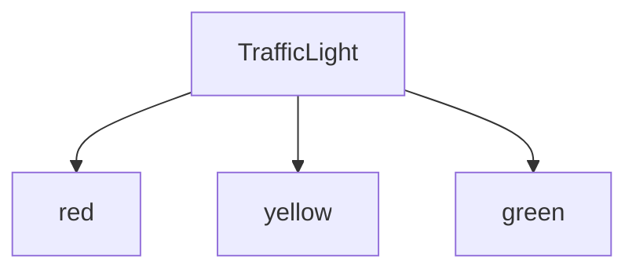

## 7.4 Literal Types

In this section, we will delve into the concept of literal types in TypeScript. Literal types allow us to specify exact values a variable can hold, providing a powerful way to enforce stricter type checking and enhance code predictability. Let's explore how literal types differ from general types, their practical applications, and how they can be combined with union types to create flexible yet constrained type definitions.

### Understanding Literal Types

Literal types in TypeScript are types that represent specific values rather than a broad category of values. Unlike general types such as `string`, `number`, or `boolean`, which can hold any value of their respective category, literal types are restricted to a single, specific value. This specificity allows us to define variables that can only take on certain predefined values, which can be particularly useful in scenarios where only a limited set of options is valid.

#### Example of General vs. Literal Types

Consider the following example:

```typescript
// General type
let direction: string;
direction = "north";
direction = "south";
direction = "east";
direction = "west";

// Literal type
let specificDirection: "north" | "south" | "east" | "west";
specificDirection = "north"; // Valid
specificDirection = "south"; // Valid
// specificDirection = "up"; // Error: Type '"up"' is not assignable to type '"north" | "south" | "east" | "west"'.
```

In the example above, `direction` is a general type and can hold any string value, whereas `specificDirection` is a literal type restricted to the values "north", "south", "east", or "west". Attempting to assign any other value to `specificDirection` will result in a compile-time error.

### String Literal Types

String literal types are perhaps the most common form of literal types. They allow us to specify that a variable can only contain a specific string value or a set of specific string values.

#### Example of String Literal Types

```typescript
type TrafficLight = "red" | "yellow" | "green";

function respondToTrafficLight(light: TrafficLight) {
    switch (light) {
        case "red":
            console.log("Stop!");
            break;
        case "yellow":
            console.log("Get ready...");
            break;
        case "green":
            console.log("Go!");
            break;
        default:
            const exhaustiveCheck: never = light;
            return exhaustiveCheck;
    }
}

respondToTrafficLight("red"); // Output: Stop!
// respondToTrafficLight("blue"); // Error: Argument of type '"blue"' is not assignable to parameter of type 'TrafficLight'.
```

In this example, the `TrafficLight` type is a union of string literal types. The function `respondToTrafficLight` can only accept one of the specified literal values, ensuring that the function handles only valid traffic light states.

### Number Literal Types

Number literal types work similarly to string literal types but are used to restrict variables to specific numeric values.

#### Example of Number Literal Types

```typescript
type DiceRoll = 1 | 2 | 3 | 4 | 5 | 6;

function rollDice(): DiceRoll {
    return (Math.floor(Math.random() * 6) + 1) as DiceRoll;
}

const result = rollDice();
console.log(`You rolled a ${result}`); // Output: You rolled a 1 (or any number between 1 and 6)
```

Here, the `DiceRoll` type is defined as a union of number literal types, representing the possible outcomes of a dice roll. The `rollDice` function returns a value that is guaranteed to be one of these specified numbers.

### Boolean Literal Types

Boolean literal types are less common but can be used to restrict a variable to the `true` or `false` value.

#### Example of Boolean Literal Types

```typescript
type IsEnabled = true;

function toggleFeature(isEnabled: IsEnabled) {
    if (isEnabled) {
        console.log("Feature is enabled.");
    } else {
        console.log("Feature is disabled.");
    }
}

toggleFeature(true); // Output: Feature is enabled.
// toggleFeature(false); // Error: Argument of type 'false' is not assignable to parameter of type 'true'.
```

In this example, the `IsEnabled` type is a boolean literal type restricted to `true`. The `toggleFeature` function can only be called with the value `true`, enforcing that the feature is always enabled.

### Combining Literal Types with Union Types

Literal types can be combined with union types to create more flexible yet constrained type definitions. This combination is particularly useful when defining enums or sets of options.

#### Example of Literal Types with Union Types

```typescript
type Shape = "circle" | "square" | "triangle";

function drawShape(shape: Shape) {
    switch (shape) {
        case "circle":
            console.log("Drawing a circle.");
            break;
        case "square":
            console.log("Drawing a square.");
            break;
        case "triangle":
            console.log("Drawing a triangle.");
            break;
        default:
            const exhaustiveCheck: never = shape;
            return exhaustiveCheck;
    }
}

drawShape("circle"); // Output: Drawing a circle.
// drawShape("hexagon"); // Error: Argument of type '"hexagon"' is not assignable to parameter of type 'Shape'.
```

In this example, the `Shape` type is a union of string literal types, representing the shapes that can be drawn. The `drawShape` function can only accept one of the specified shapes, ensuring that invalid shapes are caught at compile time.

### Benefits of Literal Types

Literal types offer several benefits that enhance the safety and predictability of our code:

1. **Compile-time Safety**: By restricting variables to specific values, TypeScript can catch errors at compile time, reducing runtime errors.

2. **Improved Code Readability**: Literal types make the code more self-documenting, as the possible values are explicitly defined.

3. **Enhanced Intellisense Support**: Code editors can provide better autocompletion and suggestions when working with literal types, improving developer productivity.

4. **Enforcing Business Logic**: Literal types can be used to enforce business rules and logic, ensuring that only valid values are used in specific contexts.

### Practical Applications of Literal Types

Literal types are particularly useful in scenarios where we need to define a set of allowed options for a function parameter or property. Here are a few practical applications:

#### Defining Allowed Options for Function Parameters

```typescript
type ButtonSize = "small" | "medium" | "large";

function createButton(size: ButtonSize) {
    console.log(`Creating a ${size} button.`);
}

createButton("medium"); // Output: Creating a medium button.
// createButton("extra-large"); // Error: Argument of type '"extra-large"' is not assignable to parameter of type 'ButtonSize'.
```

In this example, the `ButtonSize` type defines the allowed sizes for a button. The `createButton` function can only accept one of the specified sizes, ensuring that invalid sizes are caught at compile time.

#### Configuring Application Settings

```typescript
type Theme = "light" | "dark";

interface AppSettings {
    theme: Theme;
    notificationsEnabled: boolean;
}

const settings: AppSettings = {
    theme: "dark",
    notificationsEnabled: true,
};

console.log(`Current theme: ${settings.theme}`); // Output: Current theme: dark
```

Here, the `Theme` type is used to define the allowed themes for an application. The `AppSettings` interface uses this type to ensure that only valid themes are assigned to the `theme` property.

### Try It Yourself

Now it's your turn to experiment with literal types. Try modifying the code examples above to add new literal values or change existing ones. Observe how TypeScript enforces the constraints and catches errors at compile time. Here are a few challenges to get you started:

- Add a new color to the `TrafficLight` type and update the `respondToTrafficLight` function to handle it.
- Modify the `DiceRoll` type to include a "lucky seven" outcome and update the `rollDice` function accordingly.
- Create a new type for a set of allowed user roles (e.g., "admin", "editor", "viewer") and write a function that performs actions based on the role.

### Visualizing Literal Types

To help visualize the concept of literal types and their relationship with union types, let's use a diagram to represent the `TrafficLight` example:



This diagram illustrates the `TrafficLight` type as a union of three string literal types: "red", "yellow", and "green". Each arrow represents a valid value that can be assigned to a variable of type `TrafficLight`.

### Conclusion

Literal types in TypeScript provide a powerful way to enforce stricter type checking and enhance code predictability. By restricting variables to specific values, we can catch errors at compile time, improve code readability, and enforce business logic. Whether you're defining allowed options for function parameters or configuring application settings, literal types offer a flexible yet constrained approach to type definitions.

### Additional Resources

For more information on literal types and advanced type features in TypeScript, consider exploring the following resources:

- [TypeScript Handbook: Literal Types](https://www.typescriptlang.org/docs/handbook/literal-types.html)
- [MDN Web Docs: TypeScript](https://developer.mozilla.org/en-US/docs/Web/JavaScript/Reference/Global_Objects/TypeScript)
- [W3Schools: TypeScript Tutorial](https://www.w3schools.com/typescript/)

## Quiz Time!



### What is a literal type in TypeScript?

- [x] A type that represents a specific value.
- [ ] A type that can hold any value of a certain category.
- [ ] A type that is used for arrays.
- [ ] A type that is used for functions.

> **Explanation:** A literal type represents a specific value, such as a particular string or number, rather than a broad category of values.

### Which of the following is a valid string literal type?

- [x] "hello"
- [ ] string
- [ ] "world" | string
- [ ] "123"

> **Explanation:** "hello" is a valid string literal type because it represents a specific string value.

### How can you combine literal types with union types?

- [x] Using the `|` operator to define a set of allowed values.
- [ ] Using the `&` operator to combine types.
- [ ] Using the `!` operator to negate types.
- [ ] Using the `?` operator to make types optional.

> **Explanation:** The `|` operator is used to combine literal types into a union type, allowing a variable to hold one of several specific values.

### What is a benefit of using literal types?

- [x] Compile-time safety.
- [ ] Increased runtime errors.
- [ ] Less readable code.
- [ ] Reduced code flexibility.

> **Explanation:** Literal types provide compile-time safety by catching errors when invalid values are assigned to variables.

### Which of the following is a valid number literal type?

- [x] 42
- [ ] number
- [ ] "42"
- [ ] 3.14 | number

> **Explanation:** 42 is a valid number literal type because it represents a specific numeric value.

### What happens if you assign an invalid value to a variable with a literal type?

- [x] TypeScript throws a compile-time error.
- [ ] The program crashes at runtime.
- [ ] The invalid value is ignored.
- [ ] The variable is automatically converted to a string.

> **Explanation:** TypeScript throws a compile-time error if an invalid value is assigned to a variable with a literal type.

### How can literal types improve code readability?

- [x] By making the code more self-documenting.
- [ ] By allowing any value to be assigned to variables.
- [ ] By reducing the number of comments needed.
- [ ] By making the code shorter.

> **Explanation:** Literal types improve code readability by explicitly defining the possible values a variable can hold, making the code more self-documenting.

### What is a practical application of literal types?

- [x] Defining allowed options for a function parameter.
- [ ] Creating complex data structures.
- [ ] Implementing dynamic typing.
- [ ] Writing less code.

> **Explanation:** Literal types are useful for defining allowed options for a function parameter, ensuring that only valid values are used.

### Which of the following is a valid boolean literal type?

- [x] true
- [ ] boolean
- [ ] "true"
- [ ] 1

> **Explanation:** `true` is a valid boolean literal type because it represents a specific boolean value.

### True or False: Literal types can only be used with strings.

- [ ] True
- [x] False

> **Explanation:** False. Literal types can be used with strings, numbers, and booleans.


