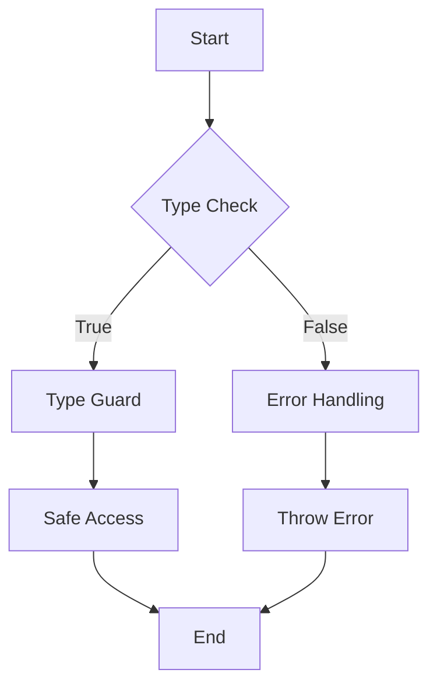

## 7.5 Type Guards and Type Assertions

In TypeScript, understanding types is crucial for writing robust and error-free code. As we delve deeper into advanced types, two essential concepts emerge: **Type Guards** and **Type Assertions**. These tools empower developers to work with types more effectively, ensuring that the code behaves as expected. Let's explore these concepts in detail.

### Understanding Type Guards

Type Guards are a way to narrow down the type of a variable within a specific block of code. They help TypeScript understand what type a variable is, based on certain conditions. By using Type Guards, you can make your code safer and more predictable.

#### Implementing Type Guards

Type Guards can be implemented using several techniques, such as `typeof`, `instanceof`, and custom type guard functions. Let's explore each of these methods.

#### Using `typeof`

The `typeof` operator is a built-in JavaScript operator that returns a string indicating the type of the unevaluated operand. It's commonly used for primitive types like `string`, `number`, and `boolean`.

```typescript
function printLength(value: string | number) {
  if (typeof value === "string") {
    // TypeScript knows 'value' is a string here
    console.log(`String length: ${value.length}`);
  } else {
    // TypeScript knows 'value' is a number here
    console.log(`Number value: ${value}`);
  }
}

printLength("Hello, TypeScript!");
printLength(42);
```

In this example, the `typeof` operator helps TypeScript determine whether `value` is a `string` or a `number`, allowing us to safely access properties or methods specific to those types.

#### Using `instanceof`

The `instanceof` operator is used to check if an object is an instance of a specific class or constructor function. It's particularly useful when working with custom classes.

```typescript
class Dog {
  bark() {
    console.log("Woof!");
  }
}

class Cat {
  meow() {
    console.log("Meow!");
  }
}

function makeSound(animal: Dog | Cat) {
  if (animal instanceof Dog) {
    // TypeScript knows 'animal' is a Dog here
    animal.bark();
  } else {
    // TypeScript knows 'animal' is a Cat here
    animal.meow();
  }
}

const myDog = new Dog();
const myCat = new Cat();

makeSound(myDog);
makeSound(myCat);
```

Here, `instanceof` helps TypeScript understand whether `animal` is a `Dog` or a `Cat`, allowing us to call the appropriate method.

#### Custom Type Guard Functions

Custom type guard functions provide a more flexible way to narrow down types. These functions return a boolean value and use a special syntax to inform TypeScript about the type.

```typescript
interface Fish {
  swim: () => void;
}

interface Bird {
  fly: () => void;
}

function isFish(pet: Fish | Bird): pet is Fish {
  return (pet as Fish).swim !== undefined;
}

function move(pet: Fish | Bird) {
  if (isFish(pet)) {
    // TypeScript knows 'pet' is a Fish here
    pet.swim();
  } else {
    // TypeScript knows 'pet' is a Bird here
    pet.fly();
  }
}

const myFish: Fish = { swim: () => console.log("Swimming") };
const myBird: Bird = { fly: () => console.log("Flying") };

move(myFish);
move(myBird);
```

In this example, `isFish` is a custom type guard function that checks if `pet` is a `Fish`. The `pet is Fish` syntax tells TypeScript that if the function returns `true`, `pet` should be treated as a `Fish`.

### Exploring Type Assertions

Type Assertions are a way to tell TypeScript to treat a variable as a specific type. They are useful when you, as the developer, have more information about the type of a variable than TypeScript can infer.

#### Using the `as` Keyword

The `as` keyword is the most common way to perform a type assertion. It allows you to specify the type you want to assert.

```typescript
let someValue: unknown = "Hello, TypeScript!";
let strLength: number = (someValue as string).length;

console.log(`String length: ${strLength}`);
```

In this example, we assert that `someValue` is a `string`, allowing us to access the `length` property.

#### Using Angle-Bracket Syntax

Another way to perform type assertions is using angle-bracket syntax. However, this syntax is not compatible with JSX, so it's less commonly used in React projects.

```typescript
let someValue: unknown = "Hello, TypeScript!";
let strLength: number = (<string>someValue).length;

console.log(`String length: ${strLength}`);
```

This example achieves the same result as the previous one, using angle-bracket syntax for the type assertion.

#### Risks of Incorrect Type Assertions

While type assertions can be powerful, they come with risks. Incorrect type assertions can lead to runtime errors if the variable is not actually of the asserted type. It's crucial to ensure that the type assertion is valid.

```typescript
let someValue: unknown = 42;
// This will compile, but will cause a runtime error
let strLength: number = (someValue as string).length;

console.log(`String length: ${strLength}`);
```

In this example, asserting `someValue` as a `string` is incorrect because it's actually a `number`. This will lead to a runtime error when trying to access the `length` property.

### Encouraging Proper Type Checking

Before making a type assertion, it's essential to perform proper type checking. This can be done using Type Guards or other validation techniques to ensure the variable is of the expected type.

```typescript
function getStringLength(value: unknown): number {
  if (typeof value === "string") {
    return value.length;
  } else {
    throw new Error("Value is not a string");
  }
}

try {
  console.log(getStringLength("Hello, TypeScript!"));
  console.log(getStringLength(42)); // This will throw an error
} catch (error) {
  console.error(error.message);
}
```

In this example, we use a type guard to check if `value` is a `string` before attempting to access the `length` property. If the check fails, an error is thrown, preventing a runtime error.

### Visualizing Type Guards and Type Assertions

To better understand how Type Guards and Type Assertions work, let's visualize the process using a flowchart.



**Caption:** This flowchart illustrates the process of using Type Guards to safely access properties or methods based on type checks.

### Try It Yourself

Now that we've covered the basics of Type Guards and Type Assertions, try modifying the examples to reinforce your understanding. Here are a few suggestions:

- Add a new class, `Parrot`, to the `makeSound` function and implement a method for it.
- Create a custom type guard function for a new interface, `Reptile`, and use it in a function.
- Experiment with incorrect type assertions and observe the runtime errors.

### References and Further Reading

- [MDN Web Docs: typeof](https://developer.mozilla.org/en-US/docs/Web/JavaScript/Reference/Operators/typeof)
- [MDN Web Docs: instanceof](https://developer.mozilla.org/en-US/docs/Web/JavaScript/Reference/Operators/instanceof)
- [TypeScript Handbook: Type Guards and Differentiating Types](https://www.typescriptlang.org/docs/handbook/2/narrowing.html#using-type-predicates)

### Key Takeaways

- **Type Guards** help narrow down types at runtime, making code safer and more predictable.
- **Type Assertions** allow developers to inform TypeScript about a variable's type when more information is available.
- Use Type Guards like `typeof`, `instanceof`, and custom functions to ensure safe type narrowing.
- Be cautious with Type Assertions, as incorrect assertions can lead to runtime errors.
- Always perform proper type checking before making assertions to avoid potential issues.

## Quiz Time!



### What is a Type Guard in TypeScript?

- [x] A way to narrow down the type of a variable within a specific block of code.
- [ ] A method to assert a variable's type.
- [ ] A TypeScript feature that automatically infers types.
- [ ] A tool to convert JavaScript to TypeScript.

> **Explanation:** Type Guards help narrow down the type of a variable within a specific block of code, making it safer to access properties or methods specific to that type.

### Which operator is used to check if an object is an instance of a specific class?

- [ ] typeof
- [x] instanceof
- [ ] as
- [ ] is

> **Explanation:** The `instanceof` operator is used to check if an object is an instance of a specific class or constructor function.

### How do you perform a type assertion using the `as` keyword?

- [x] `let strLength: number = (someValue as string).length;`
- [ ] `let strLength: number = <string>someValue.length;`
- [ ] `let strLength: number = typeof someValue.length;`
- [ ] `let strLength: number = instanceof someValue.length;`

> **Explanation:** The `as` keyword is used for type assertions, allowing you to specify the type you want to assert.

### What is the risk of incorrect type assertions?

- [x] They can lead to runtime errors if the variable is not of the asserted type.
- [ ] They improve code readability.
- [ ] They automatically fix type errors.
- [ ] They prevent all runtime errors.

> **Explanation:** Incorrect type assertions can lead to runtime errors if the variable is not actually of the asserted type.

### Which of the following is a custom type guard function?

- [x] `function isFish(pet: Fish | Bird): pet is Fish { return (pet as Fish).swim !== undefined; }`
- [ ] `function isFish(pet: Fish | Bird): boolean { return typeof pet === "Fish"; }`
- [ ] `function isFish(pet: Fish | Bird): boolean { return pet instanceof Fish; }`
- [ ] `function isFish(pet: Fish | Bird): pet as Fish { return pet.swim !== undefined; }`

> **Explanation:** A custom type guard function uses the `pet is Fish` syntax to inform TypeScript about the type if the function returns `true`.

### What does the `typeof` operator return?

- [x] A string indicating the type of the unevaluated operand.
- [ ] A boolean indicating if a variable is of a specific type.
- [ ] An object representing the variable's type.
- [ ] A number representing the variable's type.

> **Explanation:** The `typeof` operator returns a string indicating the type of the unevaluated operand.

### What is the primary purpose of Type Guards?

- [x] To narrow down types at runtime and ensure safe access to properties or methods.
- [ ] To convert JavaScript code to TypeScript.
- [ ] To automatically fix type errors in the code.
- [ ] To provide type information for third-party libraries.

> **Explanation:** Type Guards are used to narrow down types at runtime, ensuring safe access to properties or methods specific to those types.

### How can you safely access a property of a variable with an unknown type?

- [x] Use a Type Guard to check the type before accessing the property.
- [ ] Directly access the property without checking the type.
- [ ] Use a Type Assertion without any checks.
- [ ] Use the `typeof` operator to access the property.

> **Explanation:** Using a Type Guard to check the type before accessing the property ensures that the access is safe and prevents runtime errors.

### What is the result of using `typeof` on a function?

- [x] "function"
- [ ] "object"
- [ ] "undefined"
- [ ] "string"

> **Explanation:** The `typeof` operator returns "function" when used on a function.

### True or False: Type Assertions can change the runtime behavior of a program.

- [ ] True
- [x] False

> **Explanation:** Type Assertions do not change the runtime behavior of a program; they only affect the TypeScript compiler's understanding of the code.


