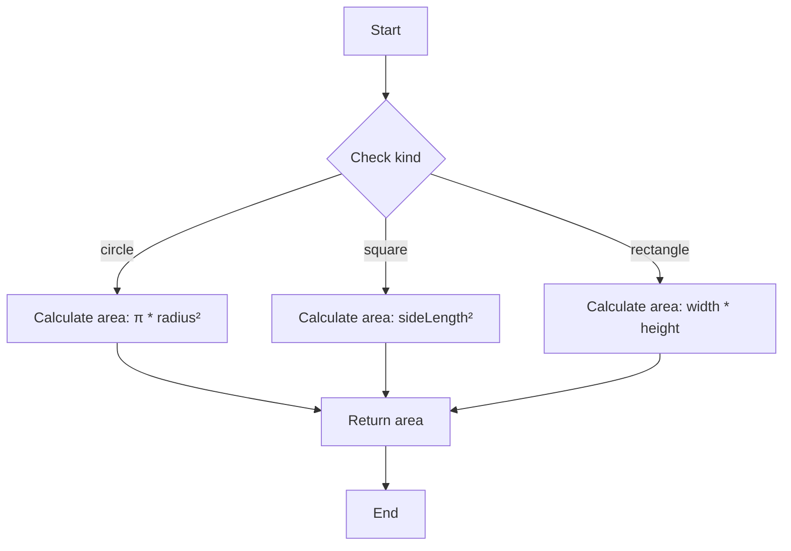

## 7.6 Discriminated Unions

In this section, we will explore the concept of discriminated unions in TypeScript. Discriminated unions are a powerful feature that allows you to create type-safe unions of interfaces, making your code more reliable and easier to maintain. By the end of this section, you'll understand how to define discriminated unions, how TypeScript uses them for type narrowing, and the benefits they offer in pattern matching and exhaustive checking.

### What are Discriminated Unions?

Discriminated unions, also known as tagged unions or algebraic data types, are a way to combine multiple types into a single union type. Each type in the union has a common property, known as the discriminant, which TypeScript uses to determine which type is currently in use. This allows TypeScript to narrow down the type and provide type safety when accessing properties specific to each type.

#### Structure of Discriminated Unions

To create a discriminated union, you need to define a set of types that share a common discriminant property. This property is usually a string literal type, such as `type` or `kind`, which uniquely identifies each type in the union.

Here's a basic structure of a discriminated union:

```typescript
interface Circle {
  kind: 'circle';
  radius: number;
}

interface Square {
  kind: 'square';
  sideLength: number;
}

interface Rectangle {
  kind: 'rectangle';
  width: number;
  height: number;
}

type Shape = Circle | Square | Rectangle;
```

In this example, we have defined three interfaces: `Circle`, `Square`, and `Rectangle`. Each interface has a `kind` property that acts as the discriminant. The `Shape` type is a union of these interfaces.

### Using Discriminants for Type Narrowing

TypeScript uses the discriminant property to narrow down the type of a variable. This means that when you check the value of the discriminant, TypeScript can infer the specific type and allow you to access properties unique to that type.

Let's see this in action with a function that calculates the area of a shape:

```typescript
function calculateArea(shape: Shape): number {
  switch (shape.kind) {
    case 'circle':
      return Math.PI * shape.radius * shape.radius;
    case 'square':
      return shape.sideLength * shape.sideLength;
    case 'rectangle':
      return shape.width * shape.height;
    default:
      // This should never happen if all cases are covered
      throw new Error('Unknown shape');
  }
}
```

In the `calculateArea` function, we use a `switch` statement to check the `kind` property of the `shape` parameter. TypeScript automatically narrows the type based on the value of `kind`, allowing us to safely access properties like `radius`, `sideLength`, and `width`.

### Benefits of Discriminated Unions

Discriminated unions offer several benefits that can improve the quality and maintainability of your code:

1. **Type Safety**: By using a common discriminant property, TypeScript can ensure that you only access properties that exist on the current type. This prevents runtime errors caused by accessing undefined properties.

2. **Pattern Matching**: Discriminated unions make it easy to implement pattern matching, a common technique in functional programming. This allows you to handle different types in a union with clear and concise code.

3. **Exhaustive Checking**: TypeScript can check that all possible cases are handled in a `switch` statement, ensuring that your code is robust and free of logical errors.

4. **Readability**: By clearly defining the structure of each type and using a common discriminant, your code becomes more readable and easier to understand.

### Exercises: Implementing Discriminated Unions

Now that we've covered the basics of discriminated unions, let's put your knowledge into practice with some exercises. Try implementing the following scenarios using discriminated unions:

#### Exercise 1: Vehicle Types

Define a discriminated union for different types of vehicles. Each vehicle type should have a `kind` property and specific properties unique to that type. Implement a function that returns a description of the vehicle based on its type.

```typescript
interface Car {
  kind: 'car';
  make: string;
  model: string;
}

interface Truck {
  kind: 'truck';
  capacity: number;
}

interface Motorcycle {
  kind: 'motorcycle';
  engineCapacity: number;
}

type Vehicle = Car | Truck | Motorcycle;

function describeVehicle(vehicle: Vehicle): string {
  switch (vehicle.kind) {
    case 'car':
      return `Car: ${vehicle.make} ${vehicle.model}`;
    case 'truck':
      return `Truck with capacity: ${vehicle.capacity} tons`;
    case 'motorcycle':
      return `Motorcycle with engine capacity: ${vehicle.engineCapacity} cc`;
    default:
      throw new Error('Unknown vehicle type');
  }
}
```

#### Exercise 2: Payment Methods

Create a discriminated union for different payment methods. Each method should have a `type` property and specific properties for that method. Write a function that processes a payment based on its type.

```typescript
interface CreditCard {
  type: 'creditCard';
  cardNumber: string;
  expiryDate: string;
}

interface PayPal {
  type: 'paypal';
  email: string;
}

interface BankTransfer {
  type: 'bankTransfer';
  accountNumber: string;
  bankCode: string;
}

type PaymentMethod = CreditCard | PayPal | BankTransfer;

function processPayment(payment: PaymentMethod): void {
  switch (payment.type) {
    case 'creditCard':
      console.log(`Processing credit card payment for card number: ${payment.cardNumber}`);
      break;
    case 'paypal':
      console.log(`Processing PayPal payment for email: ${payment.email}`);
      break;
    case 'bankTransfer':
      console.log(`Processing bank transfer to account: ${payment.accountNumber}`);
      break;
    default:
      throw new Error('Unknown payment method');
  }
}
```

### Try It Yourself

To deepen your understanding of discriminated unions, try modifying the code examples above. For instance, add a new type of shape or vehicle and update the functions to handle the new type. Experiment with different discriminant properties and see how TypeScript's type narrowing helps you write safer code.

### Visualizing Discriminated Unions

To help you visualize how discriminated unions work, let's use a flowchart to represent the `calculateArea` function. This flowchart shows how the `kind` property is used to determine the type of shape and calculate the area accordingly.



### Conclusion

Discriminated unions are a powerful feature in TypeScript that allow you to create type-safe unions of interfaces. By using a common discriminant property, you can leverage TypeScript's type narrowing to write safer and more maintainable code. Discriminated unions also make it easy to implement pattern matching and ensure exhaustive checking, improving the robustness of your code.

As you continue your journey with TypeScript, consider using discriminated unions in your projects to take advantage of these benefits. With practice, you'll become more comfortable with this feature and be able to apply it effectively in a variety of scenarios.

## Quiz Time!



### What is a discriminated union in TypeScript?

- [x] A union of types with a common discriminant property
- [ ] A type that combines multiple interfaces without a common property
- [ ] A way to create classes with shared methods
- [ ] A function that returns different types based on input

> **Explanation:** A discriminated union is a union of types that share a common discriminant property, allowing TypeScript to narrow down the type based on its value.

### What is the purpose of the discriminant property in a discriminated union?

- [x] To uniquely identify each type in the union
- [ ] To store data common to all types in the union
- [ ] To provide a default value for the union
- [ ] To enforce type safety by preventing type narrowing

> **Explanation:** The discriminant property uniquely identifies each type in the union, allowing TypeScript to narrow down the type based on its value.

### Which of the following is a benefit of using discriminated unions?

- [x] Type safety
- [x] Pattern matching
- [x] Exhaustive checking
- [ ] Increased code complexity

> **Explanation:** Discriminated unions provide type safety, enable pattern matching, and ensure exhaustive checking, making your code more reliable and maintainable.

### How does TypeScript narrow down the type in a discriminated union?

- [x] By checking the value of the discriminant property
- [ ] By analyzing the properties of each type
- [ ] By using runtime type checks
- [ ] By inferring the type from function parameters

> **Explanation:** TypeScript uses the value of the discriminant property to narrow down the type in a discriminated union.

### What happens if you don't handle all cases in a switch statement for a discriminated union?

- [ ] The code will compile but may throw a runtime error
- [x] TypeScript will show a compile-time error if strict checking is enabled
- [ ] The code will not compile
- [ ] TypeScript will automatically handle the missing cases

> **Explanation:** If strict checking is enabled, TypeScript will show a compile-time error if all cases are not handled in a switch statement for a discriminated union.

### In the `calculateArea` function, what is the role of the `default` case?

- [ ] To handle all known shape types
- [x] To catch any unknown shape types
- [ ] To provide a default area calculation
- [ ] To optimize the switch statement

> **Explanation:** The `default` case is used to catch any unknown shape types, ensuring that the function handles all possible cases.

### Which of the following is an example of a discriminant property?

- [x] `kind`
- [x] `type`
- [ ] `value`
- [ ] `name`

> **Explanation:** Common discriminant properties include `kind` and `type`, which are used to uniquely identify each type in a discriminated union.

### What is the main advantage of using a discriminated union over a regular union?

- [x] TypeScript can narrow down the type based on the discriminant property
- [ ] It allows for more complex data structures
- [ ] It reduces the need for type annotations
- [ ] It simplifies function overloading

> **Explanation:** The main advantage of a discriminated union is that TypeScript can narrow down the type based on the discriminant property, providing type safety and enabling pattern matching.

### How can you ensure exhaustive checking in a switch statement for a discriminated union?

- [x] By handling all possible cases and using a default case
- [ ] By using a try-catch block
- [ ] By adding type annotations to each case
- [ ] By using a loop to iterate over the cases

> **Explanation:** To ensure exhaustive checking, handle all possible cases in the switch statement and use a default case to catch any unknown types.

### True or False: Discriminated unions can only be used with interfaces.

- [ ] True
- [x] False

> **Explanation:** Discriminated unions can be used with any types that share a common discriminant property, not just interfaces.


