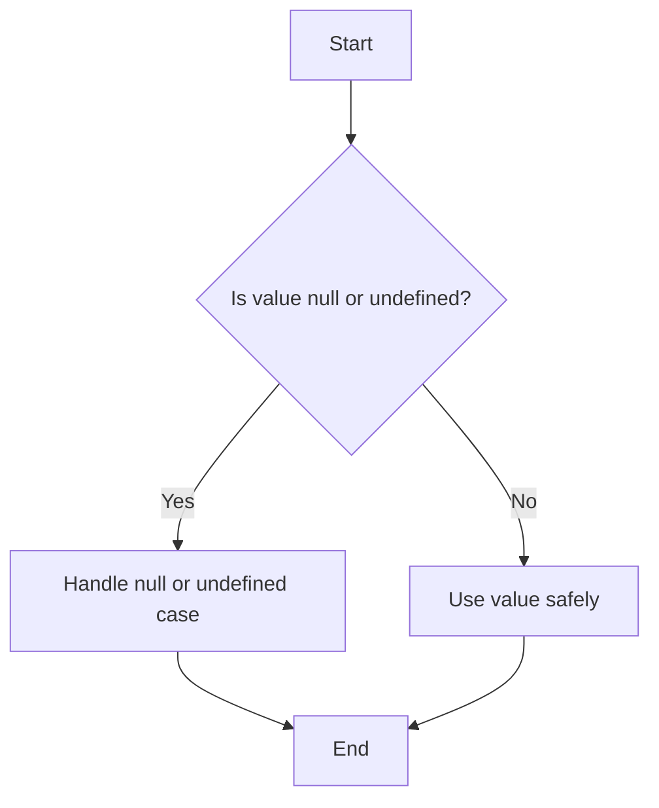

## 7.7 Nullable Types and the Non-null Assertion Operator

In this section, we will explore how TypeScript handles nullable types and how you can use the non-null assertion operator to manage null and undefined values. Understanding these concepts is crucial for writing robust TypeScript code that can handle unexpected scenarios gracefully.

### Understanding Nullable Types

In JavaScript, `null` and `undefined` are often used to represent the absence of a value. TypeScript builds on this by allowing you to explicitly define when a variable can be `null` or `undefined`. This feature helps catch potential errors at compile time rather than at runtime.

#### Enabling Strict Null Checking

TypeScript provides a feature called strict null checking, which ensures that `null` and `undefined` are handled explicitly. To enable this feature, you need to modify your `tsconfig.json` file:

```json
{
  "compilerOptions": {
    "strictNullChecks": true
  }
}
```

When `strictNullChecks` is enabled, TypeScript will not allow `null` or `undefined` to be assigned to a variable unless explicitly specified. This helps prevent common runtime errors caused by null or undefined values.

#### Defining Nullable Types

To define a nullable type in TypeScript, you can use a union type that includes `null` or `undefined`. Let's look at an example:

```typescript
let name: string | null = null;
name = "Alice"; // This is valid
name = null; // This is also valid

let age: number | undefined;
age = 25; // This is valid
age = undefined; // This is also valid
```

In the example above, the `name` variable can hold either a `string` or `null`, while the `age` variable can hold a `number` or `undefined`.

### The Non-null Assertion Operator (`!`)

The non-null assertion operator (`!`) is a powerful tool in TypeScript that tells the compiler that a particular expression is not `null` or `undefined`, even if it appears to be. This operator can be useful in scenarios where you are certain that a value is not null or undefined, but TypeScript's strict null checks are preventing you from proceeding.

#### Using the Non-null Assertion Operator

Here's how you can use the non-null assertion operator:

```typescript
function getLength(str: string | null): number {
  // Using the non-null assertion operator to assert that str is not null
  return str!.length;
}

let myString: string | null = "Hello, TypeScript!";
console.log(getLength(myString)); // Outputs: 17
```

In the example above, the `!` operator is used to assert that `str` is not `null`, allowing us to access the `length` property without TypeScript throwing an error.

#### Potential Pitfalls of the Non-null Assertion Operator

While the non-null assertion operator can be handy, it should be used with caution. Overusing `!` can lead to runtime errors if the value is actually `null` or `undefined`. It's important to ensure that the value is indeed non-null before using this operator.

Consider the following example:

```typescript
let maybeNull: string | null = null;

// This will cause a runtime error if maybeNull is actually null
console.log(maybeNull!.length);
```

In this case, using `!` without checking if `maybeNull` is non-null can lead to a runtime error. To avoid such issues, it's better to perform a null check before using the non-null assertion operator.

### Safe Handling of Null and Undefined Values

To handle null and undefined values safely, it's recommended to use conditional checks or optional chaining. Let's explore these techniques:

#### Conditional Checks

You can use conditional checks to ensure that a value is non-null before accessing its properties:

```typescript
function printLength(str: string | null): void {
  if (str !== null) {
    console.log(`Length: ${str.length}`);
  } else {
    console.log("String is null");
  }
}

let myString: string | null = null;
printLength(myString); // Outputs: String is null
```

In this example, we check if `str` is non-null before accessing its `length` property.

#### Optional Chaining

Optional chaining is a feature that allows you to safely access nested properties of an object without worrying about null or undefined values. Here's how it works:

```typescript
interface User {
  name: string;
  address?: {
    street: string;
    city: string;
  };
}

let user: User = { name: "Alice" };

// Using optional chaining to safely access nested properties
console.log(user.address?.street); // Outputs: undefined
```

In this example, `user.address?.street` will return `undefined` if `address` is not present, avoiding a runtime error.

### Visualizing Nullable Types and Non-null Assertion

To better understand how nullable types and the non-null assertion operator work, let's visualize the process using a flowchart:



This flowchart illustrates the decision-making process when dealing with nullable types. If a value is null or undefined, handle it accordingly. Otherwise, use the value safely.

### Try It Yourself

Now that we've covered the basics of nullable types and the non-null assertion operator, let's try a small exercise. Modify the following code to handle null values safely:

```typescript
function greet(user: { name: string | null }): void {
  console.log(`Hello, ${user.name}!`);
}

let user = { name: null };
greet(user);
```

Try using conditional checks or optional chaining to ensure that the `name` property is non-null before printing the greeting.

### Key Takeaways

- **Strict Null Checking**: Enable `strictNullChecks` in `tsconfig.json` to handle null and undefined values explicitly.
- **Nullable Types**: Use union types to define variables that can hold `null` or `undefined`.
- **Non-null Assertion Operator**: Use `!` to assert that a value is non-null, but use it cautiously to avoid runtime errors.
- **Safe Handling**: Use conditional checks and optional chaining to handle null and undefined values safely.

### Further Reading

For more information on nullable types and the non-null assertion operator, check out the following resources:

- [TypeScript Handbook: Null and Undefined](https://www.typescriptlang.org/docs/handbook/2/everyday-types.html#null-and-undefined)
- [MDN Web Docs: Null](https://developer.mozilla.org/en-US/docs/Web/JavaScript/Reference/Global_Objects/null)
- [MDN Web Docs: Undefined](https://developer.mozilla.org/en-US/docs/Web/JavaScript/Reference/Global_Objects/undefined)

## Quiz Time!



### What does enabling `strictNullChecks` in TypeScript do?

- [x] It requires explicit handling of `null` and `undefined` values.
- [ ] It allows `null` and `undefined` to be used interchangeably.
- [ ] It disables type checking for `null` and `undefined`.
- [ ] It automatically converts `null` to `undefined`.

> **Explanation:** Enabling `strictNullChecks` ensures that `null` and `undefined` are handled explicitly, preventing them from being assigned to variables unless specified.

### How do you define a nullable type in TypeScript?

- [x] By using a union type with `null` or `undefined`.
- [ ] By using the `nullable` keyword.
- [ ] By setting a variable to `null`.
- [ ] By using the `optional` keyword.

> **Explanation:** Nullable types are defined using union types, such as `string | null` or `number | undefined`.

### What is the purpose of the non-null assertion operator (`!`)?

- [x] To assert that a value is not `null` or `undefined`.
- [ ] To convert a value to `null`.
- [ ] To disable type checking for a variable.
- [ ] To declare a variable as optional.

> **Explanation:** The non-null assertion operator (`!`) tells the TypeScript compiler that a value is not `null` or `undefined`.

### What is a potential pitfall of using the non-null assertion operator?

- [x] It can lead to runtime errors if the value is actually `null` or `undefined`.
- [ ] It makes code harder to read.
- [ ] It causes compile-time errors.
- [ ] It disables type checking for the entire file.

> **Explanation:** Overusing `!` without proper checks can lead to runtime errors if the value is actually `null` or `undefined`.

### How can you safely access a nested property in an object that might be `null` or `undefined`?

- [x] By using optional chaining (`?.`).
- [ ] By using the `!` operator.
- [ ] By using the `??` operator.
- [ ] By using the `typeof` operator.

> **Explanation:** Optional chaining (`?.`) allows you to safely access nested properties without causing runtime errors.

### What does the following code do? `let name: string | null = null;`

- [x] It declares a variable `name` that can hold a `string` or `null`.
- [ ] It declares a variable `name` that can only hold a `string`.
- [ ] It declares a variable `name` that can only hold `null`.
- [ ] It declares a variable `name` that can hold any type.

> **Explanation:** The code declares a variable `name` that can hold either a `string` or `null`.

### Which of the following is a safe way to handle a nullable type?

- [x] Using conditional checks to verify non-null values.
- [ ] Using the `!` operator without checks.
- [ ] Ignoring null values.
- [ ] Using the `typeof` operator.

> **Explanation:** Conditional checks ensure that a value is non-null before accessing its properties, preventing runtime errors.

### What is the output of the following code? `console.log(user.address?.street);` if `user.address` is `undefined`.

- [x] `undefined`
- [ ] `null`
- [ ] An error
- [ ] `0`

> **Explanation:** Optional chaining returns `undefined` if the property being accessed is not present.

### What should you do before using the non-null assertion operator?

- [x] Ensure that the value is indeed non-null.
- [ ] Use it without checks.
- [ ] Convert the value to a string.
- [ ] Use the `typeof` operator.

> **Explanation:** Before using `!`, ensure that the value is non-null to avoid runtime errors.

### True or False: The non-null assertion operator should be used frequently to simplify code.

- [ ] True
- [x] False

> **Explanation:** The non-null assertion operator should be used cautiously, as overusing it can lead to runtime errors.


