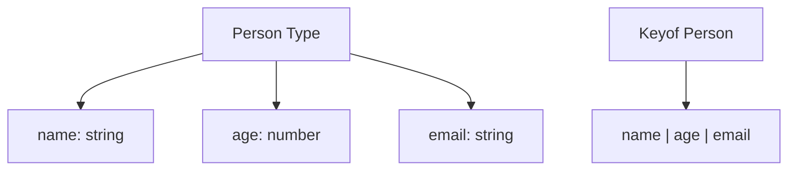

## 7.8 Index Types and the `keyof` Operator

In this section, we will delve into the powerful features of TypeScript that allow us to work with dynamic property names and access types of object keys. Understanding index types and the `keyof` operator is crucial for creating flexible and type-safe code. Let's explore these concepts step-by-step.

### Introduction to the `keyof` Operator

The `keyof` operator is a TypeScript feature that extracts the keys of a given type as a union of string literal types. This is particularly useful when you want to work with dynamic property names or when you need to ensure that your code is type-safe when accessing object properties.

#### How the `keyof` Operator Works

Consider an object type `Person`:

```typescript
type Person = {
  name: string;
  age: number;
  email: string;
};
```

Using the `keyof` operator, we can create a type that represents the keys of the `Person` type:

```typescript
type PersonKeys = keyof Person;
// PersonKeys is now "name" | "age" | "email"
```

Here, `PersonKeys` becomes a union type of the keys `"name"`, `"age"`, and `"email"`.

### Practical Use of `keyof` in Type Annotations

The `keyof` operator can be used in type annotations to create more flexible and reusable code. Let's look at an example where we use `keyof` to create a function that safely accesses properties of an object:

```typescript
function getProperty<T, K extends keyof T>(obj: T, key: K): T[K] {
  return obj[key];
}

const person: Person = {
  name: "Alice",
  age: 30,
  email: "alice@example.com",
};

const personName = getProperty(person, "name"); // TypeScript infers the type as string
const personAge = getProperty(person, "age");   // TypeScript infers the type as number
```

In this example, the `getProperty` function takes an object `obj` of type `T` and a key `key` of type `K`, where `K` is constrained to the keys of `T`. The return type `T[K]` ensures that the function returns the correct type for the property being accessed.

### Index Access Types

Index access types allow you to dynamically reference the type of a property in an object. This is done using the syntax `T[K]`, where `T` is an object type and `K` is a key of that object.

#### Example of Index Access Types

Let's expand our previous example to demonstrate index access types:

```typescript
type EmailType = Person["email"]; // EmailType is string
type AgeType = Person["age"];     // AgeType is number
```

Here, `EmailType` and `AgeType` are inferred as `string` and `number`, respectively, based on the types of the `email` and `age` properties in the `Person` type.

### Creating Flexible Access Functions

The combination of `keyof` and index access types allows us to create flexible functions that can operate on any object type. Let's create a function that updates a property of an object:

```typescript
function updateProperty<T, K extends keyof T>(obj: T, key: K, value: T[K]): void {
  obj[key] = value;
}

updateProperty(person, "name", "Bob");
updateProperty(person, "age", 31);
```

In this function, `updateProperty`, we ensure that the value being assigned to the property matches the property's type. This prevents runtime errors and ensures type safety.

### Practical Applications

The `keyof` operator and index access types have numerous practical applications in TypeScript, especially when dealing with APIs, form handling, and dynamic data structures.

#### Example: Validating Form Data

Imagine you are building a form where users can update their profile information. You can use `keyof` to ensure that only valid fields are updated:

```typescript
type Profile = {
  username: string;
  bio: string;
  website: string;
};

function updateProfileField<T extends Profile, K extends keyof T>(profile: T, field: K, value: T[K]): T {
  return { ...profile, [field]: value };
}

const userProfile: Profile = {
  username: "coder123",
  bio: "I love coding!",
  website: "https://coder123.dev",
};

const updatedProfile = updateProfileField(userProfile, "bio", "I love TypeScript!");
```

This function ensures that only valid fields (`username`, `bio`, `website`) can be updated, and the value type matches the field type.

### Exercises

To reinforce your understanding, try the following exercises:

1. **Create a Type-Safe Setter Function**: Write a function `setProperty` that takes an object, a key, and a value, and sets the property on the object. Ensure that the value type matches the property type.

2. **Dynamic Object Access**: Create a function `getValues` that takes an object and an array of keys, and returns an array of values corresponding to those keys.

3. **Type-Safe Form Handling**: Implement a function `updateForm` that takes a form object and an object of updates, and returns a new form object with the updates applied. Use `keyof` to ensure only valid fields are updated.

### Try It Yourself

Experiment with the code examples provided. Try modifying the `Person` type and see how the `keyof` operator and index access types adapt to changes. Consider adding new properties or changing existing ones to observe TypeScript's type inference in action.

### Visual Aids

To better understand how `keyof` and index types work, let's visualize the relationship between an object type and its keys using a diagram:



This diagram illustrates how the `keyof` operator extracts keys from the `Person` type, resulting in a union type of the keys.

### Summary

In this section, we've explored the `keyof` operator and index access types in TypeScript. These features allow us to work with dynamic property names and ensure type safety when accessing object properties. By understanding and utilizing these tools, you can create more flexible and robust TypeScript applications.

### Additional Resources

For further reading, consider exploring the following resources:

- [TypeScript Handbook: keyof](https://www.typescriptlang.org/docs/handbook/2/keyof-types.html)
- [MDN Web Docs: JavaScript Object](https://developer.mozilla.org/en-US/docs/Web/JavaScript/Reference/Global_Objects/Object)

## Quiz Time!



### What does the `keyof` operator do in TypeScript?

- [x] Extracts the keys of a given type as a union of string literal types.
- [ ] Converts all property values of a type to strings.
- [ ] Creates a new object with only the specified keys.
- [ ] Deletes properties from an object.

> **Explanation:** The `keyof` operator extracts the keys of a given type, forming a union of string literal types representing those keys.

### Which of the following is a correct use of the `keyof` operator?

- [x] `type Keys = keyof Person;`
- [ ] `type Keys = keyof ["name", "age"];`
- [ ] `type Keys = keyof { name: string; age: number };`
- [ ] `type Keys = keyof number;`

> **Explanation:** The `keyof` operator is used with types, not arrays or primitive types. It extracts keys from a type definition.

### How can you ensure a function parameter is a valid key of an object type?

- [x] Use a generic constraint like `K extends keyof T`.
- [ ] Use a type assertion.
- [ ] Use a type alias.
- [ ] Use a union type.

> **Explanation:** Using a generic constraint `K extends keyof T` ensures that the parameter is a valid key of the object type `T`.

### What is the result of `type EmailType = Person["email"];`?

- [x] `string`
- [ ] `number`
- [ ] `boolean`
- [ ] `undefined`

> **Explanation:** `Person["email"]` accesses the type of the `email` property in the `Person` type, which is `string`.

### What does the following function do? `function getProperty<T, K extends keyof T>(obj: T, key: K): T[K] { return obj[key]; }`

- [x] Retrieves a property value from an object, ensuring type safety.
- [ ] Deletes a property from an object.
- [ ] Adds a new property to an object.
- [ ] Converts an object's property to a string.

> **Explanation:** The `getProperty` function retrieves a property value from an object while ensuring that the key is valid and the return type matches the property's type.

### Which of the following is a benefit of using `keyof` and index types?

- [x] They provide type safety when accessing object properties.
- [ ] They automatically convert all properties to strings.
- [ ] They allow properties to be accessed without knowing their names.
- [ ] They enable properties to be deleted from an object.

> **Explanation:** `keyof` and index types ensure type safety by verifying that accessed properties exist and have the expected types.

### How can you create a type-safe update function for an object?

- [x] Use `keyof` to restrict keys and index types to match property types.
- [ ] Use type assertions to bypass type checks.
- [ ] Use any type for flexibility.
- [ ] Use a union of all possible types.

> **Explanation:** Using `keyof` to restrict keys and index types to match property types ensures that updates are type-safe.

### What is the purpose of index access types like `T[K]`?

- [x] To dynamically reference the type of a property in an object.
- [ ] To convert all properties to strings.
- [ ] To delete properties from an object.
- [ ] To create a new object with only the specified properties.

> **Explanation:** Index access types like `T[K]` allow you to dynamically reference the type of a property in an object, ensuring type safety.

### Which of the following is a correct way to use index access types?

- [x] `type AgeType = Person["age"];`
- [ ] `type AgeType = Person[age];`
- [ ] `type AgeType = Person.age;`
- [ ] `type AgeType = Person["name" | "age"];`

> **Explanation:** `Person["age"]` is the correct syntax for accessing the type of the `age` property in the `Person` type.

### True or False: The `keyof` operator can be used with primitive types like `number` or `string`.

- [ ] True
- [x] False

> **Explanation:** The `keyof` operator is used with object types to extract keys, not with primitive types like `number` or `string`.


