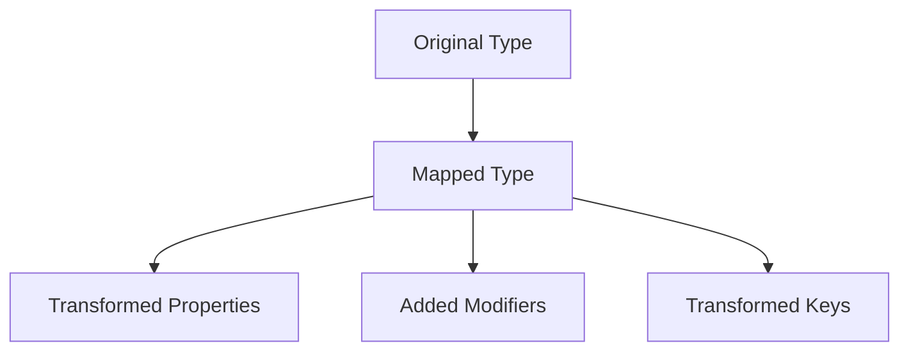

## 7.9 Mapped Types

In TypeScript, mapped types allow us to create new types by transforming existing types. This powerful feature enables us to manipulate and extend types in a flexible and dynamic way, making our code more robust and easier to maintain. In this section, we'll explore the concept of mapped types, understand their syntax, and look at practical examples to see how they can simplify complex type manipulations.

### Introduction to Mapped Types

Mapped types are a way to transform the properties of an existing type into a new type. They allow us to iterate over the keys of a type and apply transformations to each property. This can include changing property types, adding modifiers like `readonly` or `optional`, or even creating subsets of types.

#### Basic Syntax

The basic syntax for a mapped type in TypeScript looks like this:

```typescript
type MappedType<T> = {
  [P in keyof T]: T[P];
};
```

Here, `T` is a generic type, `P` represents each property key in `T`, and `T[P]` is the type of each property. This syntax allows us to iterate over each property in `T` and create a new type based on it.

### Practical Examples of Mapped Types

Let's dive into some practical examples to see how mapped types can be used in real-world scenarios.

#### Example 1: Creating a Partial Type

The `Partial<T>` type is a built-in mapped type that makes all properties of `T` optional. This is useful when you want to create a type where some properties may not be present.

```typescript
type Partial<T> = {
  [P in keyof T]?: T[P];
};

// Example usage
interface User {
  name: string;
  age: number;
  email: string;
}

type PartialUser = Partial<User>;

const user1: PartialUser = {
  name: "Alice",
  // age and email are optional
};
```

In this example, `Partial<User>` creates a new type where all properties of `User` are optional.

#### Example 2: Creating a Required Type

The `Required<T>` type is another built-in mapped type that makes all properties of `T` required. This is the opposite of `Partial<T>`.

```typescript
type Required<T> = {
  [P in keyof T]-?: T[P];
};

// Example usage
interface User {
  name?: string;
  age?: number;
  email?: string;
}

type RequiredUser = Required<User>;

const user2: RequiredUser = {
  name: "Bob",
  age: 30,
  email: "bob@example.com",
  // All properties are now required
};
```

Here, `Required<User>` ensures that all properties of `User` must be present.

### Custom Mapped Types

Beyond the built-in types, you can create your own custom mapped types to suit specific needs.

#### Example 3: Creating a Readonly Type

Let's create a custom mapped type that makes all properties of a type `readonly`.

```typescript
type Readonly<T> = {
  readonly [P in keyof T]: T[P];
};

// Example usage
interface User {
  name: string;
  age: number;
  email: string;
}

type ReadonlyUser = Readonly<User>;

const user3: ReadonlyUser = {
  name: "Charlie",
  age: 25,
  email: "charlie@example.com",
};

// user3.name = "Dave"; // Error: Cannot assign to 'name' because it is a read-only property.
```

In this example, `Readonly<User>` creates a new type where all properties are `readonly`, preventing them from being modified after initialization.

#### Example 4: Creating a Nullable Type

We can also create a mapped type that makes all properties of a type nullable.

```typescript
type Nullable<T> = {
  [P in keyof T]: T[P] | null;
};

// Example usage
interface User {
  name: string;
  age: number;
  email: string;
}

type NullableUser = Nullable<User>;

const user4: NullableUser = {
  name: null,
  age: 30,
  email: "dave@example.com",
};
```

Here, `Nullable<User>` allows each property to be either its original type or `null`.

### Transforming Properties and Adding Modifiers

Mapped types can be used to transform properties and add modifiers, such as `readonly`, `optional`, or `nullable`.

#### Example 5: Combining Modifiers

Let's create a mapped type that combines `readonly` and `optional` modifiers.

```typescript
type ReadonlyOptional<T> = {
  readonly [P in keyof T]?: T[P];
};

// Example usage
interface User {
  name: string;
  age: number;
  email: string;
}

type ReadonlyOptionalUser = ReadonlyOptional<User>;

const user5: ReadonlyOptionalUser = {
  name: "Eve",
  // age and email are optional and readonly
};
```

In this example, `ReadonlyOptional<User>` creates a type where all properties are both `readonly` and optional.

### Using Template Literal Types in Mapped Types

Template literal types can be used in mapped types to transform keys. This allows for more advanced type manipulations.

#### Example 6: Transforming Keys with Template Literals

Let's create a mapped type that appends a suffix to each property key.

```typescript
type SuffixKeys<T, S extends string> = {
  [P in keyof T as `${P & string}${S}`]: T[P];
};

// Example usage
interface User {
  name: string;
  age: number;
  email: string;
}

type UserWithSuffix = SuffixKeys<User, "Field">;

const user6: UserWithSuffix = {
  nameField: "Frank",
  ageField: 40,
  emailField: "frank@example.com",
};
```

In this example, `SuffixKeys<User, "Field">` creates a new type where each property key has "Field" appended to it.

### Encouraging Experimentation with Mapped Types

Mapped types are a versatile tool in TypeScript, allowing you to create complex types with ease. Here are some ways you can experiment with mapped types:

- **Create Custom Modifiers**: Try creating your own modifiers, such as `Nullable` or `ReadonlyOptional`, to suit your needs.
- **Transform Keys**: Use template literal types to transform keys in creative ways, such as prefixing or suffixing keys.
- **Combine Mapped Types**: Combine multiple mapped types to create complex type transformations.

### Try It Yourself

To get a better understanding of mapped types, try modifying the examples above. For instance, create a mapped type that makes all properties `readonly` and nullable, or experiment with transforming keys using different template literals.

### Visualizing Mapped Types

To help visualize how mapped types work, let's use a Mermaid.js diagram to illustrate the transformation process.



**Diagram Description**: This diagram shows the flow from an original type to a mapped type, illustrating how properties can be transformed, modifiers added, and keys transformed.

### Summary

Mapped types in TypeScript provide a powerful way to create new types by transforming existing ones. By using mapped types, you can apply transformations to properties, add modifiers, and even transform keys using template literal types. This flexibility allows you to simplify complex type manipulations and create more robust and maintainable code.

### Key Takeaways

- Mapped types allow you to transform existing types into new ones by iterating over their properties.
- Built-in mapped types like `Partial<T>` and `Required<T>` provide common transformations.
- You can create custom mapped types to suit specific needs, such as making properties `readonly` or nullable.
- Template literal types can be used in mapped types to transform keys.
- Experimenting with mapped types can help you better understand their capabilities and applications.

## Quiz Time!



### What is a mapped type in TypeScript?

- [x] A type that transforms properties of an existing type
- [ ] A type that only adds new properties
- [ ] A type that only removes properties
- [ ] A type that does not change any properties

> **Explanation:** Mapped types transform properties of an existing type, allowing for modifications like making properties optional or readonly.

### Which built-in mapped type makes all properties optional?

- [ ] Required<T>
- [x] Partial<T>
- [ ] Readonly<T>
- [ ] Nullable<T>

> **Explanation:** `Partial<T>` is a built-in mapped type that makes all properties of a type optional.

### How can you make all properties of a type readonly using mapped types?

- [ ] Use the Required<T> type
- [x] Create a custom mapped type with readonly modifier
- [ ] Use the Nullable<T> type
- [ ] Use the Partial<T> type

> **Explanation:** You can create a custom mapped type that applies the `readonly` modifier to all properties.

### What does the `keyof` operator do in a mapped type?

- [x] Iterates over the keys of a type
- [ ] Iterates over the values of a type
- [ ] Removes keys from a type
- [ ] Adds keys to a type

> **Explanation:** The `keyof` operator is used to iterate over the keys of a type in a mapped type.

### How can you transform keys using mapped types?

- [ ] By using the Partial<T> type
- [ ] By using the Required<T> type
- [x] By using template literal types
- [ ] By using the Readonly<T> type

> **Explanation:** Template literal types can be used in mapped types to transform keys, such as appending or prepending strings to keys.

### What is the purpose of the `Readonly<T>` mapped type?

- [ ] To make all properties optional
- [x] To make all properties readonly
- [ ] To make all properties nullable
- [ ] To remove all properties

> **Explanation:** The `Readonly<T>` mapped type makes all properties of a type readonly, preventing modification after initialization.

### Which of the following is a valid use of template literal types in mapped types?

- [x] Transforming keys by appending strings
- [ ] Transforming values by appending strings
- [ ] Removing keys from a type
- [ ] Adding new keys to a type

> **Explanation:** Template literal types can be used to transform keys by appending or prepending strings in mapped types.

### What does the `-?` operator do in a mapped type?

- [x] Removes the optional modifier from properties
- [ ] Adds the optional modifier to properties
- [ ] Makes properties readonly
- [ ] Makes properties nullable

> **Explanation:** The `-?` operator removes the optional modifier from properties in a mapped type, making them required.

### How can you create a type where all properties are nullable?

- [x] Create a custom mapped type with `| null`
- [ ] Use the Partial<T> type
- [ ] Use the Required<T> type
- [ ] Use the Readonly<T> type

> **Explanation:** You can create a custom mapped type that adds `| null` to each property type, making them nullable.

### True or False: Mapped types can only be used with object types.

- [x] True
- [ ] False

> **Explanation:** Mapped types are designed to work with object types, as they iterate over the keys of an object type.


