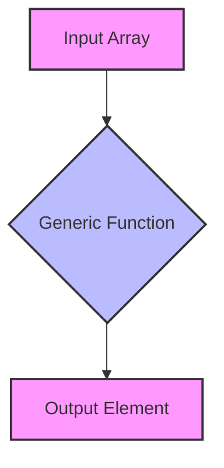

## 8.1 Introduction to Generics

In the world of programming, one of the key principles we strive for is reusability. We want to write code that can be used in multiple scenarios without having to rewrite it for every new situation. This is where **generics** come into play. Generics allow us to create components that can work with any data type, providing both flexibility and type safety. In this section, we will explore what generics are, why they are useful, and how to use them in TypeScript.

### What Are Generics?

Generics are a way to create reusable components that can work with any data type. They allow you to define a placeholder for a type that can be specified later. This means you can write a function or a class that can operate on different types of data without sacrificing type safety.

#### Why Use Generics?

1. **Reusability**: Generics enable you to write a single function or class that can handle multiple types, reducing code duplication.
2. **Type Safety**: By specifying types, generics help catch errors at compile time, making your code more robust and reliable.
3. **Flexibility**: Generics allow you to work with any data type, making your components more versatile.

### How Generics Work

Think of generics as a way to create a blueprint for a function or a class. Instead of specifying the exact data type, you use a placeholder that can be replaced with any type when the function or class is used. This is similar to how you might use variables in a mathematical formula.

#### Analogy: The Cookie Cutter

Imagine you have a cookie cutter that can cut cookies in the shape of a star. You can use this cookie cutter with any type of dough—chocolate, vanilla, or gingerbread. The cookie cutter represents the generic component, and the dough represents the different data types. The cookie cutter doesn't care what type of dough you use; it just shapes it into a star.

### Generic Functions

Let's start with a simple example of a generic function. Suppose we want to create a function that returns the first element of an array. Without generics, we might write separate functions for arrays of numbers, strings, or any other type. With generics, we can write a single function that works with any array type.

```typescript
function getFirstElement<T>(arr: T[]): T {
    return arr[0];
}

// Usage examples
const numbers = [1, 2, 3];
const firstNumber = getFirstElement(numbers); // TypeScript infers T as number

const words = ["hello", "world"];
const firstWord = getFirstElement(words); // TypeScript infers T as string
```

In this example, `<T>` is a type parameter that acts as a placeholder for the data type. When we call `getFirstElement`, TypeScript infers the type of `T` based on the argument we pass.

#### Key Points

- **Type Parameter**: The `<T>` is a type parameter, which is a placeholder for the actual type that will be used.
- **Inference**: TypeScript can often infer the type based on the function's usage, so you don't always need to specify it explicitly.

### Generic Classes

Just like functions, classes can also be generic. This allows you to create data structures that work with any type of data. Let's look at an example of a generic class that implements a simple stack.

```typescript
class Stack<T> {
    private items: T[] = [];

    push(item: T): void {
        this.items.push(item);
    }

    pop(): T | undefined {
        return this.items.pop();
    }

    peek(): T | undefined {
        return this.items[this.items.length - 1];
    }
}

// Usage examples
const numberStack = new Stack<number>();
numberStack.push(10);
numberStack.push(20);
console.log(numberStack.pop()); // Outputs: 20

const stringStack = new Stack<string>();
stringStack.push("TypeScript");
stringStack.push("Generics");
console.log(stringStack.peek()); // Outputs: "Generics"
```

In this example, the `Stack` class is generic, allowing it to store items of any type. The type parameter `<T>` is used to specify the type of items the stack will hold.

#### Key Points

- **Generic Class**: The class `Stack<T>` can work with any data type specified at the time of instantiation.
- **Type Consistency**: All methods within the class use the same type parameter `<T>`, ensuring type consistency across the class.

### Enhancing Type Safety with Generics

Generics not only provide flexibility but also enhance type safety. By specifying the type of data a function or class can work with, you reduce the risk of runtime errors. TypeScript will check that the types are used correctly, catching potential errors at compile time.

#### Example: Type Safety in Action

Consider a function that concatenates two arrays. Without generics, you might accidentally concatenate arrays of different types, leading to unexpected results.

```typescript
function concatenateArrays<T>(arr1: T[], arr2: T[]): T[] {
    return arr1.concat(arr2);
}

// Usage examples
const numbersArray = [1, 2, 3];
const moreNumbers = [4, 5, 6];
const combinedNumbers = concatenateArrays(numbersArray, moreNumbers); // TypeScript ensures both arrays are of type number

const wordsArray = ["hello"];
const moreWords = ["world"];
const combinedWords = concatenateArrays(wordsArray, moreWords); // TypeScript ensures both arrays are of type string
```

In this example, the `concatenateArrays` function uses a generic type parameter `<T>` to ensure that both arrays are of the same type. This prevents accidental type mismatches.

### Generics in Other Programming Languages

If you have experience with other programming languages, you might find generics in TypeScript familiar. Many languages, such as Java and C#, also use generics to achieve similar goals of reusability and type safety. The syntax and implementation details may vary, but the core concept remains the same.

### Try It Yourself

Now that we've covered the basics of generics, it's time to experiment! Try modifying the examples above to see how generics work in different scenarios. Here are a few ideas to get you started:

- Create a generic function that returns the last element of an array.
- Implement a generic class for a queue data structure.
- Write a generic function that swaps the first and last elements of an array.

### Visualizing Generics

To help visualize how generics work, let's use a diagram to represent the flow of data through a generic function.



**Diagram Explanation**: The diagram shows an input array being passed to a generic function, which processes the array and returns an output element. The generic function can handle any type of array, demonstrating the flexibility of generics.

### Summary

Generics are a powerful feature in TypeScript that allow you to create reusable and flexible components. By using type parameters, you can write functions and classes that work with any data type while maintaining type safety. This not only reduces code duplication but also helps catch errors at compile time. As you continue your journey with TypeScript, you'll find that generics are an essential tool for building robust and maintainable code.

### Additional Resources

For more information on generics and TypeScript, check out the following resources:

- [TypeScript Handbook: Generics](https://www.typescriptlang.org/docs/handbook/generics.html)
- [MDN Web Docs: TypeScript](https://developer.mozilla.org/en-US/docs/Web/JavaScript/Reference/Global_Objects/TypeScript)
- [W3Schools: TypeScript Generics](https://www.w3schools.com/typescript/typescript_generics.php)

## Quiz Time!



### What is the primary benefit of using generics in TypeScript?

- [x] Reusability and flexibility
- [ ] Faster code execution
- [ ] Reduced memory usage
- [ ] Improved user interface

> **Explanation:** Generics allow you to create reusable components that can work with any data type, providing flexibility and reducing code duplication.

### Which of the following is a correct way to define a generic function in TypeScript?

- [x] `function example<T>(arg: T): T { return arg; }`
- [ ] `function example(arg: T): T { return arg; }`
- [ ] `function example<T>(arg: any): T { return arg; }`
- [ ] `function example(arg: any): any { return arg; }`

> **Explanation:** The correct syntax for a generic function includes a type parameter `<T>` that acts as a placeholder for the actual type.

### How do generics enhance type safety in TypeScript?

- [x] By allowing you to specify the type of data a function or class can work with
- [ ] By making code execution faster
- [ ] By reducing the size of the code
- [ ] By improving the user interface

> **Explanation:** Generics enhance type safety by allowing you to specify the type of data a function or class can work with, catching errors at compile time.

### What does the `<T>` in a generic function represent?

- [x] A type parameter
- [ ] A variable
- [ ] A function
- [ ] A class

> **Explanation:** The `<T>` in a generic function is a type parameter that acts as a placeholder for the actual type that will be used.

### Which of the following is a benefit of using generics in TypeScript?

- [x] Reduced code duplication
- [ ] Faster code execution
- [ ] Improved user interface
- [ ] Reduced memory usage

> **Explanation:** Generics help reduce code duplication by allowing you to write a single function or class that can handle multiple types.

### In the analogy of a cookie cutter, what does the dough represent?

- [x] Different data types
- [ ] The generic component
- [ ] The function
- [ ] The class

> **Explanation:** In the analogy, the dough represents different data types that the generic component (cookie cutter) can work with.

### What is the purpose of a type parameter in a generic class?

- [x] To specify the type of data the class can work with
- [ ] To improve code execution speed
- [ ] To reduce memory usage
- [ ] To enhance the user interface

> **Explanation:** A type parameter in a generic class specifies the type of data the class can work with, ensuring type consistency.

### Which of the following is an example of a generic class in TypeScript?

- [x] `class Stack<T> { private items: T[] = []; }`
- [ ] `class Stack { private items: any[] = []; }`
- [ ] `class Stack<T> { private items: any[] = []; }`
- [ ] `class Stack { private items: T[] = []; }`

> **Explanation:** The correct syntax for a generic class includes a type parameter `<T>` that specifies the type of data the class can work with.

### How do generics in TypeScript compare to those in other programming languages?

- [x] They are similar in concept, providing reusability and type safety
- [ ] They are completely different
- [ ] They are less flexible
- [ ] They are more complex

> **Explanation:** Generics in TypeScript are similar to those in other programming languages, providing reusability and type safety.

### True or False: Generics can only be used with functions in TypeScript.

- [ ] True
- [x] False

> **Explanation:** Generics can be used with both functions and classes in TypeScript, allowing for flexible and reusable components.


