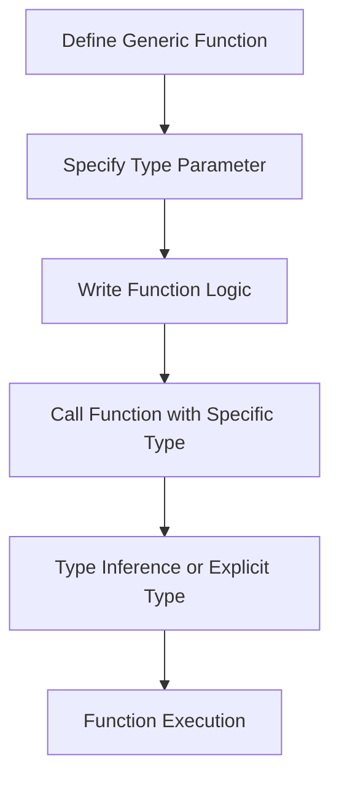

## 8.2 Generic Functions

In our journey through TypeScript, we've learned how to define functions that operate on specific data types. However, there are times when we want our functions to be more flexible and work with a variety of types. This is where **generic functions** come into play. Generics allow us to create functions that can handle different data types without sacrificing type safety. In this section, we'll explore how to define and use generic functions in TypeScript, providing you with the tools to write more reusable and versatile code.

### What are Generic Functions?

Generic functions are functions that can operate on any data type. They are defined with a type parameter, which acts as a placeholder for the actual type that will be used when the function is called. This allows us to write functions that are not tied to a specific type, making them more flexible and reusable.

#### Defining a Generic Function

To define a generic function in TypeScript, we use angle brackets (`<>`) to specify a type parameter. Let's start with a simple example: an identity function. An identity function is a function that returns its input without modification.

```typescript
function identity<T>(arg: T): T {
    return arg;
}

// Usage
let output1 = identity<string>("Hello, TypeScript!");
let output2 = identity<number>(42);

console.log(output1); // Output: Hello, TypeScript!
console.log(output2); // Output: 42
```

In this example, `T` is a type parameter that represents the type of the argument `arg`. When we call the function, we specify the type we want to use, such as `string` or `number`. The function then returns a value of the same type.

#### Type Inference in Generic Functions

TypeScript is smart enough to infer the type of the argument in many cases, so we don't always need to specify the type explicitly. Let's modify our identity function example to demonstrate this:

```typescript
let output3 = identity("TypeScript is awesome!");
let output4 = identity(100);

console.log(output3); // Output: TypeScript is awesome!
console.log(output4); // Output: 100
```

Here, TypeScript infers that `output3` is a `string` and `output4` is a `number` based on the arguments passed to the `identity` function.

### More Examples of Generic Functions

Let's explore some more examples to solidify our understanding of generic functions.

#### A Function to Return an Array of Any Type

Suppose we want to create a function that takes a single element and returns an array containing that element. We can use generics to achieve this:

```typescript
function createArray<T>(element: T, count: number): T[] {
    let result: T[] = [];
    for (let i = 0; i < count; i++) {
        result.push(element);
    }
    return result;
}

// Usage
let stringArray = createArray<string>("TypeScript", 3);
let numberArray = createArray<number>(7, 5);

console.log(stringArray); // Output: ["TypeScript", "TypeScript", "TypeScript"]
console.log(numberArray); // Output: [7, 7, 7, 7, 7]
```

In this example, the `createArray` function takes an element of type `T` and a count, and returns an array of type `T`. This function can be used with any type, making it highly reusable.

### Constraints in Generic Functions

Sometimes, we want to restrict the types that can be used with a generic function. We can achieve this by using **constraints**. Constraints allow us to specify that a type parameter must extend a certain type.

#### Using Constraints with `extends`

Let's say we want to create a function that works with objects that have a `length` property. We can use a constraint to enforce this requirement:

```typescript
interface Lengthwise {
    length: number;
}

function logLength<T extends Lengthwise>(arg: T): T {
    console.log(arg.length);
    return arg;
}

// Usage
logLength({ length: 10, value: "Hello" }); // Output: 10
// logLength(3); // Error: Argument of type 'number' is not assignable to parameter of type 'Lengthwise'.
```

In this example, the `logLength` function has a constraint `T extends Lengthwise`, which means that `T` must be a type that has a `length` property. This ensures that we can safely access the `length` property within the function.

### Converting Non-Generic Functions to Generic Ones

To practice using generics, let's convert a non-generic function into a generic one. Consider the following function that concatenates two arrays of numbers:

```typescript
function concatenateNumbers(arr1: number[], arr2: number[]): number[] {
    return arr1.concat(arr2);
}
```

We can make this function generic so that it can concatenate arrays of any type:

```typescript
function concatenate<T>(arr1: T[], arr2: T[]): T[] {
    return arr1.concat(arr2);
}

// Usage
let combinedArray = concatenate<string>(["Hello"], ["World"]);
console.log(combinedArray); // Output: ["Hello", "World"]
```

By using a type parameter `T`, we allow the `concatenate` function to work with arrays of any type, making it more versatile.

### Try It Yourself

Now that we've explored generic functions, try converting the following non-generic function into a generic one:

```typescript
function doubleNumbers(arr: number[]): number[] {
    return arr.map((num) => num * 2);
}
```

**Hint:** Use a type parameter to allow the function to work with arrays of any type.

### Visualizing Generic Functions

To better understand how generic functions work, let's visualize the process using a flowchart. This flowchart illustrates the steps involved in defining and using a generic function.



**Caption:** This flowchart shows the process of defining and using a generic function in TypeScript. We start by defining the function with a type parameter, write the function logic, call the function with a specific type, and finally execute the function with inferred or explicit types.

### Key Takeaways

- **Generic functions** allow us to write flexible and reusable functions that can operate on any data type.
- **Type parameters** are used to define generic functions, acting as placeholders for actual types.
- **Type inference** allows TypeScript to automatically determine the type of arguments in many cases.
- **Constraints** can be used to restrict the types that can be used with a generic function.
- Converting non-generic functions to generic ones is a great way to practice and improve your understanding of generics.

### Further Reading

For more information on generic functions and other TypeScript features, check out the following resources:

- [TypeScript Handbook: Generics](https://www.typescriptlang.org/docs/handbook/2/generics.html)
- [MDN Web Docs: JavaScript Functions](https://developer.mozilla.org/en-US/docs/Web/JavaScript/Guide/Functions)

## Quiz Time!



### What is a generic function in TypeScript?

- [x] A function that can operate on any data type using type parameters.
- [ ] A function that only works with numbers.
- [ ] A function that returns a fixed type.
- [ ] A function without any parameters.

> **Explanation:** A generic function uses type parameters to operate on any data type, making it flexible and reusable.

### How do you define a type parameter in a generic function?

- [x] Using angle brackets (`<>`) with a placeholder type.
- [ ] Using parentheses (`()`) with a placeholder type.
- [ ] Using square brackets (`[]`) with a placeholder type.
- [ ] Using curly braces (`{}`) with a placeholder type.

> **Explanation:** Type parameters are defined using angle brackets (`<>`) in TypeScript.

### What does the following generic function do? `function identity<T>(arg: T): T { return arg; }`

- [x] Returns the input argument without modification.
- [ ] Modifies the input argument and returns it.
- [ ] Always returns a string.
- [ ] Always returns a number.

> **Explanation:** The `identity` function returns its input argument without modification.

### Can TypeScript infer the type of a generic function's argument?

- [x] Yes, TypeScript can infer the type based on the argument passed.
- [ ] No, the type must always be specified explicitly.
- [ ] Only for string types.
- [ ] Only for number types.

> **Explanation:** TypeScript can infer the type of a generic function's argument in many cases.

### What is the purpose of using constraints with `extends` in generic functions?

- [x] To restrict the types that can be used with the generic function.
- [ ] To allow any type to be used with the generic function.
- [ ] To make the function return a fixed type.
- [ ] To prevent the function from being called.

> **Explanation:** Constraints with `extends` restrict the types that can be used with a generic function.

### How would you convert the following function to a generic one? `function doubleNumbers(arr: number[]): number[] { return arr.map((num) => num * 2); }`

- [x] `function doubleValues<T>(arr: T[]): T[] { return arr.map((val) => val * 2); }`
- [ ] `function doubleValues(arr: number[]): number[] { return arr.map((val) => val * 2); }`
- [ ] `function doubleValues<T>(arr: T[]): number[] { return arr.map((val) => val * 2); }`
- [ ] `function doubleValues(arr: T[]): T[] { return arr.map((val) => val * 2); }`

> **Explanation:** The generic version uses a type parameter `T` to allow the function to work with arrays of any type.

### What is the output of the following code? `let output = identity("TypeScript"); console.log(output);`

- [x] TypeScript
- [ ] undefined
- [ ] null
- [ ] An error occurs

> **Explanation:** The `identity` function returns its input argument, which is "TypeScript".

### Why are generic functions useful in TypeScript?

- [x] They allow for flexible and reusable code that can work with any data type.
- [ ] They make code more complex and harder to understand.
- [ ] They are only useful for working with numbers.
- [ ] They are only useful for working with strings.

> **Explanation:** Generic functions provide flexibility and reusability by allowing functions to work with any data type.

### What is the syntax for calling a generic function with a specific type?

- [x] `identity<string>("Hello")`
- [ ] `identity("Hello")`
- [ ] `identity<string>(Hello)`
- [ ] `identity("Hello", string)`

> **Explanation:** The syntax `identity<string>("Hello")` specifies the type parameter when calling the function.

### True or False: Constraints in generic functions are used to enforce type safety.

- [x] True
- [ ] False

> **Explanation:** Constraints ensure that only types meeting certain criteria can be used with a generic function, enhancing type safety.


