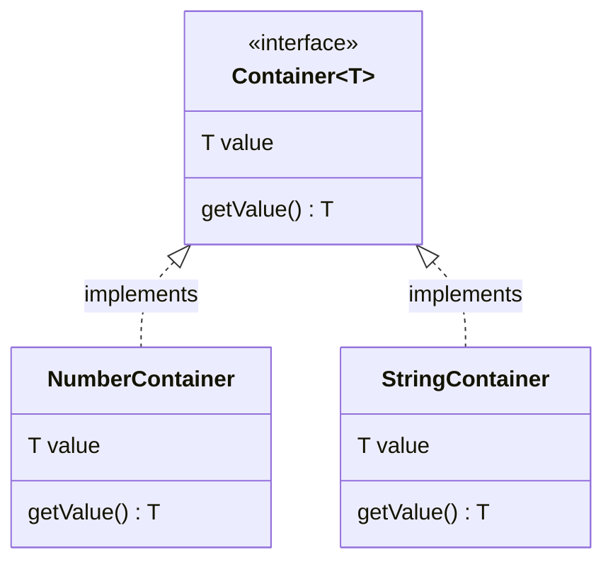

## 8.3 Generic Interfaces

In this section, we will explore the concept of generic interfaces in TypeScript. As we delve into this topic, we'll learn how to define interfaces with generic type parameters, which will allow us to create flexible and reusable code components. By the end of this section, you'll understand how to leverage generic interfaces to represent complex data structures like linked lists or trees, and how to implement these interfaces in classes or functions.

### Understanding Generic Interfaces

Before we dive into generic interfaces, let's briefly recap what interfaces are in TypeScript. Interfaces in TypeScript are used to define the structure of an object. They act as a contract that an object must adhere to, specifying what properties and methods it should have.

Generic interfaces extend this concept by allowing us to define interfaces that can work with any data type. This is achieved by using type parameters, which are placeholders for the actual types that will be used when the interface is implemented.

#### Declaring Generic Interfaces

To declare a generic interface, we use angle brackets (`<>`) to specify the type parameter. Here's a simple example of a generic interface:

```typescript
interface Container<T> {
    value: T;
    getValue: () => T;
}
```

In this example, `Container` is a generic interface with a type parameter `T`. The interface has a property `value` of type `T` and a method `getValue` that returns a value of type `T`. This means that `Container` can be used with any data type.

#### Implementing Generic Interfaces

Let's see how we can implement the `Container` interface with different data types:

```typescript
// Implementing Container with a number
const numberContainer: Container<number> = {
    value: 42,
    getValue: () => numberContainer.value,
};

// Implementing Container with a string
const stringContainer: Container<string> = {
    value: "Hello, TypeScript!",
    getValue: () => stringContainer.value,
};

console.log(numberContainer.getValue()); // Output: 42
console.log(stringContainer.getValue()); // Output: Hello, TypeScript!
```

In this example, we created two objects, `numberContainer` and `stringContainer`, that implement the `Container` interface with different types. This demonstrates the flexibility of generic interfaces, as they allow us to create reusable components that can work with any data type.

### Generic Interfaces in Data Structures

Generic interfaces are particularly useful when working with data structures, as they allow us to define structures that can store and manipulate data of any type. Let's explore how we can use generic interfaces to represent a linked list.

#### Linked List Example

A linked list is a data structure consisting of a sequence of elements, where each element points to the next one. Here's how we can define a generic interface for a linked list node:

```typescript
interface ListNode<T> {
    value: T;
    next: ListNode<T> | null;
}
```

In this example, `ListNode` is a generic interface with a type parameter `T`. Each node in the linked list has a `value` of type `T` and a `next` property that points to the next node or is `null` if it's the last node.

Let's implement a simple linked list using this interface:

```typescript
class LinkedList<T> {
    head: ListNode<T> | null = null;

    add(value: T): void {
        const newNode: ListNode<T> = { value, next: null };
        if (this.head === null) {
            this.head = newNode;
        } else {
            let current = this.head;
            while (current.next !== null) {
                current = current.next;
            }
            current.next = newNode;
        }
    }

    print(): void {
        let current = this.head;
        while (current !== null) {
            console.log(current.value);
            current = current.next;
        }
    }
}

// Using the LinkedList with numbers
const numberList = new LinkedList<number>();
numberList.add(1);
numberList.add(2);
numberList.add(3);
numberList.print(); // Output: 1 2 3

// Using the LinkedList with strings
const stringList = new LinkedList<string>();
stringList.add("a");
stringList.add("b");
stringList.add("c");
stringList.print(); // Output: a b c
```

In this example, we defined a `LinkedList` class that uses the `ListNode` interface to store nodes. The `add` method adds a new node to the end of the list, and the `print` method prints all the values in the list. We demonstrated how the `LinkedList` can be used with both numbers and strings, showcasing the power of generic interfaces in creating reusable data structures.

### Default Type Parameters in Interfaces

TypeScript also allows us to specify default type parameters for generic interfaces. This means that if no type argument is provided when the interface is used, the default type will be used.

Here's an example of a generic interface with a default type parameter:

```typescript
interface Box<T = string> {
    content: T;
}

const stringBox: Box = { content: "Default to string" };
const numberBox: Box<number> = { content: 123 };

console.log(stringBox.content); // Output: Default to string
console.log(numberBox.content); // Output: 123
```

In this example, the `Box` interface has a default type parameter `T = string`. This means that if no type argument is provided, `T` will default to `string`. As shown, `stringBox` uses the default type, while `numberBox` explicitly specifies `number` as the type.

### Benefits of Generic Interfaces

Generic interfaces provide several benefits that make them an essential tool in TypeScript:

1. **Reusability**: Generic interfaces allow us to create components that can be reused with different data types, reducing code duplication and improving maintainability.

2. **Type Safety**: By using generic interfaces, we can ensure that our code is type-safe, as the TypeScript compiler will check that the correct types are used.

3. **Flexibility**: Generic interfaces provide the flexibility to work with any data type, making it easier to create versatile and adaptable code components.

4. **Abstraction**: They enable us to abstract away the details of the data type, allowing us to focus on the logic and structure of our code.

### Implementing Generic Interfaces in Functions

In addition to classes, we can also implement generic interfaces in functions. This allows us to define functions that can operate on any data type, further enhancing the flexibility and reusability of our code.

Here's an example of a function that implements a generic interface:

```typescript
interface Comparator<T> {
    compare: (a: T, b: T) => number;
}

function sortArray<T>(array: T[], comparator: Comparator<T>): T[] {
    return array.sort(comparator.compare);
}

// Comparator for numbers
const numberComparator: Comparator<number> = {
    compare: (a, b) => a - b,
};

// Comparator for strings
const stringComparator: Comparator<string> = {
    compare: (a, b) => a.localeCompare(b),
};

const numbers = [3, 1, 4, 1, 5, 9];
const sortedNumbers = sortArray(numbers, numberComparator);
console.log(sortedNumbers); // Output: [1, 1, 3, 4, 5, 9]

const strings = ["banana", "apple", "cherry"];
const sortedStrings = sortArray(strings, stringComparator);
console.log(sortedStrings); // Output: ["apple", "banana", "cherry"]
```

In this example, we defined a `Comparator` interface with a generic type parameter `T`. The `sortArray` function takes an array and a comparator, and sorts the array using the comparator's `compare` method. We demonstrated how to use the `sortArray` function with both numbers and strings, highlighting the versatility of generic interfaces in functions.

### Try It Yourself

Now that we've covered the basics of generic interfaces, it's time to experiment with them yourself. Here are a few suggestions to get you started:

1. **Create a Stack**: Implement a generic stack data structure using a generic interface. A stack is a data structure that follows the Last In, First Out (LIFO) principle.

2. **Build a Queue**: Implement a generic queue data structure using a generic interface. A queue is a data structure that follows the First In, First Out (FIFO) principle.

3. **Experiment with Default Types**: Modify the `Box` interface to use a different default type parameter and see how it affects the code.

4. **Implement a Generic Function**: Write a generic function that filters an array based on a predicate function, and use a generic interface to define the predicate.

### Visualizing Generic Interfaces

To better understand how generic interfaces work, let's visualize the concept using a diagram. The following Mermaid.js diagram illustrates the relationship between a generic interface and its implementations:



In this diagram, the `Container` interface is represented with a generic type parameter `T`. The `NumberContainer` and `StringContainer` classes implement the `Container` interface with specific types, `number` and `string`, respectively. This visual representation helps us understand how generic interfaces can be implemented with different data types.

### Key Takeaways

- **Generic interfaces** allow us to define interfaces that can work with any data type, providing flexibility and reusability in our code.
- **Type parameters** are used to specify the data type that the interface will work with, making it possible to create versatile components.
- **Default type parameters** can be specified for generic interfaces, allowing us to define a default type if no type argument is provided.
- **Generic interfaces** are particularly useful for defining data structures and functions that need to operate on various data types.
- **Experimentation** is key to mastering generic interfaces. Try implementing different data structures and functions using generic interfaces to solidify your understanding.

### Further Reading

To deepen your understanding of generic interfaces and TypeScript, consider exploring the following resources:

- [TypeScript Handbook: Generics](https://www.typescriptlang.org/docs/handbook/generics.html)
- [MDN Web Docs: JavaScript Data Structures](https://developer.mozilla.org/en-US/docs/Web/JavaScript/Data_structures)
- [W3Schools: TypeScript Interfaces](https://www.w3schools.com/typescript/typescript_interfaces.php)

By exploring these resources, you'll gain a broader understanding of how to use generics and interfaces effectively in your TypeScript projects.

## Quiz Time!



### What is a generic interface in TypeScript?

- [x] An interface that can work with any data type using type parameters.
- [ ] An interface that only works with string data types.
- [ ] An interface that does not require type parameters.
- [ ] An interface that is used only for classes.

> **Explanation:** A generic interface uses type parameters to work with any data type, providing flexibility and reusability.

### How do you declare a generic interface in TypeScript?

- [x] By using angle brackets (`<>`) to specify type parameters.
- [ ] By using square brackets (`[]`) to specify type parameters.
- [ ] By using curly braces (`{}`) to specify type parameters.
- [ ] By using parentheses (`()`) to specify type parameters.

> **Explanation:** Generic interfaces are declared using angle brackets (`<>`) to specify type parameters.

### What is the benefit of using generic interfaces?

- [x] They provide reusability and flexibility by allowing components to work with any data type.
- [ ] They make the code more complex and harder to understand.
- [ ] They restrict the code to work only with specific data types.
- [ ] They eliminate the need for interfaces altogether.

> **Explanation:** Generic interfaces allow components to be reused with different data types, enhancing flexibility and reusability.

### How can you specify a default type parameter in a generic interface?

- [x] By assigning a default type using the equals sign (`=`) in the type parameter declaration.
- [ ] By using the `default` keyword in the type parameter declaration.
- [ ] By specifying the default type in the implementation of the interface.
- [ ] By using the `defaultType` function in the interface.

> **Explanation:** Default type parameters are specified using the equals sign (`=`) in the type parameter declaration.

### What is a use case for generic interfaces in data structures?

- [x] To define structures like linked lists or trees that can store any data type.
- [ ] To create data structures that only store string values.
- [ ] To eliminate the need for data structures in TypeScript.
- [ ] To restrict data structures to only numeric values.

> **Explanation:** Generic interfaces are useful for defining data structures that can store and manipulate any data type, such as linked lists or trees.

### Can generic interfaces be implemented in functions?

- [x] Yes, functions can implement generic interfaces to operate on any data type.
- [ ] No, generic interfaces can only be implemented in classes.
- [ ] Yes, but only with specific data types.
- [ ] No, functions cannot use interfaces.

> **Explanation:** Functions can implement generic interfaces to operate on any data type, enhancing flexibility and reusability.

### What is the purpose of the `Comparator` interface in the example?

- [x] To define a contract for comparing two values of a generic type.
- [ ] To restrict the comparison to only numeric values.
- [ ] To eliminate the need for sorting arrays.
- [ ] To provide a default sorting mechanism for strings.

> **Explanation:** The `Comparator` interface defines a contract for comparing two values of a generic type, allowing for flexible sorting.

### How does the `sortArray` function use the `Comparator` interface?

- [x] It uses the `compare` method of the `Comparator` to sort the array.
- [ ] It ignores the `Comparator` and sorts the array using default methods.
- [ ] It uses the `Comparator` to filter the array.
- [ ] It uses the `Comparator` to reverse the array.

> **Explanation:** The `sortArray` function uses the `compare` method of the `Comparator` interface to sort the array based on the provided comparison logic.

### What is the output of the `print` method in the `LinkedList` class when used with numbers?

- [x] It prints all the numbers in the linked list in the order they were added.
- [ ] It prints the numbers in reverse order.
- [ ] It prints only the first number in the list.
- [ ] It prints the numbers in alphabetical order.

> **Explanation:** The `print` method prints all the numbers in the linked list in the order they were added, demonstrating the functionality of the linked list.

### True or False: Generic interfaces can only be used with primitive data types.

- [ ] True
- [x] False

> **Explanation:** Generic interfaces can be used with any data type, including complex types like objects and classes, not just primitive data types.



By understanding and applying the concepts of generic interfaces, you'll be well-equipped to create flexible and reusable code components in TypeScript. Keep experimenting and exploring to deepen your understanding and enhance your programming skills!
