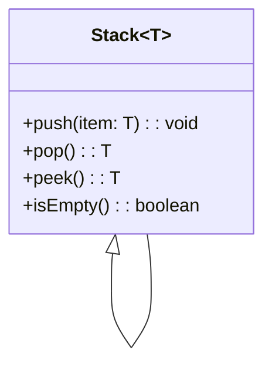

## 8.4 Generic Classes

In this section, we'll explore how generic classes in TypeScript allow us to create flexible and reusable code components. By the end of this guide, you'll understand how to define a generic class with type parameters, instantiate it with specific types, and utilize the generic type within class methods. Let's dive into the world of generic classes!

### Understanding Generic Classes

Generic classes in TypeScript are classes that can operate on various data types specified at the time of instantiation. This flexibility is achieved by using type parameters, which act as placeholders for the actual types that will be used when the class is instantiated.

#### Defining a Generic Class

To define a generic class, we use angle brackets (`<>`) to specify type parameters. These type parameters can then be used throughout the class to define properties, methods, and return types. Let's look at a simple example:

```typescript
// A generic class with a type parameter T
class Box<T> {
  private content: T;

  constructor(content: T) {
    this.content = content;
  }

  public getContent(): T {
    return this.content;
  }

  public setContent(content: T): void {
    this.content = content;
  }
}

// Instantiating the generic class with a specific type
const numberBox = new Box<number>(123);
console.log(numberBox.getContent()); // Output: 123

const stringBox = new Box<string>("Hello, TypeScript!");
console.log(stringBox.getContent()); // Output: Hello, TypeScript!
```

In this example, `Box<T>` is a generic class with a type parameter `T`. This parameter allows us to create instances of `Box` that can hold different types of content, such as numbers or strings.

### Example: A Generic Stack Class

A stack is a data structure that follows the Last-In-First-Out (LIFO) principle. Let's create a generic stack class that can store elements of any type:

```typescript
class Stack<T> {
  private items: T[] = [];

  public push(item: T): void {
    this.items.push(item);
  }

  public pop(): T | undefined {
    return this.items.pop();
  }

  public peek(): T | undefined {
    return this.items[this.items.length - 1];
  }

  public isEmpty(): boolean {
    return this.items.length === 0;
  }
}

// Using the generic stack with numbers
const numberStack = new Stack<number>();
numberStack.push(10);
numberStack.push(20);
console.log(numberStack.pop()); // Output: 20
console.log(numberStack.peek()); // Output: 10

// Using the generic stack with strings
const stringStack = new Stack<string>();
stringStack.push("TypeScript");
stringStack.push("Generics");
console.log(stringStack.pop()); // Output: Generics
console.log(stringStack.peek()); // Output: TypeScript
```

In this example, the `Stack<T>` class uses a type parameter `T` to define a stack that can hold elements of any type. The methods `push`, `pop`, `peek`, and `isEmpty` utilize this type parameter to ensure type safety.

### Instantiating Generic Classes with Specific Types

When we instantiate a generic class, we specify the actual type that will replace the type parameter. This process is known as type instantiation. Let's see how this works with our `Stack` class:

```typescript
// Instantiating a stack for numbers
const numberStack = new Stack<number>();
numberStack.push(42);
numberStack.push(99);

// Instantiating a stack for strings
const stringStack = new Stack<string>();
stringStack.push("Hello");
stringStack.push("World");
```

By specifying the type parameter during instantiation, TypeScript ensures that only elements of the specified type can be added to the stack, providing compile-time type safety.

### Methods Utilizing Generic Types

Methods within a generic class can utilize the generic type parameter to define parameter types, return types, and more. This allows for flexible and reusable method implementations. Let's revisit our `Box` class and add a method that swaps the content of two boxes:

```typescript
class Box<T> {
  private content: T;

  constructor(content: T) {
    this.content = content;
  }

  public getContent(): T {
    return this.content;
  }

  public setContent(content: T): void {
    this.content = content;
  }

  public swapContent(otherBox: Box<T>): void {
    const temp = this.content;
    this.content = otherBox.getContent();
    otherBox.setContent(temp);
  }
}

// Swapping content between two boxes
const box1 = new Box<number>(1);
const box2 = new Box<number>(2);

console.log(`Before swap: Box1 = ${box1.getContent()}, Box2 = ${box2.getContent()}`);
box1.swapContent(box2);
console.log(`After swap: Box1 = ${box1.getContent()}, Box2 = ${box2.getContent()}`);
```

In this example, the `swapContent` method uses the generic type `T` to ensure that the content of two boxes can be swapped only if they are of the same type.

### Best Practices for Managing Complexity in Generic Classes

While generic classes offer great flexibility, they can also introduce complexity if not managed properly. Here are some best practices to keep in mind:

1. **Limit the Number of Type Parameters**: Use only as many type parameters as necessary to avoid confusion and complexity.

2. **Use Descriptive Type Parameter Names**: Instead of single-letter names like `T`, consider using more descriptive names, such as `ItemType`, to improve readability.

3. **Document Type Constraints**: If your generic class has constraints on the type parameters, document them clearly to help users understand the intended usage.

4. **Avoid Overly Complex Logic**: Keep the logic within generic classes simple and focused on the core functionality. Complex logic can be difficult to maintain and understand.

5. **Test with Different Types**: Ensure that your generic class works correctly with a variety of types by writing comprehensive tests.

### Try It Yourself

Now that we've covered the basics of generic classes, it's time for you to experiment! Try modifying the `Stack` class to include a method that returns the size of the stack. You can also create a generic queue class that follows the First-In-First-Out (FIFO) principle.

### Visualizing Generic Classes

To better understand how generic classes work, let's visualize the instantiation process using a diagram:



This diagram shows the `Stack` class with a type parameter `T`, and how it can be instantiated with specific types like `number` and `string`.

### Additional Resources

For further reading on generic classes and TypeScript, consider exploring the following resources:

- [TypeScript Handbook: Generics](https://www.typescriptlang.org/docs/handbook/generics.html)
- [MDN Web Docs: TypeScript](https://developer.mozilla.org/en-US/docs/Web/JavaScript/Reference/Global_Objects/TypeScript)
- [W3Schools: TypeScript Tutorial](https://www.w3schools.com/typescript/)

### Summary

In this section, we've learned how to create and use generic classes in TypeScript. By defining classes with type parameters, we can build flexible and reusable code components that work with various data types. We've also explored best practices for managing complexity and provided opportunities for you to experiment with the concepts covered.

## Quiz Time!



### What is a generic class in TypeScript?

- [x] A class that can operate on various data types specified at instantiation.
- [ ] A class that only works with string data types.
- [ ] A class that cannot be instantiated.
- [ ] A class that only works with number data types.

> **Explanation:** A generic class in TypeScript is designed to work with various data types, specified when the class is instantiated.

### How do you define a generic class in TypeScript?

- [x] By using angle brackets (`<>`) to specify type parameters.
- [ ] By using square brackets (`[]`) to specify type parameters.
- [ ] By using curly braces (`{}`) to specify type parameters.
- [ ] By using parentheses (`()`) to specify type parameters.

> **Explanation:** Generic classes are defined using angle brackets (`<>`) to specify type parameters.

### What is the purpose of a type parameter in a generic class?

- [x] To act as a placeholder for the actual type used during instantiation.
- [ ] To define a fixed type for the class.
- [ ] To specify the number of instances allowed.
- [ ] To restrict the class to only primitive types.

> **Explanation:** Type parameters act as placeholders for the actual types that will be used when the class is instantiated.

### Which method in the `Stack` class removes the last element?

- [x] `pop()`
- [ ] `push()`
- [ ] `peek()`
- [ ] `isEmpty()`

> **Explanation:** The `pop()` method removes and returns the last element from the stack.

### What is the output of `numberStack.pop()` if `numberStack` is a `Stack<number>` with elements `[10, 20]`?

- [x] 20
- [ ] 10
- [ ] undefined
- [ ] null

> **Explanation:** The `pop()` method removes and returns the last element, which is 20 in this case.

### How can you ensure type safety when using a generic class?

- [x] By specifying the type parameter during instantiation.
- [ ] By using the `any` type.
- [ ] By avoiding type parameters.
- [ ] By using `unknown` type.

> **Explanation:** Specifying the type parameter during instantiation ensures that only elements of the specified type can be used, providing type safety.

### What does the `swapContent` method in the `Box` class do?

- [x] Swaps the content of two boxes if they are of the same type.
- [ ] Swaps the content of two boxes regardless of type.
- [ ] Removes the content of a box.
- [ ] Adds new content to a box.

> **Explanation:** The `swapContent` method swaps the content of two boxes only if they are of the same type.

### What is a best practice for naming type parameters?

- [x] Use descriptive names like `ItemType`.
- [ ] Use single-letter names like `T`.
- [ ] Use numbers like `1`, `2`.
- [ ] Use special characters like `@`, `#`.

> **Explanation:** Using descriptive names for type parameters improves readability and understanding of the code.

### What is the principle followed by a stack data structure?

- [x] Last-In-First-Out (LIFO)
- [ ] First-In-First-Out (FIFO)
- [ ] Random Access
- [ ] First-In-Last-Out (FILO)

> **Explanation:** A stack follows the Last-In-First-Out (LIFO) principle.

### True or False: Generic classes can only be used with primitive types.

- [ ] True
- [x] False

> **Explanation:** Generic classes can be used with any type, including primitive types, objects, and user-defined types.


