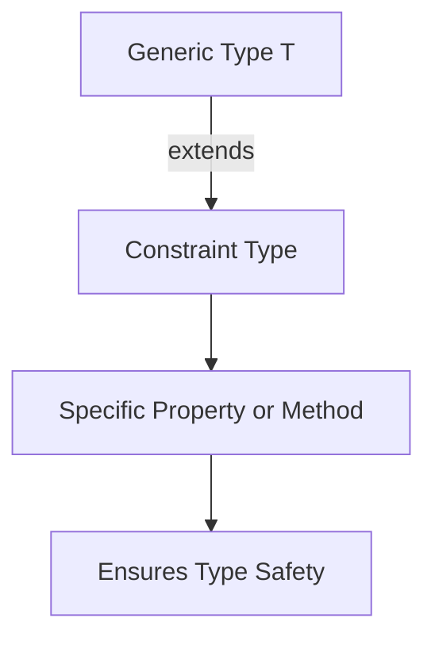

## 8.5 Generic Constraints

In the world of TypeScript, generics offer a powerful way to create reusable and flexible components. However, with great flexibility comes the need for some control. This is where **generic constraints** come into play. By applying constraints to generics, we can limit the types that can be used, ensuring that our code remains robust and type-safe. In this section, we'll explore why constraints are necessary, how to implement them using the `extends` keyword, and how they can be applied to ensure the presence of specific properties or methods.

### Why Are Constraints Necessary?

Generics allow us to write functions, classes, and interfaces that work with any data type. However, there are situations where we need to ensure that a generic type meets certain criteria. For instance, if a function is designed to work with objects that have a specific property, using a generic without constraints could lead to runtime errors if the property is missing.

**Example Scenario:**

Imagine a function that logs the length of an array. Without constraints, someone might accidentally pass a number instead of an array, leading to a runtime error.

```typescript
function logLength<T>(item: T): void {
  console.log(item.length); // Error: Property 'length' does not exist on type 'T'.
}
```

By applying constraints, we can ensure that only types with a `length` property are allowed, preventing such errors.

### Using the `extends` Keyword for Constraints

The `extends` keyword in TypeScript is used to set constraints on generics. It allows us to specify that a generic type must be a subtype of a particular type.

**Basic Syntax:**

```typescript
function functionName<T extends ConstraintType>(parameter: T): ReturnType {
  // Function logic
}
```

**Example: Constraining to Objects with a Length Property**

Let's revisit our previous example and apply a constraint to ensure that the generic type has a `length` property.

```typescript
function logLength<T extends { length: number }>(item: T): void {
  console.log(item.length);
}

// Valid usage
logLength([1, 2, 3]); // Output: 3
logLength("Hello");   // Output: 5

// Invalid usage
// logLength(123);    // Error: Argument of type 'number' is not assignable to parameter of type '{ length: number; }'.
```

In this example, the constraint `{ length: number }` ensures that the generic type `T` must have a `length` property of type `number`.

### Ensuring the Presence of Properties or Methods

Constraints are particularly useful when we need to ensure that a generic type has specific properties or methods. This is common when working with interfaces or classes.

**Example: Constraining to an Interface**

Suppose we have an interface `HasName` that requires a `name` property. We can use this interface as a constraint for our generic function.

```typescript
interface HasName {
  name: string;
}

function greet<T extends HasName>(entity: T): void {
  console.log(`Hello, ${entity.name}!`);
}

const person = { name: "Alice", age: 30 };
greet(person); // Output: Hello, Alice!

// Invalid usage
// greet({ age: 30 }); // Error: Argument of type '{ age: number; }' is not assignable to parameter of type 'HasName'.
```

In this example, the constraint `T extends HasName` ensures that the generic type `T` must have a `name` property.

### Multiple Constraints with Intersection Types

TypeScript allows us to apply multiple constraints using intersection types. This is useful when a generic type needs to satisfy multiple criteria.

**Example: Multiple Constraints**

Let's create a function that requires a type to have both `name` and `age` properties.

```typescript
interface HasName {
  name: string;
}

interface HasAge {
  age: number;
}

function describe<T extends HasName & HasAge>(entity: T): void {
  console.log(`${entity.name} is ${entity.age} years old.`);
}

const person = { name: "Bob", age: 25, occupation: "Engineer" };
describe(person); // Output: Bob is 25 years old.

// Invalid usage
// describe({ name: "Charlie" }); // Error: Argument of type '{ name: string; }' is not assignable to parameter of type 'HasName & HasAge'.
```

In this example, `T extends HasName & HasAge` ensures that the generic type `T` must have both `name` and `age` properties.

### Exercises: Adding Constraints to Existing Generic Code

Let's put our knowledge to the test with some exercises. Try adding constraints to the following generic functions to ensure they work as intended.

**Exercise 1: Constrain to Arrays**

Modify the function to ensure it only accepts arrays.

```typescript
function getFirstElement<T>(arr: T): T {
  return arr[0];
}

// Add a constraint to ensure 'arr' is an array
```

**Exercise 2: Constrain to Objects with a Specific Method**

Ensure the function only accepts objects with a `toString` method.

```typescript
function printToString<T>(obj: T): void {
  console.log(obj.toString());
}

// Add a constraint to ensure 'obj' has a 'toString' method
```

**Exercise 3: Multiple Constraints**

Create a function that requires a type to have both `id` and `title` properties.

```typescript
function displayInfo<T>(item: T): void {
  console.log(`ID: ${item.id}, Title: ${item.title}`);
}

// Add constraints to ensure 'item' has 'id' and 'title' properties
```

### Visual Aids: Understanding Generic Constraints

To help visualize how generic constraints work, let's use a diagram to illustrate the concept of constraints using the `extends` keyword.



**Diagram Explanation:**

- **Generic Type T**: Represents the generic type parameter.
- **Constraint Type**: The type that `T` must extend, ensuring it has specific properties or methods.
- **Specific Property or Method**: The required properties or methods that the constraint enforces.
- **Ensures Type Safety**: The ultimate goal of using constraints is to ensure type safety in our code.

### References and Links

For further reading on TypeScript generics and constraints, consider exploring the following resources:

- [TypeScript Handbook: Generics](https://www.typescriptlang.org/docs/handbook/generics.html)
- [MDN Web Docs: TypeScript](https://developer.mozilla.org/en-US/docs/Web/JavaScript/Reference/Global_Objects/TypeScript)

### Engagement and Reinforcement

To reinforce your understanding of generic constraints, consider the following questions:

- Why might you use constraints in a generic function?
- How can constraints improve the reliability of your code?
- What are some potential pitfalls of not using constraints with generics?

### Summary

In this section, we've explored the importance of generic constraints in TypeScript. By using the `extends` keyword, we can limit the types that can be used with generics, ensuring our code remains type-safe and reliable. We've seen how constraints can enforce the presence of specific properties or methods and how multiple constraints can be applied using intersection types. Through exercises and visual aids, we've reinforced the concepts covered. As you continue your journey with TypeScript, remember to leverage constraints to create robust and flexible code.

## Quiz Time!



### Why are generic constraints necessary in TypeScript?

- [x] To ensure that a generic type meets certain criteria
- [ ] To make the code more complex
- [ ] To reduce the number of types a function can accept
- [ ] To make TypeScript code less readable

> **Explanation:** Generic constraints ensure that a generic type meets specific criteria, enhancing type safety and preventing runtime errors.

### How do you apply a constraint to a generic type in TypeScript?

- [x] Using the `extends` keyword
- [ ] Using the `implements` keyword
- [ ] Using the `super` keyword
- [ ] Using the `typeof` keyword

> **Explanation:** The `extends` keyword is used to apply constraints to a generic type in TypeScript.

### What does the following constraint ensure: `T extends { length: number }`?

- [x] The type `T` must have a `length` property of type `number`
- [ ] The type `T` must be an array
- [ ] The type `T` must be a string
- [ ] The type `T` must have a `name` property

> **Explanation:** The constraint `T extends { length: number }` ensures that the type `T` has a `length` property of type `number`.

### How can you apply multiple constraints to a generic type?

- [x] Using intersection types with `&`
- [ ] Using union types with `|`
- [ ] Using the `extends` keyword multiple times
- [ ] Using the `implements` keyword

> **Explanation:** Multiple constraints can be applied using intersection types with the `&` operator.

### What is the purpose of using constraints in generics?

- [x] To ensure type safety and prevent runtime errors
- [ ] To make the code more difficult to read
- [ ] To limit the number of functions in a program
- [ ] To make TypeScript code less efficient

> **Explanation:** Constraints in generics ensure type safety and prevent runtime errors by enforcing specific criteria on types.

### Which of the following is a valid constraint for a generic type?

- [x] `T extends { toString(): string }`
- [ ] `T extends number`
- [ ] `T extends boolean`
- [ ] `T extends string`

> **Explanation:** The constraint `T extends { toString(): string }` ensures that the type `T` has a `toString` method.

### What happens if a type does not meet the constraints of a generic?

- [x] A compile-time error occurs
- [ ] A runtime error occurs
- [ ] The program crashes
- [ ] The type is automatically converted

> **Explanation:** If a type does not meet the constraints of a generic, a compile-time error occurs, preventing the code from running.

### Can constraints be applied to classes in TypeScript?

- [x] Yes
- [ ] No

> **Explanation:** Constraints can be applied to classes in TypeScript to enforce specific properties or methods.

### What is the result of using `T extends HasName & HasAge`?

- [x] The type `T` must have both `name` and `age` properties
- [ ] The type `T` must have either `name` or `age` properties
- [ ] The type `T` must be a string
- [ ] The type `T` must be a number

> **Explanation:** The constraint `T extends HasName & HasAge` ensures that the type `T` has both `name` and `age` properties.

### True or False: Constraints can only be applied to functions in TypeScript.

- [ ] True
- [x] False

> **Explanation:** Constraints can be applied to functions, classes, and interfaces in TypeScript.


